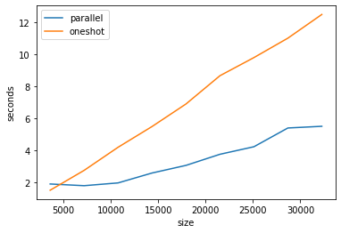

#### past
- notebook "2020-06-14.ipynb", tested the capability to continue fitting `clf.fit(X[part], y_enc[part], xgb_model=prev_model)` and saving `clf.save_model(prev_model)` a model in a loop, over parts of a training set. 
- however, the `predict_proba()` step on the test set at each iteration, was taking a very long time. Somtimes half an hour or 40 minutes. 
- In notebook "2020-06-16.ipynb" , I switrched to evaluating on that test set every epoch instead of every batch. Still, this finished `14` epochs in `13` hours and I even cut my data set by `60x` . That also appears to have deteriorated the test accuracy from `acc=0.12` in "2020-06-14.ipynb" to `acc=0.021` in "2020-06-16.ipynb". Again the train and test sets were cut by `60x` so that definitely changed things. But also the `14` epochs did not appear to be helping. 


#### other notes
- feels like better balanced datasets are important . Perhaps otherwise the time to use them is maybe excessively long.
- predict proba is slow ( as per my [2020-06-14 logs here](https://github.com/namoopsoo/learn-citibike/blob/2020-revisit/notes/2020-06-14.md#output-logs) )
- I still feel like `100` iterations feels like a minimum of sorts to aim for.
- got to re-do 3 or 5 fold cross validation now that weird log loss is good.
- If I do the non-sklearn xgboost, I can take advantage of that dataset caching, which I think saved on memory.
- So perhaps one goal is to try that non-sklearn xgboost, w/ `100` iterations, but using at least those parameters from bundle `'/opt/program/artifacts/2020-06-11T041641Z/bundle.joblib'` which appeared to be a good start..

```

XGBClassifier(base_score=0.5, booster='gbtree', colsample_bylevel=1,
               colsample_bynode=1, colsample_bytree=1, gamma=0,
               learning_rate=0.1, max_delta_step=0, max_depth=3,
               min_child_weight=1, missing=nan, n_estimators=100, n_jobs=1,
               nthread=None, objective='multi:softprob', random_state=0,
               reg_alpha=0, reg_lambda=1, scale_pos_weight=1, seed=None,
               silent=None, subsample=1, verbosity=1),
               
```

#### Are those iterations "built in" ? 
- If I am "manually" iterating then am I actually doing 100*100 = 10,000 iterations?! 
- Perhaps I can check by using the verbose mode

#### Memory consumed by other notebooks
- also important note that I forgot that other notebooks may have been sitting on memory, slowing down the notebook where I was actually running work.


```python
#!ps -p 689 -o pid,ppid,pmem,rss,res
!foo=$(ps -p 689 -o command); echo "$foo"
#!ps -p 689 -o command
# 727
# COMMAND /opt/conda/bin/python -m ipykernel_launcher -f /root/.local/share/jupyter/runtime/kernel-11cd26cf-5715-4e84-abd4-ee49b0b06ed9.json

# 689
# COMMAND /opt/conda/bin/python -m ipykernel_launcher -f /root/.local/share/jupyter/runtime/kernel-5732db1a-d484-4a58-9d67-de6ef5ac721b.json
#!cat /root/.local/share/jupyter/runtime/kernel-5732db1a-d484-4a58-9d67-de6ef5ac721b.json
#os.getpid()

# 667 , the parent
# COMMAND /opt/conda/bin/python /opt/conda/bin/jupyter-notebook --ip 0.0.0.0 --port 8889 --no-browser --allow-root
#!foo=$(ps auxww); echo "$foo"
```

    COMMAND
    /opt/conda/bin/python -m ipykernel_launcher -f /root/.local/share/jupyter/runtime/kernel-5732db1a-d484-4a58-9d67-de6ef5ac721b.json


```python
!top
```

    [?1h=top - 12:25:39 up 4 days,  6:45,  0 users,  load average: 0.00, 0.02, 0.00
    Tasks:  10 total,   1 running,   9 sleeping,   0 stopped,   0 zombie
    %Cpu(s):  6.7 us,  0.7 sy,  0.0 ni, 92.3 id,  0.2 wa,  0.0 hi,  0.1 si,  0.0 st
    KiB Mem :  2046844 total,    82660 free,  1855176 used,   109008 buff/cache
    KiB Swap:  1048572 total,   695520 free,   353052 used.    50424 avail Mem 
    
      PID USER      PR  NI    VIRT    RES    SHR S  %CPU %MEM     TIME+ COMMAND     
        1 root      20   0   18236    204    100 S   0.0  0.0   0:00.11 bash        
      667 root      20   0  999296  56116   5060 S   0.0  2.7   0:21.62 jupyter-no+ 
      673 root      20   0  555440   8460   3128 S   0.0  0.4   0:24.88 python      
      689 root      20   0 2521820 1.492g  18052 S   0.0 76.4 760:54.45 python      
      711 root      20   0  555292  44516   6204 S   0.0  2.2   0:15.04 python      
      727 root      20   0  555292  44656   6280 S   0.0  2.2   0:15.52 python      
      743 root      20   0  555292  44644   6316 S   0.0  2.2   0:14.36 python      
      759 root      20   0  562420  53140  13436 S   0.0  2.6   0:02.17 python      
      783 root      20   0    4500    672    600 S   0.0  0.0   0:00.53 sh          
      784 root      20   0   36856   3004   2592 R   0.0  0.1   0:00.00 top         
    top - 12:25:42 up 4 days,  6:45,  0 users,  load average: 0.00, 0.02, 0.00
    Tasks:  10 total,   1 running,   9 sleeping,   0 stopped,   0 zombie
    %Cpu(s):  0.4 us,  0.5 sy,  0.0 ni, 99.1 id,  0.0 wa,  0.0 hi,  0.0 si,  0.0 st
    KiB Mem :  2046844 total,    82660 free,  1855168 used,   109016 buff/cache
    
    
    
      759 root      20   0  562420  53140  13436 S   0.3  2.6   0:02.18 python      
        1 root      20   0   18236    204    100 S   0.0  0.0   0:00.11 bash        
      667 root      20   0  999296  56116   5060 S   0.0  2.7   0:21.62 jupyter-no+ 
      673 root      20   0  555440   8460   3128 S   0.0  0.4   0:24.88 python      
      689 root      20   0 2521820 1.492g  18052 S   0.0 76.4 760:54.45 python      
      711 root      20   0  555292  44516   6204 S   0.0  2.2   0:15.04 python      
      727 root      20   0  555292  44656   6280 S   0.0  2.2   0:15.52 python      
      743 root      20   0  555292  44644   6316 S   0.0  2.2   0:14.36 python      
    
      784 root      20   0   36824   3028   2592 R   0.0  0.1   0:00.00 top         
    top - 12:25:45 up 4 days,  6:45,  0 users,  load average: 0.00, 0.02, 0.00
    
    %Cpu(s):  0.7 us,  0.3 sy,  0.0 ni, 99.1 id,  0.0 wa,  0.0 hi,  0.0 si,  0.0 st
    KiB Mem :  2046844 total,    82660 free,  1855164 used,   109020 buff/cache
    
    
    
      667 root      20   0  999296  56116   5060 S   0.3  2.7   0:21.63 jupyter-no+ 
    
      673 root      20   0  555440   8460   3128 S   0.0  0.4   0:24.88 python      
      689 root      20   0 2521820 1.492g  18052 S   0.0 76.4 760:54.45 python      
      711 root      20   0  555292  44516   6204 S   0.0  2.2   0:15.04 python      
      727 root      20   0  555292  44656   6280 S   0.0  2.2   0:15.52 python      
      743 root      20   0  555292  44644   6316 S   0.0  2.2   0:14.36 python      
      759 root      20   0  562420  53140  13436 S   0.0  2.6   0:02.18 python      
    
    
    top - 12:25:48 up 4 days,  6:45,  0 users,  load average: 0.00, 0.02, 0.00
    
    %Cpu(s):  0.7 us,  0.6 sy,  0.0 ni, 98.7 id,  0.0 wa,  0.0 hi,  0.0 si,  0.0 st
    
    
    
    
        1 root      20   0   18236    204    100 S   0.0  0.0   0:00.11 bash        
      667 root      20   0  999296  56116   5060 S   0.0  2.7   0:21.63 jupyter-no+ 
    
    
    
    
    
    
    
    
    [?1l>
    


```python
# Let's look how class-balanced the data is... and given some data, "carve" a balanced training set out of it.
```


```python
import pandas as pd
import xgboost as xgb
from xgboost import XGBClassifier
import datetime; import pytz
import matplotlib.pyplot as plt
from scipy.special import softmax
from sklearn.model_selection import cross_val_score
from sklearn.model_selection import train_test_split # (*arrays, **options)
import numpy as np
from sklearn.metrics import log_loss
from sklearn.preprocessing import OneHotEncoder, LabelEncoder

from joblib import dump, load
import joblib
import os
from sklearn.metrics import confusion_matrix, mean_squared_error
from sklearn.model_selection import KFold, train_test_split, GridSearchCV
from sklearn.metrics import accuracy_score
import fresh.utils as fu

from importlib import reload
from collections import Counter
from tqdm.notebook import tqdm
import fresh.preproc.v1 as pv1
```


```python

model_loc = ('/opt/program/artifacts/2020-06-17T042025Z/model.xg')
#model = joblib.load(model_loc)
model = xgb.XGBClassifier()# .load_model(fname=model_loc)
model.load_model(fname=model_loc)
```


```python
# print(X_test_transformed[:2].shape)
# print(X_test_transformed[:2].toarray())
# y_preds = model.predict_proba(X_test_transformed[:2])
# print(y_preds.shape)
# y_preds
```

#### Quick test of parallel predict_proba 


```python
datadir = '/opt/data'
localdir = '/opt/program'


tripsdf = pd.read_csv(f'{datadir}/2013-07 - Citi Bike trip data.csv'
                     ).sample(frac=0.017, random_state=42)
stationsdf = pd.read_csv(f'{localdir}/datas/stations/stations-2018-12-04-c.csv',
                        index_col=0)

```


```python

X, y, neighborhoods = fu.prepare_data(tripsdf, stationsdf)
X_train, X_test, y_train, y_test = train_test_split(X, y)

# preproc
(X_transformed,
     one_hot_enc, le,
     y_enc) = pv1.preprocess(X_train, y_train, # X[train_index]
                         neighborhoods)
labels = le.classes_

# Test set
X_test_transformed = one_hot_enc.transform(X_test)
y_test_enc = le.transform(y_test)
```


```python
xgb_model = xgb.XGBClassifier(objective='multi:softprob'
                             ).fit(X_transformed, 
                                        y_enc, verbose=True)

# 
```


```python
workdir = fu.make_work_dir(); print(workdir)
```

    /opt/program/artifacts/2020-06-20T181230Z


```python
X_test_transformed.shape
```


    (3585, 78)


```python
joblib.dump({'model': xgb_model, 'note': 'just a quick test'}, f'{workdir}/bundle.joblib')
```


    ['/opt/program/artifacts/2020-06-20T181230Z/bundle.joblib']


```python

#X_test_transformed.toarray().shape
```


    (10755, 78)


```python

results = []
for i in tqdm(range(1, 10)):
    X = np.concatenate([X_test_transformed.toarray()]*i)
    start = datetime.datetime.now()
    y_pred_1 = fu.predict_proba(X,
                     model_loc='/opt/program/artifacts/2020-06-20T181230Z/bundle.joblib',
                             parallel=False)
    oneshot_time = fu.do_walltime(start)

    start = datetime.datetime.now()
    y_pred_2 = fu.predict_proba(X,
                     model_loc='/opt/program/artifacts/2020-06-20T181230Z/bundle.joblib',
                             parallel=True)
    parallel_time = fu.do_walltime(start)
    
    results.append({'size': X.shape[0], 'parallel_time': parallel_time,
                   'oneshot_time': oneshot_time})
    # parallel=True
    # 5.77s , 445ms

```


    HBox(children=(FloatProgress(value=0.0, max=9.0), HTML(value='')))


    


```python
np.allclose(y_pred_1, y_pred_2)
```


    True


```python
# Ok cool... glad to see I have now added a new tool to my toolbox here, 
# For super small data, parallel overheads outweighs the benefit, but there is a tipping point..
# my goal is for this to also help w/ not just filling and sitting on memory w/o releasing it! 
df = pd.DataFrame.from_records(results)
```


```python
plt.plot(df['size'].tolist(), df.parallel_time.tolist(), label='parallel')
plt.plot(df['size'].tolist(), df.oneshot_time.tolist(), label='oneshot')
plt.legend()
plt.xlabel('size')
plt.ylabel('seconds')
```


    Text(0, 0.5, 'seconds')





```python
help(np.random.choice)
```

    Help on built-in function choice:
    
    choice(...) method of numpy.random.mtrand.RandomState instance
        choice(a, size=None, replace=True, p=None)
        
        Generates a random sample from a given 1-D array
        
                .. versionadded:: 1.7.0
        
        .. note::
            New code should use the ``choice`` method of a ``default_rng()``
            instance instead; see `random-quick-start`.
        
        Parameters
        ----------
        a : 1-D array-like or int
            If an ndarray, a random sample is generated from its elements.
            If an int, the random sample is generated as if a were np.arange(a)
        size : int or tuple of ints, optional
            Output shape.  If the given shape is, e.g., ``(m, n, k)``, then
            ``m * n * k`` samples are drawn.  Default is None, in which case a
            single value is returned.
        replace : boolean, optional
            Whether the sample is with or without replacement
        p : 1-D array-like, optional
            The probabilities associated with each entry in a.
            If not given the sample assumes a uniform distribution over all
            entries in a.
        
        Returns
        -------
        samples : single item or ndarray
            The generated random samples
        
        Raises
        ------
        ValueError
            If a is an int and less than zero, if a or p are not 1-dimensional,
            if a is an array-like of size 0, if p is not a vector of
            probabilities, if a and p have different lengths, or if
            replace=False and the sample size is greater than the population
            size
        
        See Also
        --------
        randint, shuffle, permutation
        Generator.choice: which should be used in new code
        
        Examples
        --------
        Generate a uniform random sample from np.arange(5) of size 3:
        
        >>> np.random.choice(5, 3)
        array([0, 3, 4]) # random
        >>> #This is equivalent to np.random.randint(0,5,3)
        
        Generate a non-uniform random sample from np.arange(5) of size 3:
        
        >>> np.random.choice(5, 3, p=[0.1, 0, 0.3, 0.6, 0])
        array([3, 3, 0]) # random
        
        Generate a uniform random sample from np.arange(5) of size 3 without
        replacement:
        
        >>> np.random.choice(5, 3, replace=False)
        array([3,1,0]) # random
        >>> #This is equivalent to np.random.permutation(np.arange(5))[:3]
        
        Generate a non-uniform random sample from np.arange(5) of size
        3 without replacement:
        
        >>> np.random.choice(5, 3, replace=False, p=[0.1, 0, 0.3, 0.6, 0])
        array([2, 3, 0]) # random
        
        Any of the above can be repeated with an arbitrary array-like
        instead of just integers. For instance:
        
        >>> aa_milne_arr = ['pooh', 'rabbit', 'piglet', 'Christopher']
        >>> np.random.choice(aa_milne_arr, 5, p=[0.5, 0.1, 0.1, 0.3])
        array(['pooh', 'pooh', 'pooh', 'Christopher', 'piglet'], # random
              dtype='<U11')
    


```python
np.allclose(y_pred_1, y_pred_2)
```


    True


```python
reload(fu)
```


    <module 'fresh.utils' from '/opt/program/fresh/utils.py'>


```python
slices = fu.get_slices(range(200), slice_size=100)
vec = [xgb_model.predict_proba(X_test_transformed[a:b]) for (a,b) in slices]
```


```python
vec[0].shape, vec[1].shape
np.concatenate(vec).shape
# slices
# fu.get_partitions(list(range(20)), slice_size=5)

```


    (200, 54)


```python

```


```python
np.concatenate?

```


```python
%%time
workdir = fu.make_work_dir(); print(workdir)
fu.log(workdir, 'Starting')

rng = np.random.RandomState(31337)

kf = KFold(n_splits=2, shuffle=True, random_state=rng)
for train_index, test_index in kf.split(X):
    
    # preproc
    (X_transformed,
         one_hot_enc, le,
         y_enc) = preprocess(X[train_index], y[train_index], 
                             neighborhoods)
    
    xgb_model = xgb.XGBClassifier().fit(X_transformed, 
                                        y_enc, verbose=True)
    #
    X_test_transformed = one_hot_enc.transform(X[test_index])
    actuals = le.transform(y[test_index])
    
    predictions = xgb_model.predict(X_test_transformed)
    print(confusion_matrix(actuals, predictions))
    
    preds = xgb_model.predict_proba(X_test_transformed)
    
    
    loss = fu.big_logloss(y_test_enc, y_prob_vec, list(range(len(labels)))
    fu.log(workdir, f'[{epoch}] Done big_logloss, loss={loss}.')

```


    Counter({'East Village': 227,
             'Williamsburg': 189,
             'Midtown East': 717,
             'Chelsea': 1584,
             'Bowery': 271,
             'Battery Park City': 433,
             'Nolita': 183,
             'Tribeca': 662,
             'Financial District': 627,
             'Lower East Side': 452,
             'Gramercy Park': 240,
             'Ukrainian Village': 373,
             'Alphabet City': 356,
             'NoHo': 67,
             'Civic Center': 206,
             'Murray Hill': 285,
             'Dumbo': 105,
             'Flatiron District': 256,
             'Greenwich Village': 689,
             'Garment District': 235,
             'Meatpacking District': 127,
             'Stuyvesant Town': 202,
             'Rose Hill': 129,
             "Hell's Kitchen": 601,
             'Kips Bay': 411,
             'Lincoln Square': 151,
             'Midtown': 444,
             'Midtown West': 565,
             'Hudson Square': 167,
             'West Village': 619,
             'Theater District': 374,
             'Lower Manhattan': 233,
             'Union Square': 201,
             'SoHo': 234,
             'NoMad': 101,
             'Bedford-Stuyvesant': 67,
             'Downtown Brooklyn': 207,
             'Chinatown': 215,
             'Little Italy': 45,
             'Fort Greene': 274,
             'Central Park': 94,
             'Brooklyn Navy Yard': 45,
             'Peter Cooper Village': 55,
             'Boerum Hill': 53,
             'Brooklyn Heights': 142,
             'Clinton Hill': 124,
             'Fulton Ferry District': 30,
             'Tudor City': 20,
             'Korea Town': 60,
             'Two Bridges': 97,
             'Park Slope': 37,
             'Columbia Street Waterfront District': 37,
             'Vinegar Hill': 9,
             'Sutton Place': 11})


```python
reload(fu)
print(fu.get_slices(range(1000), slice_size=444))
```

    [[0, 443], [444, 887], [888, 999]]


```python
#help(joblib)
import time
from joblib import Parallel, delayed
from math import sqrt

def mywork(x, y, z=None, a=None):
    time.sleep(5)
    
    return x*y * (z or a)

%time Parallel(n_jobs=5)(delayed(mywork)(i, i+1, z=2) for i in range(10))
```

    CPU times: user 10 ms, sys: 0 ns, total: 10 ms
    Wall time: 10.1 s


    [0, 4, 12, 24, 40, 60, 84, 112, 144, 180]


```python
%%time
y_prob_vec = np.random.random(size=(y_test_enc.shape[0],
                       labels.shape[0]))
loss = fu.big_logloss(y_test_enc, y_prob_vec, list(range(len(labels))), parallel=False)
# Wall time: 56.5 s
# Wall time: 906 ms  . huh?

```

    CPU times: user 660 ms, sys: 50 ms, total: 710 ms
    Wall time: 725 ms


```python
loss#labels#y_test_enc.shape, y_prob_vec.shape#loss # 4.291267319642341

```


    0.0


```python
y_test_enc.shape, labels.shape
```


    ((210854,), (54,))


```python
np.random.random(size=(y_test_enc.shape[0],
                       labels.shape[0]))
```


    array([[0.21080369, 0.43961201, 0.19590716, ..., 0.71289874, 0.33170714,
            0.82601838],
           [0.36605098, 0.13483735, 0.90106828, ..., 0.54691864, 0.4643664 ,
            0.88128189],
           [0.63243054, 0.16359919, 0.66125254, ..., 0.34549834, 0.41448938,
            0.6333276 ],
           ...,
           [0.14012141, 0.33125609, 0.49782631, ..., 0.26443373, 0.86010273,
            0.96617081],
           [0.50237769, 0.86188519, 0.61262241, ..., 0.67107822, 0.36280706,
            0.08816574],
           [0.02359937, 0.74809099, 0.15765813, ..., 0.00790811, 0.13526414,
            0.87367221]])


