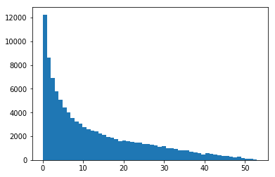
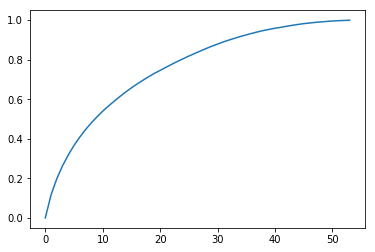

Want to do a quick recalc of yesterday's model using the sklearn API Again..


```python
import pandas as pd
import xgboost as xgb
from xgboost import XGBClassifier
import datetime; import pytz
import matplotlib.pyplot as plt
# from scipy.special import softmax
from sklearn.model_selection import cross_val_score
from sklearn.model_selection import train_test_split # (*arrays, **options)
import numpy as np
from sklearn.metrics import log_loss
from sklearn.preprocessing import OneHotEncoder, LabelEncoder, LabelBinarizer
from sklearn.datasets import load_svmlight_file
from joblib import dump, load
import joblib
import os
from sklearn.metrics import confusion_matrix, mean_squared_error
from sklearn.model_selection import KFold, train_test_split, GridSearchCV
from sklearn.metrics import accuracy_score, balanced_accuracy_score
import fresh.utils as fu

from importlib import reload
from collections import Counter
from tqdm.notebook import tqdm
import fresh.preproc.v1 as pv1
import fresh.preproc.v2 as pv2
```


```python
localdir = '/home/ec2-user/SageMaker/learn-citibike'  # sagemaker
datadir = f'{localdir}/artifacts/2020-07-03T171842Z'

train_loc = f'{datadir}/train.libsvm'

# Convert the dtrain to numpy  ( nice advice from https://stackoverflow.com/a/40430328  )
train_data = load_svmlight_file(train_loc)
X_train = train_data[0].toarray()
y_train = train_data[1]
```


```python
X_train.shape, y_train.shape # ((316281, 85), (316281,))
```


    ((316281, 85), (316281,))


```python
# I want to re-use the parameters ..
bundle = joblib.load(f'{datadir}/bundle_with_metrics.joblib')
```


```python
bundle['input_params']
```


    {'max_depth': 3,
     'learning_rate': 0.1,
     'objective': 'multi:softprob',
     'num_class': 54,
     'base_score': 0.5,
     'booster': 'gbtree',
     'colsample_bylevel': 1,
     'colsample_bynode': 1,
     'colsample_bytree': 1,
     'gamma': 0,
     'max_delta_step': 0,
     'min_child_weight': 1,
     'random_state': 0,
     'reg_alpha': 0,
     'reg_lambda': 1,
     'scale_pos_weight': 1,
     'seed': 42,
     'subsample': 1,
     'verbosity': 2}


```python
xgb_model = xgb.XGBClassifier(**bundle['input_params'])

```


```python
%%time
xgb_model.fit(X_train, y_train)
```

    [18:24:12] INFO: src/tree/updater_prune.cc:74: tree pruning end, 1 roots, 14 extra nodes, 0 pruned nodes, max_depth=3
    [18:24:13] INFO: src/tree/updater_prune.cc:74: tree pruning end, 1 roots, 14 extra nodes, 0 pruned nodes, max_depth=3
    [18:24:13] INFO: src/tree/updater_prune.cc:74: tree pruning end, 1 roots, 14 extra nodes, 0 pruned nodes, max_depth=3
    [18:24:14] INFO: src/tree/updater_prune.cc:74: tree pruning end, 1 roots, 14 extra nodes, 0 pruned nodes, max_depth=3
    [18:24:14] INFO: src/tree/updater_prune.cc:74: tree pruning end, 1 roots, 14 extra nodes, 0 pruned nodes, max_depth=3
    ...
    ...
    [19:13:08] INFO: src/tree/updater_prune.cc:74: tree pruning end, 1 roots, 14 extra nodes, 0 pruned nodes, max_depth=3
    [19:13:09] INFO: src/tree/updater_prune.cc:74: tree pruning end, 1 roots, 14 extra nodes, 0 pruned nodes, max_depth=3
    CPU times: user 49min 10s, sys: 1.15 s, total: 49min 11s
    Wall time: 49min 6s


    XGBClassifier(base_score=0.5, booster='gbtree', colsample_bylevel=1,
           colsample_bynode=1, colsample_bytree=1, gamma=0, learning_rate=0.1,
           max_delta_step=0, max_depth=3, min_child_weight=1, missing=None,
           n_estimators=100, n_jobs=1, nthread=None, num_class=54,
           objective='multi:softprob', random_state=0, reg_alpha=0,
           reg_lambda=1, scale_pos_weight=1, seed=42, silent=None, subsample=1,
           verbosity=2)


Mini anecdote, I am observing "top" while this XGBClassifier() is getting fit, using the same parameters as I had used w/ the functional api in [yesterday's notebook](https://github.com/namoopsoo/learn-citibike/blob/2020-revisit/notes/2020-07-03-aws.md)  and I am seeing only `100% CPU` utilization. But I truly recall yesterday seeing `200% CPU` taking advantage of the multiple cores in this environment. I might be mis-remembering, but yesterday's training took 

```
CPU times: user 8min 24s, sys: 1.24 s, total: 8min 26s
Wall time: 4min 18s
```

per the [training](https://github.com/namoopsoo/learn-citibike/blob/2020-revisit/notes/2020-07-03-aws.md#train)  so it is kind of convenient that the magic function `%%time` actually indicates the multi-core time. So I think therefore some parallelization is perhaps available in the functional (raw) api which is not getting taken advantage of w/ the sklearn API? 

This sklearn training is already `30 minutes` and still going . 

ok finished after ..

```
CPU times: user 49min 10s, sys: 1.15 s, total: 49min 11s
Wall time: 49min 6s
```
Wow yea I would like to have more understanding around this parallel behavior.


```python
# Save this classifier just in case... 
workdir = fu.make_work_dir(localdir); print(workdir)
bundle_loc = f'{workdir}/bundle.joblib'
joblib.dump({
    'notebook': '2020-07-04-aws.ipynb',
    'xgb_model': xgb_model,
    'train': 'artifacts/2020-07-03T171842Z/train.libsvm',
    'api': 'sklearn', # 
    'walltime': ''' CPU times: user 49min 10s, sys: 1.15 s, total: 49min 11s
Wall time: 49min 6s''',
    'primary_dataset': '2013-07 - Citi Bike trip data.csv',
    'input_params': bundle['input_params'],
    'proc_bundle': 'artifacts/2020-07-03T171842Z/proc_bundle.joblib',
    'num_round': 'unclear since this is the sklearn api. not sure how to check.'


}, bundle_loc)
print('saved bundle to ', bundle_loc)
```

    /home/ec2-user/SageMaker/learn-citibike/artifacts/2020-07-04T192632Z
    saved bundle to  /home/ec2-user/SageMaker/learn-citibike/artifacts/2020-07-04T192632Z/bundle.joblib


```python

```


```python
# quick cleanup
# print(fu.get_my_memory())
# del train_data, X_train, y_t
# print(fu.get_my_memory())

# XGBClassifier has "n_estimators=100" .  
# Dont know what that corresponds to in the functional api.

```


```python
%%time

# Evaluation...
test_loc = f'{datadir}/test.libsvm'
print('evaluate using ', test_loc)
test_data = load_svmlight_file(test_loc)
X_test = test_data[0].toarray()
y_test = test_data[1]
y_prob = xgb_model.predict_proba(X_test)

predictions = np.argmax(y_prob, axis=1)
metrics = {
    'accuracy': accuracy_score(y_test, predictions),
    'balanced_accuracy': balanced_accuracy_score(y_test, predictions),    
    'logloss': fu.big_logloss(y_test, y_prob=y_prob, labels=list(range(54))),
}
metrics
```

    evaluate using  /home/ec2-user/SageMaker/learn-citibike/artifacts/2020-07-03T171842Z/test.libsvm


    ---------------------------------------------------------------------------

    NameError                                 Traceback (most recent call last)

    <timed exec> in <module>()


    NameError: name 'y' is not defined


```python
# And I should note down these numbers for the train data as well for comparison.
```


```python
y_prob.shape, predictions.shape
```


    ((105427, 54), (105427,))


```python
# Wow... kind of creepy these numbers are exactly the same as w/ the functional api.
# So almost like a heuristic proof of some kind that they are equivalent APIs? 
# Maybe shows that `100` rounds are used by default?
# And maybe also showing the parallelization did not deteriorate the results?
metrics = {
    'accuracy': accuracy_score(y_test, predictions),
    'balanced_accuracy': balanced_accuracy_score(y_test, predictions),    
    'logloss': fu.big_logloss(y_test, y_prob=y_prob, labels=list(range(54))),
}
metrics
```


    {'accuracy': 0.11619414381515171,
     'balanced_accuracy': 0.10198056214190813,
     'logloss': 3.477780518331715}


```python
%%time
# check what training accuracy is aas well
print(X_train.shape, y_train.shape)

y_prob = xgb_model.predict_proba(X_train)
predictions = np.argmax(y_prob, axis=1)
train_metrics = {
    'train_accuracy': accuracy_score(y_train, predictions),
    'train_balanced_accuracy': balanced_accuracy_score(y_train, predictions),    
    'train_logloss': fu.big_logloss(y_train, y_prob=y_prob, labels=list(range(54))),
}
c
```

    (316281, 85) (316281,)
    CPU times: user 2min 46s, sys: 348 ms, total: 2min 46s
    Wall time: 2min 49s


```python
train_metrics
```


    {'train_accuracy': 0.11928949257147915,
     'train_balanced_accuracy': 0.10517465243360108,
     'train_logloss': 3.4663923052147214}


```python
# Ok training accuracy, and logloss slightly better. So no overfitting here. 
# But underfitting for sure.
```


```python
X_train.shape
```


    (316281, 85)


```python
# Save this classifier just in case... 
workdir = fu.make_work_dir(localdir); print(workdir)
bundle_loc = f'{workdir}/bundle_with_metrics.joblib'
joblib.dump({
    'notebook': '2020-07-04-aws.ipynb',
    'xgb_model': xgb_model,
    'train': 'artifacts/2020-07-03T171842Z/train.libsvm',
    'api': 'sklearn', # 
    'walltime': ''' CPU times: user 49min 10s, sys: 1.15 s, total: 49min 11s
Wall time: 49min 6s''',
    'primary_dataset': '2013-07 - Citi Bike trip data.csv',
    'input_params': bundle['input_params'],
    'proc_bundle': 'artifacts/2020-07-03T171842Z/proc_bundle.joblib',
    'num_round': 'unclear since this is the sklearn api. not sure how to check.',
    'test_set': 'artifacts/2020-07-03T171842Z/test.libsvm',
    'validation_metrics': metrics,
    'train_metrics': train_metrics,
}, bundle_loc)
print('saved bundle to ', bundle_loc)
```

    /home/ec2-user/SageMaker/learn-citibike/artifacts/2020-07-04T203809Z
    saved bundle to  /home/ec2-user/SageMaker/learn-citibike/artifacts/2020-07-04T203809Z/bundle_with_metrics.joblib


```python
y_prob = xgb_model.predict_proba(X_test)

```


```python
logloss = fu.big_logloss(y_test, y_prob=y_prob, labels=list(range(54)))
# but what would be the worst possible log loss?
predictions = np.argmax(y_prob, axis=1)

```


```python
print('actual', y_test[0])
print('prediction', predictions[0])
list(zip(y_prob[0], list(range(54))))
 
```

    actual 40.0
    prediction 16


    [(0.03266318, 0),
     (0.055259336, 1),
     (0.0063982885, 2),
     (0.0060006455, 3),
     (0.028050173, 4),
     (0.013179544, 5),
     (0.0040552644, 6),
     (0.0027082511, 7),
     (0.0068830275, 8),
     (0.045714676, 9),
     (0.042376906, 10),
     (0.009649674, 11),
     (0.002363756, 12),
     (0.02285816, 13),
     (0.008648784, 14),
     (0.027313996, 15),
     (0.063226275, 16),
     (0.0125913145, 17),
     (0.019257562, 18),
     (0.0021036789, 19),
     (0.020691957, 20),
     (0.024331894, 21),
     (0.012355921, 22),
     (0.016046353, 23),
     (0.01745567, 24),
     (0.023194894, 25),
     (0.0043068277, 26),
     (0.012384637, 27),
     (0.009160148, 28),
     (0.035972316, 29),
     (0.02696312, 30),
     (0.013803705, 31),
     (0.01833542, 32),
     (0.01165816, 33),
     (0.0066687753, 34),
     (0.026502948, 35),
     (0.0066653066, 36),
     (0.006679889, 37),
     (0.025716392, 38),
     (0.0044111637, 39),
     (0.008954995, 40),
     (0.01161991, 41),
     (0.022934834, 42),
     (0.04198651, 43),
     (0.0018490063, 44),
     (0.012043682, 45),
     (0.037741266, 46),
     (0.0016105745, 47),
     (0.0514548, 48),
     (0.028019251, 49),
     (0.011048731, 50),
     (0.0014019355, 51),
     (0.01741975, 52),
     (0.017306726, 53)]


```python
# just double checking predictions add to 1.0 roughly 
Counter(y_prob.sum(axis=1))
```


    Counter({1.0: 53477,
             1.0000001: 17938,
             0.99999994: 27680,
             0.9999999: 5849,
             0.9999998: 314,
             1.0000002: 169})


```python
from sklearn.preprocessing import LabelBinarizer
```


```python
# ok so best and worst possible logloss...
lb = LabelBinarizer()
lb.fit(range(54))
best_pred_prob = lb.transform(y_test)

best_logloss = fu.big_logloss(y_test, y_prob=best_pred_prob, labels=list(range(54)))
print('best_logloss', best_logloss)

# Worst...
worst_pred_prob_1 = lb.transform([((a + 1) % 54) for a in y_test])
worst_logloss_1 = fu.big_logloss(y_test, y_prob=worst_pred_prob_1, labels=list(range(54)))
print('worst logloss (off by 1 class) ', worst_logloss_1)

worst_pred_prob_2 = lb.transform([((a + 2) % 54) for a in y_test])
worst_logloss_2 = fu.big_logloss(y_test, y_prob=worst_pred_prob_2, labels=list(range(54)))
print('worst logloss (off by 2 classes) ', worst_logloss_2)

worst_pred_prob_3 = lb.transform([((a + 3) % 54) for a in y_test])
worst_logloss_3 = fu.big_logloss(y_test, y_prob=worst_pred_prob_3, labels=list(range(54)))
print('worst logloss (off by 3 classes) ', worst_logloss_3)
```

    best_logloss 5.3858291858115845e-14
    worst logloss (off by 1 class)  34.538776394910755
    worst logloss (off by 2 classes)  34.53877639491076
    worst logloss (off by 3 classes)  34.538776394910755


```python
# so yea as expected doesnt matter ordinally where the wrong answer is, 
# logloss maxes out maybe related to the dimensionality of the data

# Is it random? What does the accuracy look like if the answers are basically random?
```


```python
# uniform..
u = (1/54)
uniform_prob = np.array([[u for i in range(54)] for a in y_test])
uniform_logloss = fu.big_logloss(y_test, y_prob=uniform_prob, labels=list(range(54)))
print('uniform_logloss ', uniform_logloss)

# random probabilities... 
random_prob = np.array([(lambda x: x/x.sum())(np.random.random_sample(size=54)) 
                        for _ in y_test])
random_logloss = fu.big_logloss(y_test, y_prob=random_prob, labels=list(range(54)))
print('random_logloss', random_logloss)

random_prob = np.array([(lambda x: x/x.sum())(np.random.random_sample(size=54)) 
                        for _ in y_test])
random_logloss = fu.big_logloss(y_test, y_prob=random_prob, labels=list(range(54)))
print('random_logloss', random_logloss)

random_prob = np.array([(lambda x: x/x.sum())(np.random.random_sample(size=54)) 
                        for _ in y_test])
random_logloss = fu.big_logloss(y_test, y_prob=random_prob, labels=list(range(54)))
print('random_logloss', random_logloss)
```

    uniform_logloss  3.9889840465642754
    random_logloss 4.289770557213125
    random_logloss 4.292013338213038
    random_logloss 4.293046502038444


```python
# ok wow... big eye opener there. Uniform logloss is way less than the worst 
# so for sure this is super important to keep in mind when comparing against what my 
# particular models are producing.
```


```python
# And similarly to an original "top k" approach I had in the first iteration of this project,
# I want to look at how many top k classes do I need to look at to get the correct answer.

# 
kth_correct = (
    lambda x, y: [a[1] for a in sorted(list(zip(x, range(54))), reverse=True)].index(y)
    )
kth_correct(np.array([.4, .5, .9, .3, .2]), 4)

```


    4


```python
print(int(y_test[0]), y_prob[0])
kth_correct(y_prob[0], int(y_test[0]))
```

    40 [0.03266318 0.05525934 0.00639829 0.00600065 0.02805017 0.01317954
     0.00405526 0.00270825 0.00688303 0.04571468 0.04237691 0.00964967
     0.00236376 0.02285816 0.00864878 0.027314   0.06322628 0.01259131
     0.01925756 0.00210368 0.02069196 0.02433189 0.01235592 0.01604635
     0.01745567 0.02319489 0.00430683 0.01238464 0.00916015 0.03597232
     0.02696312 0.0138037  0.01833542 0.01165816 0.00666878 0.02650295
     0.00666531 0.00667989 0.02571639 0.00441116 0.008955   0.01161991
     0.02293483 0.04198651 0.00184901 0.01204368 0.03774127 0.00161057
     0.0514548  0.02801925 0.01104873 0.00140194 0.01741975 0.01730673]


    37


```python
list(zip(sorted(list(zip(y_prob[0], list(range(54)))), reverse=True), list(range(54))))
```


    [((0.063226275, 16), 0),
     ((0.055259336, 1), 1),
     ((0.0514548, 48), 2),
     ((0.045714676, 9), 3),
     ((0.042376906, 10), 4),
     ((0.04198651, 43), 5),
     ((0.037741266, 46), 6),
     ((0.035972316, 29), 7),
     ((0.03266318, 0), 8),
     ((0.028050173, 4), 9),
     ((0.028019251, 49), 10),
     ((0.027313996, 15), 11),
     ((0.02696312, 30), 12),
     ((0.026502948, 35), 13),
     ((0.025716392, 38), 14),
     ((0.024331894, 21), 15),
     ((0.023194894, 25), 16),
     ((0.022934834, 42), 17),
     ((0.02285816, 13), 18),
     ((0.020691957, 20), 19),
     ((0.019257562, 18), 20),
     ((0.01833542, 32), 21),
     ((0.01745567, 24), 22),
     ((0.01741975, 52), 23),
     ((0.017306726, 53), 24),
     ((0.016046353, 23), 25),
     ((0.013803705, 31), 26),
     ((0.013179544, 5), 27),
     ((0.0125913145, 17), 28),
     ((0.012384637, 27), 29),
     ((0.012355921, 22), 30),
     ((0.012043682, 45), 31),
     ((0.01165816, 33), 32),
     ((0.01161991, 41), 33),
     ((0.011048731, 50), 34),
     ((0.009649674, 11), 35),
     ((0.009160148, 28), 36),
     ((0.008954995, 40), 37),
     ((0.008648784, 14), 38),
     ((0.0068830275, 8), 39),
     ((0.006679889, 37), 40),
     ((0.0066687753, 34), 41),
     ((0.0066653066, 36), 42),
     ((0.0063982885, 2), 43),
     ((0.0060006455, 3), 44),
     ((0.0044111637, 39), 45),
     ((0.0043068277, 26), 46),
     ((0.0040552644, 6), 47),
     ((0.0027082511, 7), 48),
     ((0.002363756, 12), 49),
     ((0.0021036789, 19), 50),
     ((0.0018490063, 44), 51),
     ((0.0016105745, 47), 52),
     ((0.0014019355, 51), 53)]


```python
correct_kth = [kth_correct(y_prob[i], int(y_test[i]))
for i in range(y_test.shape[0])]
```


```python
# hmm ok so the total 0's should hopefully correspond to the accuracy...
plt.hist(correct_kth, bins=54)
plt.show()
```





```python
# Ok cool perfect, this 0.11619... is the test accuracy so that's good.
size = y_test.shape[0]
correct_kth_proportions = dict(Counter(correct_kth))
print('k=0: ', correct_kth_proportions[0]/size)
```

    k=0:  0.11619414381515171


```python
cumulative_correct_kth = (
    lambda k, props, size: sum([props[i]/size for i in range(k)]))
# ([[f'k={k}', correct_kth_proportions[k]/size] for k in range(54)])
topk = [cumulative_correct_kth(k, correct_kth_proportions, size)
for k in range(54)]
plt.plot(topk)
plt.show()
```





```python
# Hmm very interesting.. it's almost like if I found some kind of 
# scaled or normalized  area under this figure...
# I could say that an area of 1.0 would be best when k=0 was 100% 
# And curious to know what's random, uniform or some other theoretical worst... 
```
