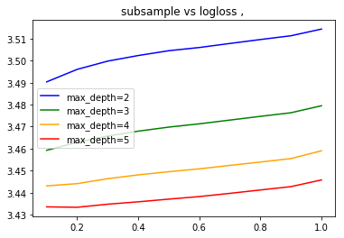
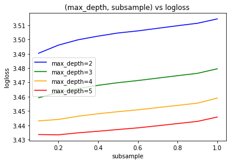
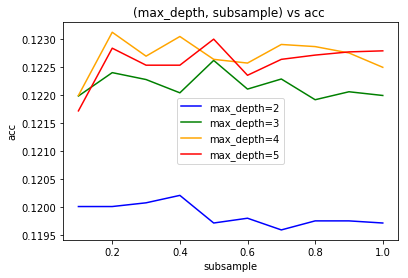
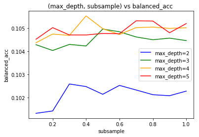

### summary
- change up 'subsample' and 'max_depth', measuring logloss, accuracy and balanced_accuracy
- and re-use data from "2020-07-08-aws"

#### some results
- there are some noticable changes in logloss, but overall the changes are probably not significant


```python
import pandas as pd
import xgboost as xgb
from xgboost import XGBClassifier
import datetime; import pytz
import matplotlib.pyplot as plt
# from scipy.special import softmax
from sklearn.model_selection import cross_val_score
from sklearn.model_selection import train_test_split # (*arrays, **options)
import numpy as np
from sklearn.metrics import log_loss
from sklearn.preprocessing import OneHotEncoder, LabelEncoder

from joblib import dump, load
import joblib
import os
from sklearn.metrics import confusion_matrix, mean_squared_error
from sklearn.model_selection import KFold, train_test_split, GridSearchCV
from sklearn.metrics import accuracy_score, balanced_accuracy_score
import fresh.utils as fu

from importlib import reload
from collections import Counter
from tqdm.notebook import tqdm
import fresh.preproc.v1 as pv1
import fresh.preproc.v2 as pv2
import fresh.tests.utils as ftu
```


```python
localdir = '/home/ec2-user/SageMaker/learn-citibike'  # sagemaker

artifactsdir = f'{localdir}/artifacts'
datadir = f'{artifactsdir}/2020-07-08T143732Z'
print('Using data dir from before, ', datadir)
fu.get_my_memory()
workdir = fu.make_work_dir(localdir); print(workdir)
fu.log(workdir, 'new workdir')
```

    Using data dir from before,  /home/ec2-user/SageMaker/learn-citibike/artifacts/2020-07-08T143732Z
    /home/ec2-user/SageMaker/learn-citibike/artifacts/2020-07-09T134244Z


```python
print('new workdir', workdir)
```

    new workdir /home/ec2-user/SageMaker/learn-citibike/artifacts/2020-07-09T134244Z


```python
train_loc = f'{datadir}/train.libsvm' 
test_loc = f'{datadir}/test.libsvm'
print('memory, before loading data ', fu.get_my_memory())
dtrain = xgb.DMatrix(f'{train_loc}?format=libsvm')
dtest = xgb.DMatrix(f'{test_loc}?format=libsvm')
print('memory,  after loading data', fu.get_my_memory())
# {'pmem': '3.5', 'rss': '0.136 GiB'}
# {'pmem': '4.9', 'rss': '0.191 GiB'}
```

    memory, before loading data  {'pmem': '4.9', 'rss': '0.191 GiB'}
    [13:50:05] 316281x85 matrix with 1431544 entries loaded from /home/ec2-user/SageMaker/learn-citibike/artifacts/2020-07-08T143732Z/train.libsvm?format=libsvm
    [13:50:06] 105427x85 matrix with 476863 entries loaded from /home/ec2-user/SageMaker/learn-citibike/artifacts/2020-07-08T143732Z/test.libsvm?format=libsvm
    memory,  after loading data {'pmem': '5.8', 'rss': '0.225 GiB'}


```python

base_params = {'max_depth':3, 
          'learning_rate': .1, # 'eta':0.1   # alias
          'objective':'multi:softprob',   # mlogloss? 
          'num_class':  54 ,
          'base_score':0.5, 
          'booster':'gbtree', 
          'colsample_bylevel':1,
          'colsample_bynode':1, 
          'colsample_bytree':1, 
          'gamma':0,
          'max_delta_step':0, 
          'min_child_weight':1, #'missing':nan, 
          'random_state':0,
          'reg_alpha':0, 
          'reg_lambda':1,
          'scale_pos_weight':1, 
          'seed': 42,
          #'silent':None, 
          'subsample':1, 
          'verbosity': 0
          
          # from sklearn...
          # 'n_estimators':100, 'n_jobs':1,
         }
actuals = dtest.get_label()

num_round = 100

def runner(params, dtrain, dtest, workdir, num_round, i):
    calltime = datetime.datetime.now()
    watchlist = [(dtrain, 'train'), 
             #(dtest, 'test')
            ]
    fu.log(workdir, f'[{i}] Start xgb.train')
    fu.log(workdir, f'[{i}] params, {params}')
    xgb_model = xgb.train(params, dtrain, num_round, watchlist)


    fu.log(workdir, f'[{i}]Start predict()', f'mem, ({fu.get_my_memory()})')
    y_prob_vec = xgb_model.predict(dtest)
    predictions = np.argmax(y_prob_vec, axis=1)
    fu.log(workdir, f'[{i}]Done predict()', f'mem, ({fu.get_my_memory()})')

    logloss = fu.big_logloss(actuals, y_prob=y_prob_vec, 
                             labels= list(range(54)))
    acc = accuracy_score(actuals, predictions)
    balanced_acc = balanced_accuracy_score(actuals, predictions)
    confusion = confusion_matrix(actuals, predictions)
    bundle_loc = f'{workdir}/{i}_bundle_with_metrics.joblib'

    fu.log(workdir, f'[{i}] Saving to ', bundle_loc)
    fu.log(workdir, f'[{i}] acc {acc}, logloss, {logloss}, balanced_acc, {balanced_acc}')


    joblib.dump({

        'notebook': '2020-07-09-aws.ipynb',
        'xgb_model': xgb_model,
        'train': train_loc,
        'walltime': fu.do_walltime(calltime),
        'primary_dataset': '2013-07 - Citi Bike trip data.csv',
        'input_params': params,
        'num_round': num_round,
        # 'proc_bundle': proc_bundle_loc,
        'validation_metrics': {
            'accuracy': acc,
            'balanced_accuracy': balanced_acc,
            'confusion': confusion,
            'logloss': logloss,
            'test': test_loc
        }


    }, bundle_loc)
    fu.log(workdir, f'[{i}] wrote bundle {bundle_loc}')
    return {'acc': acc, 'balanced_acc': balanced_acc, 'logloss': logloss}


```


```python
from itertools import product

options = [[{'max_depth': 2},
     {'max_depth': 3},
     {'max_depth': 4},
     {'max_depth': 5},       
           ],
    [#{'learning_rate': .01},
     {'learning_rate': .1},
     #{'learning_rate': 1}
    ],
    [{'subsample': 0.1},
    {'subsample': 0.2},
     {'subsample': 0.3},
     {'subsample': 0.4},
     {'subsample': 0.5},
     {'subsample': 0.6},
     {'subsample': 0.7},
     {'subsample': 0.8},
     {'subsample': 0.9},
    {'subsample': 1}],
    [#{'colsample_bytree': .1},
    #{'colsample_bytree': .5},
    {'colsample_bytree': 1.}],
     [#{'colsample_bylevel': 0.1},
      #{'colsample_bylevel': 0.2},
      {'colsample_bylevel': 1},
     ]]
# 3*3*3*3*3
results_vec = []
for i, (depth, learning_rate, subsample, colsample_bytree, colsample_bylevel
    ) in enumerate(product(*options)):
    params = {**base_params, **depth, **learning_rate,
             **subsample, **colsample_bytree, **colsample_bylevel}
    print(i, params)
    
    result = runner(params, dtrain, dtest, workdir, num_round, i)
    print('result', result)
    print('')
    results_vec.append(result)
```

(Log output is [here](2020-07-09-aws_files/train.log)  )


```python
results_vec
```


    [{'acc': 0.12000720877953465,
      'balanced_acc': 0.10132672078446496,
      'logloss': 3.4903522242014158},
     {'acc': 0.12000720877953465,
      'balanced_acc': 0.1014276695101409,
      'logloss': 3.496033286273002},
     {'acc': 0.12007360543314331,
      'balanced_acc': 0.10258872886109609,
      'logloss': 3.4997851496870376},
     {'acc': 0.12020639874036063,
      'balanced_acc': 0.10247802274996883,
      'logloss': 3.502326936804726},
     {'acc': 0.1197131664564106,
      'balanced_acc': 0.10214584304422576,
      'logloss': 3.504513040700152},
     {'acc': 0.11979853358247887,
      'balanced_acc': 0.10252772333222238,
      'logloss': 3.5059717026263986},
     {'acc': 0.11958985838542309,
      'balanced_acc': 0.10233018708968478,
      'logloss': 3.507803793377773},
     {'acc': 0.11975110740132983,
      'balanced_acc': 0.10212769147636917,
      'logloss': 3.5095972094190957},
     {'acc': 0.11975110740132983,
      'balanced_acc': 0.10208399869028718,
      'logloss': 3.5113037477492988},
     {'acc': 0.1197131664564106,
      'balanced_acc': 0.10228208224349761,
      'logloss': 3.514351655221542},
     {'acc': 0.12198013791533478,
      'balanced_acc': 0.10428031423290368,
      'logloss': 3.4592397290498176},
     {'acc': 0.12239748830944634,
      'balanced_acc': 0.10403003694682071,
      'logloss': 3.462880031462945},
     {'acc': 0.12227418023845883,
      'balanced_acc': 0.10429155699004916,
      'logloss': 3.465726248270679},
     {'acc': 0.12203704933271363,
      'balanced_acc': 0.10422429010001126,
      'logloss': 3.4679456547302094},
     {'acc': 0.12261564874273194,
      'balanced_acc': 0.10495368022784363,
      'logloss': 3.4697908097374337},
     {'acc': 0.12210344598632229,
      'balanced_acc': 0.104836431111644,
      'logloss': 3.4712800506554133},
     {'acc': 0.12228366547468865,
      'balanced_acc': 0.1046125139215172,
      'logloss': 3.472980226490574},
     {'acc': 0.12191374126172612,
      'balanced_acc': 0.1044930463562798,
      'logloss': 3.474680959032045},
     {'acc': 0.12205601980517325,
      'balanced_acc': 0.10456143790470343,
      'logloss': 3.476312512345071},
     {'acc': 0.12198962315156459,
      'balanced_acc': 0.1044572104146026,
      'logloss': 3.4794945441534866},
     {'acc': 0.12198962315156459,
      'balanced_acc': 0.10436194480401938,
      'logloss': 3.443072437155954},
     {'acc': 0.12311836626291178,
      'balanced_acc': 0.10473759585097274,
      'logloss': 3.444093844333946},
     {'acc': 0.1226915306325704,
      'balanced_acc': 0.10467858983788302,
      'logloss': 3.446350319874281},
     {'acc': 0.12304248437307332,
      'balanced_acc': 0.10551953202851949,
      'logloss': 3.4480742986458592},
     {'acc': 0.12263461921519156,
      'balanced_acc': 0.1049688156236362,
      'logloss': 3.4495171004760596},
     {'acc': 0.1225682225615829,
      'balanced_acc': 0.10471828855121067,
      'logloss': 3.4508223965237397},
     {'acc': 0.12290020582962619,
      'balanced_acc': 0.10501596322181096,
      'logloss': 3.4523840257057343},
     {'acc': 0.12286226488470696,
      'balanced_acc': 0.10503687849770783,
      'logloss': 3.453910452881146},
     {'acc': 0.12274844204994925,
      'balanced_acc': 0.10498224444074496,
      'logloss': 3.455483205107573},
     {'acc': 0.12249234067174443,
      'balanced_acc': 0.10500874405685184,
      'logloss': 3.459026138445316},
     {'acc': 0.12171455130090014,
      'balanced_acc': 0.10451301995291779,
      'logloss': 3.4335361255637977},
     {'acc': 0.12283380917601752,
      'balanced_acc': 0.10501451248844018,
      'logloss': 3.4333491509756846},
     {'acc': 0.12253028161666367,
      'balanced_acc': 0.104699574254909,
      'logloss': 3.434748187964051},
     {'acc': 0.12253028161666367,
      'balanced_acc': 0.10469797348687558,
      'logloss': 3.4358351825657234},
     {'acc': 0.12299505819192427,
      'balanced_acc': 0.10476486066677136,
      'logloss': 3.4370517752593264},
     {'acc': 0.1223500621282973,
      'balanced_acc': 0.10475067692463587,
      'logloss': 3.438216268353434},
     {'acc': 0.12263461921519156,
      'balanced_acc': 0.10530625991374801,
      'logloss': 3.43967792178407},
     {'acc': 0.12271050110503003,
      'balanced_acc': 0.10529879688329524,
      'logloss': 3.441212383223057},
     {'acc': 0.12276741252240887,
      'balanced_acc': 0.10479369280037314,
      'logloss': 3.442738511629322},
     {'acc': 0.12278638299486849,
      'balanced_acc': 0.10518978339863448,
      'logloss': 3.445776744078156}]


```python
param_vec = []
for i, (depth, learning_rate, subsample, colsample_bytree, colsample_bylevel
    ) in enumerate(product(*options)):
    param_vec.append({**base_params, **depth, **learning_rate,
             **subsample, **colsample_bytree, **colsample_bylevel, 'i': i})
    print(i, params)

```

    0 {'max_depth': 5, 'learning_rate': 0.1, 'objective': 'multi:softprob', 'num_class': 54, 'base_score': 0.5, 'booster': 'gbtree', 'colsample_bylevel': 1, 'colsample_bynode': 1, 'colsample_bytree': 1.0, 'gamma': 0, 'max_delta_step': 0, 'min_child_weight': 1, 'random_state': 0, 'reg_alpha': 0, 'reg_lambda': 1, 'scale_pos_weight': 1, 'seed': 42, 'subsample': 1, 'verbosity': 0}
    1 {'max_depth': 5, 'learning_rate': 0.1, 'objective': 'multi:softprob', 'num_class': 54, 'base_score': 0.5, 'booster': 'gbtree', 'colsample_bylevel': 1, 'colsample_bynode': 1, 'colsample_bytree': 1.0, 'gamma': 0, 'max_delta_step': 0, 'min_child_weight': 1, 'random_state': 0, 'reg_alpha': 0, 'reg_lambda': 1, 'scale_pos_weight': 1, 'seed': 42, 'subsample': 1, 'verbosity': 0}
    2 {'max_depth': 5, 'learning_rate': 0.1, 'objective': 'multi:softprob', 'num_class': 54, 'base_score': 0.5, 'booster': 'gbtree', 'colsample_bylevel': 1, 'colsample_bynode': 1, 'colsample_bytree': 1.0, 'gamma': 0, 'max_delta_step': 0, 'min_child_weight': 1, 'random_state': 0, 'reg_alpha': 0, 'reg_lambda': 1, 'scale_pos_weight': 1, 'seed': 42, 'subsample': 1, 'verbosity': 0}
    3 {'max_depth': 5, 'learning_rate': 0.1, 'objective': 'multi:softprob', 'num_class': 54, 'base_score': 0.5, 'booster': 'gbtree', 'colsample_bylevel': 1, 'colsample_bynode': 1, 'colsample_bytree': 1.0, 'gamma': 0, 'max_delta_step': 0, 'min_child_weight': 1, 'random_state': 0, 'reg_alpha': 0, 'reg_lambda': 1, 'scale_pos_weight': 1, 'seed': 42, 'subsample': 1, 'verbosity': 0}
    4 {'max_depth': 5, 'learning_rate': 0.1, 'objective': 'multi:softprob', 'num_class': 54, 'base_score': 0.5, 'booster': 'gbtree', 'colsample_bylevel': 1, 'colsample_bynode': 1, 'colsample_bytree': 1.0, 'gamma': 0, 'max_delta_step': 0, 'min_child_weight': 1, 'random_state': 0, 'reg_alpha': 0, 'reg_lambda': 1, 'scale_pos_weight': 1, 'seed': 42, 'subsample': 1, 'verbosity': 0}
    5 {'max_depth': 5, 'learning_rate': 0.1, 'objective': 'multi:softprob', 'num_class': 54, 'base_score': 0.5, 'booster': 'gbtree', 'colsample_bylevel': 1, 'colsample_bynode': 1, 'colsample_bytree': 1.0, 'gamma': 0, 'max_delta_step': 0, 'min_child_weight': 1, 'random_state': 0, 'reg_alpha': 0, 'reg_lambda': 1, 'scale_pos_weight': 1, 'seed': 42, 'subsample': 1, 'verbosity': 0}
    6 {'max_depth': 5, 'learning_rate': 0.1, 'objective': 'multi:softprob', 'num_class': 54, 'base_score': 0.5, 'booster': 'gbtree', 'colsample_bylevel': 1, 'colsample_bynode': 1, 'colsample_bytree': 1.0, 'gamma': 0, 'max_delta_step': 0, 'min_child_weight': 1, 'random_state': 0, 'reg_alpha': 0, 'reg_lambda': 1, 'scale_pos_weight': 1, 'seed': 42, 'subsample': 1, 'verbosity': 0}
    7 {'max_depth': 5, 'learning_rate': 0.1, 'objective': 'multi:softprob', 'num_class': 54, 'base_score': 0.5, 'booster': 'gbtree', 'colsample_bylevel': 1, 'colsample_bynode': 1, 'colsample_bytree': 1.0, 'gamma': 0, 'max_delta_step': 0, 'min_child_weight': 1, 'random_state': 0, 'reg_alpha': 0, 'reg_lambda': 1, 'scale_pos_weight': 1, 'seed': 42, 'subsample': 1, 'verbosity': 0}
    8 {'max_depth': 5, 'learning_rate': 0.1, 'objective': 'multi:softprob', 'num_class': 54, 'base_score': 0.5, 'booster': 'gbtree', 'colsample_bylevel': 1, 'colsample_bynode': 1, 'colsample_bytree': 1.0, 'gamma': 0, 'max_delta_step': 0, 'min_child_weight': 1, 'random_state': 0, 'reg_alpha': 0, 'reg_lambda': 1, 'scale_pos_weight': 1, 'seed': 42, 'subsample': 1, 'verbosity': 0}
    9 {'max_depth': 5, 'learning_rate': 0.1, 'objective': 'multi:softprob', 'num_class': 54, 'base_score': 0.5, 'booster': 'gbtree', 'colsample_bylevel': 1, 'colsample_bynode': 1, 'colsample_bytree': 1.0, 'gamma': 0, 'max_delta_step': 0, 'min_child_weight': 1, 'random_state': 0, 'reg_alpha': 0, 'reg_lambda': 1, 'scale_pos_weight': 1, 'seed': 42, 'subsample': 1, 'verbosity': 0}
    10 {'max_depth': 5, 'learning_rate': 0.1, 'objective': 'multi:softprob', 'num_class': 54, 'base_score': 0.5, 'booster': 'gbtree', 'colsample_bylevel': 1, 'colsample_bynode': 1, 'colsample_bytree': 1.0, 'gamma': 0, 'max_delta_step': 0, 'min_child_weight': 1, 'random_state': 0, 'reg_alpha': 0, 'reg_lambda': 1, 'scale_pos_weight': 1, 'seed': 42, 'subsample': 1, 'verbosity': 0}
    11 {'max_depth': 5, 'learning_rate': 0.1, 'objective': 'multi:softprob', 'num_class': 54, 'base_score': 0.5, 'booster': 'gbtree', 'colsample_bylevel': 1, 'colsample_bynode': 1, 'colsample_bytree': 1.0, 'gamma': 0, 'max_delta_step': 0, 'min_child_weight': 1, 'random_state': 0, 'reg_alpha': 0, 'reg_lambda': 1, 'scale_pos_weight': 1, 'seed': 42, 'subsample': 1, 'verbosity': 0}
    12 {'max_depth': 5, 'learning_rate': 0.1, 'objective': 'multi:softprob', 'num_class': 54, 'base_score': 0.5, 'booster': 'gbtree', 'colsample_bylevel': 1, 'colsample_bynode': 1, 'colsample_bytree': 1.0, 'gamma': 0, 'max_delta_step': 0, 'min_child_weight': 1, 'random_state': 0, 'reg_alpha': 0, 'reg_lambda': 1, 'scale_pos_weight': 1, 'seed': 42, 'subsample': 1, 'verbosity': 0}
    13 {'max_depth': 5, 'learning_rate': 0.1, 'objective': 'multi:softprob', 'num_class': 54, 'base_score': 0.5, 'booster': 'gbtree', 'colsample_bylevel': 1, 'colsample_bynode': 1, 'colsample_bytree': 1.0, 'gamma': 0, 'max_delta_step': 0, 'min_child_weight': 1, 'random_state': 0, 'reg_alpha': 0, 'reg_lambda': 1, 'scale_pos_weight': 1, 'seed': 42, 'subsample': 1, 'verbosity': 0}
    14 {'max_depth': 5, 'learning_rate': 0.1, 'objective': 'multi:softprob', 'num_class': 54, 'base_score': 0.5, 'booster': 'gbtree', 'colsample_bylevel': 1, 'colsample_bynode': 1, 'colsample_bytree': 1.0, 'gamma': 0, 'max_delta_step': 0, 'min_child_weight': 1, 'random_state': 0, 'reg_alpha': 0, 'reg_lambda': 1, 'scale_pos_weight': 1, 'seed': 42, 'subsample': 1, 'verbosity': 0}
    15 {'max_depth': 5, 'learning_rate': 0.1, 'objective': 'multi:softprob', 'num_class': 54, 'base_score': 0.5, 'booster': 'gbtree', 'colsample_bylevel': 1, 'colsample_bynode': 1, 'colsample_bytree': 1.0, 'gamma': 0, 'max_delta_step': 0, 'min_child_weight': 1, 'random_state': 0, 'reg_alpha': 0, 'reg_lambda': 1, 'scale_pos_weight': 1, 'seed': 42, 'subsample': 1, 'verbosity': 0}
    16 {'max_depth': 5, 'learning_rate': 0.1, 'objective': 'multi:softprob', 'num_class': 54, 'base_score': 0.5, 'booster': 'gbtree', 'colsample_bylevel': 1, 'colsample_bynode': 1, 'colsample_bytree': 1.0, 'gamma': 0, 'max_delta_step': 0, 'min_child_weight': 1, 'random_state': 0, 'reg_alpha': 0, 'reg_lambda': 1, 'scale_pos_weight': 1, 'seed': 42, 'subsample': 1, 'verbosity': 0}
    17 {'max_depth': 5, 'learning_rate': 0.1, 'objective': 'multi:softprob', 'num_class': 54, 'base_score': 0.5, 'booster': 'gbtree', 'colsample_bylevel': 1, 'colsample_bynode': 1, 'colsample_bytree': 1.0, 'gamma': 0, 'max_delta_step': 0, 'min_child_weight': 1, 'random_state': 0, 'reg_alpha': 0, 'reg_lambda': 1, 'scale_pos_weight': 1, 'seed': 42, 'subsample': 1, 'verbosity': 0}
    18 {'max_depth': 5, 'learning_rate': 0.1, 'objective': 'multi:softprob', 'num_class': 54, 'base_score': 0.5, 'booster': 'gbtree', 'colsample_bylevel': 1, 'colsample_bynode': 1, 'colsample_bytree': 1.0, 'gamma': 0, 'max_delta_step': 0, 'min_child_weight': 1, 'random_state': 0, 'reg_alpha': 0, 'reg_lambda': 1, 'scale_pos_weight': 1, 'seed': 42, 'subsample': 1, 'verbosity': 0}
    19 {'max_depth': 5, 'learning_rate': 0.1, 'objective': 'multi:softprob', 'num_class': 54, 'base_score': 0.5, 'booster': 'gbtree', 'colsample_bylevel': 1, 'colsample_bynode': 1, 'colsample_bytree': 1.0, 'gamma': 0, 'max_delta_step': 0, 'min_child_weight': 1, 'random_state': 0, 'reg_alpha': 0, 'reg_lambda': 1, 'scale_pos_weight': 1, 'seed': 42, 'subsample': 1, 'verbosity': 0}
    20 {'max_depth': 5, 'learning_rate': 0.1, 'objective': 'multi:softprob', 'num_class': 54, 'base_score': 0.5, 'booster': 'gbtree', 'colsample_bylevel': 1, 'colsample_bynode': 1, 'colsample_bytree': 1.0, 'gamma': 0, 'max_delta_step': 0, 'min_child_weight': 1, 'random_state': 0, 'reg_alpha': 0, 'reg_lambda': 1, 'scale_pos_weight': 1, 'seed': 42, 'subsample': 1, 'verbosity': 0}
    21 {'max_depth': 5, 'learning_rate': 0.1, 'objective': 'multi:softprob', 'num_class': 54, 'base_score': 0.5, 'booster': 'gbtree', 'colsample_bylevel': 1, 'colsample_bynode': 1, 'colsample_bytree': 1.0, 'gamma': 0, 'max_delta_step': 0, 'min_child_weight': 1, 'random_state': 0, 'reg_alpha': 0, 'reg_lambda': 1, 'scale_pos_weight': 1, 'seed': 42, 'subsample': 1, 'verbosity': 0}
    22 {'max_depth': 5, 'learning_rate': 0.1, 'objective': 'multi:softprob', 'num_class': 54, 'base_score': 0.5, 'booster': 'gbtree', 'colsample_bylevel': 1, 'colsample_bynode': 1, 'colsample_bytree': 1.0, 'gamma': 0, 'max_delta_step': 0, 'min_child_weight': 1, 'random_state': 0, 'reg_alpha': 0, 'reg_lambda': 1, 'scale_pos_weight': 1, 'seed': 42, 'subsample': 1, 'verbosity': 0}
    23 {'max_depth': 5, 'learning_rate': 0.1, 'objective': 'multi:softprob', 'num_class': 54, 'base_score': 0.5, 'booster': 'gbtree', 'colsample_bylevel': 1, 'colsample_bynode': 1, 'colsample_bytree': 1.0, 'gamma': 0, 'max_delta_step': 0, 'min_child_weight': 1, 'random_state': 0, 'reg_alpha': 0, 'reg_lambda': 1, 'scale_pos_weight': 1, 'seed': 42, 'subsample': 1, 'verbosity': 0}
    24 {'max_depth': 5, 'learning_rate': 0.1, 'objective': 'multi:softprob', 'num_class': 54, 'base_score': 0.5, 'booster': 'gbtree', 'colsample_bylevel': 1, 'colsample_bynode': 1, 'colsample_bytree': 1.0, 'gamma': 0, 'max_delta_step': 0, 'min_child_weight': 1, 'random_state': 0, 'reg_alpha': 0, 'reg_lambda': 1, 'scale_pos_weight': 1, 'seed': 42, 'subsample': 1, 'verbosity': 0}
    25 {'max_depth': 5, 'learning_rate': 0.1, 'objective': 'multi:softprob', 'num_class': 54, 'base_score': 0.5, 'booster': 'gbtree', 'colsample_bylevel': 1, 'colsample_bynode': 1, 'colsample_bytree': 1.0, 'gamma': 0, 'max_delta_step': 0, 'min_child_weight': 1, 'random_state': 0, 'reg_alpha': 0, 'reg_lambda': 1, 'scale_pos_weight': 1, 'seed': 42, 'subsample': 1, 'verbosity': 0}
    26 {'max_depth': 5, 'learning_rate': 0.1, 'objective': 'multi:softprob', 'num_class': 54, 'base_score': 0.5, 'booster': 'gbtree', 'colsample_bylevel': 1, 'colsample_bynode': 1, 'colsample_bytree': 1.0, 'gamma': 0, 'max_delta_step': 0, 'min_child_weight': 1, 'random_state': 0, 'reg_alpha': 0, 'reg_lambda': 1, 'scale_pos_weight': 1, 'seed': 42, 'subsample': 1, 'verbosity': 0}
    27 {'max_depth': 5, 'learning_rate': 0.1, 'objective': 'multi:softprob', 'num_class': 54, 'base_score': 0.5, 'booster': 'gbtree', 'colsample_bylevel': 1, 'colsample_bynode': 1, 'colsample_bytree': 1.0, 'gamma': 0, 'max_delta_step': 0, 'min_child_weight': 1, 'random_state': 0, 'reg_alpha': 0, 'reg_lambda': 1, 'scale_pos_weight': 1, 'seed': 42, 'subsample': 1, 'verbosity': 0}
    28 {'max_depth': 5, 'learning_rate': 0.1, 'objective': 'multi:softprob', 'num_class': 54, 'base_score': 0.5, 'booster': 'gbtree', 'colsample_bylevel': 1, 'colsample_bynode': 1, 'colsample_bytree': 1.0, 'gamma': 0, 'max_delta_step': 0, 'min_child_weight': 1, 'random_state': 0, 'reg_alpha': 0, 'reg_lambda': 1, 'scale_pos_weight': 1, 'seed': 42, 'subsample': 1, 'verbosity': 0}
    29 {'max_depth': 5, 'learning_rate': 0.1, 'objective': 'multi:softprob', 'num_class': 54, 'base_score': 0.5, 'booster': 'gbtree', 'colsample_bylevel': 1, 'colsample_bynode': 1, 'colsample_bytree': 1.0, 'gamma': 0, 'max_delta_step': 0, 'min_child_weight': 1, 'random_state': 0, 'reg_alpha': 0, 'reg_lambda': 1, 'scale_pos_weight': 1, 'seed': 42, 'subsample': 1, 'verbosity': 0}
    30 {'max_depth': 5, 'learning_rate': 0.1, 'objective': 'multi:softprob', 'num_class': 54, 'base_score': 0.5, 'booster': 'gbtree', 'colsample_bylevel': 1, 'colsample_bynode': 1, 'colsample_bytree': 1.0, 'gamma': 0, 'max_delta_step': 0, 'min_child_weight': 1, 'random_state': 0, 'reg_alpha': 0, 'reg_lambda': 1, 'scale_pos_weight': 1, 'seed': 42, 'subsample': 1, 'verbosity': 0}
    31 {'max_depth': 5, 'learning_rate': 0.1, 'objective': 'multi:softprob', 'num_class': 54, 'base_score': 0.5, 'booster': 'gbtree', 'colsample_bylevel': 1, 'colsample_bynode': 1, 'colsample_bytree': 1.0, 'gamma': 0, 'max_delta_step': 0, 'min_child_weight': 1, 'random_state': 0, 'reg_alpha': 0, 'reg_lambda': 1, 'scale_pos_weight': 1, 'seed': 42, 'subsample': 1, 'verbosity': 0}
    32 {'max_depth': 5, 'learning_rate': 0.1, 'objective': 'multi:softprob', 'num_class': 54, 'base_score': 0.5, 'booster': 'gbtree', 'colsample_bylevel': 1, 'colsample_bynode': 1, 'colsample_bytree': 1.0, 'gamma': 0, 'max_delta_step': 0, 'min_child_weight': 1, 'random_state': 0, 'reg_alpha': 0, 'reg_lambda': 1, 'scale_pos_weight': 1, 'seed': 42, 'subsample': 1, 'verbosity': 0}
    33 {'max_depth': 5, 'learning_rate': 0.1, 'objective': 'multi:softprob', 'num_class': 54, 'base_score': 0.5, 'booster': 'gbtree', 'colsample_bylevel': 1, 'colsample_bynode': 1, 'colsample_bytree': 1.0, 'gamma': 0, 'max_delta_step': 0, 'min_child_weight': 1, 'random_state': 0, 'reg_alpha': 0, 'reg_lambda': 1, 'scale_pos_weight': 1, 'seed': 42, 'subsample': 1, 'verbosity': 0}
    34 {'max_depth': 5, 'learning_rate': 0.1, 'objective': 'multi:softprob', 'num_class': 54, 'base_score': 0.5, 'booster': 'gbtree', 'colsample_bylevel': 1, 'colsample_bynode': 1, 'colsample_bytree': 1.0, 'gamma': 0, 'max_delta_step': 0, 'min_child_weight': 1, 'random_state': 0, 'reg_alpha': 0, 'reg_lambda': 1, 'scale_pos_weight': 1, 'seed': 42, 'subsample': 1, 'verbosity': 0}
    35 {'max_depth': 5, 'learning_rate': 0.1, 'objective': 'multi:softprob', 'num_class': 54, 'base_score': 0.5, 'booster': 'gbtree', 'colsample_bylevel': 1, 'colsample_bynode': 1, 'colsample_bytree': 1.0, 'gamma': 0, 'max_delta_step': 0, 'min_child_weight': 1, 'random_state': 0, 'reg_alpha': 0, 'reg_lambda': 1, 'scale_pos_weight': 1, 'seed': 42, 'subsample': 1, 'verbosity': 0}
    36 {'max_depth': 5, 'learning_rate': 0.1, 'objective': 'multi:softprob', 'num_class': 54, 'base_score': 0.5, 'booster': 'gbtree', 'colsample_bylevel': 1, 'colsample_bynode': 1, 'colsample_bytree': 1.0, 'gamma': 0, 'max_delta_step': 0, 'min_child_weight': 1, 'random_state': 0, 'reg_alpha': 0, 'reg_lambda': 1, 'scale_pos_weight': 1, 'seed': 42, 'subsample': 1, 'verbosity': 0}
    37 {'max_depth': 5, 'learning_rate': 0.1, 'objective': 'multi:softprob', 'num_class': 54, 'base_score': 0.5, 'booster': 'gbtree', 'colsample_bylevel': 1, 'colsample_bynode': 1, 'colsample_bytree': 1.0, 'gamma': 0, 'max_delta_step': 0, 'min_child_weight': 1, 'random_state': 0, 'reg_alpha': 0, 'reg_lambda': 1, 'scale_pos_weight': 1, 'seed': 42, 'subsample': 1, 'verbosity': 0}
    38 {'max_depth': 5, 'learning_rate': 0.1, 'objective': 'multi:softprob', 'num_class': 54, 'base_score': 0.5, 'booster': 'gbtree', 'colsample_bylevel': 1, 'colsample_bynode': 1, 'colsample_bytree': 1.0, 'gamma': 0, 'max_delta_step': 0, 'min_child_weight': 1, 'random_state': 0, 'reg_alpha': 0, 'reg_lambda': 1, 'scale_pos_weight': 1, 'seed': 42, 'subsample': 1, 'verbosity': 0}
    39 {'max_depth': 5, 'learning_rate': 0.1, 'objective': 'multi:softprob', 'num_class': 54, 'base_score': 0.5, 'booster': 'gbtree', 'colsample_bylevel': 1, 'colsample_bynode': 1, 'colsample_bytree': 1.0, 'gamma': 0, 'max_delta_step': 0, 'min_child_weight': 1, 'random_state': 0, 'reg_alpha': 0, 'reg_lambda': 1, 'scale_pos_weight': 1, 'seed': 42, 'subsample': 1, 'verbosity': 0}


```python
df = pd.DataFrame.from_records([
    {**param_vec[i], **results_vec[i]} for i in range(len(results_vec))
    
])


df.shape
```


    (40, 23)


```python
cols = ['acc', 'balanced_acc', 'logloss', 'subsample', 'max_depth']
df[cols]

plt.plot(df[df['max_depth'] == 2]['subsample'], 
         df[df['max_depth'] == 2]['logloss'], label='max_depth=2', color='blue')
plt.plot(df[df['max_depth'] == 3]['subsample'], 
         df[df['max_depth'] == 3]['logloss'], label='max_depth=3', color='green')
plt.plot(df[df['max_depth'] == 4]['subsample'], 
         df[df['max_depth'] == 4]['logloss'], label='max_depth=4', color='orange')
plt.plot(df[df['max_depth'] == 5]['subsample'], 
         df[df['max_depth'] == 5]['logloss'], label='max_depth=5', color='red')
plt.title('subsample vs logloss , ')
plt.legend()
```


    <matplotlib.legend.Legend at 0x7fa2507a1be0>





```python

def compare_tuning(df, feature_col_1, feature_col_2, metric_col):

    feature_col_1_values = df[feature_col_1].unique().tolist()

    colors = ['blue', 'green', 'orange', 'red', 'black']
    for i, x in enumerate(feature_col_1_values):
        plt.plot(df[df[feature_col_1] == x][feature_col_2], 
                 df[df[feature_col_1] == x][metric_col], 
                 label=f'{feature_col_1}={x}', color=colors[i%len(colors)])
    plt.title(f'({feature_col_1}, {feature_col_2}) vs {metric_col} ')
    plt.legend()
    plt.xlabel(feature_col_2)
    plt.ylabel(metric_col)


```


```python
cols = ['acc', 'balanced_acc', 'logloss', 'subsample', 'max_depth']
# df[cols]

compare_tuning(df, feature_col_1='max_depth', 
             feature_col_2='subsample', 
             metric_col='logloss')
```





```python
compare_tuning(df, feature_col_1='max_depth', 
             feature_col_2='subsample', 
             metric_col='acc')
```





```python
compare_tuning(df, feature_col_1='max_depth', 
             feature_col_2='subsample', 
             metric_col='balanced_acc')
```




