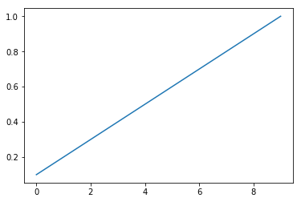

like "2020-07-09-aws"  , test some more parameters... 


```python
import pandas as pd
import json
import xgboost as xgb
from xgboost import XGBClassifier
import datetime; import pytz
import matplotlib.pyplot as plt
# from scipy.special import softmax
from sklearn.model_selection import cross_val_score
from sklearn.model_selection import train_test_split # (*arrays, **options)
import numpy as np
from sklearn.metrics import log_loss
from sklearn.preprocessing import OneHotEncoder, LabelEncoder
from itertools import product

from joblib import dump, load
import joblib
import os
from sklearn.metrics import confusion_matrix, mean_squared_error
from sklearn.model_selection import KFold, train_test_split, GridSearchCV
from sklearn.metrics import accuracy_score, balanced_accuracy_score
import fresh.utils as fu

from importlib import reload
from collections import Counter
from tqdm.notebook import tqdm
import fresh.preproc.v1 as pv1
import fresh.preproc.v2 as pv2
import fresh.tests.utils as ftu
```


```python
localdir = '/home/ec2-user/SageMaker/learn-citibike'  # sagemaker
name_of_this_notebook = '2020-07-10-aws.ipynb'
artifactsdir = f'{localdir}/artifacts'
datadir = f'{artifactsdir}/2020-07-08T143732Z'
print('Using data dir from before, ', datadir)
fu.get_my_memory()
workdir = fu.make_work_dir(localdir); print(workdir)
fu.log(workdir, 'new workdir')
```

    Using data dir from before,  /home/ec2-user/SageMaker/learn-citibike/artifacts/2020-07-08T143732Z
    /home/ec2-user/SageMaker/learn-citibike/artifacts/2020-07-10T135910Z


```python
print('new workdir', workdir)

```

    new workdir /home/ec2-user/SageMaker/learn-citibike/artifacts/2020-07-10T135910Z


```python
train_loc = f'{datadir}/train.libsvm' 
test_loc = f'{datadir}/test.libsvm'
print('memory, before loading data ', fu.get_my_memory())
dtrain = xgb.DMatrix(f'{train_loc}?format=libsvm')
dtest = xgb.DMatrix(f'{test_loc}?format=libsvm')
print('memory,  after loading data', fu.get_my_memory())
```

    memory, before loading data  {'pmem': '3.5', 'rss': '0.136 GiB'}
    [13:59:44] 316281x85 matrix with 1431544 entries loaded from /home/ec2-user/SageMaker/learn-citibike/artifacts/2020-07-08T143732Z/train.libsvm?format=libsvm
    [13:59:44] 105427x85 matrix with 476863 entries loaded from /home/ec2-user/SageMaker/learn-citibike/artifacts/2020-07-08T143732Z/test.libsvm?format=libsvm
    memory,  after loading data {'pmem': '4.9', 'rss': '0.191 GiB'}


```python
from sklearn.datasets import load_svmlight_file

```


```python
bundle = joblib.load(f'{artifactsdir}/2020-07-09T134244Z/28_bundle_with_metrics.joblib')
model = bundle['xgb_model']
test_loc = f'{datadir}/test.libsvm'
print('evaluate using ', test_loc)
test_data = load_svmlight_file(test_loc)
X_test = test_data[0].toarray()
y_test = test_data[1]
y_prob = model.predict(dtest)
```

    evaluate using  /home/ec2-user/SageMaker/learn-citibike/artifacts/2020-07-08T143732Z/test.libsvm


```python
reload(fm) ; import fresh.metrics as fm
correct_kth, area = fm.kth_area(y_test, y_prob,
            num_classes=54)
print(area)
plt.hist(correct_kth, bins=54)
plt.show()

```

    0.756701407222621


```python
arr = np.array([.1, .2, .3, .4, .5, .6, .7, .8, .9, 1.])
plt.plot(arr)
(arr/10).sum()
```


    0.5499999999999999





```python
arr = np.array([.2, .3, .38, .4, .5, .6, .7, .8, .9, 1.])
plt.plot(arr)
(arr/10).sum()
```


    0.578


```python
base_params = {'max_depth':3, 
          'learning_rate': .1, # 'eta':0.1   # alias
          'objective':'multi:softprob',   # mlogloss? 
          'num_class':  54 ,
          'base_score':0.5, 
          'booster':'gbtree', 
          'colsample_bylevel':1,
          'colsample_bynode':1, 
          'colsample_bytree':1, 
          'gamma':0,
          'max_delta_step':0, 
          'min_child_weight':1, #'missing':nan, 
          'random_state':0,
          'reg_alpha':0, 
          'reg_lambda':1,
          'scale_pos_weight':1, 
          'seed': 42,
          #'silent':None, 
          'subsample':1, 
          'verbosity': 0
          
          # from sklearn...
          # 'n_estimators':100, 'n_jobs':1,
         }
actuals = dtest.get_label()

num_round = 100

def runner(params, dtrain, dtest, y_test, workdir, num_round, i):
    calltime = datetime.datetime.now()
    watchlist = [(dtrain, 'train'), 
             #(dtest, 'test')
            ]
    fu.log(workdir, f'[{i}] Start xgb.train')
    fu.log(workdir, f'[{i}] params, {params}')
    xgb_model = xgb.train(params, dtrain, num_round, watchlist)

    fu.log(workdir, f'[{i}]Start predict()', f'mem, ({fu.get_my_memory()})')
    y_prob_vec = xgb_model.predict(dtest)
    predictions = np.argmax(y_prob_vec, axis=1)
    fu.log(workdir, f'[{i}]Done predict()', f'mem, ({fu.get_my_memory()})')

    logloss = fu.big_logloss(actuals, y_prob=y_prob_vec, 
                             labels= list(range(54)))
    acc = accuracy_score(actuals, predictions)
    balanced_acc = balanced_accuracy_score(actuals, predictions)
    confusion = confusion_matrix(actuals, predictions)
    bundle_loc = f'{workdir}/{i}_bundle_with_metrics.joblib'

    fu.log(workdir, f'[{i}] Saving to ', bundle_loc)
    fu.log(workdir, f'[{i}] acc {acc}, logloss, {logloss}, balanced_acc, {balanced_acc}')

    walltime = fu.do_walltime(calltime)
    
    correct_kth, karea = fm.kth_area(y_test, y_prob_vec,
            num_classes=54)
    joblib.dump({
        'notebook': name_of_this_notebook,
        'xgb_model': xgb_model,
        'train': train_loc,
        'walltime': walltime,
        'primary_dataset': '2013-07 - Citi Bike trip data.csv',
        'input_params': params,
        'num_round': num_round,
        # 'proc_bundle': proc_bundle_loc,
        'validation_metrics': {
            'accuracy': acc,
            'balanced_accuracy': balanced_acc,
            'confusion': confusion,
            'logloss': logloss,
            'test': test_loc,
            'karea': karea,
        }

    }, bundle_loc)
    fu.log(workdir, f'[{i}] wrote bundle {bundle_loc}')
    return {'acc': acc, 'balanced_acc': balanced_acc, 
            'logloss': logloss,
           'walltime': walltime, 
           'karea': karea}
```


```python
options = [[#{'max_depth': 2},  # this is pretty bad for sure 
     {'max_depth': 3},
     {'max_depth': 4},
     {'max_depth': 5},       # 3
           ],
    [{'learning_rate': .01},
     {'learning_rate': .1},
     {'learning_rate': 1}  # 3 
    ],
    [{'subsample': 0.1},
    #{'subsample': 0.2},
     #{'subsample': 0.3},
     {'subsample': 0.4},
     #{'subsample': 0.5},
     #{'subsample': 0.6},
     #{'subsample': 0.7},
     #{'subsample': 0.8},
     #{'subsample': 0.9},
    {'subsample': 1}],      # 3 
    [{'colsample_bytree': .1},
    {'colsample_bytree': .5},
    {'colsample_bytree': 1.}],   # 3
     [{'colsample_bylevel': 0.1},
      {'colsample_bylevel': 0.2},
      {'colsample_bylevel': 1},    # 3 
     ],
           [10, 20, 40, 60, 80, 100]    # 6  
          ]
# 3*3*3*3*3 * 6  = 1458 combos...
results_vec = []
for i, (depth, learning_rate, subsample, colsample_bytree, colsample_bylevel,
        num_round
    ) in enumerate(product(*options)):
    params = {**base_params, **depth, **learning_rate,
             **subsample, **colsample_bytree, **colsample_bylevel}
    print(i, params, 'num_round, ', num_round)
    
    result = runner(params, dtrain, dtest, y_test, workdir, num_round, i)
    print('result', result)
    print('')
    results_vec.append({**params, **result, 'i': i, 'num_round': num_round})
    with open(f'{workdir}/{fu.utc_ts()}_results_vec.json', 'w') as fd:
        json.dump(results_vec, fd)
    # fu.log(workdir, f'[{i}] wrote bundle {bundle_loc}')

    
```

_I manually cut this output out and placed it_ [here](2020-07-10-aws_files/train.log)

```python
import json
```
