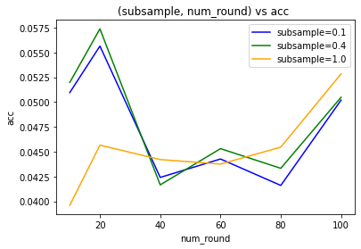

While my "2020-07-10-aws" notebook is still running, I'm just going to plot some results in matplotlib here locally. I don't want to interrupt the sagemaker notebook instance memory. 

I am impressed that it did not crash and that somehow AWS did not kill it.

`2020-07-10 15:22:40Z, [0] Start xgb.train` Started first xgb train
`2020-07-11 14:02:07Z, [266] Start xgb.train` still going

Based on the combinations beingtested , `3*3*3*3*3*6 = 1458` there's some more waiting to do for sure. Going to check which models take longer perhaps


```python
import pandas as pd
import datetime; import pytz
import matplotlib.pyplot as plt
from joblib import dump, load
import joblib
import os
from functools import reduce
import fresh.s3utils as fs3
from importlib import reload
import json
import fresh.plot as fp
import fresh.vanilla_utils as fvu


```


```python
# os.environ['MY_SAGEMAKER_S3_BUCKET'] = ''  # storing this in my somevars.sh NOTE
# os.environ['MY_ACCESS_KEY_ID'] = ''
# os.environ['MY_SECRET_ACCESS_KEY'] = ''

mybucket = os.getenv('MY_SAGEMAKER_S3_BUCKET')
s3uri = (f's3://{mybucket}/'
         'bikelearn/artifacts/2020-07-10T135910Z/'
         '2020-07-11T143012Z_results_vec.json')
bucket, s3fn = fs3.s3uri_to_parts(s3uri)

results_vec = json.loads(fs3.read_s3_file(bucket, s3fn))
results_vec
```


    [{'max_depth': 3,
      'learning_rate': 0.01,
      'objective': 'multi:softprob',
      'num_class': 54,
      'base_score': 0.5,
      'booster': 'gbtree',
      'colsample_bylevel': 0.1,
      'colsample_bynode': 1,
      'colsample_bytree': 0.1,
      'gamma': 0,
      'max_delta_step': 0,
      'min_child_weight': 1,
      'random_state': 0,
      'reg_alpha': 0,
      'reg_lambda': 1,
      'scale_pos_weight': 1,
      'seed': 42,
      'subsample': 0.1,
      'verbosity': 0,
      'acc': 0.050964174262760016,
      'balanced_acc': 0.03684609209838398,
      'logloss': 3.9766314117097132,
      'walltime': 22.023615,
      'karea': 0.6426400363389939,
      'i': 0,
      'num_round': 10},
     {'max_depth': 3,
      'learning_rate': 0.01,
      'objective': 'multi:softprob',
      'num_class': 54,
      'base_score': 0.5,
      'booster': 'gbtree',
      'colsample_bylevel': 0.1,
      'colsample_bynode': 1,
      'colsample_bytree': 0.1,
      'gamma': 0,
      'max_delta_step': 0,
      'min_child_weight': 1,
      'random_state': 0,
      'reg_alpha': 0,
      'reg_lambda': 1,
      'scale_pos_weight': 1,
      'seed': 42,
      'subsample': 0.1,
      'verbosity': 0,
      'acc': 0.055649880960285315,
      'balanced_acc': 0.03922801506122463,
      'logloss': 3.9639876704063286,
      'walltime': 44.816075,
      'karea': 0.6473522665674581,
      'i': 1,
      'num_round': 20},
     {'max_depth': 3,
      'learning_rate': 0.01,
      'objective': 'multi:softprob',
      'num_class': 54,
      'base_score': 0.5,
      'booster': 'gbtree',
      'colsample_bylevel': 0.1,
      'colsample_bynode': 1,
      'colsample_bytree': 0.1,
      'gamma': 0,
      'max_delta_step': 0,
      'min_child_weight': 1,
      'random_state': 0,
      'reg_alpha': 0,
      'reg_lambda': 1,
      'scale_pos_weight': 1,
      'seed': 42,
      'subsample': 0.1,
      'verbosity': 0,
      'acc': 0.042408491183472924,
      'balanced_acc': 0.028028268765707718,
      'logloss': 3.9443131285956072,
      'walltime': 86.323253,
      'karea': 0.6477320273216961,
      'i': 2,
      'num_round': 40},
     {'max_depth': 3,
      'learning_rate': 0.01,
      'objective': 'multi:softprob',
      'num_class': 54,
      'base_score': 0.5,
      'booster': 'gbtree',
      'colsample_bylevel': 0.1,
      'colsample_bynode': 1,
      'colsample_bytree': 0.1,
      'gamma': 0,
      'max_delta_step': 0,
      'min_child_weight': 1,
      'random_state': 0,
      'reg_alpha': 0,
      'reg_lambda': 1,
      'scale_pos_weight': 1,
      'seed': 42,
      'subsample': 0.1,
      'verbosity': 0,
      'acc': 0.04426759748451535,
      'balanced_acc': 0.029299973995973547,
      'logloss': 3.926844672785682,
      'walltime': 130.527839,
      'karea': 0.649191524133427,
      'i': 3,
      'num_round': 60},
     {'max_depth': 3,
      'learning_rate': 0.01,
      'objective': 'multi:softprob',
      'num_class': 54,
      'base_score': 0.5,
      'booster': 'gbtree',
      'colsample_bylevel': 0.1,
      'colsample_bynode': 1,
      'colsample_bytree': 0.1,
      'gamma': 0,
      'max_delta_step': 0,
      'min_child_weight': 1,
      'random_state': 0,
      'reg_alpha': 0,
      'reg_lambda': 1,
      'scale_pos_weight': 1,
      'seed': 42,
      'subsample': 0.1,
      'verbosity': 0,
      'acc': 0.04160224610393922,
      'balanced_acc': 0.024886277704167695,
      'logloss': 3.9111737903246024,
      'walltime': 173.374781,
      'karea': 0.6514491860086443,
      'i': 4,
      'num_round': 80},
     {'max_depth': 3,
      'learning_rate': 0.01,
      'objective': 'multi:softprob',
      'num_class': 54,
      'base_score': 0.5,
      'booster': 'gbtree',
      'colsample_bylevel': 0.1,
      'colsample_bynode': 1,
      'colsample_bytree': 0.1,
      'gamma': 0,
      'max_delta_step': 0,
      'min_child_weight': 1,
      'random_state': 0,
      'reg_alpha': 0,
      'reg_lambda': 1,
      'scale_pos_weight': 1,
      'seed': 42,
      'subsample': 0.1,
      'verbosity': 0,
      'acc': 0.05020535536437535,
      'balanced_acc': 0.031255168407851724,
      'logloss': 3.8974572440336823,
      'walltime': 216.224809,
      'karea': 0.6532775531182012,
      'i': 5,
      'num_round': 100},
     {'max_depth': 3,
      'learning_rate': 0.01,
      'objective': 'multi:softprob',
      'num_class': 54,
      'base_score': 0.5,
      'booster': 'gbtree',
      'colsample_bylevel': 0.2,
      'colsample_bynode': 1,
      'colsample_bytree': 0.1,
      'gamma': 0,
      'max_delta_step': 0,
      'min_child_weight': 1,
      'random_state': 0,
      'reg_alpha': 0,
      'reg_lambda': 1,
      'scale_pos_weight': 1,
      'seed': 42,
      'subsample': 0.1,
      'verbosity': 0,
      'acc': 0.050964174262760016,
      'balanced_acc': 0.03684609209838398,
      'logloss': 3.9766314117097132,
      'walltime': 21.920952,
      'karea': 0.6426400363389939,
      'i': 6,
      'num_round': 10},
     {'max_depth': 3,
      'learning_rate': 0.01,
      'objective': 'multi:softprob',
      'num_class': 54,
      'base_score': 0.5,
      'booster': 'gbtree',
      'colsample_bylevel': 0.2,
      'colsample_bynode': 1,
      'colsample_bytree': 0.1,
      'gamma': 0,
      'max_delta_step': 0,
      'min_child_weight': 1,
      'random_state': 0,
      'reg_alpha': 0,
      'reg_lambda': 1,
      'scale_pos_weight': 1,
      'seed': 42,
      'subsample': 0.1,
      'verbosity': 0,
      'acc': 0.055649880960285315,
      'balanced_acc': 0.03922801506122463,
      'logloss': 3.9639876704063286,
      'walltime': 45.036871,
      'karea': 0.6473522665674581,
      'i': 7,
      'num_round': 20},
     {'max_depth': 3,
      'learning_rate': 0.01,
      'objective': 'multi:softprob',
      'num_class': 54,
      'base_score': 0.5,
      'booster': 'gbtree',
      'colsample_bylevel': 0.2,
      'colsample_bynode': 1,
      'colsample_bytree': 0.1,
      'gamma': 0,
      'max_delta_step': 0,
      'min_child_weight': 1,
      'random_state': 0,
      'reg_alpha': 0,
      'reg_lambda': 1,
      'scale_pos_weight': 1,
      'seed': 42,
      'subsample': 0.1,
      'verbosity': 0,
      'acc': 0.042408491183472924,
      'balanced_acc': 0.028028268765707718,
      'logloss': 3.9443131285956072,
      'walltime': 86.518097,
      'karea': 0.6477320273216961,
      'i': 8,
      'num_round': 40},
     {'max_depth': 3,
      'learning_rate': 0.01,
      'objective': 'multi:softprob',
      'num_class': 54,
      'base_score': 0.5,
      'booster': 'gbtree',
      'colsample_bylevel': 0.2,
      'colsample_bynode': 1,
      'colsample_bytree': 0.1,
      'gamma': 0,
      'max_delta_step': 0,
      'min_child_weight': 1,
      'random_state': 0,
      'reg_alpha': 0,
      'reg_lambda': 1,
      'scale_pos_weight': 1,
      'seed': 42,
      'subsample': 0.1,
      'verbosity': 0,
      'acc': 0.04426759748451535,
      'balanced_acc': 0.029299973995973547,
      'logloss': 3.926844672785682,
      'walltime': 130.473843,
      'karea': 0.649191524133427,
      'i': 9,
      'num_round': 60},
     {'max_depth': 3,
      'learning_rate': 0.01,
      'objective': 'multi:softprob',
      'num_class': 54,
      'base_score': 0.5,
      'booster': 'gbtree',
      'colsample_bylevel': 0.2,
      'colsample_bynode': 1,
      'colsample_bytree': 0.1,
      'gamma': 0,
      'max_delta_step': 0,
      'min_child_weight': 1,
      'random_state': 0,
      'reg_alpha': 0,
      'reg_lambda': 1,
      'scale_pos_weight': 1,
      'seed': 42,
      'subsample': 0.1,
      'verbosity': 0,
      'acc': 0.04160224610393922,
      'balanced_acc': 0.024886277704167695,
      'logloss': 3.9111737903246024,
      'walltime': 172.969956,
      'karea': 0.6514491860086443,
      'i': 10,
      'num_round': 80},
     {'max_depth': 3,
      'learning_rate': 0.01,
      'objective': 'multi:softprob',
      'num_class': 54,
      'base_score': 0.5,
      'booster': 'gbtree',
      'colsample_bylevel': 0.2,
      'colsample_bynode': 1,
      'colsample_bytree': 0.1,
      'gamma': 0,
      'max_delta_step': 0,
      'min_child_weight': 1,
      'random_state': 0,
      'reg_alpha': 0,
      'reg_lambda': 1,
      'scale_pos_weight': 1,
      'seed': 42,
      'subsample': 0.1,
      'verbosity': 0,
      'acc': 0.05020535536437535,
      'balanced_acc': 0.031255168407851724,
      'logloss': 3.8974572440336823,
      'walltime': 215.899521,
      'karea': 0.6532775531182012,
      'i': 11,
      'num_round': 100},
     {'max_depth': 3,
      'learning_rate': 0.01,
      'objective': 'multi:softprob',
      'num_class': 54,
      'base_score': 0.5,
      'booster': 'gbtree',
      'colsample_bylevel': 1,
      'colsample_bynode': 1,
      'colsample_bytree': 0.1,
      'gamma': 0,
      'max_delta_step': 0,
      'min_child_weight': 1,
      'random_state': 0,
      'reg_alpha': 0,
      'reg_lambda': 1,
      'scale_pos_weight': 1,
      'seed': 42,
      'subsample': 0.1,
      'verbosity': 0,
      'acc': 0.07659328255570205,
      'balanced_acc': 0.05665177120965496,
      'logloss': 3.9727518967767494,
      'walltime': 24.395298,
      'karea': 0.6727194769489437,
      'i': 12,
      'num_round': 10},
     {'max_depth': 3,
      'learning_rate': 0.01,
      'objective': 'multi:softprob',
      'num_class': 54,
      'base_score': 0.5,
      'booster': 'gbtree',
      'colsample_bylevel': 1,
      'colsample_bynode': 1,
      'colsample_bytree': 0.1,
      'gamma': 0,
      'max_delta_step': 0,
      'min_child_weight': 1,
      'random_state': 0,
      'reg_alpha': 0,
      'reg_lambda': 1,
      'scale_pos_weight': 1,
      'seed': 42,
      'subsample': 0.1,
      'verbosity': 0,
      'acc': 0.08551888984795167,
      'balanced_acc': 0.06504770005232816,
      'logloss': 3.9550271916398705,
      'walltime': 48.177662,
      'karea': 0.682592202643992,
      'i': 13,
      'num_round': 20},
     {'max_depth': 3,
      'learning_rate': 0.01,
      'objective': 'multi:softprob',
      'num_class': 54,
      'base_score': 0.5,
      'booster': 'gbtree',
      'colsample_bylevel': 1,
      'colsample_bynode': 1,
      'colsample_bytree': 0.1,
      'gamma': 0,
      'max_delta_step': 0,
      'min_child_weight': 1,
      'random_state': 0,
      'reg_alpha': 0,
      'reg_lambda': 1,
      'scale_pos_weight': 1,
      'seed': 42,
      'subsample': 0.1,
      'verbosity': 0,
      'acc': 0.09631308867747351,
      'balanced_acc': 0.07231282521517009,
      'logloss': 3.9270377747831287,
      'walltime': 97.632821,
      'karea': 0.686150220145307,
      'i': 14,
      'num_round': 40},
     {'max_depth': 3,
      'learning_rate': 0.01,
      'objective': 'multi:softprob',
      'num_class': 54,
      'base_score': 0.5,
      'booster': 'gbtree',
      'colsample_bylevel': 1,
      'colsample_bynode': 1,
      'colsample_bytree': 0.1,
      'gamma': 0,
      'max_delta_step': 0,
      'min_child_weight': 1,
      'random_state': 0,
      'reg_alpha': 0,
      'reg_lambda': 1,
      'scale_pos_weight': 1,
      'seed': 42,
      'subsample': 0.1,
      'verbosity': 0,
      'acc': 0.10377796959033264,
      'balanced_acc': 0.07914268716825026,
      'logloss': 3.9011299229346617,
      'walltime': 145.224516,
      'karea': 0.6895190598795938,
      'i': 15,
      'num_round': 60},
     {'max_depth': 3,
      'learning_rate': 0.01,
      'objective': 'multi:softprob',
      'num_class': 54,
      'base_score': 0.5,
      'booster': 'gbtree',
      'colsample_bylevel': 1,
      'colsample_bynode': 1,
      'colsample_bytree': 0.1,
      'gamma': 0,
      'max_delta_step': 0,
      'min_child_weight': 1,
      'random_state': 0,
      'reg_alpha': 0,
      'reg_lambda': 1,
      'scale_pos_weight': 1,
      'seed': 42,
      'subsample': 0.1,
      'verbosity': 0,
      'acc': 0.10397715955115862,
      'balanced_acc': 0.07960739597434163,
      'logloss': 3.8782707917551087,
      'walltime': 193.051182,
      'karea': 0.6927097879557875,
      'i': 16,
      'num_round': 80},
     {'max_depth': 3,
      'learning_rate': 0.01,
      'objective': 'multi:softprob',
      'num_class': 54,
      'base_score': 0.5,
      'booster': 'gbtree',
      'colsample_bylevel': 1,
      'colsample_bynode': 1,
      'colsample_bytree': 0.1,
      'gamma': 0,
      'max_delta_step': 0,
      'min_child_weight': 1,
      'random_state': 0,
      'reg_alpha': 0,
      'reg_lambda': 1,
      'scale_pos_weight': 1,
      'seed': 42,
      'subsample': 0.1,
      'verbosity': 0,
      'acc': 0.10573192825367315,
      'balanced_acc': 0.08100206630275165,
      'logloss': 3.8571678777956544,
      'walltime': 241.473214,
      'karea': 0.6951397649558461,
      'i': 17,
      'num_round': 100},
     {'max_depth': 3,
      'learning_rate': 0.01,
      'objective': 'multi:softprob',
      'num_class': 54,
      'base_score': 0.5,
      'booster': 'gbtree',
      'colsample_bylevel': 0.1,
      'colsample_bynode': 1,
      'colsample_bytree': 0.5,
      'gamma': 0,
      'max_delta_step': 0,
      'min_child_weight': 1,
      'random_state': 0,
      'reg_alpha': 0,
      'reg_lambda': 1,
      'scale_pos_weight': 1,
      'seed': 42,
      'subsample': 0.1,
      'verbosity': 0,
      'acc': 0.09735646466275243,
      'balanced_acc': 0.0761882409578278,
      'logloss': 3.9698979582166305,
      'walltime': 23.827975,
      'karea': 0.6848591741029163,
      'i': 18,
      'num_round': 10},
     {'max_depth': 3,
      'learning_rate': 0.01,
      'objective': 'multi:softprob',
      'num_class': 54,
      'base_score': 0.5,
      'booster': 'gbtree',
      'colsample_bylevel': 0.1,
      'colsample_bynode': 1,
      'colsample_bytree': 0.5,
      'gamma': 0,
      'max_delta_step': 0,
      'min_child_weight': 1,
      'random_state': 0,
      'reg_alpha': 0,
      'reg_lambda': 1,
      'scale_pos_weight': 1,
      'seed': 42,
      'subsample': 0.1,
      'verbosity': 0,
      'acc': 0.10347444203097877,
      'balanced_acc': 0.07982445119472048,
      'logloss': 3.952604716685288,
      'walltime': 48.960687,
      'karea': 0.6894851589426985,
      'i': 19,
      'num_round': 20},
     {'max_depth': 3,
      'learning_rate': 0.01,
      'objective': 'multi:softprob',
      'num_class': 54,
      'base_score': 0.5,
      'booster': 'gbtree',
      'colsample_bylevel': 0.1,
      'colsample_bynode': 1,
      'colsample_bytree': 0.5,
      'gamma': 0,
      'max_delta_step': 0,
      'min_child_weight': 1,
      'random_state': 0,
      'reg_alpha': 0,
      'reg_lambda': 1,
      'scale_pos_weight': 1,
      'seed': 42,
      'subsample': 0.1,
      'verbosity': 0,
      'acc': 0.10752463790110693,
      'balanced_acc': 0.08243190639076518,
      'logloss': 3.922878503776591,
      'walltime': 94.397305,
      'karea': 0.6941814047915903,
      'i': 20,
      'num_round': 40},
     {'max_depth': 3,
      'learning_rate': 0.01,
      'objective': 'multi:softprob',
      'num_class': 54,
      'base_score': 0.5,
      'booster': 'gbtree',
      'colsample_bylevel': 0.1,
      'colsample_bynode': 1,
      'colsample_bytree': 0.5,
      'gamma': 0,
      'max_delta_step': 0,
      'min_child_weight': 1,
      'random_state': 0,
      'reg_alpha': 0,
      'reg_lambda': 1,
      'scale_pos_weight': 1,
      'seed': 42,
      'subsample': 0.1,
      'verbosity': 0,
      'acc': 0.10788507687783964,
      'balanced_acc': 0.08128914522373325,
      'logloss': 3.8966110737031463,
      'walltime': 142.716002,
      'karea': 0.6958346463359409,
      'i': 21,
      'num_round': 60},
     {'max_depth': 3,
      'learning_rate': 0.01,
      'objective': 'multi:softprob',
      'num_class': 54,
      'base_score': 0.5,
      'booster': 'gbtree',
      'colsample_bylevel': 0.1,
      'colsample_bynode': 1,
      'colsample_bytree': 0.5,
      'gamma': 0,
      'max_delta_step': 0,
      'min_child_weight': 1,
      'random_state': 0,
      'reg_alpha': 0,
      'reg_lambda': 1,
      'scale_pos_weight': 1,
      'seed': 42,
      'subsample': 0.1,
      'verbosity': 0,
      'acc': 0.10901381998918683,
      'balanced_acc': 0.08343564337156482,
      'logloss': 3.8715651539884335,
      'walltime': 188.161359,
      'karea': 0.6979440574819368,
      'i': 22,
      'num_round': 80},
     {'max_depth': 3,
      'learning_rate': 0.01,
      'objective': 'multi:softprob',
      'num_class': 54,
      'base_score': 0.5,
      'booster': 'gbtree',
      'colsample_bylevel': 0.1,
      'colsample_bynode': 1,
      'colsample_bytree': 0.5,
      'gamma': 0,
      'max_delta_step': 0,
      'min_child_weight': 1,
      'random_state': 0,
      'reg_alpha': 0,
      'reg_lambda': 1,
      'scale_pos_weight': 1,
      'seed': 42,
      'subsample': 0.1,
      'verbosity': 0,
      'acc': 0.11033226782513018,
      'balanced_acc': 0.08505293233067296,
      'logloss': 3.848959197175778,
      'walltime': 236.067771,
      'karea': 0.6996918000835405,
      'i': 23,
      'num_round': 100},
     {'max_depth': 3,
      'learning_rate': 0.01,
      'objective': 'multi:softprob',
      'num_class': 54,
      'base_score': 0.5,
      'booster': 'gbtree',
      'colsample_bylevel': 0.2,
      'colsample_bynode': 1,
      'colsample_bytree': 0.5,
      'gamma': 0,
      'max_delta_step': 0,
      'min_child_weight': 1,
      'random_state': 0,
      'reg_alpha': 0,
      'reg_lambda': 1,
      'scale_pos_weight': 1,
      'seed': 42,
      'subsample': 0.1,
      'verbosity': 0,
      'acc': 0.1053240630957914,
      'balanced_acc': 0.08537072604951083,
      'logloss': 3.9639677201391046,
      'walltime': 26.131305,
      'karea': 0.7027982149488026,
      'i': 24,
      'num_round': 10},
     {'max_depth': 3,
      'learning_rate': 0.01,
      'objective': 'multi:softprob',
      'num_class': 54,
      'base_score': 0.5,
      'booster': 'gbtree',
      'colsample_bylevel': 0.2,
      'colsample_bynode': 1,
      'colsample_bytree': 0.5,
      'gamma': 0,
      'max_delta_step': 0,
      'min_child_weight': 1,
      'random_state': 0,
      'reg_alpha': 0,
      'reg_lambda': 1,
      'scale_pos_weight': 1,
      'seed': 42,
      'subsample': 0.1,
      'verbosity': 0,
      'acc': 0.11249490168552648,
      'balanced_acc': 0.09310444197134081,
      'logloss': 3.941154311618649,
      'walltime': 48.611971,
      'karea': 0.7066797843970674,
      'i': 25,
      'num_round': 20},
     {'max_depth': 3,
      'learning_rate': 0.01,
      'objective': 'multi:softprob',
      'num_class': 54,
      'base_score': 0.5,
      'booster': 'gbtree',
      'colsample_bylevel': 0.2,
      'colsample_bynode': 1,
      'colsample_bytree': 0.5,
      'gamma': 0,
      'max_delta_step': 0,
      'min_child_weight': 1,
      'random_state': 0,
      'reg_alpha': 0,
      'reg_lambda': 1,
      'scale_pos_weight': 1,
      'seed': 42,
      'subsample': 0.1,
      'verbosity': 0,
      'acc': 0.11299761920570632,
      'balanced_acc': 0.09147105668613377,
      'logloss': 3.90343499644711,
      'walltime': 96.777859,
      'karea': 0.7107463159518134,
      'i': 26,
      'num_round': 40},
     {'max_depth': 3,
      'learning_rate': 0.01,
      'objective': 'multi:softprob',
      'num_class': 54,
      'base_score': 0.5,
      'booster': 'gbtree',
      'colsample_bylevel': 0.2,
      'colsample_bynode': 1,
      'colsample_bytree': 0.5,
      'gamma': 0,
      'max_delta_step': 0,
      'min_child_weight': 1,
      'random_state': 0,
      'reg_alpha': 0,
      'reg_lambda': 1,
      'scale_pos_weight': 1,
      'seed': 42,
      'subsample': 0.1,
      'verbosity': 0,
      'acc': 0.11246644597683705,
      'balanced_acc': 0.08840161872376497,
      'logloss': 3.870413189232855,
      'walltime': 146.792252,
      'karea': 0.7129208941837585,
      'i': 27,
      'num_round': 60},
     {'max_depth': 3,
      'learning_rate': 0.01,
      'objective': 'multi:softprob',
      'num_class': 54,
      'base_score': 0.5,
      'booster': 'gbtree',
      'colsample_bylevel': 0.2,
      'colsample_bynode': 1,
      'colsample_bytree': 0.5,
      'gamma': 0,
      'max_delta_step': 0,
      'min_child_weight': 1,
      'random_state': 0,
      'reg_alpha': 0,
      'reg_lambda': 1,
      'scale_pos_weight': 1,
      'seed': 42,
      'subsample': 0.1,
      'verbosity': 0,
      'acc': 0.11405048042721504,
      'balanced_acc': 0.09050993185816543,
      'logloss': 3.8408255691691235,
      'walltime': 195.297808,
      'karea': 0.7148186440398115,
      'i': 28,
      'num_round': 80},
     {'max_depth': 3,
      'learning_rate': 0.01,
      'objective': 'multi:softprob',
      'num_class': 54,
      'base_score': 0.5,
      'booster': 'gbtree',
      'colsample_bylevel': 0.2,
      'colsample_bynode': 1,
      'colsample_bytree': 0.5,
      'gamma': 0,
      'max_delta_step': 0,
      'min_child_weight': 1,
      'random_state': 0,
      'reg_alpha': 0,
      'reg_lambda': 1,
      'scale_pos_weight': 1,
      'seed': 42,
      'subsample': 0.1,
      'verbosity': 0,
      'acc': 0.11452474223870546,
      'balanced_acc': 0.09181951184547822,
      'logloss': 3.814821634151065,
      'walltime': 244.755332,
      'karea': 0.7161458745018935,
      'i': 29,
      'num_round': 100},
     {'max_depth': 3,
      'learning_rate': 0.01,
      'objective': 'multi:softprob',
      'num_class': 54,
      'base_score': 0.5,
      'booster': 'gbtree',
      'colsample_bylevel': 1,
      'colsample_bynode': 1,
      'colsample_bytree': 0.5,
      'gamma': 0,
      'max_delta_step': 0,
      'min_child_weight': 1,
      'random_state': 0,
      'reg_alpha': 0,
      'reg_lambda': 1,
      'scale_pos_weight': 1,
      'seed': 42,
      'subsample': 0.1,
      'verbosity': 0,
      'acc': 0.11240004932322839,
      'balanced_acc': 0.09451924755468605,
      'logloss': 3.952921683427729,
      'walltime': 26.805804,
      'karea': 0.7202884635990007,
      'i': 30,
      'num_round': 10},
     {'max_depth': 3,
      'learning_rate': 0.01,
      'objective': 'multi:softprob',
      'num_class': 54,
      'base_score': 0.5,
      'booster': 'gbtree',
      'colsample_bylevel': 1,
      'colsample_bynode': 1,
      'colsample_bytree': 0.5,
      'gamma': 0,
      'max_delta_step': 0,
      'min_child_weight': 1,
      'random_state': 0,
      'reg_alpha': 0,
      'reg_lambda': 1,
      'scale_pos_weight': 1,
      'seed': 42,
      'subsample': 0.1,
      'verbosity': 0,
      'acc': 0.1145911388923141,
      'balanced_acc': 0.09696822698047765,
      'logloss': 3.9209571689079525,
      'walltime': 53.774035,
      'karea': 0.7234003236924686,
      'i': 31,
      'num_round': 20},
     {'max_depth': 3,
      'learning_rate': 0.01,
      'objective': 'multi:softprob',
      'num_class': 54,
      'base_score': 0.5,
      'booster': 'gbtree',
      'colsample_bylevel': 1,
      'colsample_bynode': 1,
      'colsample_bytree': 0.5,
      'gamma': 0,
      'max_delta_step': 0,
      'min_child_weight': 1,
      'random_state': 0,
      'reg_alpha': 0,
      'reg_lambda': 1,
      'scale_pos_weight': 1,
      'seed': 42,
      'subsample': 0.1,
      'verbosity': 0,
      'acc': 0.11631745188613922,
      'balanced_acc': 0.0979681028143153,
      'logloss': 3.869276434413477,
      'walltime': 108.643898,
      'karea': 0.7263252895017056,
      'i': 32,
      'num_round': 40},
     {'max_depth': 3,
      'learning_rate': 0.01,
      'objective': 'multi:softprob',
      'num_class': 54,
      'base_score': 0.5,
      'booster': 'gbtree',
      'colsample_bylevel': 1,
      'colsample_bynode': 1,
      'colsample_bytree': 0.5,
      'gamma': 0,
      'max_delta_step': 0,
      'min_child_weight': 1,
      'random_state': 0,
      'reg_alpha': 0,
      'reg_lambda': 1,
      'scale_pos_weight': 1,
      'seed': 42,
      'subsample': 0.1,
      'verbosity': 0,
      'acc': 0.11715215267436235,
      'balanced_acc': 0.09865760117646341,
      'logloss': 3.8269173097714035,
      'walltime': 162.226657,
      'karea': 0.7281452252901691,
      'i': 33,
      'num_round': 60},
     {'max_depth': 3,
      'learning_rate': 0.01,
      'objective': 'multi:softprob',
      'num_class': 54,
      'base_score': 0.5,
      'booster': 'gbtree',
      'colsample_bylevel': 1,
      'colsample_bynode': 1,
      'colsample_bytree': 0.5,
      'gamma': 0,
      'max_delta_step': 0,
      'min_child_weight': 1,
      'random_state': 0,
      'reg_alpha': 0,
      'reg_lambda': 1,
      'scale_pos_weight': 1,
      'seed': 42,
      'subsample': 0.1,
      'verbosity': 0,
      'acc': 0.11816707295095184,
      'balanced_acc': 0.09998135467153085,
      'logloss': 3.789963544010357,
      'walltime': 217.477652,
      'karea': 0.7290879523798984,
      'i': 34,
      'num_round': 80},
     {'max_depth': 3,
      'learning_rate': 0.01,
      'objective': 'multi:softprob',
      'num_class': 54,
      'base_score': 0.5,
      'booster': 'gbtree',
      'colsample_bylevel': 1,
      'colsample_bynode': 1,
      'colsample_bytree': 0.5,
      'gamma': 0,
      'max_delta_step': 0,
      'min_child_weight': 1,
      'random_state': 0,
      'reg_alpha': 0,
      'reg_lambda': 1,
      'scale_pos_weight': 1,
      'seed': 42,
      'subsample': 0.1,
      'verbosity': 0,
      'acc': 0.11799633869881529,
      'balanced_acc': 0.0995078835043915,
      'logloss': 3.75902365824304,
      'walltime': 270.244095,
      'karea': 0.7299581349777222,
      'i': 35,
      'num_round': 100},
     {'max_depth': 3,
      'learning_rate': 0.01,
      'objective': 'multi:softprob',
      'num_class': 54,
      'base_score': 0.5,
      'booster': 'gbtree',
      'colsample_bylevel': 0.1,
      'colsample_bynode': 1,
      'colsample_bytree': 1.0,
      'gamma': 0,
      'max_delta_step': 0,
      'min_child_weight': 1,
      'random_state': 0,
      'reg_alpha': 0,
      'reg_lambda': 1,
      'scale_pos_weight': 1,
      'seed': 42,
      'subsample': 0.1,
      'verbosity': 0,
      'acc': 0.10551376782038757,
      'balanced_acc': 0.08536300618379901,
      'logloss': 3.964330678850874,
      'walltime': 24.318465,
      'karea': 0.7027056460693004,
      'i': 36,
      'num_round': 10},
     {'max_depth': 3,
      'learning_rate': 0.01,
      'objective': 'multi:softprob',
      'num_class': 54,
      'base_score': 0.5,
      'booster': 'gbtree',
      'colsample_bylevel': 0.1,
      'colsample_bynode': 1,
      'colsample_bytree': 1.0,
      'gamma': 0,
      'max_delta_step': 0,
      'min_child_weight': 1,
      'random_state': 0,
      'reg_alpha': 0,
      'reg_lambda': 1,
      'scale_pos_weight': 1,
      'seed': 42,
      'subsample': 0.1,
      'verbosity': 0,
      'acc': 0.10857749912261565,
      'balanced_acc': 0.08549683065898364,
      'logloss': 3.9415224682628285,
      'walltime': 48.528165,
      'karea': 0.7101278434191255,
      'i': 37,
      'num_round': 20},
     {'max_depth': 3,
      'learning_rate': 0.01,
      'objective': 'multi:softprob',
      'num_class': 54,
      'base_score': 0.5,
      'booster': 'gbtree',
      'colsample_bylevel': 0.1,
      'colsample_bynode': 1,
      'colsample_bytree': 1.0,
      'gamma': 0,
      'max_delta_step': 0,
      'min_child_weight': 1,
      'random_state': 0,
      'reg_alpha': 0,
      'reg_lambda': 1,
      'scale_pos_weight': 1,
      'seed': 42,
      'subsample': 0.1,
      'verbosity': 0,
      'acc': 0.11151792235385623,
      'balanced_acc': 0.08805672590051168,
      'logloss': 3.9013392220992436,
      'walltime': 98.546107,
      'karea': 0.7126665493307813,
      'i': 38,
      'num_round': 40},
     {'max_depth': 3,
      'learning_rate': 0.01,
      'objective': 'multi:softprob',
      'num_class': 54,
      'base_score': 0.5,
      'booster': 'gbtree',
      'colsample_bylevel': 0.1,
      'colsample_bynode': 1,
      'colsample_bytree': 1.0,
      'gamma': 0,
      'max_delta_step': 0,
      'min_child_weight': 1,
      'random_state': 0,
      'reg_alpha': 0,
      'reg_lambda': 1,
      'scale_pos_weight': 1,
      'seed': 42,
      'subsample': 0.1,
      'verbosity': 0,
      'acc': 0.11221034459863223,
      'balanced_acc': 0.08838316907602285,
      'logloss': 3.8667362221406494,
      'walltime': 145.192854,
      'karea': 0.7148802980753052,
      'i': 39,
      'num_round': 60},
     {'max_depth': 3,
      'learning_rate': 0.01,
      'objective': 'multi:softprob',
      'num_class': 54,
      'base_score': 0.5,
      'booster': 'gbtree',
      'colsample_bylevel': 0.1,
      'colsample_bynode': 1,
      'colsample_bytree': 1.0,
      'gamma': 0,
      'max_delta_step': 0,
      'min_child_weight': 1,
      'random_state': 0,
      'reg_alpha': 0,
      'reg_lambda': 1,
      'scale_pos_weight': 1,
      'seed': 42,
      'subsample': 0.1,
      'verbosity': 0,
      'acc': 0.11409790660836408,
      'balanced_acc': 0.09265072702751845,
      'logloss': 3.8362119999398274,
      'walltime': 195.073744,
      'karea': 0.716525283951086,
      'i': 40,
      'num_round': 80},
     {'max_depth': 3,
      'learning_rate': 0.01,
      'objective': 'multi:softprob',
      'num_class': 54,
      'base_score': 0.5,
      'booster': 'gbtree',
      'colsample_bylevel': 0.1,
      'colsample_bynode': 1,
      'colsample_bytree': 1.0,
      'gamma': 0,
      'max_delta_step': 0,
      'min_child_weight': 1,
      'random_state': 0,
      'reg_alpha': 0,
      'reg_lambda': 1,
      'scale_pos_weight': 1,
      'seed': 42,
      'subsample': 0.1,
      'verbosity': 0,
      'acc': 0.11406945089967466,
      'balanced_acc': 0.09114857551858221,
      'logloss': 3.808498255743887,
      'walltime': 246.832109,
      'karea': 0.7178786866390611,
      'i': 41,
      'num_round': 100},
     {'max_depth': 3,
      'learning_rate': 0.01,
      'objective': 'multi:softprob',
      'num_class': 54,
      'base_score': 0.5,
      'booster': 'gbtree',
      'colsample_bylevel': 0.2,
      'colsample_bynode': 1,
      'colsample_bytree': 1.0,
      'gamma': 0,
      'max_delta_step': 0,
      'min_child_weight': 1,
      'random_state': 0,
      'reg_alpha': 0,
      'reg_lambda': 1,
      'scale_pos_weight': 1,
      'seed': 42,
      'subsample': 0.1,
      'verbosity': 0,
      'acc': 0.11075910345547156,
      'balanced_acc': 0.09269157477063601,
      'logloss': 3.953805701376245,
      'walltime': 25.225956,
      'karea': 0.7168721976835648,
      'i': 42,
      'num_round': 10},
     {'max_depth': 3,
      'learning_rate': 0.01,
      'objective': 'multi:softprob',
      'num_class': 54,
      'base_score': 0.5,
      'booster': 'gbtree',
      'colsample_bylevel': 0.2,
      'colsample_bynode': 1,
      'colsample_bytree': 1.0,
      'gamma': 0,
      'max_delta_step': 0,
      'min_child_weight': 1,
      'random_state': 0,
      'reg_alpha': 0,
      'reg_lambda': 1,
      'scale_pos_weight': 1,
      'seed': 42,
      'subsample': 0.1,
      'verbosity': 0,
      'acc': 0.11323475011145152,
      'balanced_acc': 0.09570884701602447,
      'logloss': 3.923103332227901,
      'walltime': 50.494236,
      'karea': 0.7202269852160296,
      'i': 43,
      'num_round': 20},
     {'max_depth': 3,
      'learning_rate': 0.01,
      'objective': 'multi:softprob',
      'num_class': 54,
      'base_score': 0.5,
      'booster': 'gbtree',
      'colsample_bylevel': 0.2,
      'colsample_bynode': 1,
      'colsample_bytree': 1.0,
      'gamma': 0,
      'max_delta_step': 0,
      'min_child_weight': 1,
      'random_state': 0,
      'reg_alpha': 0,
      'reg_lambda': 1,
      'scale_pos_weight': 1,
      'seed': 42,
      'subsample': 0.1,
      'verbosity': 0,
      'acc': 0.11447731605755641,
      'balanced_acc': 0.09708629257472416,
      'logloss': 3.8736417662980216,
      'walltime': 102.0057,
      'karea': 0.7233193478794702,
      'i': 44,
      'num_round': 40},
     {'max_depth': 3,
      'learning_rate': 0.01,
      'objective': 'multi:softprob',
      'num_class': 54,
      'base_score': 0.5,
      'booster': 'gbtree',
      'colsample_bylevel': 0.2,
      'colsample_bynode': 1,
      'colsample_bytree': 1.0,
      'gamma': 0,
      'max_delta_step': 0,
      'min_child_weight': 1,
      'random_state': 0,
      'reg_alpha': 0,
      'reg_lambda': 1,
      'scale_pos_weight': 1,
      'seed': 42,
      'subsample': 0.1,
      'verbosity': 0,
      'acc': 0.11499900405019586,
      'balanced_acc': 0.09749278354262299,
      'logloss': 3.8331031647220937,
      'walltime': 151.400184,
      'karea': 0.7253282857824387,
      'i': 45,
      'num_round': 60},
     {'max_depth': 3,
      'learning_rate': 0.01,
      'objective': 'multi:softprob',
      'num_class': 54,
      'base_score': 0.5,
      'booster': 'gbtree',
      'colsample_bylevel': 0.2,
      'colsample_bynode': 1,
      'colsample_bytree': 1.0,
      'gamma': 0,
      'max_delta_step': 0,
      'min_child_weight': 1,
      'random_state': 0,
      'reg_alpha': 0,
      'reg_lambda': 1,
      'scale_pos_weight': 1,
      'seed': 42,
      'subsample': 0.1,
      'verbosity': 0,
      'acc': 0.11482826979805932,
      'balanced_acc': 0.0975565192981022,
      'logloss': 3.798523003484937,
      'walltime': 203.19496,
      'karea': 0.7264912811357269,
      'i': 46,
      'num_round': 80},
     {'max_depth': 3,
      'learning_rate': 0.01,
      'objective': 'multi:softprob',
      'num_class': 54,
      'base_score': 0.5,
      'booster': 'gbtree',
      'colsample_bylevel': 0.2,
      'colsample_bynode': 1,
      'colsample_bytree': 1.0,
      'gamma': 0,
      'max_delta_step': 0,
      'min_child_weight': 1,
      'random_state': 0,
      'reg_alpha': 0,
      'reg_lambda': 1,
      'scale_pos_weight': 1,
      'seed': 42,
      'subsample': 0.1,
      'verbosity': 0,
      'acc': 0.11539738397184782,
      'balanced_acc': 0.09730495240752589,
      'logloss': 3.768533496735462,
      'walltime': 251.315914,
      'karea': 0.7274561404433261,
      'i': 47,
      'num_round': 100},
     {'max_depth': 3,
      'learning_rate': 0.01,
      'objective': 'multi:softprob',
      'num_class': 54,
      'base_score': 0.5,
      'booster': 'gbtree',
      'colsample_bylevel': 1,
      'colsample_bynode': 1,
      'colsample_bytree': 1.0,
      'gamma': 0,
      'max_delta_step': 0,
      'min_child_weight': 1,
      'random_state': 0,
      'reg_alpha': 0,
      'reg_lambda': 1,
      'scale_pos_weight': 1,
      'seed': 42,
      'subsample': 0.1,
      'verbosity': 0,
      'acc': 0.1145721684198545,
      'balanced_acc': 0.10147635913713371,
      'logloss': 3.937040018117644,
      'walltime': 29.218153,
      'karea': 0.7124891402827794,
      'i': 48,
      'num_round': 10},
     {'max_depth': 3,
      'learning_rate': 0.01,
      'objective': 'multi:softprob',
      'num_class': 54,
      'base_score': 0.5,
      'booster': 'gbtree',
      'colsample_bylevel': 1,
      'colsample_bynode': 1,
      'colsample_bytree': 1.0,
      'gamma': 0,
      'max_delta_step': 0,
      'min_child_weight': 1,
      'random_state': 0,
      'reg_alpha': 0,
      'reg_lambda': 1,
      'scale_pos_weight': 1,
      'seed': 42,
      'subsample': 0.1,
      'verbosity': 0,
      'acc': 0.11529304637331993,
      'balanced_acc': 0.10259544193116019,
      'logloss': 3.897408343772207,
      'walltime': 59.871484,
      'karea': 0.7159725054619154,
      'i': 49,
      'num_round': 20},
     {'max_depth': 3,
      'learning_rate': 0.01,
      'objective': 'multi:softprob',
      'num_class': 54,
      'base_score': 0.5,
      'booster': 'gbtree',
      'colsample_bylevel': 1,
      'colsample_bynode': 1,
      'colsample_bytree': 1.0,
      'gamma': 0,
      'max_delta_step': 0,
      'min_child_weight': 1,
      'random_state': 0,
      'reg_alpha': 0,
      'reg_lambda': 1,
      'scale_pos_weight': 1,
      'seed': 42,
      'subsample': 0.1,
      'verbosity': 0,
      'acc': 0.11564400011382284,
      'balanced_acc': 0.1017568829207477,
      'logloss': 3.8367695605495067,
      'walltime': 116.290974,
      'karea': 0.7201050823652244,
      'i': 50,
      'num_round': 40},
     {'max_depth': 3,
      'learning_rate': 0.01,
      'objective': 'multi:softprob',
      'num_class': 54,
      'base_score': 0.5,
      'booster': 'gbtree',
      'colsample_bylevel': 1,
      'colsample_bynode': 1,
      'colsample_bytree': 1.0,
      'gamma': 0,
      'max_delta_step': 0,
      'min_child_weight': 1,
      'random_state': 0,
      'reg_alpha': 0,
      'reg_lambda': 1,
      'scale_pos_weight': 1,
      'seed': 42,
      'subsample': 0.1,
      'verbosity': 0,
      'acc': 0.11571039676743149,
      'balanced_acc': 0.10218859062564986,
      'logloss': 3.7909636836011336,
      'walltime': 175.543923,
      'karea': 0.7227718389659825,
      'i': 51,
      'num_round': 60},
     {'max_depth': 3,
      'learning_rate': 0.01,
      'objective': 'multi:softprob',
      'num_class': 54,
      'base_score': 0.5,
      'booster': 'gbtree',
      'colsample_bylevel': 1,
      'colsample_bynode': 1,
      'colsample_bytree': 1.0,
      'gamma': 0,
      'max_delta_step': 0,
      'min_child_weight': 1,
      'random_state': 0,
      'reg_alpha': 0,
      'reg_lambda': 1,
      'scale_pos_weight': 1,
      'seed': 42,
      'subsample': 0.1,
      'verbosity': 0,
      'acc': 0.1165071566107354,
      'balanced_acc': 0.10283940366929445,
      'logloss': 3.754291512317242,
      'walltime': 234.420437,
      'karea': 0.7245915991019237,
      'i': 52,
      'num_round': 80},
     {'max_depth': 3,
      'learning_rate': 0.01,
      'objective': 'multi:softprob',
      'num_class': 54,
      'base_score': 0.5,
      'booster': 'gbtree',
      'colsample_bylevel': 1,
      'colsample_bynode': 1,
      'colsample_bytree': 1.0,
      'gamma': 0,
      'max_delta_step': 0,
      'min_child_weight': 1,
      'random_state': 0,
      'reg_alpha': 0,
      'reg_lambda': 1,
      'scale_pos_weight': 1,
      'seed': 42,
      'subsample': 0.1,
      'verbosity': 0,
      'acc': 0.11652612708319501,
      'balanced_acc': 0.10253257302219705,
      'logloss': 3.724139900172412,
      'walltime': 292.779981,
      'karea': 0.7262090075316289,
      'i': 53,
      'num_round': 100},
     {'max_depth': 3,
      'learning_rate': 0.01,
      'objective': 'multi:softprob',
      'num_class': 54,
      'base_score': 0.5,
      'booster': 'gbtree',
      'colsample_bylevel': 0.1,
      'colsample_bynode': 1,
      'colsample_bytree': 0.1,
      'gamma': 0,
      'max_delta_step': 0,
      'min_child_weight': 1,
      'random_state': 0,
      'reg_alpha': 0,
      'reg_lambda': 1,
      'scale_pos_weight': 1,
      'seed': 42,
      'subsample': 0.4,
      'verbosity': 0,
      'acc': 0.05198857977557931,
      'balanced_acc': 0.038298632606064587,
      'logloss': 3.9764389462295715,
      'walltime': 25.23474,
      'karea': 0.6432126635632379,
      'i': 54,
      'num_round': 10},
     {'max_depth': 3,
      'learning_rate': 0.01,
      'objective': 'multi:softprob',
      'num_class': 54,
      'base_score': 0.5,
      'booster': 'gbtree',
      'colsample_bylevel': 0.1,
      'colsample_bynode': 1,
      'colsample_bytree': 0.1,
      'gamma': 0,
      'max_delta_step': 0,
      'min_child_weight': 1,
      'random_state': 0,
      'reg_alpha': 0,
      'reg_lambda': 1,
      'scale_pos_weight': 1,
      'seed': 42,
      'subsample': 0.4,
      'verbosity': 0,
      'acc': 0.05738567919034024,
      'balanced_acc': 0.04033617461455532,
      'logloss': 3.963639534603609,
      'walltime': 46.875298,
      'karea': 0.6481648351378118,
      'i': 55,
      'num_round': 20},
     {'max_depth': 3,
      'learning_rate': 0.01,
      'objective': 'multi:softprob',
      'num_class': 54,
      'base_score': 0.5,
      'booster': 'gbtree',
      'colsample_bylevel': 0.1,
      'colsample_bynode': 1,
      'colsample_bytree': 0.1,
      'gamma': 0,
      'max_delta_step': 0,
      'min_child_weight': 1,
      'random_state': 0,
      'reg_alpha': 0,
      'reg_lambda': 1,
      'scale_pos_weight': 1,
      'seed': 42,
      'subsample': 0.4,
      'verbosity': 0,
      'acc': 0.04165915752131807,
      'balanced_acc': 0.02819869946700851,
      'logloss': 3.9439676156428436,
      'walltime': 93.396731,
      'karea': 0.6480127200530893,
      'i': 56,
      'num_round': 40},
     {'max_depth': 3,
      'learning_rate': 0.01,
      'objective': 'multi:softprob',
      'num_class': 54,
      'base_score': 0.5,
      'booster': 'gbtree',
      'colsample_bylevel': 0.1,
      'colsample_bynode': 1,
      'colsample_bytree': 0.1,
      'gamma': 0,
      'max_delta_step': 0,
      'min_child_weight': 1,
      'random_state': 0,
      'reg_alpha': 0,
      'reg_lambda': 1,
      'scale_pos_weight': 1,
      'seed': 42,
      'subsample': 0.4,
      'verbosity': 0,
      'acc': 0.04531097346979426,
      'balanced_acc': 0.03019680503616889,
      'logloss': 3.926299348750272,
      'walltime': 141.309466,
      'karea': 0.6499559639125405,
      'i': 57,
      'num_round': 60},
     {'max_depth': 3,
      'learning_rate': 0.01,
      'objective': 'multi:softprob',
      'num_class': 54,
      'base_score': 0.5,
      'booster': 'gbtree',
      'colsample_bylevel': 0.1,
      'colsample_bynode': 1,
      'colsample_bytree': 0.1,
      'gamma': 0,
      'max_delta_step': 0,
      'min_child_weight': 1,
      'random_state': 0,
      'reg_alpha': 0,
      'reg_lambda': 1,
      'scale_pos_weight': 1,
      'seed': 42,
      'subsample': 0.4,
      'verbosity': 0,
      'acc': 0.04332855909776433,
      'balanced_acc': 0.026129133822184798,
      'logloss': 3.9104094529709004,
      'walltime': 186.988299,
      'karea': 0.6523954261488291,
      'i': 58,
      'num_round': 80},
     {'max_depth': 3,
      'learning_rate': 0.01,
      'objective': 'multi:softprob',
      'num_class': 54,
      'base_score': 0.5,
      'booster': 'gbtree',
      'colsample_bylevel': 0.1,
      'colsample_bynode': 1,
      'colsample_bytree': 0.1,
      'gamma': 0,
      'max_delta_step': 0,
      'min_child_weight': 1,
      'random_state': 0,
      'reg_alpha': 0,
      'reg_lambda': 1,
      'scale_pos_weight': 1,
      'seed': 42,
      'subsample': 0.4,
      'verbosity': 0,
      'acc': 0.050489912451269596,
      'balanced_acc': 0.03154466306613822,
      'logloss': 3.8965706056139955,
      'walltime': 234.860996,
      'karea': 0.654518713844124,
      'i': 59,
      'num_round': 100},
     {'max_depth': 3,
      'learning_rate': 0.01,
      'objective': 'multi:softprob',
      'num_class': 54,
      'base_score': 0.5,
      'booster': 'gbtree',
      'colsample_bylevel': 0.2,
      'colsample_bynode': 1,
      'colsample_bytree': 0.1,
      'gamma': 0,
      'max_delta_step': 0,
      'min_child_weight': 1,
      'random_state': 0,
      'reg_alpha': 0,
      'reg_lambda': 1,
      'scale_pos_weight': 1,
      'seed': 42,
      'subsample': 0.4,
      'verbosity': 0,
      'acc': 0.05198857977557931,
      'balanced_acc': 0.038298632606064587,
      'logloss': 3.9764389462295715,
      'walltime': 23.658179,
      'karea': 0.6432126635632379,
      'i': 60,
      'num_round': 10},
     {'max_depth': 3,
      'learning_rate': 0.01,
      'objective': 'multi:softprob',
      'num_class': 54,
      'base_score': 0.5,
      'booster': 'gbtree',
      'colsample_bylevel': 0.2,
      'colsample_bynode': 1,
      'colsample_bytree': 0.1,
      'gamma': 0,
      'max_delta_step': 0,
      'min_child_weight': 1,
      'random_state': 0,
      'reg_alpha': 0,
      'reg_lambda': 1,
      'scale_pos_weight': 1,
      'seed': 42,
      'subsample': 0.4,
      'verbosity': 0,
      'acc': 0.05738567919034024,
      'balanced_acc': 0.04033617461455532,
      'logloss': 3.963639534603609,
      'walltime': 46.754571,
      'karea': 0.6481648351378118,
      'i': 61,
      'num_round': 20},
     {'max_depth': 3,
      'learning_rate': 0.01,
      'objective': 'multi:softprob',
      'num_class': 54,
      'base_score': 0.5,
      'booster': 'gbtree',
      'colsample_bylevel': 0.2,
      'colsample_bynode': 1,
      'colsample_bytree': 0.1,
      'gamma': 0,
      'max_delta_step': 0,
      'min_child_weight': 1,
      'random_state': 0,
      'reg_alpha': 0,
      'reg_lambda': 1,
      'scale_pos_weight': 1,
      'seed': 42,
      'subsample': 0.4,
      'verbosity': 0,
      'acc': 0.04165915752131807,
      'balanced_acc': 0.02819869946700851,
      'logloss': 3.9439676156428436,
      'walltime': 94.947804,
      'karea': 0.6480127200530893,
      'i': 62,
      'num_round': 40},
     {'max_depth': 3,
      'learning_rate': 0.01,
      'objective': 'multi:softprob',
      'num_class': 54,
      'base_score': 0.5,
      'booster': 'gbtree',
      'colsample_bylevel': 0.2,
      'colsample_bynode': 1,
      'colsample_bytree': 0.1,
      'gamma': 0,
      'max_delta_step': 0,
      'min_child_weight': 1,
      'random_state': 0,
      'reg_alpha': 0,
      'reg_lambda': 1,
      'scale_pos_weight': 1,
      'seed': 42,
      'subsample': 0.4,
      'verbosity': 0,
      'acc': 0.04531097346979426,
      'balanced_acc': 0.03019680503616889,
      'logloss': 3.926299348750272,
      'walltime': 140.50829,
      'karea': 0.6499559639125405,
      'i': 63,
      'num_round': 60},
     {'max_depth': 3,
      'learning_rate': 0.01,
      'objective': 'multi:softprob',
      'num_class': 54,
      'base_score': 0.5,
      'booster': 'gbtree',
      'colsample_bylevel': 0.2,
      'colsample_bynode': 1,
      'colsample_bytree': 0.1,
      'gamma': 0,
      'max_delta_step': 0,
      'min_child_weight': 1,
      'random_state': 0,
      'reg_alpha': 0,
      'reg_lambda': 1,
      'scale_pos_weight': 1,
      'seed': 42,
      'subsample': 0.4,
      'verbosity': 0,
      'acc': 0.04332855909776433,
      'balanced_acc': 0.026129133822184798,
      'logloss': 3.9104094529709004,
      'walltime': 187.138207,
      'karea': 0.6523954261488291,
      'i': 64,
      'num_round': 80},
     {'max_depth': 3,
      'learning_rate': 0.01,
      'objective': 'multi:softprob',
      'num_class': 54,
      'base_score': 0.5,
      'booster': 'gbtree',
      'colsample_bylevel': 0.2,
      'colsample_bynode': 1,
      'colsample_bytree': 0.1,
      'gamma': 0,
      'max_delta_step': 0,
      'min_child_weight': 1,
      'random_state': 0,
      'reg_alpha': 0,
      'reg_lambda': 1,
      'scale_pos_weight': 1,
      'seed': 42,
      'subsample': 0.4,
      'verbosity': 0,
      'acc': 0.050489912451269596,
      'balanced_acc': 0.03154466306613822,
      'logloss': 3.8965706056139955,
      'walltime': 236.019438,
      'karea': 0.654518713844124,
      'i': 65,
      'num_round': 100},
     {'max_depth': 3,
      'learning_rate': 0.01,
      'objective': 'multi:softprob',
      'num_class': 54,
      'base_score': 0.5,
      'booster': 'gbtree',
      'colsample_bylevel': 1,
      'colsample_bynode': 1,
      'colsample_bytree': 0.1,
      'gamma': 0,
      'max_delta_step': 0,
      'min_child_weight': 1,
      'random_state': 0,
      'reg_alpha': 0,
      'reg_lambda': 1,
      'scale_pos_weight': 1,
      'seed': 42,
      'subsample': 0.4,
      'verbosity': 0,
      'acc': 0.07888870972331566,
      'balanced_acc': 0.05839788385676817,
      'logloss': 3.9724440673422854,
      'walltime': 26.877704,
      'karea': 0.6733474347178616,
      'i': 66,
      'num_round': 10},
     {'max_depth': 3,
      'learning_rate': 0.01,
      'objective': 'multi:softprob',
      'num_class': 54,
      'base_score': 0.5,
      'booster': 'gbtree',
      'colsample_bylevel': 1,
      'colsample_bynode': 1,
      'colsample_bytree': 0.1,
      'gamma': 0,
      'max_delta_step': 0,
      'min_child_weight': 1,
      'random_state': 0,
      'reg_alpha': 0,
      'reg_lambda': 1,
      'scale_pos_weight': 1,
      'seed': 42,
      'subsample': 0.4,
      'verbosity': 0,
      'acc': 0.08755821563736045,
      'balanced_acc': 0.06735474488374893,
      'logloss': 3.9543670265034936,
      'walltime': 53.470699,
      'karea': 0.6838804382460183,
      'i': 67,
      'num_round': 20},
     {'max_depth': 3,
      'learning_rate': 0.01,
      'objective': 'multi:softprob',
      'num_class': 54,
      'base_score': 0.5,
      'booster': 'gbtree',
      'colsample_bylevel': 1,
      'colsample_bynode': 1,
      'colsample_bytree': 0.1,
      'gamma': 0,
      'max_delta_step': 0,
      'min_child_weight': 1,
      'random_state': 0,
      'reg_alpha': 0,
      'reg_lambda': 1,
      'scale_pos_weight': 1,
      'seed': 42,
      'subsample': 0.4,
      'verbosity': 0,
      'acc': 0.09623720678763505,
      'balanced_acc': 0.07278680535117928,
      'logloss': 3.9261325287554,
      'walltime': 108.31961,
      'karea': 0.6874807880053216,
      'i': 68,
      'num_round': 40},
     {'max_depth': 3,
      'learning_rate': 0.01,
      'objective': 'multi:softprob',
      'num_class': 54,
      'base_score': 0.5,
      'booster': 'gbtree',
      'colsample_bylevel': 1,
      'colsample_bynode': 1,
      'colsample_bytree': 0.1,
      'gamma': 0,
      'max_delta_step': 0,
      'min_child_weight': 1,
      'random_state': 0,
      'reg_alpha': 0,
      'reg_lambda': 1,
      'scale_pos_weight': 1,
      'seed': 42,
      'subsample': 0.4,
      'verbosity': 0,
      'acc': 0.10561810541891546,
      'balanced_acc': 0.08093140511338623,
      'logloss': 3.8999046022819632,
      'walltime': 161.54245,
      'karea': 0.6910050802222635,
      'i': 69,
      'num_round': 60},
     {'max_depth': 3,
      'learning_rate': 0.01,
      'objective': 'multi:softprob',
      'num_class': 54,
      'base_score': 0.5,
      'booster': 'gbtree',
      'colsample_bylevel': 1,
      'colsample_bynode': 1,
      'colsample_bytree': 0.1,
      'gamma': 0,
      'max_delta_step': 0,
      'min_child_weight': 1,
      'random_state': 0,
      'reg_alpha': 0,
      'reg_lambda': 1,
      'scale_pos_weight': 1,
      'seed': 42,
      'subsample': 0.4,
      'verbosity': 0,
      'acc': 0.10579832490728182,
      'balanced_acc': 0.08147675769744867,
      'logloss': 3.876748457870566,
      'walltime': 213.991508,
      'karea': 0.6940944567928169,
      'i': 70,
      'num_round': 80},
     {'max_depth': 3,
      'learning_rate': 0.01,
      'objective': 'multi:softprob',
      'num_class': 54,
      'base_score': 0.5,
      'booster': 'gbtree',
      'colsample_bylevel': 1,
      'colsample_bynode': 1,
      'colsample_bytree': 0.1,
      'gamma': 0,
      'max_delta_step': 0,
      'min_child_weight': 1,
      'random_state': 0,
      'reg_alpha': 0,
      'reg_lambda': 1,
      'scale_pos_weight': 1,
      'seed': 42,
      'subsample': 0.4,
      'verbosity': 0,
      'acc': 0.10664251093173475,
      'balanced_acc': 0.0830184654458159,
      'logloss': 3.855354122406662,
      'walltime': 267.662479,
      'karea': 0.6967717525449414,
      'i': 71,
      'num_round': 100},
     {'max_depth': 3,
      'learning_rate': 0.01,
      'objective': 'multi:softprob',
      'num_class': 54,
      'base_score': 0.5,
      'booster': 'gbtree',
      'colsample_bylevel': 0.1,
      'colsample_bynode': 1,
      'colsample_bytree': 0.5,
      'gamma': 0,
      'max_delta_step': 0,
      'min_child_weight': 1,
      'random_state': 0,
      'reg_alpha': 0,
      'reg_lambda': 1,
      'scale_pos_weight': 1,
      'seed': 42,
      'subsample': 0.4,
      'verbosity': 0,
      'acc': 0.09765050698587649,
      'balanced_acc': 0.07734350621379604,
      'logloss': 3.9691874146170028,
      'walltime': 26.190877,
      'karea': 0.688021797775466,
      'i': 72,
      'num_round': 10},
     {'max_depth': 3,
      'learning_rate': 0.01,
      'objective': 'multi:softprob',
      'num_class': 54,
      'base_score': 0.5,
      'booster': 'gbtree',
      'colsample_bylevel': 0.1,
      'colsample_bynode': 1,
      'colsample_bytree': 0.5,
      'gamma': 0,
      'max_delta_step': 0,
      'min_child_weight': 1,
      'random_state': 0,
      'reg_alpha': 0,
      'reg_lambda': 1,
      'scale_pos_weight': 1,
      'seed': 42,
      'subsample': 0.4,
      'verbosity': 0,
      'acc': 0.10333216348753166,
      'balanced_acc': 0.08166729875779755,
      'logloss': 3.951257577451674,
      'walltime': 52.283998,
      'karea': 0.6922553748793705,
      'i': 73,
      'num_round': 20},
     {'max_depth': 3,
      'learning_rate': 0.01,
      'objective': 'multi:softprob',
      'num_class': 54,
      'base_score': 0.5,
      'booster': 'gbtree',
      'colsample_bylevel': 0.1,
      'colsample_bynode': 1,
      'colsample_bytree': 0.5,
      'gamma': 0,
      'max_delta_step': 0,
      'min_child_weight': 1,
      'random_state': 0,
      'reg_alpha': 0,
      'reg_lambda': 1,
      'scale_pos_weight': 1,
      'seed': 42,
      'subsample': 0.4,
      'verbosity': 0,
      'acc': 0.10804632589374638,
      'balanced_acc': 0.08396397444057246,
      'logloss': 3.9210396272345114,
      'walltime': 105.112227,
      'karea': 0.6964007744168424,
      'i': 74,
      'num_round': 40},
     {'max_depth': 3,
      'learning_rate': 0.01,
      'objective': 'multi:softprob',
      'num_class': 54,
      'base_score': 0.5,
      'booster': 'gbtree',
      'colsample_bylevel': 0.1,
      'colsample_bynode': 1,
      'colsample_bytree': 0.5,
      'gamma': 0,
      'max_delta_step': 0,
      'min_child_weight': 1,
      'random_state': 0,
      'reg_alpha': 0,
      'reg_lambda': 1,
      'scale_pos_weight': 1,
      'seed': 42,
      'subsample': 0.4,
      'verbosity': 0,
      'acc': 0.10957344892674552,
      'balanced_acc': 0.08431989843773272,
      'logloss': 3.8943364371230196,
      'walltime': 154.921361,
      'karea': 0.6981906736239116,
      'i': 75,
      'num_round': 60},
     {'max_depth': 3,
      'learning_rate': 0.01,
      'objective': 'multi:softprob',
      'num_class': 54,
      'base_score': 0.5,
      'booster': 'gbtree',
      'colsample_bylevel': 0.1,
      'colsample_bynode': 1,
      'colsample_bytree': 0.5,
      'gamma': 0,
      'max_delta_step': 0,
      'min_child_weight': 1,
      'random_state': 0,
      'reg_alpha': 0,
      'reg_lambda': 1,
      'scale_pos_weight': 1,
      'seed': 42,
      'subsample': 0.4,
      'verbosity': 0,
      'acc': 0.11020895975414267,
      'balanced_acc': 0.08527762063850908,
      'logloss': 3.868944450508981,
      'walltime': 212.083669,
      'karea': 0.7001804654018985,
      'i': 76,
      'num_round': 80},
     {'max_depth': 3,
      'learning_rate': 0.01,
      'objective': 'multi:softprob',
      'num_class': 54,
      'base_score': 0.5,
      'booster': 'gbtree',
      'colsample_bylevel': 0.1,
      'colsample_bynode': 1,
      'colsample_bytree': 0.5,
      'gamma': 0,
      'max_delta_step': 0,
      'min_child_weight': 1,
      'random_state': 0,
      'reg_alpha': 0,
      'reg_lambda': 1,
      'scale_pos_weight': 1,
      'seed': 42,
      'subsample': 0.4,
      'verbosity': 0,
      'acc': 0.11170762707845239,
      'balanced_acc': 0.08644272903429116,
      'logloss': 3.8461352065784515,
      'walltime': 260.612167,
      'karea': 0.7016626213890672,
      'i': 77,
      'num_round': 100},
     {'max_depth': 3,
      'learning_rate': 0.01,
      'objective': 'multi:softprob',
      'num_class': 54,
      'base_score': 0.5,
      'booster': 'gbtree',
      'colsample_bylevel': 0.2,
      'colsample_bynode': 1,
      'colsample_bytree': 0.5,
      'gamma': 0,
      'max_delta_step': 0,
      'min_child_weight': 1,
      'random_state': 0,
      'reg_alpha': 0,
      'reg_lambda': 1,
      'scale_pos_weight': 1,
      'seed': 42,
      'subsample': 0.4,
      'verbosity': 0,
      'acc': 0.10724008081421268,
      'balanced_acc': 0.08768638794002354,
      'logloss': 3.9630157693702817,
      'walltime': 27.112353,
      'karea': 0.7052828198834441,
      'i': 78,
      'num_round': 10},
     {'max_depth': 3,
      'learning_rate': 0.01,
      'objective': 'multi:softprob',
      'num_class': 54,
      'base_score': 0.5,
      'booster': 'gbtree',
      'colsample_bylevel': 0.2,
      'colsample_bynode': 1,
      'colsample_bytree': 0.5,
      'gamma': 0,
      'max_delta_step': 0,
      'min_child_weight': 1,
      'random_state': 0,
      'reg_alpha': 0,
      'reg_lambda': 1,
      'scale_pos_weight': 1,
      'seed': 42,
      'subsample': 0.4,
      'verbosity': 0,
      'acc': 0.11353827767080539,
      'balanced_acc': 0.09478688037493001,
      'logloss': 3.9395081722042846,
      'walltime': 55.674496,
      'karea': 0.7080577784382313,
      'i': 79,
      'num_round': 20},
     {'max_depth': 3,
      'learning_rate': 0.01,
      'objective': 'multi:softprob',
      'num_class': 54,
      'base_score': 0.5,
      'booster': 'gbtree',
      'colsample_bylevel': 0.2,
      'colsample_bynode': 1,
      'colsample_bytree': 0.5,
      'gamma': 0,
      'max_delta_step': 0,
      'min_child_weight': 1,
      'random_state': 0,
      'reg_alpha': 0,
      'reg_lambda': 1,
      'scale_pos_weight': 1,
      'seed': 42,
      'subsample': 0.4,
      'verbosity': 0,
      'acc': 0.1127510030637313,
      'balanced_acc': 0.09268117744442382,
      'logloss': 3.9010610234296528,
      'walltime': 107.383473,
      'karea': 0.7117073109039116,
      'i': 80,
      'num_round': 40},
     {'max_depth': 3,
      'learning_rate': 0.01,
      'objective': 'multi:softprob',
      'num_class': 54,
      'base_score': 0.5,
      'booster': 'gbtree',
      'colsample_bylevel': 0.2,
      'colsample_bynode': 1,
      'colsample_bytree': 0.5,
      'gamma': 0,
      'max_delta_step': 0,
      'min_child_weight': 1,
      'random_state': 0,
      'reg_alpha': 0,
      'reg_lambda': 1,
      'scale_pos_weight': 1,
      'seed': 42,
      'subsample': 0.4,
      'verbosity': 0,
      'acc': 0.11450577176624584,
      'balanced_acc': 0.0906978276131345,
      'logloss': 3.867528687095791,
      'walltime': 162.923746,
      'karea': 0.7136294764606298,
      'i': 81,
      'num_round': 60},
     {'max_depth': 3,
      'learning_rate': 0.01,
      'objective': 'multi:softprob',
      'num_class': 54,
      'base_score': 0.5,
      'booster': 'gbtree',
      'colsample_bylevel': 0.2,
      'colsample_bynode': 1,
      'colsample_bytree': 0.5,
      'gamma': 0,
      'max_delta_step': 0,
      'min_child_weight': 1,
      'random_state': 0,
      'reg_alpha': 0,
      'reg_lambda': 1,
      'scale_pos_weight': 1,
      'seed': 42,
      'subsample': 0.4,
      'verbosity': 0,
      'acc': 0.1149136369241276,
      'balanced_acc': 0.09162083044876208,
      'logloss': 3.837630223005407,
      'walltime': 216.682055,
      'karea': 0.7157190388715519,
      'i': 82,
      'num_round': 80},
     {'max_depth': 3,
      'learning_rate': 0.01,
      'objective': 'multi:softprob',
      'num_class': 54,
      'base_score': 0.5,
      'booster': 'gbtree',
      'colsample_bylevel': 0.2,
      'colsample_bynode': 1,
      'colsample_bytree': 0.5,
      'gamma': 0,
      'max_delta_step': 0,
      'min_child_weight': 1,
      'random_state': 0,
      'reg_alpha': 0,
      'reg_lambda': 1,
      'scale_pos_weight': 1,
      'seed': 42,
      'subsample': 0.4,
      'verbosity': 0,
      'acc': 0.1150464302313449,
      'balanced_acc': 0.09272047743481887,
      'logloss': 3.8114029350161993,
      'walltime': 270.54888,
      'karea': 0.717028352776311,
      'i': 83,
      'num_round': 100},
     {'max_depth': 3,
      'learning_rate': 0.01,
      'objective': 'multi:softprob',
      'num_class': 54,
      'base_score': 0.5,
      'booster': 'gbtree',
      'colsample_bylevel': 1,
      'colsample_bynode': 1,
      'colsample_bytree': 0.5,
      'gamma': 0,
      'max_delta_step': 0,
      'min_child_weight': 1,
      'random_state': 0,
      'reg_alpha': 0,
      'reg_lambda': 1,
      'scale_pos_weight': 1,
      'seed': 42,
      'subsample': 0.4,
      'verbosity': 0,
      'acc': 0.11436349322279872,
      'balanced_acc': 0.09686767450085362,
      'logloss': 3.9513367303231073,
      'walltime': 31.337474,
      'karea': 0.7200569535739844,
      'i': 84,
      'num_round': 10},
     {'max_depth': 3,
      'learning_rate': 0.01,
      'objective': 'multi:softprob',
      'num_class': 54,
      'base_score': 0.5,
      'booster': 'gbtree',
      'colsample_bylevel': 1,
      'colsample_bynode': 1,
      'colsample_bytree': 0.5,
      'gamma': 0,
      'max_delta_step': 0,
      'min_child_weight': 1,
      'random_state': 0,
      'reg_alpha': 0,
      'reg_lambda': 1,
      'scale_pos_weight': 1,
      'seed': 42,
      'subsample': 0.4,
      'verbosity': 0,
      'acc': 0.11700038889468542,
      'balanced_acc': 0.09947293552207365,
      'logloss': 3.918355709769753,
      'walltime': 62.796246,
      'karea': 0.7229715558843771,
      'i': 85,
      'num_round': 20},
     {'max_depth': 3,
      'learning_rate': 0.01,
      'objective': 'multi:softprob',
      'num_class': 54,
      'base_score': 0.5,
      'booster': 'gbtree',
      'colsample_bylevel': 1,
      'colsample_bynode': 1,
      'colsample_bytree': 0.5,
      'gamma': 0,
      'max_delta_step': 0,
      'min_child_weight': 1,
      'random_state': 0,
      'reg_alpha': 0,
      'reg_lambda': 1,
      'scale_pos_weight': 1,
      'seed': 42,
      'subsample': 0.4,
      'verbosity': 0,
      'acc': 0.11680119893385944,
      'balanced_acc': 0.09874214123475232,
      'logloss': 3.8658998128502997,
      'walltime': 126.430277,
      'karea': 0.724963104187591,
      'i': 86,
      'num_round': 40},
     {'max_depth': 3,
      'learning_rate': 0.01,
      'objective': 'multi:softprob',
      'num_class': 54,
      'base_score': 0.5,
      'booster': 'gbtree',
      'colsample_bylevel': 1,
      'colsample_bynode': 1,
      'colsample_bytree': 0.5,
      'gamma': 0,
      'max_delta_step': 0,
      'min_child_weight': 1,
      'random_state': 0,
      'reg_alpha': 0,
      'reg_lambda': 1,
      'scale_pos_weight': 1,
      'seed': 42,
      'subsample': 0.4,
      'verbosity': 0,
      'acc': 0.11737031310764795,
      'balanced_acc': 0.100030704992524,
      'logloss': 3.8230390808272277,
      'walltime': 188.725217,
      'karea': 0.7265423960198542,
      'i': 87,
      'num_round': 60},
     {'max_depth': 3,
      'learning_rate': 0.01,
      'objective': 'multi:softprob',
      'num_class': 54,
      'base_score': 0.5,
      'booster': 'gbtree',
      'colsample_bylevel': 1,
      'colsample_bynode': 1,
      'colsample_bytree': 0.5,
      'gamma': 0,
      'max_delta_step': 0,
      'min_child_weight': 1,
      'random_state': 0,
      'reg_alpha': 0,
      'reg_lambda': 1,
      'scale_pos_weight': 1,
      'seed': 42,
      'subsample': 0.4,
      'verbosity': 0,
      'acc': 0.1182334696045605,
      'balanced_acc': 0.10059504378956402,
      'logloss': 3.785903317331994,
      'walltime': 251.06462,
      'karea': 0.7273646254789605,
      'i': 88,
      'num_round': 80},
     {'max_depth': 3,
      'learning_rate': 0.01,
      'objective': 'multi:softprob',
      'num_class': 54,
      'base_score': 0.5,
      'booster': 'gbtree',
      'colsample_bylevel': 1,
      'colsample_bynode': 1,
      'colsample_bytree': 0.5,
      'gamma': 0,
      'max_delta_step': 0,
      'min_child_weight': 1,
      'random_state': 0,
      'reg_alpha': 0,
      'reg_lambda': 1,
      'scale_pos_weight': 1,
      'seed': 42,
      'subsample': 0.4,
      'verbosity': 0,
      'acc': 0.11832832196685858,
      'balanced_acc': 0.1004990485521539,
      'logloss': 3.755046596230244,
      'walltime': 315.955801,
      'karea': 0.7281599801020823,
      'i': 89,
      'num_round': 100},
     {'max_depth': 3,
      'learning_rate': 0.01,
      'objective': 'multi:softprob',
      'num_class': 54,
      'base_score': 0.5,
      'booster': 'gbtree',
      'colsample_bylevel': 0.1,
      'colsample_bynode': 1,
      'colsample_bytree': 1.0,
      'gamma': 0,
      'max_delta_step': 0,
      'min_child_weight': 1,
      'random_state': 0,
      'reg_alpha': 0,
      'reg_lambda': 1,
      'scale_pos_weight': 1,
      'seed': 42,
      'subsample': 0.4,
      'verbosity': 0,
      'acc': 0.10674684853026264,
      'balanced_acc': 0.08701264856874495,
      'logloss': 3.9634908288652935,
      'walltime': 28.686424,
      'karea': 0.7046696169264391,
      'i': 90,
      'num_round': 10},
     {'max_depth': 3,
      'learning_rate': 0.01,
      'objective': 'multi:softprob',
      'num_class': 54,
      'base_score': 0.5,
      'booster': 'gbtree',
      'colsample_bylevel': 0.1,
      'colsample_bynode': 1,
      'colsample_bytree': 1.0,
      'gamma': 0,
      'max_delta_step': 0,
      'min_child_weight': 1,
      'random_state': 0,
      'reg_alpha': 0,
      'reg_lambda': 1,
      'scale_pos_weight': 1,
      'seed': 42,
      'subsample': 0.4,
      'verbosity': 0,
      'acc': 0.10914661329640414,
      'balanced_acc': 0.08628932488367275,
      'logloss': 3.940049691827331,
      'walltime': 53.642838,
      'karea': 0.7116222950828885,
      'i': 91,
      'num_round': 20},
     {'max_depth': 3,
      'learning_rate': 0.01,
      'objective': 'multi:softprob',
      'num_class': 54,
      'base_score': 0.5,
      'booster': 'gbtree',
      'colsample_bylevel': 0.1,
      'colsample_bynode': 1,
      'colsample_bytree': 1.0,
      'gamma': 0,
      'max_delta_step': 0,
      'min_child_weight': 1,
      'random_state': 0,
      'reg_alpha': 0,
      'reg_lambda': 1,
      'scale_pos_weight': 1,
      'seed': 42,
      'subsample': 0.4,
      'verbosity': 0,
      'acc': 0.11185939085812932,
      'balanced_acc': 0.08839231282976422,
      'logloss': 3.8992225244536276,
      'walltime': 108.430248,
      'karea': 0.7136653095752757,
      'i': 92,
      'num_round': 40},
     {'max_depth': 3,
      'learning_rate': 0.01,
      'objective': 'multi:softprob',
      'num_class': 54,
      'base_score': 0.5,
      'booster': 'gbtree',
      'colsample_bylevel': 0.1,
      'colsample_bynode': 1,
      'colsample_bytree': 1.0,
      'gamma': 0,
      'max_delta_step': 0,
      'min_child_weight': 1,
      'random_state': 0,
      'reg_alpha': 0,
      'reg_lambda': 1,
      'scale_pos_weight': 1,
      'seed': 42,
      'subsample': 0.4,
      'verbosity': 0,
      'acc': 0.11329166152883037,
      'balanced_acc': 0.09073263862295801,
      'logloss': 3.864179031565167,
      'walltime': 160.645329,
      'karea': 0.7157202684392113,
      'i': 93,
      'num_round': 60},
     {'max_depth': 3,
      'learning_rate': 0.01,
      'objective': 'multi:softprob',
      'num_class': 54,
      'base_score': 0.5,
      'booster': 'gbtree',
      'colsample_bylevel': 0.1,
      'colsample_bynode': 1,
      'colsample_bytree': 1.0,
      'gamma': 0,
      'max_delta_step': 0,
      'min_child_weight': 1,
      'random_state': 0,
      'reg_alpha': 0,
      'reg_lambda': 1,
      'scale_pos_weight': 1,
      'seed': 42,
      'subsample': 0.4,
      'verbosity': 0,
      'acc': 0.11392717235622753,
      'balanced_acc': 0.09340839502232984,
      'logloss': 3.833382109974577,
      'walltime': 217.771197,
      'karea': 0.717086669413872,
      'i': 94,
      'num_round': 80},
     {'max_depth': 3,
      'learning_rate': 0.01,
      'objective': 'multi:softprob',
      'num_class': 54,
      'base_score': 0.5,
      'booster': 'gbtree',
      'colsample_bylevel': 0.1,
      'colsample_bynode': 1,
      'colsample_bytree': 1.0,
      'gamma': 0,
      'max_delta_step': 0,
      'min_child_weight': 1,
      'random_state': 0,
      'reg_alpha': 0,
      'reg_lambda': 1,
      'scale_pos_weight': 1,
      'seed': 42,
      'subsample': 0.4,
      'verbosity': 0,
      'acc': 0.11482826979805932,
      'balanced_acc': 0.09268914167297124,
      'logloss': 3.805473146484238,
      'walltime': 268.639245,
      'karea': 0.7184506112532137,
      'i': 95,
      'num_round': 100},
     {'max_depth': 3,
      'learning_rate': 0.01,
      'objective': 'multi:softprob',
      'num_class': 54,
      'base_score': 0.5,
      'booster': 'gbtree',
      'colsample_bylevel': 0.2,
      'colsample_bynode': 1,
      'colsample_bytree': 1.0,
      'gamma': 0,
      'max_delta_step': 0,
      'min_child_weight': 1,
      'random_state': 0,
      'reg_alpha': 0,
      'reg_lambda': 1,
      'scale_pos_weight': 1,
      'seed': 42,
      'subsample': 0.4,
      'verbosity': 0,
      'acc': 0.11187836133058894,
      'balanced_acc': 0.09514036290733437,
      'logloss': 3.9526189375869314,
      'walltime': 28.429429,
      'karea': 0.7169805752901163,
      'i': 96,
      'num_round': 10},
     {'max_depth': 3,
      'learning_rate': 0.01,
      'objective': 'multi:softprob',
      'num_class': 54,
      'base_score': 0.5,
      'booster': 'gbtree',
      'colsample_bylevel': 0.2,
      'colsample_bynode': 1,
      'colsample_bytree': 1.0,
      'gamma': 0,
      'max_delta_step': 0,
      'min_child_weight': 1,
      'random_state': 0,
      'reg_alpha': 0,
      'reg_lambda': 1,
      'scale_pos_weight': 1,
      'seed': 42,
      'subsample': 0.4,
      'verbosity': 0,
      'acc': 0.11470496172707181,
      'balanced_acc': 0.0981776495739382,
      'logloss': 3.9211395640529823,
      'walltime': 58.264063,
      'karea': 0.7201544407241243,
      'i': 97,
      'num_round': 20},
     {'max_depth': 3,
      'learning_rate': 0.01,
      'objective': 'multi:softprob',
      'num_class': 54,
      'base_score': 0.5,
      'booster': 'gbtree',
      'colsample_bylevel': 0.2,
      'colsample_bynode': 1,
      'colsample_bytree': 1.0,
      'gamma': 0,
      'max_delta_step': 0,
      'min_child_weight': 1,
      'random_state': 0,
      'reg_alpha': 0,
      'reg_lambda': 1,
      'scale_pos_weight': 1,
      'seed': 42,
      'subsample': 0.4,
      'verbosity': 0,
      'acc': 0.11558708869644399,
      'balanced_acc': 0.09979365814839339,
      'logloss': 3.8706580017606615,
      'walltime': 112.868607,
      'karea': 0.7228134686138802,
      'i': 98,
      'num_round': 40},
     {'max_depth': 3,
      'learning_rate': 0.01,
      'objective': 'multi:softprob',
      'num_class': 54,
      'base_score': 0.5,
      'booster': 'gbtree',
      'colsample_bylevel': 0.2,
      'colsample_bynode': 1,
      'colsample_bytree': 1.0,
      'gamma': 0,
      'max_delta_step': 0,
      'min_child_weight': 1,
      'random_state': 0,
      'reg_alpha': 0,
      'reg_lambda': 1,
      'scale_pos_weight': 1,
      'seed': 42,
      'subsample': 0.4,
      'verbosity': 0,
      'acc': 0.11568194105874206,
      'balanced_acc': 0.09982768515910428,
      'logloss': 3.8296083719020695,
      'walltime': 170.502929,
      'karea': 0.7246149608874525,
      'i': 99,
      'num_round': 60},
     {'max_depth': 3,
      'learning_rate': 0.01,
      'objective': 'multi:softprob',
      'num_class': 54,
      'base_score': 0.5,
      'booster': 'gbtree',
      'colsample_bylevel': 0.2,
      'colsample_bynode': 1,
      'colsample_bytree': 1.0,
      'gamma': 0,
      'max_delta_step': 0,
      'min_child_weight': 1,
      'random_state': 0,
      'reg_alpha': 0,
      'reg_lambda': 1,
      'scale_pos_weight': 1,
      'seed': 42,
      'subsample': 0.4,
      'verbosity': 0,
      'acc': 0.1157293672398911,
      'balanced_acc': 0.09977067244061855,
      'logloss': 3.7948656547493,
      'walltime': 227.647715,
      'karea': 0.7257263143990451,
      'i': 100,
      'num_round': 80},
     {'max_depth': 3,
      'learning_rate': 0.01,
      'objective': 'multi:softprob',
      'num_class': 54,
      'base_score': 0.5,
      'booster': 'gbtree',
      'colsample_bylevel': 0.2,
      'colsample_bynode': 1,
      'colsample_bytree': 1.0,
      'gamma': 0,
      'max_delta_step': 0,
      'min_child_weight': 1,
      'random_state': 0,
      'reg_alpha': 0,
      'reg_lambda': 1,
      'scale_pos_weight': 1,
      'seed': 42,
      'subsample': 0.4,
      'verbosity': 0,
      'acc': 0.11612774716154306,
      'balanced_acc': 0.0999778408984269,
      'logloss': 3.764786048097321,
      'walltime': 285.349392,
      'karea': 0.726510778565755,
      'i': 101,
      'num_round': 100},
     {'max_depth': 3,
      'learning_rate': 0.01,
      'objective': 'multi:softprob',
      'num_class': 54,
      'base_score': 0.5,
      'booster': 'gbtree',
      'colsample_bylevel': 1,
      'colsample_bynode': 1,
      'colsample_bytree': 1.0,
      'gamma': 0,
      'max_delta_step': 0,
      'min_child_weight': 1,
      'random_state': 0,
      'reg_alpha': 0,
      'reg_lambda': 1,
      'scale_pos_weight': 1,
      'seed': 42,
      'subsample': 0.4,
      'verbosity': 0,
      'acc': 0.11352879243457559,
      'balanced_acc': 0.10077689383058895,
      'logloss': 3.935048670643634,
      'walltime': 35.498596,
      'karea': 0.7046636447406647,
      'i': 102,
      'num_round': 10},
     {'max_depth': 3,
      'learning_rate': 0.01,
      'objective': 'multi:softprob',
      'num_class': 54,
      'base_score': 0.5,
      'booster': 'gbtree',
      'colsample_bylevel': 1,
      'colsample_bynode': 1,
      'colsample_bytree': 1.0,
      'gamma': 0,
      'max_delta_step': 0,
      'min_child_weight': 1,
      'random_state': 0,
      'reg_alpha': 0,
      'reg_lambda': 1,
      'scale_pos_weight': 1,
      'seed': 42,
      'subsample': 0.4,
      'verbosity': 0,
      'acc': 0.11384180523015926,
      'balanced_acc': 0.10122338834927934,
      'logloss': 3.8950547396504382,
      'walltime': 72.71432,
      'karea': 0.7086284734847248,
      'i': 103,
      'num_round': 20},
     {'max_depth': 3,
      'learning_rate': 0.01,
      'objective': 'multi:softprob',
      'num_class': 54,
      'base_score': 0.5,
      'booster': 'gbtree',
      'colsample_bylevel': 1,
      'colsample_bynode': 1,
      'colsample_bytree': 1.0,
      'gamma': 0,
      'max_delta_step': 0,
      'min_child_weight': 1,
      'random_state': 0,
      'reg_alpha': 0,
      'reg_lambda': 1,
      'scale_pos_weight': 1,
      'seed': 42,
      'subsample': 0.4,
      'verbosity': 0,
      'acc': 0.11429709656919006,
      'balanced_acc': 0.10080950729373493,
      'logloss': 3.83472375660175,
      'walltime': 143.546746,
      'karea': 0.7131917503738763,
      'i': 104,
      'num_round': 40},
     {'max_depth': 3,
      'learning_rate': 0.01,
      'objective': 'multi:softprob',
      'num_class': 54,
      'base_score': 0.5,
      'booster': 'gbtree',
      'colsample_bylevel': 1,
      'colsample_bynode': 1,
      'colsample_bytree': 1.0,
      'gamma': 0,
      'max_delta_step': 0,
      'min_child_weight': 1,
      'random_state': 0,
      'reg_alpha': 0,
      'reg_lambda': 1,
      'scale_pos_weight': 1,
      'seed': 42,
      'subsample': 0.4,
      'verbosity': 0,
      'acc': 0.1152645906646305,
      'balanced_acc': 0.10168513369521993,
      'logloss': 3.7896207511344895,
      'walltime': 213.226408,
      'karea': 0.7168732515987014,
      'i': 105,
      'num_round': 60},
     {'max_depth': 3,
      'learning_rate': 0.01,
      'objective': 'multi:softprob',
      'num_class': 54,
      'base_score': 0.5,
      'booster': 'gbtree',
      'colsample_bylevel': 1,
      'colsample_bynode': 1,
      'colsample_bytree': 1.0,
      'gamma': 0,
      'max_delta_step': 0,
      'min_child_weight': 1,
      'random_state': 0,
      'reg_alpha': 0,
      'reg_lambda': 1,
      'scale_pos_weight': 1,
      'seed': 42,
      'subsample': 0.4,
      'verbosity': 0,
      'acc': 0.11620362905138153,
      'balanced_acc': 0.10240654333785423,
      'logloss': 3.7537893180263318,
      'walltime': 284.034424,
      'karea': 0.7195131333634752,
      'i': 106,
      'num_round': 80},
     {'max_depth': 3,
      'learning_rate': 0.01,
      'objective': 'multi:softprob',
      'num_class': 54,
      'base_score': 0.5,
      'booster': 'gbtree',
      'colsample_bylevel': 1,
      'colsample_bynode': 1,
      'colsample_bytree': 1.0,
      'gamma': 0,
      'max_delta_step': 0,
      'min_child_weight': 1,
      'random_state': 0,
      'reg_alpha': 0,
      'reg_lambda': 1,
      'scale_pos_weight': 1,
      'seed': 42,
      'subsample': 0.4,
      'verbosity': 0,
      'acc': 0.11703832983960466,
      'balanced_acc': 0.10313739733196474,
      'logloss': 3.724471896497779,
      'walltime': 359.758099,
      'karea': 0.7212896829788139,
      'i': 107,
      'num_round': 100},
     {'max_depth': 3,
      'learning_rate': 0.01,
      'objective': 'multi:softprob',
      'num_class': 54,
      'base_score': 0.5,
      'booster': 'gbtree',
      'colsample_bylevel': 0.1,
      'colsample_bynode': 1,
      'colsample_bytree': 0.1,
      'gamma': 0,
      'max_delta_step': 0,
      'min_child_weight': 1,
      'random_state': 0,
      'reg_alpha': 0,
      'reg_lambda': 1,
      'scale_pos_weight': 1,
      'seed': 42,
      'subsample': 1,
      'verbosity': 0,
      'acc': 0.039600861259449664,
      'balanced_acc': 0.02402800662183409,
      'logloss': 3.9767456174558693,
      'walltime': 20.634377,
      'karea': 0.6404410424063832,
      'i': 108,
      'num_round': 10},
     {'max_depth': 3,
      'learning_rate': 0.01,
      'objective': 'multi:softprob',
      'num_class': 54,
      'base_score': 0.5,
      'booster': 'gbtree',
      'colsample_bylevel': 0.1,
      'colsample_bynode': 1,
      'colsample_bytree': 0.1,
      'gamma': 0,
      'max_delta_step': 0,
      'min_child_weight': 1,
      'random_state': 0,
      'reg_alpha': 0,
      'reg_lambda': 1,
      'scale_pos_weight': 1,
      'seed': 42,
      'subsample': 1,
      'verbosity': 0,
      'acc': 0.045661927210297173,
      'balanced_acc': 0.03152356174735798,
      'logloss': 3.9640529934092625,
      'walltime': 36.723582,
      'karea': 0.6466619521529555,
      'i': 109,
      'num_round': 20},
     {'max_depth': 3,
      'learning_rate': 0.01,
      'objective': 'multi:softprob',
      'num_class': 54,
      'base_score': 0.5,
      'booster': 'gbtree',
      'colsample_bylevel': 0.1,
      'colsample_bynode': 1,
      'colsample_bytree': 0.1,
      'gamma': 0,
      'max_delta_step': 0,
      'min_child_weight': 1,
      'random_state': 0,
      'reg_alpha': 0,
      'reg_lambda': 1,
      'scale_pos_weight': 1,
      'seed': 42,
      'subsample': 1,
      'verbosity': 0,
      'acc': 0.044210686067136504,
      'balanced_acc': 0.03002409558608647,
      'logloss': 3.943680165254421,
      'walltime': 73.045193,
      'karea': 0.646974437990971,
      'i': 110,
      'num_round': 40},
     {'max_depth': 3,
      'learning_rate': 0.01,
      'objective': 'multi:softprob',
      'num_class': 54,
      'base_score': 0.5,
      'booster': 'gbtree',
      'colsample_bylevel': 0.1,
      'colsample_bynode': 1,
      'colsample_bytree': 0.1,
      'gamma': 0,
      'max_delta_step': 0,
      'min_child_weight': 1,
      'random_state': 0,
      'reg_alpha': 0,
      'reg_lambda': 1,
      'scale_pos_weight': 1,
      'seed': 42,
      'subsample': 1,
      'verbosity': 0,
      'acc': 0.043755394728105704,
      'balanced_acc': 0.029739043624676383,
      'logloss': 3.9259569959292775,
      'walltime': 110.897805,
      'karea': 0.6492408824923268,
      'i': 111,
      'num_round': 60},
     {'max_depth': 3,
      'learning_rate': 0.01,
      'objective': 'multi:softprob',
      'num_class': 54,
      'base_score': 0.5,
      'booster': 'gbtree',
      'colsample_bylevel': 0.1,
      'colsample_bynode': 1,
      'colsample_bytree': 0.1,
      'gamma': 0,
      'max_delta_step': 0,
      'min_child_weight': 1,
      'random_state': 0,
      'reg_alpha': 0,
      'reg_lambda': 1,
      'scale_pos_weight': 1,
      'seed': 42,
      'subsample': 1,
      'verbosity': 0,
      'acc': 0.0454627372494712,
      'balanced_acc': 0.030775789034126252,
      'logloss': 3.9102189343439018,
      'walltime': 147.061878,
      'karea': 0.6515712645119726,
      'i': 112,
      'num_round': 80},
     {'max_depth': 3,
      'learning_rate': 0.01,
      'objective': 'multi:softprob',
      'num_class': 54,
      'base_score': 0.5,
      'booster': 'gbtree',
      'colsample_bylevel': 0.1,
      'colsample_bynode': 1,
      'colsample_bytree': 0.1,
      'gamma': 0,
      'max_delta_step': 0,
      'min_child_weight': 1,
      'random_state': 0,
      'reg_alpha': 0,
      'reg_lambda': 1,
      'scale_pos_weight': 1,
      'seed': 42,
      'subsample': 1,
      'verbosity': 0,
      'acc': 0.052842251036262056,
      'balanced_acc': 0.0363002425653013,
      'logloss': 3.895941410943288,
      'walltime': 182.883035,
      'karea': 0.6538210220236647,
      'i': 113,
      'num_round': 100},
     {'max_depth': 3,
      'learning_rate': 0.01,
      'objective': 'multi:softprob',
      'num_class': 54,
      'base_score': 0.5,
      'booster': 'gbtree',
      'colsample_bylevel': 0.2,
      'colsample_bynode': 1,
      'colsample_bytree': 0.1,
      'gamma': 0,
      'max_delta_step': 0,
      'min_child_weight': 1,
      'random_state': 0,
      'reg_alpha': 0,
      'reg_lambda': 1,
      'scale_pos_weight': 1,
      'seed': 42,
      'subsample': 1,
      'verbosity': 0,
      'acc': 0.039600861259449664,
      'balanced_acc': 0.02402800662183409,
      'logloss': 3.9767456174558693,
      'walltime': 18.59084,
      'karea': 0.6404410424063832,
      'i': 114,
      'num_round': 10},
     {'max_depth': 3,
      'learning_rate': 0.01,
      'objective': 'multi:softprob',
      'num_class': 54,
      'base_score': 0.5,
      'booster': 'gbtree',
      'colsample_bylevel': 0.2,
      'colsample_bynode': 1,
      'colsample_bytree': 0.1,
      'gamma': 0,
      'max_delta_step': 0,
      'min_child_weight': 1,
      'random_state': 0,
      'reg_alpha': 0,
      'reg_lambda': 1,
      'scale_pos_weight': 1,
      'seed': 42,
      'subsample': 1,
      'verbosity': 0,
      'acc': 0.045661927210297173,
      'balanced_acc': 0.03152356174735798,
      'logloss': 3.9640529934092625,
      'walltime': 36.918303,
      'karea': 0.6466619521529555,
      'i': 115,
      'num_round': 20},
     {'max_depth': 3,
      'learning_rate': 0.01,
      'objective': 'multi:softprob',
      'num_class': 54,
      'base_score': 0.5,
      'booster': 'gbtree',
      'colsample_bylevel': 0.2,
      'colsample_bynode': 1,
      'colsample_bytree': 0.1,
      'gamma': 0,
      'max_delta_step': 0,
      'min_child_weight': 1,
      'random_state': 0,
      'reg_alpha': 0,
      'reg_lambda': 1,
      'scale_pos_weight': 1,
      'seed': 42,
      'subsample': 1,
      'verbosity': 0,
      'acc': 0.044210686067136504,
      'balanced_acc': 0.03002409558608647,
      'logloss': 3.943680165254421,
      'walltime': 73.782269,
      'karea': 0.646974437990971,
      'i': 116,
      'num_round': 40},
     {'max_depth': 3,
      'learning_rate': 0.01,
      'objective': 'multi:softprob',
      'num_class': 54,
      'base_score': 0.5,
      'booster': 'gbtree',
      'colsample_bylevel': 0.2,
      'colsample_bynode': 1,
      'colsample_bytree': 0.1,
      'gamma': 0,
      'max_delta_step': 0,
      'min_child_weight': 1,
      'random_state': 0,
      'reg_alpha': 0,
      'reg_lambda': 1,
      'scale_pos_weight': 1,
      'seed': 42,
      'subsample': 1,
      'verbosity': 0,
      'acc': 0.043755394728105704,
      'balanced_acc': 0.029739043624676383,
      'logloss': 3.9259569959292775,
      'walltime': 108.966148,
      'karea': 0.6492408824923268,
      'i': 117,
      'num_round': 60},
     {'max_depth': 3,
      'learning_rate': 0.01,
      'objective': 'multi:softprob',
      'num_class': 54,
      'base_score': 0.5,
      'booster': 'gbtree',
      'colsample_bylevel': 0.2,
      'colsample_bynode': 1,
      'colsample_bytree': 0.1,
      'gamma': 0,
      'max_delta_step': 0,
      'min_child_weight': 1,
      'random_state': 0,
      'reg_alpha': 0,
      'reg_lambda': 1,
      'scale_pos_weight': 1,
      'seed': 42,
      'subsample': 1,
      'verbosity': 0,
      'acc': 0.0454627372494712,
      'balanced_acc': 0.030775789034126252,
      'logloss': 3.9102189343439018,
      'walltime': 146.824357,
      'karea': 0.6515712645119726,
      'i': 118,
      'num_round': 80},
     {'max_depth': 3,
      'learning_rate': 0.01,
      'objective': 'multi:softprob',
      'num_class': 54,
      'base_score': 0.5,
      'booster': 'gbtree',
      'colsample_bylevel': 0.2,
      'colsample_bynode': 1,
      'colsample_bytree': 0.1,
      'gamma': 0,
      'max_delta_step': 0,
      'min_child_weight': 1,
      'random_state': 0,
      'reg_alpha': 0,
      'reg_lambda': 1,
      'scale_pos_weight': 1,
      'seed': 42,
      'subsample': 1,
      'verbosity': 0,
      'acc': 0.052842251036262056,
      'balanced_acc': 0.0363002425653013,
      'logloss': 3.895941410943288,
      'walltime': 183.488447,
      'karea': 0.6538210220236647,
      'i': 119,
      'num_round': 100},
     {'max_depth': 3,
      'learning_rate': 0.01,
      'objective': 'multi:softprob',
      'num_class': 54,
      'base_score': 0.5,
      'booster': 'gbtree',
      'colsample_bylevel': 1,
      'colsample_bynode': 1,
      'colsample_bytree': 0.1,
      'gamma': 0,
      'max_delta_step': 0,
      'min_child_weight': 1,
      'random_state': 0,
      'reg_alpha': 0,
      'reg_lambda': 1,
      'scale_pos_weight': 1,
      'seed': 42,
      'subsample': 1,
      'verbosity': 0,
      'acc': 0.0811082550010908,
      'balanced_acc': 0.06535337796954009,
      'logloss': 3.970289354100763,
      'walltime': 21.523635,
      'karea': 0.6798486858907813,
      'i': 120,
      'num_round': 10},
     {'max_depth': 3,
      'learning_rate': 0.01,
      'objective': 'multi:softprob',
      'num_class': 54,
      'base_score': 0.5,
      'booster': 'gbtree',
      'colsample_bylevel': 1,
      'colsample_bynode': 1,
      'colsample_bytree': 0.1,
      'gamma': 0,
      'max_delta_step': 0,
      'min_child_weight': 1,
      'random_state': 0,
      'reg_alpha': 0,
      'reg_lambda': 1,
      'scale_pos_weight': 1,
      'seed': 42,
      'subsample': 1,
      'verbosity': 0,
      'acc': 0.08628719398256614,
      'balanced_acc': 0.06727498804217365,
      'logloss': 3.952646593741881,
      'walltime': 42.61686,
      'karea': 0.6846218675446482,
      'i': 121,
      'num_round': 20},
     {'max_depth': 3,
      'learning_rate': 0.01,
      'objective': 'multi:softprob',
      'num_class': 54,
      'base_score': 0.5,
      'booster': 'gbtree',
      'colsample_bylevel': 1,
      'colsample_bynode': 1,
      'colsample_bytree': 0.1,
      'gamma': 0,
      'max_delta_step': 0,
      'min_child_weight': 1,
      'random_state': 0,
      'reg_alpha': 0,
      'reg_lambda': 1,
      'scale_pos_weight': 1,
      'seed': 42,
      'subsample': 1,
      'verbosity': 0,
      'acc': 0.0927466398550656,
      'balanced_acc': 0.06992268816312344,
      'logloss': 3.923166444482832,
      'walltime': 86.666549,
      'karea': 0.6886060180662132,
      'i': 122,
      'num_round': 40},
     {'max_depth': 3,
      'learning_rate': 0.01,
      'objective': 'multi:softprob',
      'num_class': 54,
      'base_score': 0.5,
      'booster': 'gbtree',
      'colsample_bylevel': 1,
      'colsample_bynode': 1,
      'colsample_bytree': 0.1,
      'gamma': 0,
      'max_delta_step': 0,
      'min_child_weight': 1,
      'random_state': 0,
      'reg_alpha': 0,
      'reg_lambda': 1,
      'scale_pos_weight': 1,
      'seed': 42,
      'subsample': 1,
      'verbosity': 0,
      'acc': 0.09557324025154847,
      'balanced_acc': 0.07203669088264439,
      'logloss': 3.8965976985993405,
      'walltime': 129.212805,
      'karea': 0.6920240405068772,
      'i': 123,
      'num_round': 60},
     {'max_depth': 3,
      'learning_rate': 0.01,
      'objective': 'multi:softprob',
      'num_class': 54,
      'base_score': 0.5,
      'booster': 'gbtree',
      'colsample_bylevel': 1,
      'colsample_bynode': 1,
      'colsample_bytree': 0.1,
      'gamma': 0,
      'max_delta_step': 0,
      'min_child_weight': 1,
      'random_state': 0,
      'reg_alpha': 0,
      'reg_lambda': 1,
      'scale_pos_weight': 1,
      'seed': 42,
      'subsample': 1,
      'verbosity': 0,
      'acc': 0.10242158080947006,
      'balanced_acc': 0.07494638902719508,
      'logloss': 3.8723850236968635,
      'walltime': 171.097395,
      'karea': 0.6949367106395193,
      'i': 124,
      'num_round': 80},
     {'max_depth': 3,
      'learning_rate': 0.01,
      'objective': 'multi:softprob',
      'num_class': 54,
      'base_score': 0.5,
      'booster': 'gbtree',
      'colsample_bylevel': 1,
      'colsample_bynode': 1,
      'colsample_bytree': 0.1,
      'gamma': 0,
      'max_delta_step': 0,
      'min_child_weight': 1,
      'random_state': 0,
      'reg_alpha': 0,
      'reg_lambda': 1,
      'scale_pos_weight': 1,
      'seed': 42,
      'subsample': 1,
      'verbosity': 0,
      'acc': 0.10478340463069233,
      'balanced_acc': 0.07707523739102168,
      'logloss': 3.8515569459171544,
      'walltime': 212.320686,
      'karea': 0.6974589052140345,
      'i': 125,
      'num_round': 100},
     {'max_depth': 3,
      'learning_rate': 0.01,
      'objective': 'multi:softprob',
      'num_class': 54,
      'base_score': 0.5,
      'booster': 'gbtree',
      'colsample_bylevel': 0.1,
      'colsample_bynode': 1,
      'colsample_bytree': 0.5,
      'gamma': 0,
      'max_delta_step': 0,
      'min_child_weight': 1,
      'random_state': 0,
      'reg_alpha': 0,
      'reg_lambda': 1,
      'scale_pos_weight': 1,
      'seed': 42,
      'subsample': 1,
      'verbosity': 0,
      'acc': 0.08813681504737876,
      'balanced_acc': 0.06840507300566297,
      'logloss': 3.9703595497300106,
      'walltime': 20.975582,
      'karea': 0.6793197961447082,
      'i': 126,
      'num_round': 10},
     {'max_depth': 3,
      'learning_rate': 0.01,
      'objective': 'multi:softprob',
      'num_class': 54,
      'base_score': 0.5,
      'booster': 'gbtree',
      'colsample_bylevel': 0.1,
      'colsample_bynode': 1,
      'colsample_bytree': 0.5,
      'gamma': 0,
      'max_delta_step': 0,
      'min_child_weight': 1,
      'random_state': 0,
      'reg_alpha': 0,
      'reg_lambda': 1,
      'scale_pos_weight': 1,
      'seed': 42,
      'subsample': 1,
      'verbosity': 0,
      'acc': 0.09634154438616294,
      'balanced_acc': 0.07590305227429317,
      'logloss': 3.9520951475593575,
      'walltime': 41.862662,
      'karea': 0.6892580402307512,
      'i': 127,
      'num_round': 20},
     {'max_depth': 3,
      'learning_rate': 0.01,
      'objective': 'multi:softprob',
      'num_class': 54,
      'base_score': 0.5,
      'booster': 'gbtree',
      'colsample_bylevel': 0.1,
      'colsample_bynode': 1,
      'colsample_bytree': 0.5,
      'gamma': 0,
      'max_delta_step': 0,
      'min_child_weight': 1,
      'random_state': 0,
      'reg_alpha': 0,
      'reg_lambda': 1,
      'scale_pos_weight': 1,
      'seed': 42,
      'subsample': 1,
      'verbosity': 0,
      'acc': 0.1044134804177298,
      'balanced_acc': 0.08024627851060023,
      'logloss': 3.9209138927624108,
      'walltime': 84.171505,
      'karea': 0.694934602809246,
      'i': 128,
      'num_round': 40},
     {'max_depth': 3,
      'learning_rate': 0.01,
      'objective': 'multi:softprob',
      'num_class': 54,
      'base_score': 0.5,
      'booster': 'gbtree',
      'colsample_bylevel': 0.1,
      'colsample_bynode': 1,
      'colsample_bytree': 0.5,
      'gamma': 0,
      'max_delta_step': 0,
      'min_child_weight': 1,
      'random_state': 0,
      'reg_alpha': 0,
      'reg_lambda': 1,
      'scale_pos_weight': 1,
      'seed': 42,
      'subsample': 1,
      'verbosity': 0,
      'acc': 0.10735390364897038,
      'balanced_acc': 0.08328056345445106,
      'logloss': 3.8914505588678305,
      'walltime': 123.793445,
      'karea': 0.6990982702090863,
      'i': 129,
      'num_round': 60},
     {'max_depth': 3,
      'learning_rate': 0.01,
      'objective': 'multi:softprob',
      'num_class': 54,
      'base_score': 0.5,
      'booster': 'gbtree',
      'colsample_bylevel': 0.1,
      'colsample_bynode': 1,
      'colsample_bytree': 0.5,
      'gamma': 0,
      'max_delta_step': 0,
      'min_child_weight': 1,
      'random_state': 0,
      'reg_alpha': 0,
      'reg_lambda': 1,
      'scale_pos_weight': 1,
      'seed': 42,
      'subsample': 1,
      'verbosity': 0,
      'acc': 0.10774279833439251,
      'balanced_acc': 0.08087811009826824,
      'logloss': 3.867225307099716,
      'walltime': 167.339073,
      'karea': 0.7002315802860256,
      'i': 130,
      'num_round': 80},
     {'max_depth': 3,
      'learning_rate': 0.01,
      'objective': 'multi:softprob',
      'num_class': 54,
      'base_score': 0.5,
      'booster': 'gbtree',
      'colsample_bylevel': 0.1,
      'colsample_bynode': 1,
      'colsample_bytree': 0.5,
      'gamma': 0,
      'max_delta_step': 0,
      'min_child_weight': 1,
      'random_state': 0,
      'reg_alpha': 0,
      'reg_lambda': 1,
      'scale_pos_weight': 1,
      'seed': 42,
      'subsample': 1,
      'verbosity': 0,
      'acc': 0.11026587117152152,
      'balanced_acc': 0.08490516531637689,
      'logloss': 3.8463468391841467,
      'walltime': 208.647797,
      'karea': 0.7020504621593529,
      'i': 131,
      'num_round': 100},
     {'max_depth': 3,
      'learning_rate': 0.01,
      'objective': 'multi:softprob',
      'num_class': 54,
      'base_score': 0.5,
      'booster': 'gbtree',
      'colsample_bylevel': 0.2,
      'colsample_bynode': 1,
      'colsample_bytree': 0.5,
      'gamma': 0,
      'max_delta_step': 0,
      'min_child_weight': 1,
      'random_state': 0,
      'reg_alpha': 0,
      'reg_lambda': 1,
      'scale_pos_weight': 1,
      'seed': 42,
      'subsample': 1,
      'verbosity': 0,
      'acc': 0.10466009655970482,
      'balanced_acc': 0.08545753424075692,
      'logloss': 3.9626299817427126,
      'walltime': 21.629705,
      'karea': 0.7003006117274758,
      'i': 132,
      'num_round': 10},
     {'max_depth': 3,
      'learning_rate': 0.01,
      'objective': 'multi:softprob',
      'num_class': 54,
      'base_score': 0.5,
      'booster': 'gbtree',
      'colsample_bylevel': 0.2,
      'colsample_bynode': 1,
      'colsample_bytree': 0.5,
      'gamma': 0,
      'max_delta_step': 0,
      'min_child_weight': 1,
      'random_state': 0,
      'reg_alpha': 0,
      'reg_lambda': 1,
      'scale_pos_weight': 1,
      'seed': 42,
      'subsample': 1,
      'verbosity': 0,
      'acc': 0.10693655325485882,
      'balanced_acc': 0.0870824361393234,
      'logloss': 3.9407818844373965,
      'walltime': 43.251199,
      'karea': 0.7071127678657059,
      'i': 133,
      'num_round': 20},
     {'max_depth': 3,
      'learning_rate': 0.01,
      'objective': 'multi:softprob',
      'num_class': 54,
      'base_score': 0.5,
      'booster': 'gbtree',
      'colsample_bylevel': 0.2,
      'colsample_bynode': 1,
      'colsample_bytree': 0.5,
      'gamma': 0,
      'max_delta_step': 0,
      'min_child_weight': 1,
      'random_state': 0,
      'reg_alpha': 0,
      'reg_lambda': 1,
      'scale_pos_weight': 1,
      'seed': 42,
      'subsample': 1,
      'verbosity': 0,
      'acc': 0.11008565168315516,
      'balanced_acc': 0.09014062975664511,
      'logloss': 3.902565792927606,
      'walltime': 85.625784,
      'karea': 0.7113284284122874,
      'i': 134,
      'num_round': 40},
     {'max_depth': 3,
      'learning_rate': 0.01,
      'objective': 'multi:softprob',
      'num_class': 54,
      'base_score': 0.5,
      'booster': 'gbtree',
      'colsample_bylevel': 0.2,
      'colsample_bynode': 1,
      'colsample_bytree': 0.5,
      'gamma': 0,
      'max_delta_step': 0,
      'min_child_weight': 1,
      'random_state': 0,
      'reg_alpha': 0,
      'reg_lambda': 1,
      'scale_pos_weight': 1,
      'seed': 42,
      'subsample': 1,
      'verbosity': 0,
      'acc': 0.11378489381278041,
      'balanced_acc': 0.09236966567186099,
      'logloss': 3.868809164942128,
      'walltime': 130.638006,
      'karea': 0.7142620011951397,
      'i': 135,
      'num_round': 60},
     {'max_depth': 3,
      'learning_rate': 0.01,
      'objective': 'multi:softprob',
      'num_class': 54,
      'base_score': 0.5,
      'booster': 'gbtree',
      'colsample_bylevel': 0.2,
      'colsample_bynode': 1,
      'colsample_bytree': 0.5,
      'gamma': 0,
      'max_delta_step': 0,
      'min_child_weight': 1,
      'random_state': 0,
      'reg_alpha': 0,
      'reg_lambda': 1,
      'scale_pos_weight': 1,
      'seed': 42,
      'subsample': 1,
      'verbosity': 0,
      'acc': 0.11331063200128999,
      'balanced_acc': 0.09095408903351032,
      'logloss': 3.8398642942412606,
      'walltime': 173.554647,
      'karea': 0.7154329009119528,
      'i': 136,
      'num_round': 80},
     {'max_depth': 3,
      'learning_rate': 0.01,
      'objective': 'multi:softprob',
      'num_class': 54,
      'base_score': 0.5,
      'booster': 'gbtree',
      'colsample_bylevel': 0.2,
      'colsample_bynode': 1,
      'colsample_bytree': 0.5,
      'gamma': 0,
      'max_delta_step': 0,
      'min_child_weight': 1,
      'random_state': 0,
      'reg_alpha': 0,
      'reg_lambda': 1,
      'scale_pos_weight': 1,
      'seed': 42,
      'subsample': 1,
      'verbosity': 0,
      'acc': 0.11506540070380453,
      'balanced_acc': 0.09155437959873601,
      'logloss': 3.8141507342288143,
      'walltime': 216.735613,
      'karea': 0.716767684432514,
      'i': 137,
      'num_round': 100},
     {'max_depth': 3,
      'learning_rate': 0.01,
      'objective': 'multi:softprob',
      'num_class': 54,
      'base_score': 0.5,
      'booster': 'gbtree',
      'colsample_bylevel': 1,
      'colsample_bynode': 1,
      'colsample_bytree': 0.5,
      'gamma': 0,
      'max_delta_step': 0,
      'min_child_weight': 1,
      'random_state': 0,
      'reg_alpha': 0,
      'reg_lambda': 1,
      'scale_pos_weight': 1,
      'seed': 42,
      'subsample': 1,
      'verbosity': 0,
      'acc': 0.11349085148965635,
      'balanced_acc': 0.09672093549483983,
      'logloss': 3.948530389321612,
      'walltime': 25.357513,
      'karea': 0.7195213890320459,
      'i': 138,
      'num_round': 10},
     {'max_depth': 3,
      'learning_rate': 0.01,
      'objective': 'multi:softprob',
      'num_class': 54,
      'base_score': 0.5,
      'booster': 'gbtree',
      'colsample_bylevel': 1,
      'colsample_bynode': 1,
      'colsample_bytree': 0.5,
      'gamma': 0,
      'max_delta_step': 0,
      'min_child_weight': 1,
      'random_state': 0,
      'reg_alpha': 0,
      'reg_lambda': 1,
      'scale_pos_weight': 1,
      'seed': 42,
      'subsample': 1,
      'verbosity': 0,
      'acc': 0.11620362905138153,
      'balanced_acc': 0.09960599007987299,
      'logloss': 3.9161553816329904,
      'walltime': 50.703011,
      'karea': 0.7227087797103068,
      'i': 139,
      'num_round': 20},
     {'max_depth': 3,
      'learning_rate': 0.01,
      'objective': 'multi:softprob',
      'num_class': 54,
      'base_score': 0.5,
      'booster': 'gbtree',
      'colsample_bylevel': 1,
      'colsample_bynode': 1,
      'colsample_bytree': 0.5,
      'gamma': 0,
      'max_delta_step': 0,
      'min_child_weight': 1,
      'random_state': 0,
      'reg_alpha': 0,
      'reg_lambda': 1,
      'scale_pos_weight': 1,
      'seed': 42,
      'subsample': 1,
      'verbosity': 0,
      'acc': 0.11825244007702011,
      'balanced_acc': 0.10171686246878064,
      'logloss': 3.8625006496522913,
      'walltime': 100.407039,
      'karea': 0.7244124335286941,
      'i': 140,
      'num_round': 40},
     {'max_depth': 3,
      'learning_rate': 0.01,
      'objective': 'multi:softprob',
      'num_class': 54,
      'base_score': 0.5,
      'booster': 'gbtree',
      'colsample_bylevel': 1,
      'colsample_bynode': 1,
      'colsample_bytree': 0.5,
      'gamma': 0,
      'max_delta_step': 0,
      'min_child_weight': 1,
      'random_state': 0,
      'reg_alpha': 0,
      'reg_lambda': 1,
      'scale_pos_weight': 1,
      'seed': 42,
      'subsample': 1,
      'verbosity': 0,
      'acc': 0.11891640661310669,
      'balanced_acc': 0.10255284536529365,
      'logloss': 3.819953066376383,
      'walltime': 152.482617,
      'karea': 0.7255311644462433,
      'i': 141,
      'num_round': 60},
     {'max_depth': 3,
      'learning_rate': 0.01,
      'objective': 'multi:softprob',
      'num_class': 54,
      'base_score': 0.5,
      'booster': 'gbtree',
      'colsample_bylevel': 1,
      'colsample_bynode': 1,
      'colsample_bytree': 0.5,
      'gamma': 0,
      'max_delta_step': 0,
      'min_child_weight': 1,
      'random_state': 0,
      'reg_alpha': 0,
      'reg_lambda': 1,
      'scale_pos_weight': 1,
      'seed': 42,
      'subsample': 1,
      'verbosity': 0,
      'acc': 0.11873618712474034,
      'balanced_acc': 0.10113575431402476,
      'logloss': 3.78431762822068,
      'walltime': 202.848526,
      'karea': 0.7266667580059784,
      'i': 142,
      'num_round': 80},
     {'max_depth': 3,
      'learning_rate': 0.01,
      'objective': 'multi:softprob',
      'num_class': 54,
      'base_score': 0.5,
      'booster': 'gbtree',
      'colsample_bylevel': 1,
      'colsample_bynode': 1,
      'colsample_bytree': 0.5,
      'gamma': 0,
      'max_delta_step': 0,
      'min_child_weight': 1,
      'random_state': 0,
      'reg_alpha': 0,
      'reg_lambda': 1,
      'scale_pos_weight': 1,
      'seed': 42,
      'subsample': 1,
      'verbosity': 0,
      'acc': 0.11898280326671536,
      'balanced_acc': 0.10168982294411794,
      'logloss': 3.7537649901398447,
      'walltime': 253.647562,
      'karea': 0.7272464113311334,
      'i': 143,
      'num_round': 100},
     {'max_depth': 3,
      'learning_rate': 0.01,
      'objective': 'multi:softprob',
      'num_class': 54,
      'base_score': 0.5,
      'booster': 'gbtree',
      'colsample_bylevel': 0.1,
      'colsample_bynode': 1,
      'colsample_bytree': 1.0,
      'gamma': 0,
      'max_delta_step': 0,
      'min_child_weight': 1,
      'random_state': 0,
      'reg_alpha': 0,
      'reg_lambda': 1,
      'scale_pos_weight': 1,
      'seed': 42,
      'subsample': 1,
      'verbosity': 0,
      'acc': 0.10907073140656567,
      'balanced_acc': 0.08922032903055693,
      'logloss': 3.9627229260624923,
      'walltime': 21.592106,
      'karea': 0.7052315293467941,
      'i': 144,
      'num_round': 10},
     {'max_depth': 3,
      'learning_rate': 0.01,
      'objective': 'multi:softprob',
      'num_class': 54,
      'base_score': 0.5,
      'booster': 'gbtree',
      'colsample_bylevel': 0.1,
      'colsample_bynode': 1,
      'colsample_bytree': 1.0,
      'gamma': 0,
      'max_delta_step': 0,
      'min_child_weight': 1,
      'random_state': 0,
      'reg_alpha': 0,
      'reg_lambda': 1,
      'scale_pos_weight': 1,
      'seed': 42,
      'subsample': 1,
      'verbosity': 0,
      'acc': 0.11078755916416098,
      'balanced_acc': 0.08964999049691516,
      'logloss': 3.939152045195006,
      'walltime': 42.951443,
      'karea': 0.708922340155326,
      'i': 145,
      'num_round': 20},
     {'max_depth': 3,
      'learning_rate': 0.01,
      'objective': 'multi:softprob',
      'num_class': 54,
      'base_score': 0.5,
      'booster': 'gbtree',
      'colsample_bylevel': 0.1,
      'colsample_bynode': 1,
      'colsample_bytree': 1.0,
      'gamma': 0,
      'max_delta_step': 0,
      'min_child_weight': 1,
      'random_state': 0,
      'reg_alpha': 0,
      'reg_lambda': 1,
      'scale_pos_weight': 1,
      'seed': 42,
      'subsample': 1,
      'verbosity': 0,
      'acc': 0.11249490168552648,
      'balanced_acc': 0.09288733665293092,
      'logloss': 3.898328176574601,
      'walltime': 87.199566,
      'karea': 0.7138225185831587,
      'i': 146,
      'num_round': 40},
     {'max_depth': 3,
      'learning_rate': 0.01,
      'objective': 'multi:softprob',
      'num_class': 54,
      'base_score': 0.5,
      'booster': 'gbtree',
      'colsample_bylevel': 0.1,
      'colsample_bynode': 1,
      'colsample_bytree': 1.0,
      'gamma': 0,
      'max_delta_step': 0,
      'min_child_weight': 1,
      'random_state': 0,
      'reg_alpha': 0,
      'reg_lambda': 1,
      'scale_pos_weight': 1,
      'seed': 42,
      'subsample': 1,
      'verbosity': 0,
      'acc': 0.11267512117389283,
      'balanced_acc': 0.09157374179478169,
      'logloss': 3.8626141169494494,
      'walltime': 128.643467,
      'karea': 0.7160633178161895,
      'i': 147,
      'num_round': 60},
     {'max_depth': 3,
      'learning_rate': 0.01,
      'objective': 'multi:softprob',
      'num_class': 54,
      'base_score': 0.5,
      'booster': 'gbtree',
      'colsample_bylevel': 0.1,
      'colsample_bynode': 1,
      'colsample_bytree': 1.0,
      'gamma': 0,
      'max_delta_step': 0,
      'min_child_weight': 1,
      'random_state': 0,
      'reg_alpha': 0,
      'reg_lambda': 1,
      'scale_pos_weight': 1,
      'seed': 42,
      'subsample': 1,
      'verbosity': 0,
      'acc': 0.11422121467935159,
      'balanced_acc': 0.09317126340319017,
      'logloss': 3.8325750231415445,
      'walltime': 173.493129,
      'karea': 0.717673173187415,
      'i': 148,
      'num_round': 80},
     {'max_depth': 3,
      'learning_rate': 0.01,
      'objective': 'multi:softprob',
      'num_class': 54,
      'base_score': 0.5,
      'booster': 'gbtree',
      'colsample_bylevel': 0.1,
      'colsample_bynode': 1,
      'colsample_bytree': 1.0,
      'gamma': 0,
      'max_delta_step': 0,
      'min_child_weight': 1,
      'random_state': 0,
      'reg_alpha': 0,
      'reg_lambda': 1,
      'scale_pos_weight': 1,
      'seed': 42,
      'subsample': 1,
      'verbosity': 0,
      'acc': 0.11439194893148814,
      'balanced_acc': 0.09273975060330265,
      'logloss': 3.805848550073158,
      'walltime': 217.232739,
      'karea': 0.7191823796630914,
      'i': 149,
      'num_round': 100},
     {'max_depth': 3,
      'learning_rate': 0.01,
      'objective': 'multi:softprob',
      'num_class': 54,
      'base_score': 0.5,
      'booster': 'gbtree',
      'colsample_bylevel': 0.2,
      'colsample_bynode': 1,
      'colsample_bytree': 1.0,
      'gamma': 0,
      'max_delta_step': 0,
      'min_child_weight': 1,
      'random_state': 0,
      'reg_alpha': 0,
      'reg_lambda': 1,
      'scale_pos_weight': 1,
      'seed': 42,
      'subsample': 1,
      'verbosity': 0,
      'acc': 0.11417378849820255,
      'balanced_acc': 0.09769258103434852,
      'logloss': 3.951041788826848,
      'walltime': 22.787854,
      'karea': 0.7193325625700634,
      'i': 150,
      'num_round': 10},
     {'max_depth': 3,
      'learning_rate': 0.01,
      'objective': 'multi:softprob',
      'num_class': 54,
      'base_score': 0.5,
      'booster': 'gbtree',
      'colsample_bylevel': 0.2,
      'colsample_bynode': 1,
      'colsample_bytree': 1.0,
      'gamma': 0,
      'max_delta_step': 0,
      'min_child_weight': 1,
      'random_state': 0,
      'reg_alpha': 0,
      'reg_lambda': 1,
      'scale_pos_weight': 1,
      'seed': 42,
      'subsample': 1,
      'verbosity': 0,
      'acc': 0.11406945089967466,
      'balanced_acc': 0.09787091108212433,
      'logloss': 3.918872088859579,
      'walltime': 45.454398,
      'karea': 0.7210493903276587,
      'i': 151,
      'num_round': 20},
     {'max_depth': 3,
      'learning_rate': 0.01,
      'objective': 'multi:softprob',
      'num_class': 54,
      'base_score': 0.5,
      'booster': 'gbtree',
      'colsample_bylevel': 0.2,
      'colsample_bynode': 1,
      'colsample_bytree': 1.0,
      'gamma': 0,
      'max_delta_step': 0,
      'min_child_weight': 1,
      'random_state': 0,
      'reg_alpha': 0,
      'reg_lambda': 1,
      'scale_pos_weight': 1,
      'seed': 42,
      'subsample': 1,
      'verbosity': 0,
      'acc': 0.11414533278951312,
      'balanced_acc': 0.09809360915291844,
      'logloss': 3.868754783234769,
      'walltime': 91.923407,
      'karea': 0.7227159814637406,
      'i': 152,
      'num_round': 40},
     {'max_depth': 3,
      'learning_rate': 0.01,
      'objective': 'multi:softprob',
      'num_class': 54,
      'base_score': 0.5,
      'booster': 'gbtree',
      'colsample_bylevel': 0.2,
      'colsample_bynode': 1,
      'colsample_bytree': 1.0,
      'gamma': 0,
      'max_delta_step': 0,
      'min_child_weight': 1,
      'random_state': 0,
      'reg_alpha': 0,
      'reg_lambda': 1,
      'scale_pos_weight': 1,
      'seed': 42,
      'subsample': 1,
      'verbosity': 0,
      'acc': 0.11555863298775455,
      'balanced_acc': 0.09875638810446341,
      'logloss': 3.8280161243649915,
      'walltime': 135.480851,
      'karea': 0.7240904624544489,
      'i': 153,
      'num_round': 60},
     {'max_depth': 3,
      'learning_rate': 0.01,
      'objective': 'multi:softprob',
      'num_class': 54,
      'base_score': 0.5,
      'booster': 'gbtree',
      'colsample_bylevel': 0.2,
      'colsample_bynode': 1,
      'colsample_bytree': 1.0,
      'gamma': 0,
      'max_delta_step': 0,
      'min_child_weight': 1,
      'random_state': 0,
      'reg_alpha': 0,
      'reg_lambda': 1,
      'scale_pos_weight': 1,
      'seed': 42,
      'subsample': 1,
      'verbosity': 0,
      'acc': 0.11631745188613922,
      'balanced_acc': 0.09891402218943066,
      'logloss': 3.7937584329967255,
      'walltime': 182.125724,
      'karea': 0.7252569708581926,
      'i': 154,
      'num_round': 80},
     {'max_depth': 3,
      'learning_rate': 0.01,
      'objective': 'multi:softprob',
      'num_class': 54,
      'base_score': 0.5,
      'booster': 'gbtree',
      'colsample_bylevel': 0.2,
      'colsample_bynode': 1,
      'colsample_bytree': 1.0,
      'gamma': 0,
      'max_delta_step': 0,
      'min_child_weight': 1,
      'random_state': 0,
      'reg_alpha': 0,
      'reg_lambda': 1,
      'scale_pos_weight': 1,
      'seed': 42,
      'subsample': 1,
      'verbosity': 0,
      'acc': 0.1161751733426921,
      'balanced_acc': 0.09897916028564767,
      'logloss': 3.764061969599415,
      'walltime': 229.21523,
      'karea': 0.7261779170350978,
      'i': 155,
      'num_round': 100},
     {'max_depth': 3,
      'learning_rate': 0.01,
      'objective': 'multi:softprob',
      'num_class': 54,
      'base_score': 0.5,
      'booster': 'gbtree',
      'colsample_bylevel': 1,
      'colsample_bynode': 1,
      'colsample_bytree': 1.0,
      'gamma': 0,
      'max_delta_step': 0,
      'min_child_weight': 1,
      'random_state': 0,
      'reg_alpha': 0,
      'reg_lambda': 1,
      'scale_pos_weight': 1,
      'seed': 42,
      'subsample': 1,
      'verbosity': 0,
      'acc': 0.11360467432441405,
      'balanced_acc': 0.1011127873274635,
      'logloss': 3.9344018279684327,
      'walltime': 28.731767,
      'karea': 0.6978750260404861,
      'i': 156,
      'num_round': 10},
     {'max_depth': 3,
      'learning_rate': 0.01,
      'objective': 'multi:softprob',
      'num_class': 54,
      'base_score': 0.5,
      'booster': 'gbtree',
      'colsample_bylevel': 1,
      'colsample_bynode': 1,
      'colsample_bytree': 1.0,
      'gamma': 0,
      'max_delta_step': 0,
      'min_child_weight': 1,
      'random_state': 0,
      'reg_alpha': 0,
      'reg_lambda': 1,
      'scale_pos_weight': 1,
      'seed': 42,
      'subsample': 1,
      'verbosity': 0,
      'acc': 0.1135477629070352,
      'balanced_acc': 0.10140301162041286,
      'logloss': 3.8943704131203853,
      'walltime': 57.346461,
      'karea': 0.7027016060612769,
      'i': 157,
      'num_round': 20},
     {'max_depth': 3,
      'learning_rate': 0.01,
      'objective': 'multi:softprob',
      'num_class': 54,
      'base_score': 0.5,
      'booster': 'gbtree',
      'colsample_bylevel': 1,
      'colsample_bynode': 1,
      'colsample_bytree': 1.0,
      'gamma': 0,
      'max_delta_step': 0,
      'min_child_weight': 1,
      'random_state': 0,
      'reg_alpha': 0,
      'reg_lambda': 1,
      'scale_pos_weight': 1,
      'seed': 42,
      'subsample': 1,
      'verbosity': 0,
      'acc': 0.1143445227503391,
      'balanced_acc': 0.10164898952390006,
      'logloss': 3.8345483331434913,
      'walltime': 116.261756,
      'karea': 0.7095311517992616,
      'i': 158,
      'num_round': 40},
     {'max_depth': 3,
      'learning_rate': 0.01,
      'objective': 'multi:softprob',
      'num_class': 54,
      'base_score': 0.5,
      'booster': 'gbtree',
      'colsample_bylevel': 1,
      'colsample_bynode': 1,
      'colsample_bytree': 1.0,
      'gamma': 0,
      'max_delta_step': 0,
      'min_child_weight': 1,
      'random_state': 0,
      'reg_alpha': 0,
      'reg_lambda': 1,
      'scale_pos_weight': 1,
      'seed': 42,
      'subsample': 1,
      'verbosity': 0,
      'acc': 0.11453422747493526,
      'balanced_acc': 0.10180852079271609,
      'logloss': 3.79018650874771,
      'walltime': 172.604285,
      'karea': 0.7130849536400297,
      'i': 159,
      'num_round': 60},
     {'max_depth': 3,
      'learning_rate': 0.01,
      'objective': 'multi:softprob',
      'num_class': 54,
      'base_score': 0.5,
      'booster': 'gbtree',
      'colsample_bylevel': 1,
      'colsample_bynode': 1,
      'colsample_bytree': 1.0,
      'gamma': 0,
      'max_delta_step': 0,
      'min_child_weight': 1,
      'random_state': 0,
      'reg_alpha': 0,
      'reg_lambda': 1,
      'scale_pos_weight': 1,
      'seed': 42,
      'subsample': 1,
      'verbosity': 0,
      'acc': 0.11637436330351808,
      'balanced_acc': 0.10287038748655965,
      'logloss': 3.7551065534570367,
      'walltime': 229.786858,
      'karea': 0.716669670324806,
      'i': 160,
      'num_round': 80},
     {'max_depth': 3,
      'learning_rate': 0.01,
      'objective': 'multi:softprob',
      'num_class': 54,
      'base_score': 0.5,
      'booster': 'gbtree',
      'colsample_bylevel': 1,
      'colsample_bynode': 1,
      'colsample_bytree': 1.0,
      'gamma': 0,
      'max_delta_step': 0,
      'min_child_weight': 1,
      'random_state': 0,
      'reg_alpha': 0,
      'reg_lambda': 1,
      'scale_pos_weight': 1,
      'seed': 42,
      'subsample': 1,
      'verbosity': 0,
      'acc': 0.1167442875164806,
      'balanced_acc': 0.10306477880894888,
      'logloss': 3.72629826672113,
      'walltime': 290.557365,
      'karea': 0.7193485469496357,
      'i': 161,
      'num_round': 100},
     {'max_depth': 3,
      'learning_rate': 0.1,
      'objective': 'multi:softprob',
      'num_class': 54,
      'base_score': 0.5,
      'booster': 'gbtree',
      'colsample_bylevel': 0.1,
      'colsample_bynode': 1,
      'colsample_bytree': 0.1,
      'gamma': 0,
      'max_delta_step': 0,
      'min_child_weight': 1,
      'random_state': 0,
      'reg_alpha': 0,
      'reg_lambda': 1,
      'scale_pos_weight': 1,
      'seed': 42,
      'subsample': 0.1,
      'verbosity': 0,
      'acc': 0.05592495281094976,
      'balanced_acc': 0.04141957109270441,
      'logloss': 3.89821427376837,
      'walltime': 21.830204,
      'karea': 0.6451813770384913,
      'i': 162,
      'num_round': 10},
     {'max_depth': 3,
      'learning_rate': 0.1,
      'objective': 'multi:softprob',
      'num_class': 54,
      'base_score': 0.5,
      'booster': 'gbtree',
      'colsample_bylevel': 0.1,
      'colsample_bynode': 1,
      'colsample_bytree': 0.1,
      'gamma': 0,
      'max_delta_step': 0,
      'min_child_weight': 1,
      'random_state': 0,
      'reg_alpha': 0,
      'reg_lambda': 1,
      'scale_pos_weight': 1,
      'seed': 42,
      'subsample': 0.1,
      'verbosity': 0,
      'acc': 0.07005795479336413,
      'balanced_acc': 0.05171880814058232,
      'logloss': 3.8445053701228584,
      'walltime': 43.5398,
      'karea': 0.6547600604104156,
      'i': 163,
      'num_round': 20},
     {'max_depth': 3,
      'learning_rate': 0.1,
      'objective': 'multi:softprob',
      'num_class': 54,
      'base_score': 0.5,
      'booster': 'gbtree',
      'colsample_bylevel': 0.1,
      'colsample_bynode': 1,
      'colsample_bytree': 0.1,
      'gamma': 0,
      'max_delta_step': 0,
      'min_child_weight': 1,
      'random_state': 0,
      'reg_alpha': 0,
      'reg_lambda': 1,
      'scale_pos_weight': 1,
      'seed': 42,
      'subsample': 0.1,
      'verbosity': 0,
      'acc': 0.08054862606353211,
      'balanced_acc': 0.0595036166725711,
      'logloss': 3.803764068884381,
      'walltime': 88.559296,
      'karea': 0.6637123668861269,
      'i': 164,
      'num_round': 40},
     {'max_depth': 3,
      'learning_rate': 0.1,
      'objective': 'multi:softprob',
      'num_class': 54,
      'base_score': 0.5,
      'booster': 'gbtree',
      'colsample_bylevel': 0.1,
      'colsample_bynode': 1,
      'colsample_bytree': 0.1,
      'gamma': 0,
      'max_delta_step': 0,
      'min_child_weight': 1,
      'random_state': 0,
      'reg_alpha': 0,
      'reg_lambda': 1,
      'scale_pos_weight': 1,
      'seed': 42,
      'subsample': 0.1,
      'verbosity': 0,
      'acc': 0.08974930520644617,
      'balanced_acc': 0.0672752353715353,
      'logloss': 3.776287613634475,
      'walltime': 130.016265,
      'karea': 0.6743479514875835,
      'i': 165,
      'num_round': 60},
     {'max_depth': 3,
      'learning_rate': 0.1,
      'objective': 'multi:softprob',
      'num_class': 54,
      'base_score': 0.5,
      'booster': 'gbtree',
      'colsample_bylevel': 0.1,
      'colsample_bynode': 1,
      'colsample_bytree': 0.1,
      'gamma': 0,
      'max_delta_step': 0,
      'min_child_weight': 1,
      'random_state': 0,
      'reg_alpha': 0,
      'reg_lambda': 1,
      'scale_pos_weight': 1,
      'seed': 42,
      'subsample': 0.1,
      'verbosity': 0,
      'acc': 0.09924402667248428,
      'balanced_acc': 0.07617116568503635,
      'logloss': 3.749133616079465,
      'walltime': 174.751817,
      'karea': 0.68683614324674,
      'i': 166,
      'num_round': 80},
     {'max_depth': 3,
      'learning_rate': 0.1,
      'objective': 'multi:softprob',
      'num_class': 54,
      'base_score': 0.5,
      'booster': 'gbtree',
      'colsample_bylevel': 0.1,
      'colsample_bynode': 1,
      'colsample_bytree': 0.1,
      'gamma': 0,
      'max_delta_step': 0,
      'min_child_weight': 1,
      'random_state': 0,
      'reg_alpha': 0,
      'reg_lambda': 1,
      'scale_pos_weight': 1,
      'seed': 42,
      'subsample': 0.1,
      'verbosity': 0,
      'acc': 0.10339856014114031,
      'balanced_acc': 0.08090491065217074,
      'logloss': 3.7281453456614138,
      'walltime': 280.565064,
      'karea': 0.6949121192863308,
      'i': 167,
      'num_round': 100},
     {'max_depth': 3,
      'learning_rate': 0.1,
      'objective': 'multi:softprob',
      'num_class': 54,
      'base_score': 0.5,
      'booster': 'gbtree',
      'colsample_bylevel': 0.2,
      'colsample_bynode': 1,
      'colsample_bytree': 0.1,
      'gamma': 0,
      'max_delta_step': 0,
      'min_child_weight': 1,
      'random_state': 0,
      'reg_alpha': 0,
      'reg_lambda': 1,
      'scale_pos_weight': 1,
      'seed': 42,
      'subsample': 0.1,
      'verbosity': 0,
      'acc': 0.05592495281094976,
      'balanced_acc': 0.04141957109270441,
      'logloss': 3.89821427376837,
      'walltime': 133.491108,
      'karea': 0.6451813770384913,
      'i': 168,
      'num_round': 10},
     {'max_depth': 3,
      'learning_rate': 0.1,
      'objective': 'multi:softprob',
      'num_class': 54,
      'base_score': 0.5,
      'booster': 'gbtree',
      'colsample_bylevel': 0.2,
      'colsample_bynode': 1,
      'colsample_bytree': 0.1,
      'gamma': 0,
      'max_delta_step': 0,
      'min_child_weight': 1,
      'random_state': 0,
      'reg_alpha': 0,
      'reg_lambda': 1,
      'scale_pos_weight': 1,
      'seed': 42,
      'subsample': 0.1,
      'verbosity': 0,
      'acc': 0.07005795479336413,
      'balanced_acc': 0.05171880814058232,
      'logloss': 3.8445053701228584,
      'walltime': 147.415715,
      'karea': 0.6547600604104156,
      'i': 169,
      'num_round': 20},
     {'max_depth': 3,
      'learning_rate': 0.1,
      'objective': 'multi:softprob',
      'num_class': 54,
      'base_score': 0.5,
      'booster': 'gbtree',
      'colsample_bylevel': 0.2,
      'colsample_bynode': 1,
      'colsample_bytree': 0.1,
      'gamma': 0,
      'max_delta_step': 0,
      'min_child_weight': 1,
      'random_state': 0,
      'reg_alpha': 0,
      'reg_lambda': 1,
      'scale_pos_weight': 1,
      'seed': 42,
      'subsample': 0.1,
      'verbosity': 0,
      'acc': 0.08054862606353211,
      'balanced_acc': 0.0595036166725711,
      'logloss': 3.803764068884381,
      'walltime': 452.548096,
      'karea': 0.6637123668861269,
      'i': 170,
      'num_round': 40},
     {'max_depth': 3,
      'learning_rate': 0.1,
      'objective': 'multi:softprob',
      'num_class': 54,
      'base_score': 0.5,
      'booster': 'gbtree',
      'colsample_bylevel': 0.2,
      'colsample_bynode': 1,
      'colsample_bytree': 0.1,
      'gamma': 0,
      'max_delta_step': 0,
      'min_child_weight': 1,
      'random_state': 0,
      'reg_alpha': 0,
      'reg_lambda': 1,
      'scale_pos_weight': 1,
      'seed': 42,
      'subsample': 0.1,
      'verbosity': 0,
      'acc': 0.08974930520644617,
      'balanced_acc': 0.0672752353715353,
      'logloss': 3.776287613634475,
      'walltime': 557.311169,
      'karea': 0.6743479514875835,
      'i': 171,
      'num_round': 60},
     {'max_depth': 3,
      'learning_rate': 0.1,
      'objective': 'multi:softprob',
      'num_class': 54,
      'base_score': 0.5,
      'booster': 'gbtree',
      'colsample_bylevel': 0.2,
      'colsample_bynode': 1,
      'colsample_bytree': 0.1,
      'gamma': 0,
      'max_delta_step': 0,
      'min_child_weight': 1,
      'random_state': 0,
      'reg_alpha': 0,
      'reg_lambda': 1,
      'scale_pos_weight': 1,
      'seed': 42,
      'subsample': 0.1,
      'verbosity': 0,
      'acc': 0.09924402667248428,
      'balanced_acc': 0.07617116568503635,
      'logloss': 3.749133616079465,
      'walltime': 768.183621,
      'karea': 0.68683614324674,
      'i': 172,
      'num_round': 80},
     {'max_depth': 3,
      'learning_rate': 0.1,
      'objective': 'multi:softprob',
      'num_class': 54,
      'base_score': 0.5,
      'booster': 'gbtree',
      'colsample_bylevel': 0.2,
      'colsample_bynode': 1,
      'colsample_bytree': 0.1,
      'gamma': 0,
      'max_delta_step': 0,
      'min_child_weight': 1,
      'random_state': 0,
      'reg_alpha': 0,
      'reg_lambda': 1,
      'scale_pos_weight': 1,
      'seed': 42,
      'subsample': 0.1,
      'verbosity': 0,
      'acc': 0.10339856014114031,
      'balanced_acc': 0.08090491065217074,
      'logloss': 3.7281453456614138,
      'walltime': 971.612227,
      'karea': 0.6949121192863308,
      'i': 173,
      'num_round': 100},
     {'max_depth': 3,
      'learning_rate': 0.1,
      'objective': 'multi:softprob',
      'num_class': 54,
      'base_score': 0.5,
      'booster': 'gbtree',
      'colsample_bylevel': 1,
      'colsample_bynode': 1,
      'colsample_bytree': 0.1,
      'gamma': 0,
      'max_delta_step': 0,
      'min_child_weight': 1,
      'random_state': 0,
      'reg_alpha': 0,
      'reg_lambda': 1,
      'scale_pos_weight': 1,
      'seed': 42,
      'subsample': 0.1,
      'verbosity': 0,
      'acc': 0.08092803551272444,
      'balanced_acc': 0.06063651747221666,
      'logloss': 3.8659412415305607,
      'walltime': 192.536331,
      'karea': 0.6785297110972698,
      'i': 174,
      'num_round': 10},
     {'max_depth': 3,
      'learning_rate': 0.1,
      'objective': 'multi:softprob',
      'num_class': 54,
      'base_score': 0.5,
      'booster': 'gbtree',
      'colsample_bylevel': 1,
      'colsample_bynode': 1,
      'colsample_bytree': 0.1,
      'gamma': 0,
      'max_delta_step': 0,
      'min_child_weight': 1,
      'random_state': 0,
      'reg_alpha': 0,
      'reg_lambda': 1,
      'scale_pos_weight': 1,
      'seed': 42,
      'subsample': 0.1,
      'verbosity': 0,
      'acc': 0.09551632883416962,
      'balanced_acc': 0.07517243018082605,
      'logloss': 3.7814359234225026,
      'walltime': 156.353999,
      'karea': 0.6967682394944862,
      'i': 175,
      'num_round': 20},
     {'max_depth': 3,
      'learning_rate': 0.1,
      'objective': 'multi:softprob',
      'num_class': 54,
      'base_score': 0.5,
      'booster': 'gbtree',
      'colsample_bylevel': 1,
      'colsample_bynode': 1,
      'colsample_bytree': 0.1,
      'gamma': 0,
      'max_delta_step': 0,
      'min_child_weight': 1,
      'random_state': 0,
      'reg_alpha': 0,
      'reg_lambda': 1,
      'scale_pos_weight': 1,
      'seed': 42,
      'subsample': 0.1,
      'verbosity': 0,
      'acc': 0.1100002845570869,
      'balanced_acc': 0.08642234728155421,
      'logloss': 3.6998817002754336,
      'walltime': 450.729176,
      'karea': 0.7132957366673588,
      'i': 176,
      'num_round': 40},
     {'max_depth': 3,
      'learning_rate': 0.1,
      'objective': 'multi:softprob',
      'num_class': 54,
      'base_score': 0.5,
      'booster': 'gbtree',
      'colsample_bylevel': 1,
      'colsample_bynode': 1,
      'colsample_bytree': 0.1,
      'gamma': 0,
      'max_delta_step': 0,
      'min_child_weight': 1,
      'random_state': 0,
      'reg_alpha': 0,
      'reg_lambda': 1,
      'scale_pos_weight': 1,
      'seed': 42,
      'subsample': 0.1,
      'verbosity': 0,
      'acc': 0.11332960247374961,
      'balanced_acc': 0.09065256487926475,
      'logloss': 3.6450911087731974,
      'walltime': 634.383675,
      'karea': 0.7266683388786835,
      'i': 177,
      'num_round': 60},
     {'max_depth': 3,
      'learning_rate': 0.1,
      'objective': 'multi:softprob',
      'num_class': 54,
      'base_score': 0.5,
      'booster': 'gbtree',
      'colsample_bylevel': 1,
      'colsample_bynode': 1,
      'colsample_bytree': 0.1,
      'gamma': 0,
      'max_delta_step': 0,
      'min_child_weight': 1,
      'random_state': 0,
      'reg_alpha': 0,
      'reg_lambda': 1,
      'scale_pos_weight': 1,
      'seed': 42,
      'subsample': 0.1,
      'verbosity': 0,
      'acc': 0.11520767924725166,
      'balanced_acc': 0.09470249457378298,
      'logloss': 3.606182509123738,
      'walltime': 899.836789,
      'karea': 0.7347316679366347,
      'i': 178,
      'num_round': 80},
     {'max_depth': 3,
      'learning_rate': 0.1,
      'objective': 'multi:softprob',
      'num_class': 54,
      'base_score': 0.5,
      'booster': 'gbtree',
      'colsample_bylevel': 1,
      'colsample_bynode': 1,
      'colsample_bytree': 0.1,
      'gamma': 0,
      'max_delta_step': 0,
      'min_child_weight': 1,
      'random_state': 0,
      'reg_alpha': 0,
      'reg_lambda': 1,
      'scale_pos_weight': 1,
      'seed': 42,
      'subsample': 0.1,
      'verbosity': 0,
      'acc': 0.11499900405019586,
      'balanced_acc': 0.09451512327075555,
      'logloss': 3.5759211318556066,
      'walltime': 1144.742616,
      'karea': 0.7403107433649891,
      'i': 179,
      'num_round': 100},
     {'max_depth': 3,
      'learning_rate': 0.1,
      'objective': 'multi:softprob',
      'num_class': 54,
      'base_score': 0.5,
      'booster': 'gbtree',
      'colsample_bylevel': 0.1,
      'colsample_bynode': 1,
      'colsample_bytree': 0.5,
      'gamma': 0,
      'max_delta_step': 0,
      'min_child_weight': 1,
      'random_state': 0,
      'reg_alpha': 0,
      'reg_lambda': 1,
      'scale_pos_weight': 1,
      'seed': 42,
      'subsample': 0.1,
      'verbosity': 0,
      'acc': 0.10420480522067402,
      'balanced_acc': 0.08307811405212442,
      'logloss': 3.841347623145515,
      'walltime': 92.213514,
      'karea': 0.6919711690975218,
      'i': 180,
      'num_round': 10},
     {'max_depth': 3,
      'learning_rate': 0.1,
      'objective': 'multi:softprob',
      'num_class': 54,
      'base_score': 0.5,
      'booster': 'gbtree',
      'colsample_bylevel': 0.1,
      'colsample_bynode': 1,
      'colsample_bytree': 0.5,
      'gamma': 0,
      'max_delta_step': 0,
      'min_child_weight': 1,
      'random_state': 0,
      'reg_alpha': 0,
      'reg_lambda': 1,
      'scale_pos_weight': 1,
      'seed': 42,
      'subsample': 0.1,
      'verbosity': 0,
      'acc': 0.10960190463543494,
      'balanced_acc': 0.08782306180101153,
      'logloss': 3.7639634217085276,
      'walltime': 203.298175,
      'karea': 0.7034904615410555,
      'i': 181,
      'num_round': 20},
     {'max_depth': 3,
      'learning_rate': 0.1,
      'objective': 'multi:softprob',
      'num_class': 54,
      'base_score': 0.5,
      'booster': 'gbtree',
      'colsample_bylevel': 0.1,
      'colsample_bynode': 1,
      'colsample_bytree': 0.5,
      'gamma': 0,
      'max_delta_step': 0,
      'min_child_weight': 1,
      'random_state': 0,
      'reg_alpha': 0,
      'reg_lambda': 1,
      'scale_pos_weight': 1,
      'seed': 42,
      'subsample': 0.1,
      'verbosity': 0,
      'acc': 0.1131968091665323,
      'balanced_acc': 0.08944867716853894,
      'logloss': 3.678176578191383,
      'walltime': 526.766475,
      'karea': 0.7205948015987189,
      'i': 182,
      'num_round': 40},
     {'max_depth': 3,
      'learning_rate': 0.1,
      'objective': 'multi:softprob',
      'num_class': 54,
      'base_score': 0.5,
      'booster': 'gbtree',
      'colsample_bylevel': 0.1,
      'colsample_bynode': 1,
      'colsample_bytree': 0.5,
      'gamma': 0,
      'max_delta_step': 0,
      'min_child_weight': 1,
      'random_state': 0,
      'reg_alpha': 0,
      'reg_lambda': 1,
      'scale_pos_weight': 1,
      'seed': 42,
      'subsample': 0.1,
      'verbosity': 0,
      'acc': 0.11424018515181121,
      'balanced_acc': 0.08972979389288614,
      'logloss': 3.6266100201979046,
      'walltime': 646.126353,
      'karea': 0.7309003351098828,
      'i': 183,
      'num_round': 60},
     {'max_depth': 3,
      'learning_rate': 0.1,
      'objective': 'multi:softprob',
      'num_class': 54,
      'base_score': 0.5,
      'booster': 'gbtree',
      'colsample_bylevel': 0.1,
      'colsample_bynode': 1,
      'colsample_bytree': 0.5,
      'gamma': 0,
      'max_delta_step': 0,
      'min_child_weight': 1,
      'random_state': 0,
      'reg_alpha': 0,
      'reg_lambda': 1,
      'scale_pos_weight': 1,
      'seed': 42,
      'subsample': 0.1,
      'verbosity': 0,
      'acc': 0.11634590759482864,
      'balanced_acc': 0.09461269027361788,
      'logloss': 3.588762841791738,
      'walltime': 887.634869,
      'karea': 0.7376597954912806,
      'i': 184,
      'num_round': 80},
     {'max_depth': 3,
      'learning_rate': 0.1,
      'objective': 'multi:softprob',
      'num_class': 54,
      'base_score': 0.5,
      'booster': 'gbtree',
      'colsample_bylevel': 0.1,
      'colsample_bynode': 1,
      'colsample_bytree': 0.5,
      'gamma': 0,
      'max_delta_step': 0,
      'min_child_weight': 1,
      'random_state': 0,
      'reg_alpha': 0,
      'reg_lambda': 1,
      'scale_pos_weight': 1,
      'seed': 42,
      'subsample': 0.1,
      'verbosity': 0,
      'acc': 0.11662097944549309,
      'balanced_acc': 0.0946117799782427,
      'logloss': 3.5593758988807203,
      'walltime': 1033.76005,
      'karea': 0.7430695418876815,
      'i': 185,
      'num_round': 100},
     {'max_depth': 3,
      'learning_rate': 0.1,
      'objective': 'multi:softprob',
      'num_class': 54,
      'base_score': 0.5,
      'booster': 'gbtree',
      'colsample_bylevel': 0.2,
      'colsample_bynode': 1,
      'colsample_bytree': 0.5,
      'gamma': 0,
      'max_delta_step': 0,
      'min_child_weight': 1,
      'random_state': 0,
      'reg_alpha': 0,
      'reg_lambda': 1,
      'scale_pos_weight': 1,
      'seed': 42,
      'subsample': 0.1,
      'verbosity': 0,
      'acc': 0.10855852865015603,
      'balanced_acc': 0.08808004812075473,
      'logloss': 3.80731471825341,
      'walltime': 153.195213,
      'karea': 0.7096189780606487,
      'i': 186,
      'num_round': 10},
     {'max_depth': 3,
      'learning_rate': 0.1,
      'objective': 'multi:softprob',
      'num_class': 54,
      'base_score': 0.5,
      'booster': 'gbtree',
      'colsample_bylevel': 0.2,
      'colsample_bynode': 1,
      'colsample_bytree': 0.5,
      'gamma': 0,
      'max_delta_step': 0,
      'min_child_weight': 1,
      'random_state': 0,
      'reg_alpha': 0,
      'reg_lambda': 1,
      'scale_pos_weight': 1,
      'seed': 42,
      'subsample': 0.1,
      'verbosity': 0,
      'acc': 0.11424018515181121,
      'balanced_acc': 0.09493046942318024,
      'logloss': 3.715940737424044,
      'walltime': 194.032276,
      'karea': 0.7184016041993598,
      'i': 187,
      'num_round': 20},
     {'max_depth': 3,
      'learning_rate': 0.1,
      'objective': 'multi:softprob',
      'num_class': 54,
      'base_score': 0.5,
      'booster': 'gbtree',
      'colsample_bylevel': 0.2,
      'colsample_bynode': 1,
      'colsample_bytree': 0.5,
      'gamma': 0,
      'max_delta_step': 0,
      'min_child_weight': 1,
      'random_state': 0,
      'reg_alpha': 0,
      'reg_lambda': 1,
      'scale_pos_weight': 1,
      'seed': 42,
      'subsample': 0.1,
      'verbosity': 0,
      'acc': 0.11634590759482864,
      'balanced_acc': 0.09522432790485735,
      'logloss': 3.622008015806443,
      'walltime': 409.288891,
      'karea': 0.7322923813528686,
      'i': 188,
      'num_round': 40},
     {'max_depth': 3,
      'learning_rate': 0.1,
      'objective': 'multi:softprob',
      'num_class': 54,
      'base_score': 0.5,
      'booster': 'gbtree',
      'colsample_bylevel': 0.2,
      'colsample_bynode': 1,
      'colsample_bytree': 0.5,
      'gamma': 0,
      'max_delta_step': 0,
      'min_child_weight': 1,
      'random_state': 0,
      'reg_alpha': 0,
      'reg_lambda': 1,
      'scale_pos_weight': 1,
      'seed': 42,
      'subsample': 0.1,
      'verbosity': 0,
      'acc': 0.11756950306847393,
      'balanced_acc': 0.09495535774415548,
      'logloss': 3.57142855583925,
      'walltime': 659.67569,
      'karea': 0.7404575888740285,
      'i': 189,
      'num_round': 60},
     {'max_depth': 3,
      'learning_rate': 0.1,
      'objective': 'multi:softprob',
      'num_class': 54,
      'base_score': 0.5,
      'booster': 'gbtree',
      'colsample_bylevel': 0.2,
      'colsample_bynode': 1,
      'colsample_bytree': 0.5,
      'gamma': 0,
      'max_delta_step': 0,
      'min_child_weight': 1,
      'random_state': 0,
      'reg_alpha': 0,
      'reg_lambda': 1,
      'scale_pos_weight': 1,
      'seed': 42,
      'subsample': 0.1,
      'verbosity': 0,
      'acc': 0.11850854145522494,
      'balanced_acc': 0.09679083641491305,
      'logloss': 3.5376035758514934,
      'walltime': 899.834347,
      'karea': 0.7456874670871085,
      'i': 190,
      'num_round': 80},
     {'max_depth': 3,
      'learning_rate': 0.1,
      'objective': 'multi:softprob',
      'num_class': 54,
      'base_score': 0.5,
      'booster': 'gbtree',
      'colsample_bylevel': 0.2,
      'colsample_bynode': 1,
      'colsample_bytree': 0.5,
      'gamma': 0,
      'max_delta_step': 0,
      'min_child_weight': 1,
      'random_state': 0,
      'reg_alpha': 0,
      'reg_lambda': 1,
      'scale_pos_weight': 1,
      'seed': 42,
      'subsample': 0.1,
      'verbosity': 0,
      'acc': 0.1192578751173798,
      'balanced_acc': 0.09880423930227546,
      'logloss': 3.5134535519769767,
      'walltime': 1127.098019,
      'karea': 0.7494755893932576,
      'i': 191,
      'num_round': 100},
     {'max_depth': 3,
      'learning_rate': 0.1,
      'objective': 'multi:softprob',
      'num_class': 54,
      'base_score': 0.5,
      'booster': 'gbtree',
      'colsample_bylevel': 1,
      'colsample_bynode': 1,
      'colsample_bytree': 0.5,
      'gamma': 0,
      'max_delta_step': 0,
      'min_child_weight': 1,
      'random_state': 0,
      'reg_alpha': 0,
      'reg_lambda': 1,
      'scale_pos_weight': 1,
      'seed': 42,
      'subsample': 0.1,
      'verbosity': 0,
      'acc': 0.1143540079865689,
      'balanced_acc': 0.0965898190083572,
      'logloss': 3.755204312041017,
      'walltime': 239.346952,
      'karea': 0.7250493495762734,
      'i': 192,
      'num_round': 10},
     {'max_depth': 3,
      'learning_rate': 0.1,
      'objective': 'multi:softprob',
      'num_class': 54,
      'base_score': 0.5,
      'booster': 'gbtree',
      'colsample_bylevel': 1,
      'colsample_bynode': 1,
      'colsample_bytree': 0.5,
      'gamma': 0,
      'max_delta_step': 0,
      'min_child_weight': 1,
      'random_state': 0,
      'reg_alpha': 0,
      'reg_lambda': 1,
      'scale_pos_weight': 1,
      'seed': 42,
      'subsample': 0.1,
      'verbosity': 0,
      'acc': 0.11778766350175951,
      'balanced_acc': 0.10009901046858516,
      'logloss': 3.6528617205809106,
      'walltime': 198.657255,
      'karea': 0.7323679119376614,
      'i': 193,
      'num_round': 20},
     {'max_depth': 3,
      'learning_rate': 0.1,
      'objective': 'multi:softprob',
      'num_class': 54,
      'base_score': 0.5,
      'booster': 'gbtree',
      'colsample_bylevel': 1,
      'colsample_bynode': 1,
      'colsample_bytree': 0.5,
      'gamma': 0,
      'max_delta_step': 0,
      'min_child_weight': 1,
      'random_state': 0,
      'reg_alpha': 0,
      'reg_lambda': 1,
      'scale_pos_weight': 1,
      'seed': 42,
      'subsample': 0.1,
      'verbosity': 0,
      'acc': 0.11876464283342977,
      'balanced_acc': 0.10071884905446687,
      'logloss': 3.559519414762618,
      'walltime': 436.936368,
      'karea': 0.741582994587443,
      'i': 194,
      'num_round': 40},
     {'max_depth': 3,
      'learning_rate': 0.1,
      'objective': 'multi:softprob',
      'num_class': 54,
      'base_score': 0.5,
      'booster': 'gbtree',
      'colsample_bylevel': 1,
      'colsample_bynode': 1,
      'colsample_bytree': 0.5,
      'gamma': 0,
      'max_delta_step': 0,
      'min_child_weight': 1,
      'random_state': 0,
      'reg_alpha': 0,
      'reg_lambda': 1,
      'scale_pos_weight': 1,
      'seed': 42,
      'subsample': 0.1,
      'verbosity': 0,
      'acc': 0.120187428267901,
      'balanced_acc': 0.10274429217011487,
      'logloss': 3.516704888242114,
      'walltime': 844.608507,
      'karea': 0.7471996596556718,
      'i': 195,
      'num_round': 60},
     {'max_depth': 3,
      'learning_rate': 0.1,
      'objective': 'multi:softprob',
      'num_class': 54,
      'base_score': 0.5,
      'booster': 'gbtree',
      'colsample_bylevel': 1,
      'colsample_bynode': 1,
      'colsample_bytree': 0.5,
      'gamma': 0,
      'max_delta_step': 0,
      'min_child_weight': 1,
      'random_state': 0,
      'reg_alpha': 0,
      'reg_lambda': 1,
      'scale_pos_weight': 1,
      'seed': 42,
      'subsample': 0.1,
      'verbosity': 0,
      'acc': 0.12028228063019909,
      'balanced_acc': 0.10263174982555182,
      'logloss': 3.4903199189694,
      'walltime': 934.614702,
      'karea': 0.7513894992814057,
      'i': 196,
      'num_round': 80},
     {'max_depth': 3,
      'learning_rate': 0.1,
      'objective': 'multi:softprob',
      'num_class': 54,
      'base_score': 0.5,
      'booster': 'gbtree',
      'colsample_bylevel': 1,
      'colsample_bynode': 1,
      'colsample_bytree': 0.5,
      'gamma': 0,
      'max_delta_step': 0,
      'min_child_weight': 1,
      'random_state': 0,
      'reg_alpha': 0,
      'reg_lambda': 1,
      'scale_pos_weight': 1,
      'seed': 42,
      'subsample': 0.1,
      'verbosity': 0,
      'acc': 0.12087985051267702,
      'balanced_acc': 0.1028013477399874,
      'logloss': 3.472623054806108,
      'walltime': 1240.128045,
      'karea': 0.7546764849400797,
      'i': 197,
      'num_round': 100},
     {'max_depth': 3,
      'learning_rate': 0.1,
      'objective': 'multi:softprob',
      'num_class': 54,
      'base_score': 0.5,
      'booster': 'gbtree',
      'colsample_bylevel': 0.1,
      'colsample_bynode': 1,
      'colsample_bytree': 1.0,
      'gamma': 0,
      'max_delta_step': 0,
      'min_child_weight': 1,
      'random_state': 0,
      'reg_alpha': 0,
      'reg_lambda': 1,
      'scale_pos_weight': 1,
      'seed': 42,
      'subsample': 0.1,
      'verbosity': 0,
      'acc': 0.1076005197909454,
      'balanced_acc': 0.08680641495203384,
      'logloss': 3.809606225075326,
      'walltime': 214.661914,
      'karea': 0.7089959385623684,
      'i': 198,
      'num_round': 10},
     {'max_depth': 3,
      'learning_rate': 0.1,
      'objective': 'multi:softprob',
      'num_class': 54,
      'base_score': 0.5,
      'booster': 'gbtree',
      'colsample_bylevel': 0.1,
      'colsample_bynode': 1,
      'colsample_bytree': 1.0,
      'gamma': 0,
      'max_delta_step': 0,
      'min_child_weight': 1,
      'random_state': 0,
      'reg_alpha': 0,
      'reg_lambda': 1,
      'scale_pos_weight': 1,
      'seed': 42,
      'subsample': 0.1,
      'verbosity': 0,
      'acc': 0.11060733967579463,
      'balanced_acc': 0.08773221050099228,
      'logloss': 3.7150370271617437,
      'walltime': 133.293939,
      'karea': 0.7219952791627979,
      'i': 199,
      'num_round': 20},
     {'max_depth': 3,
      'learning_rate': 0.1,
      'objective': 'multi:softprob',
      'num_class': 54,
      'base_score': 0.5,
      'booster': 'gbtree',
      'colsample_bylevel': 0.1,
      'colsample_bynode': 1,
      'colsample_bytree': 1.0,
      'gamma': 0,
      'max_delta_step': 0,
      'min_child_weight': 1,
      'random_state': 0,
      'reg_alpha': 0,
      'reg_lambda': 1,
      'scale_pos_weight': 1,
      'seed': 42,
      'subsample': 0.1,
      'verbosity': 0,
      'acc': 0.11461959460100354,
      'balanced_acc': 0.09267518777063016,
      'logloss': 3.617602610117438,
      'walltime': 477.359342,
      'karea': 0.7336067891807883,
      'i': 200,
      'num_round': 40},
     {'max_depth': 3,
      'learning_rate': 0.1,
      'objective': 'multi:softprob',
      'num_class': 54,
      'base_score': 0.5,
      'booster': 'gbtree',
      'colsample_bylevel': 0.1,
      'colsample_bynode': 1,
      'colsample_bytree': 1.0,
      'gamma': 0,
      'max_delta_step': 0,
      'min_child_weight': 1,
      'random_state': 0,
      'reg_alpha': 0,
      'reg_lambda': 1,
      'scale_pos_weight': 1,
      'seed': 42,
      'subsample': 0.1,
      'verbosity': 0,
      'acc': 0.11701935936714504,
      'balanced_acc': 0.09595485113064477,
      'logloss': 3.5654649545610213,
      'walltime': 616.992533,
      'karea': 0.7410583205019167,
      'i': 201,
      'num_round': 60},
     {'max_depth': 3,
      'learning_rate': 0.1,
      'objective': 'multi:softprob',
      'num_class': 54,
      'base_score': 0.5,
      'booster': 'gbtree',
      'colsample_bylevel': 0.1,
      'colsample_bynode': 1,
      'colsample_bytree': 1.0,
      'gamma': 0,
      'max_delta_step': 0,
      'min_child_weight': 1,
      'random_state': 0,
      'reg_alpha': 0,
      'reg_lambda': 1,
      'scale_pos_weight': 1,
      'seed': 42,
      'subsample': 0.1,
      'verbosity': 0,
      'acc': 0.11837574814800762,
      'balanced_acc': 0.0990000434492562,
      'logloss': 3.5318897992357554,
      'walltime': 950.74467,
      'karea': 0.7462785378262439,
      'i': 202,
      'num_round': 80},
     {'max_depth': 3,
      'learning_rate': 0.1,
      'objective': 'multi:softprob',
      'num_class': 54,
      'base_score': 0.5,
      'booster': 'gbtree',
      'colsample_bylevel': 0.1,
      'colsample_bynode': 1,
      'colsample_bytree': 1.0,
      'gamma': 0,
      'max_delta_step': 0,
      'min_child_weight': 1,
      'random_state': 0,
      'reg_alpha': 0,
      'reg_lambda': 1,
      'scale_pos_weight': 1,
      'seed': 42,
      'subsample': 0.1,
      'verbosity': 0,
      'acc': 0.11814810247849222,
      'balanced_acc': 0.09887807906855753,
      'logloss': 3.508618271576612,
      'walltime': 1130.515745,
      'karea': 0.7499372042231083,
      'i': 203,
      'num_round': 100},
     {'max_depth': 3,
      'learning_rate': 0.1,
      'objective': 'multi:softprob',
      'num_class': 54,
      'base_score': 0.5,
      'booster': 'gbtree',
      'colsample_bylevel': 0.2,
      'colsample_bynode': 1,
      'colsample_bytree': 1.0,
      'gamma': 0,
      'max_delta_step': 0,
      'min_child_weight': 1,
      'random_state': 0,
      'reg_alpha': 0,
      'reg_lambda': 1,
      'scale_pos_weight': 1,
      'seed': 42,
      'subsample': 0.1,
      'verbosity': 0,
      'acc': 0.1106927068018629,
      'balanced_acc': 0.0916058049146872,
      'logloss': 3.7640058835609302,
      'walltime': 203.745714,
      'karea': 0.7227423293421567,
      'i': 204,
      'num_round': 10},
     {'max_depth': 3,
      'learning_rate': 0.1,
      'objective': 'multi:softprob',
      'num_class': 54,
      'base_score': 0.5,
      'booster': 'gbtree',
      'colsample_bylevel': 0.2,
      'colsample_bynode': 1,
      'colsample_bytree': 1.0,
      'gamma': 0,
      'max_delta_step': 0,
      'min_child_weight': 1,
      'random_state': 0,
      'reg_alpha': 0,
      'reg_lambda': 1,
      'scale_pos_weight': 1,
      'seed': 42,
      'subsample': 0.1,
      'verbosity': 0,
      'acc': 0.11623208476007095,
      'balanced_acc': 0.09771275724144941,
      'logloss': 3.6641022180459815,
      'walltime': 148.759976,
      'karea': 0.7307698252854616,
      'i': 205,
      'num_round': 20},
     {'max_depth': 3,
      'learning_rate': 0.1,
      'objective': 'multi:softprob',
      'num_class': 54,
      'base_score': 0.5,
      'booster': 'gbtree',
      'colsample_bylevel': 0.2,
      'colsample_bynode': 1,
      'colsample_bytree': 1.0,
      'gamma': 0,
      'max_delta_step': 0,
      'min_child_weight': 1,
      'random_state': 0,
      'reg_alpha': 0,
      'reg_lambda': 1,
      'scale_pos_weight': 1,
      'seed': 42,
      'subsample': 0.1,
      'verbosity': 0,
      'acc': 0.11776869302929989,
      'balanced_acc': 0.09918296160936947,
      'logloss': 3.571514852448005,
      'walltime': 507.534705,
      'karea': 0.7395658010159039,
      'i': 206,
      'num_round': 40},
     {'max_depth': 3,
      'learning_rate': 0.1,
      'objective': 'multi:softprob',
      'num_class': 54,
      'base_score': 0.5,
      'booster': 'gbtree',
      'colsample_bylevel': 0.2,
      'colsample_bynode': 1,
      'colsample_bytree': 1.0,
      'gamma': 0,
      'max_delta_step': 0,
      'min_child_weight': 1,
      'random_state': 0,
      'reg_alpha': 0,
      'reg_lambda': 1,
      'scale_pos_weight': 1,
      'seed': 42,
      'subsample': 0.1,
      'verbosity': 0,
      'acc': 0.11874567236097015,
      'balanced_acc': 0.10046045110945936,
      'logloss': 3.527263653103296,
      'walltime': 668.098546,
      'karea': 0.7459326780089014,
      'i': 207,
      'num_round': 60},
     {'max_depth': 3,
      'learning_rate': 0.1,
      'objective': 'multi:softprob',
      'num_class': 54,
      'base_score': 0.5,
      'booster': 'gbtree',
      'colsample_bylevel': 0.2,
      'colsample_bynode': 1,
      'colsample_bytree': 1.0,
      'gamma': 0,
      'max_delta_step': 0,
      'min_child_weight': 1,
      'random_state': 0,
      'reg_alpha': 0,
      'reg_lambda': 1,
      'scale_pos_weight': 1,
      'seed': 42,
      'subsample': 0.1,
      'verbosity': 0,
      'acc': 0.11938118318836731,
      'balanced_acc': 0.101737502682186,
      'logloss': 3.4994284525918373,
      'walltime': 945.478829,
      'karea': 0.7502352865542559,
      'i': 208,
      'num_round': 80},
     {'max_depth': 3,
      'learning_rate': 0.1,
      'objective': 'multi:softprob',
      'num_class': 54,
      'base_score': 0.5,
      'booster': 'gbtree',
      'colsample_bylevel': 0.2,
      'colsample_bynode': 1,
      'colsample_bytree': 1.0,
      'gamma': 0,
      'max_delta_step': 0,
      'min_child_weight': 1,
      'random_state': 0,
      'reg_alpha': 0,
      'reg_lambda': 1,
      'scale_pos_weight': 1,
      'seed': 42,
      'subsample': 0.1,
      'verbosity': 0,
      'acc': 0.11987441547231734,
      'balanced_acc': 0.1016595649854917,
      'logloss': 3.480950430292823,
      'walltime': 1131.287601,
      'karea': 0.7533576857990908,
      'i': 209,
      'num_round': 100},
     {'max_depth': 3,
      'learning_rate': 0.1,
      'objective': 'multi:softprob',
      'num_class': 54,
      'base_score': 0.5,
      'booster': 'gbtree',
      'colsample_bylevel': 1,
      'colsample_bynode': 1,
      'colsample_bytree': 1.0,
      'gamma': 0,
      'max_delta_step': 0,
      'min_child_weight': 1,
      'random_state': 0,
      'reg_alpha': 0,
      'reg_lambda': 1,
      'scale_pos_weight': 1,
      'seed': 42,
      'subsample': 0.1,
      'verbosity': 0,
      'acc': 0.11615620287023248,
      'balanced_acc': 0.1017595609679694,
      'logloss': 3.719397106051505,
      'walltime': 208.394282,
      'karea': 0.7245461050985255,
      'i': 210,
      'num_round': 10},
     {'max_depth': 3,
      'learning_rate': 0.1,
      'objective': 'multi:softprob',
      'num_class': 54,
      'base_score': 0.5,
      'booster': 'gbtree',
      'colsample_bylevel': 1,
      'colsample_bynode': 1,
      'colsample_bytree': 1.0,
      'gamma': 0,
      'max_delta_step': 0,
      'min_child_weight': 1,
      'random_state': 0,
      'reg_alpha': 0,
      'reg_lambda': 1,
      'scale_pos_weight': 1,
      'seed': 42,
      'subsample': 0.1,
      'verbosity': 0,
      'acc': 0.11876464283342977,
      'balanced_acc': 0.10312597918878398,
      'logloss': 3.62352927959955,
      'walltime': 269.268333,
      'karea': 0.733597655249604,
      'i': 211,
      'num_round': 20},
     {'max_depth': 3,
      'learning_rate': 0.1,
      'objective': 'multi:softprob',
      'num_class': 54,
      'base_score': 0.5,
      'booster': 'gbtree',
      'colsample_bylevel': 1,
      'colsample_bynode': 1,
      'colsample_bytree': 1.0,
      'gamma': 0,
      'max_delta_step': 0,
      'min_child_weight': 1,
      'random_state': 0,
      'reg_alpha': 0,
      'reg_lambda': 1,
      'scale_pos_weight': 1,
      'seed': 42,
      'subsample': 0.1,
      'verbosity': 0,
      'acc': 0.11970368122018078,
      'balanced_acc': 0.10322170233661707,
      'logloss': 3.5379313648678568,
      'walltime': 461.775993,
      'karea': 0.7431203054667633,
      'i': 212,
      'num_round': 40},
     {'max_depth': 3,
      'learning_rate': 0.1,
      'objective': 'multi:softprob',
      'num_class': 54,
      'base_score': 0.5,
      'booster': 'gbtree',
      'colsample_bylevel': 1,
      'colsample_bynode': 1,
      'colsample_bytree': 1.0,
      'gamma': 0,
      'max_delta_step': 0,
      'min_child_weight': 1,
      'random_state': 0,
      'reg_alpha': 0,
      'reg_lambda': 1,
      'scale_pos_weight': 1,
      'seed': 42,
      'subsample': 0.1,
      'verbosity': 0,
      'acc': 0.12052889677217411,
      'balanced_acc': 0.10309752251373473,
      'logloss': 3.4981573049592676,
      'walltime': 779.700769,
      'karea': 0.7496668749905587,
      'i': 213,
      'num_round': 60},
     {'max_depth': 3,
      'learning_rate': 0.1,
      'objective': 'multi:softprob',
      'num_class': 54,
      'base_score': 0.5,
      'booster': 'gbtree',
      'colsample_bylevel': 1,
      'colsample_bynode': 1,
      'colsample_bytree': 1.0,
      'gamma': 0,
      'max_delta_step': 0,
      'min_child_weight': 1,
      'random_state': 0,
      'reg_alpha': 0,
      'reg_lambda': 1,
      'scale_pos_weight': 1,
      'seed': 42,
      'subsample': 0.1,
      'verbosity': 0,
      'acc': 0.12163866941106168,
      'balanced_acc': 0.10405381310862462,
      'logloss': 3.474821074082077,
      'walltime': 1161.668037,
      'karea': 0.7535340409319563,
      'i': 214,
      'num_round': 80},
     {'max_depth': 3,
      'learning_rate': 0.1,
      'objective': 'multi:softprob',
      'num_class': 54,
      'base_score': 0.5,
      'booster': 'gbtree',
      'colsample_bylevel': 1,
      'colsample_bynode': 1,
      'colsample_bytree': 1.0,
      'gamma': 0,
      'max_delta_step': 0,
      'min_child_weight': 1,
      'random_state': 0,
      'reg_alpha': 0,
      'reg_lambda': 1,
      'scale_pos_weight': 1,
      'seed': 42,
      'subsample': 0.1,
      'verbosity': 0,
      'acc': 0.12198013791533478,
      'balanced_acc': 0.10428031423290368,
      'logloss': 3.4592397290498176,
      'walltime': 1282.777316,
      'karea': 0.7564330101678218,
      'i': 215,
      'num_round': 100},
     {'max_depth': 3,
      'learning_rate': 0.1,
      'objective': 'multi:softprob',
      'num_class': 54,
      'base_score': 0.5,
      'booster': 'gbtree',
      'colsample_bylevel': 0.1,
      'colsample_bynode': 1,
      'colsample_bytree': 0.1,
      'gamma': 0,
      'max_delta_step': 0,
      'min_child_weight': 1,
      'random_state': 0,
      'reg_alpha': 0,
      'reg_lambda': 1,
      'scale_pos_weight': 1,
      'seed': 42,
      'subsample': 0.4,
      'verbosity': 0,
      'acc': 0.059567283523196145,
      'balanced_acc': 0.045994730210420894,
      'logloss': 3.8966992176220105,
      'walltime': 188.570158,
      'karea': 0.6458309400677106,
      'i': 216,
      'num_round': 10},
     {'max_depth': 3,
      'learning_rate': 0.1,
      'objective': 'multi:softprob',
      'num_class': 54,
      'base_score': 0.5,
      'booster': 'gbtree',
      'colsample_bylevel': 0.1,
      'colsample_bynode': 1,
      'colsample_bytree': 0.1,
      'gamma': 0,
      'max_delta_step': 0,
      'min_child_weight': 1,
      'random_state': 0,
      'reg_alpha': 0,
      'reg_lambda': 1,
      'scale_pos_weight': 1,
      'seed': 42,
      'subsample': 0.4,
      'verbosity': 0,
      'acc': 0.07464880912859134,
      'balanced_acc': 0.05543737778086621,
      'logloss': 3.8423409849065813,
      'walltime': 122.697466,
      'karea': 0.655282451013146,
      'i': 217,
      'num_round': 20},
     {'max_depth': 3,
      'learning_rate': 0.1,
      'objective': 'multi:softprob',
      'num_class': 54,
      'base_score': 0.5,
      'booster': 'gbtree',
      'colsample_bylevel': 0.1,
      'colsample_bynode': 1,
      'colsample_bytree': 0.1,
      'gamma': 0,
      'max_delta_step': 0,
      'min_child_weight': 1,
      'random_state': 0,
      'reg_alpha': 0,
      'reg_lambda': 1,
      'scale_pos_weight': 1,
      'seed': 42,
      'subsample': 0.4,
      'verbosity': 0,
      'acc': 0.0793914272434955,
      'balanced_acc': 0.05974407580699222,
      'logloss': 3.800722924056311,
      'walltime': 477.868923,
      'karea': 0.6647785776993665,
      'i': 218,
      'num_round': 40},
     {'max_depth': 3,
      'learning_rate': 0.1,
      'objective': 'multi:softprob',
      'num_class': 54,
      'base_score': 0.5,
      'booster': 'gbtree',
      'colsample_bylevel': 0.1,
      'colsample_bynode': 1,
      'colsample_bytree': 0.1,
      'gamma': 0,
      'max_delta_step': 0,
      'min_child_weight': 1,
      'random_state': 0,
      'reg_alpha': 0,
      'reg_lambda': 1,
      'scale_pos_weight': 1,
      'seed': 42,
      'subsample': 0.4,
      'verbosity': 0,
      'acc': 0.08888614870953361,
      'balanced_acc': 0.06659711105074716,
      'logloss': 3.7722562242491198,
      'walltime': 607.343351,
      'karea': 0.6762423639457037,
      'i': 219,
      'num_round': 60},
     {'max_depth': 3,
      'learning_rate': 0.1,
      'objective': 'multi:softprob',
      'num_class': 54,
      'base_score': 0.5,
      'booster': 'gbtree',
      'colsample_bylevel': 0.1,
      'colsample_bynode': 1,
      'colsample_bytree': 0.1,
      'gamma': 0,
      'max_delta_step': 0,
      'min_child_weight': 1,
      'random_state': 0,
      'reg_alpha': 0,
      'reg_lambda': 1,
      'scale_pos_weight': 1,
      'seed': 42,
      'subsample': 0.4,
      'verbosity': 0,
      'acc': 0.10038225502006128,
      'balanced_acc': 0.0785175561766663,
      'logloss': 3.744036983504473,
      'walltime': 866.970485,
      'karea': 0.6890179232321189,
      'i': 220,
      'num_round': 80},
     {'max_depth': 3,
      'learning_rate': 0.1,
      'objective': 'multi:softprob',
      'num_class': 54,
      'base_score': 0.5,
      'booster': 'gbtree',
      'colsample_bylevel': 0.1,
      'colsample_bynode': 1,
      'colsample_bytree': 0.1,
      'gamma': 0,
      'max_delta_step': 0,
      'min_child_weight': 1,
      'random_state': 0,
      'reg_alpha': 0,
      'reg_lambda': 1,
      'scale_pos_weight': 1,
      'seed': 42,
      'subsample': 0.4,
      'verbosity': 0,
      'acc': 0.10314245876293548,
      'balanced_acc': 0.08164222049944854,
      'logloss': 3.7221396779645977,
      'walltime': 969.307669,
      'karea': 0.6975040479123875,
      'i': 221,
      'num_round': 100},
     {'max_depth': 3,
      'learning_rate': 0.1,
      'objective': 'multi:softprob',
      'num_class': 54,
      'base_score': 0.5,
      'booster': 'gbtree',
      'colsample_bylevel': 0.2,
      'colsample_bynode': 1,
      'colsample_bytree': 0.1,
      'gamma': 0,
      'max_delta_step': 0,
      'min_child_weight': 1,
      'random_state': 0,
      'reg_alpha': 0,
      'reg_lambda': 1,
      'scale_pos_weight': 1,
      'seed': 42,
      'subsample': 0.4,
      'verbosity': 0,
      'acc': 0.059567283523196145,
      'balanced_acc': 0.045994730210420894,
      'logloss': 3.8966992176220105,
      'walltime': 180.010091,
      'karea': 0.6458309400677106,
      'i': 222,
      'num_round': 10},
     {'max_depth': 3,
      'learning_rate': 0.1,
      'objective': 'multi:softprob',
      'num_class': 54,
      'base_score': 0.5,
      'booster': 'gbtree',
      'colsample_bylevel': 0.2,
      'colsample_bynode': 1,
      'colsample_bytree': 0.1,
      'gamma': 0,
      'max_delta_step': 0,
      'min_child_weight': 1,
      'random_state': 0,
      'reg_alpha': 0,
      'reg_lambda': 1,
      'scale_pos_weight': 1,
      'seed': 42,
      'subsample': 0.4,
      'verbosity': 0,
      'acc': 0.07464880912859134,
      'balanced_acc': 0.05543737778086621,
      'logloss': 3.8423409849065813,
      'walltime': 106.238257,
      'karea': 0.655282451013146,
      'i': 223,
      'num_round': 20},
     {'max_depth': 3,
      'learning_rate': 0.1,
      'objective': 'multi:softprob',
      'num_class': 54,
      'base_score': 0.5,
      'booster': 'gbtree',
      'colsample_bylevel': 0.2,
      'colsample_bynode': 1,
      'colsample_bytree': 0.1,
      'gamma': 0,
      'max_delta_step': 0,
      'min_child_weight': 1,
      'random_state': 0,
      'reg_alpha': 0,
      'reg_lambda': 1,
      'scale_pos_weight': 1,
      'seed': 42,
      'subsample': 0.4,
      'verbosity': 0,
      'acc': 0.0793914272434955,
      'balanced_acc': 0.05974407580699222,
      'logloss': 3.800722924056311,
      'walltime': 511.95276,
      'karea': 0.6647785776993665,
      'i': 224,
      'num_round': 40},
     {'max_depth': 3,
      'learning_rate': 0.1,
      'objective': 'multi:softprob',
      'num_class': 54,
      'base_score': 0.5,
      'booster': 'gbtree',
      'colsample_bylevel': 0.2,
      'colsample_bynode': 1,
      'colsample_bytree': 0.1,
      'gamma': 0,
      'max_delta_step': 0,
      'min_child_weight': 1,
      'random_state': 0,
      'reg_alpha': 0,
      'reg_lambda': 1,
      'scale_pos_weight': 1,
      'seed': 42,
      'subsample': 0.4,
      'verbosity': 0,
      'acc': 0.08888614870953361,
      'balanced_acc': 0.06659711105074716,
      'logloss': 3.7722562242491198,
      'walltime': 600.588988,
      'karea': 0.6762423639457037,
      'i': 225,
      'num_round': 60},
     {'max_depth': 3,
      'learning_rate': 0.1,
      'objective': 'multi:softprob',
      'num_class': 54,
      'base_score': 0.5,
      'booster': 'gbtree',
      'colsample_bylevel': 0.2,
      'colsample_bynode': 1,
      'colsample_bytree': 0.1,
      'gamma': 0,
      'max_delta_step': 0,
      'min_child_weight': 1,
      'random_state': 0,
      'reg_alpha': 0,
      'reg_lambda': 1,
      'scale_pos_weight': 1,
      'seed': 42,
      'subsample': 0.4,
      'verbosity': 0,
      'acc': 0.10038225502006128,
      'balanced_acc': 0.0785175561766663,
      'logloss': 3.744036983504473,
      'walltime': 782.255404,
      'karea': 0.6890179232321189,
      'i': 226,
      'num_round': 80},
     {'max_depth': 3,
      'learning_rate': 0.1,
      'objective': 'multi:softprob',
      'num_class': 54,
      'base_score': 0.5,
      'booster': 'gbtree',
      'colsample_bylevel': 0.2,
      'colsample_bynode': 1,
      'colsample_bytree': 0.1,
      'gamma': 0,
      'max_delta_step': 0,
      'min_child_weight': 1,
      'random_state': 0,
      'reg_alpha': 0,
      'reg_lambda': 1,
      'scale_pos_weight': 1,
      'seed': 42,
      'subsample': 0.4,
      'verbosity': 0,
      'acc': 0.10314245876293548,
      'balanced_acc': 0.08164222049944854,
      'logloss': 3.7221396779645977,
      'walltime': 1027.357551,
      'karea': 0.6975040479123875,
      'i': 227,
      'num_round': 100},
     {'max_depth': 3,
      'learning_rate': 0.1,
      'objective': 'multi:softprob',
      'num_class': 54,
      'base_score': 0.5,
      'booster': 'gbtree',
      'colsample_bylevel': 1,
      'colsample_bynode': 1,
      'colsample_bytree': 0.1,
      'gamma': 0,
      'max_delta_step': 0,
      'min_child_weight': 1,
      'random_state': 0,
      'reg_alpha': 0,
      'reg_lambda': 1,
      'scale_pos_weight': 1,
      'seed': 42,
      'subsample': 0.4,
      'verbosity': 0,
      'acc': 0.08237927665588511,
      'balanced_acc': 0.06257578519982905,
      'logloss': 3.8637076559992694,
      'walltime': 127.350155,
      'karea': 0.6794940434473001,
      'i': 228,
      'num_round': 10},
     {'max_depth': 3,
      'learning_rate': 0.1,
      'objective': 'multi:softprob',
      'num_class': 54,
      'base_score': 0.5,
      'booster': 'gbtree',
      'colsample_bylevel': 1,
      'colsample_bynode': 1,
      'colsample_bytree': 0.1,
      'gamma': 0,
      'max_delta_step': 0,
      'min_child_weight': 1,
      'random_state': 0,
      'reg_alpha': 0,
      'reg_lambda': 1,
      'scale_pos_weight': 1,
      'seed': 42,
      'subsample': 0.4,
      'verbosity': 0,
      'acc': 0.09739440560767165,
      'balanced_acc': 0.07723010548960352,
      'logloss': 3.777921172778897,
      'walltime': 187.363862,
      'karea': 0.6979108591551324,
      'i': 229,
      'num_round': 20},
     {'max_depth': 3,
      'learning_rate': 0.1,
      'objective': 'multi:softprob',
      'num_class': 54,
      'base_score': 0.5,
      'booster': 'gbtree',
      'colsample_bylevel': 1,
      'colsample_bynode': 1,
      'colsample_bytree': 0.1,
      'gamma': 0,
      'max_delta_step': 0,
      'min_child_weight': 1,
      'random_state': 0,
      'reg_alpha': 0,
      'reg_lambda': 1,
      'scale_pos_weight': 1,
      'seed': 42,
      'subsample': 0.4,
      'verbosity': 0,
      'acc': 0.11062631014825425,
      'balanced_acc': 0.08778880603015092,
      'logloss': 3.6961168819337185,
      'walltime': 557.558368,
      'karea': 0.7141341261585602,
      'i': 230,
      'num_round': 40},
     {'max_depth': 3,
      'learning_rate': 0.1,
      'objective': 'multi:softprob',
      'num_class': 54,
      'base_score': 0.5,
      'booster': 'gbtree',
      'colsample_bylevel': 1,
      'colsample_bynode': 1,
      'colsample_bytree': 0.1,
      'gamma': 0,
      'max_delta_step': 0,
      'min_child_weight': 1,
      'random_state': 0,
      'reg_alpha': 0,
      'reg_lambda': 1,
      'scale_pos_weight': 1,
      'seed': 42,
      'subsample': 0.4,
      'verbosity': 0,
      'acc': 0.11483775503428913,
      'balanced_acc': 0.09300792181661051,
      'logloss': 3.640612470099799,
      'walltime': 680.201258,
      'karea': 0.7277317392515588,
      'i': 231,
      'num_round': 60},
     {'max_depth': 3,
      'learning_rate': 0.1,
      'objective': 'multi:softprob',
      'num_class': 54,
      'base_score': 0.5,
      'booster': 'gbtree',
      'colsample_bylevel': 1,
      'colsample_bynode': 1,
      'colsample_bytree': 0.1,
      'gamma': 0,
      'max_delta_step': 0,
      'min_child_weight': 1,
      'random_state': 0,
      'reg_alpha': 0,
      'reg_lambda': 1,
      'scale_pos_weight': 1,
      'seed': 42,
      'subsample': 0.4,
      'verbosity': 0,
      'acc': 0.11569142629497188,
      'balanced_acc': 0.09502867079448621,
      'logloss': 3.6013218939074587,
      'walltime': 984.077213,
      'karea': 0.736014985268023,
      'i': 232,
      'num_round': 80},
     {'max_depth': 3,
      'learning_rate': 0.1,
      'objective': 'multi:softprob',
      'num_class': 54,
      'base_score': 0.5,
      'booster': 'gbtree',
      'colsample_bylevel': 1,
      'colsample_bynode': 1,
      'colsample_bytree': 0.1,
      'gamma': 0,
      'max_delta_step': 0,
      'min_child_weight': 1,
      'random_state': 0,
      'reg_alpha': 0,
      'reg_lambda': 1,
      'scale_pos_weight': 1,
      'seed': 42,
      'subsample': 0.4,
      'verbosity': 0,
      'acc': 0.11553017727906513,
      'balanced_acc': 0.09471660497866938,
      'logloss': 3.57057011425681,
      'walltime': 1230.758381,
      'karea': 0.741816612442733,
      'i': 233,
      'num_round': 100},
     {'max_depth': 3,
      'learning_rate': 0.1,
      'objective': 'multi:softprob',
      'num_class': 54,
      'base_score': 0.5,
      'booster': 'gbtree',
      'colsample_bylevel': 0.1,
      'colsample_bynode': 1,
      'colsample_bytree': 0.5,
      'gamma': 0,
      'max_delta_step': 0,
      'min_child_weight': 1,
      'random_state': 0,
      'reg_alpha': 0,
      'reg_lambda': 1,
      'scale_pos_weight': 1,
      'seed': 42,
      'subsample': 0.4,
      'verbosity': 0,
      'acc': 0.10392024813377977,
      'balanced_acc': 0.08386972131622937,
      'logloss': 3.836389609461585,
      'walltime': 76.090377,
      'karea': 0.6945151445848611,
      'i': 234,
      'num_round': 10},
     {'max_depth': 3,
      'learning_rate': 0.1,
      'objective': 'multi:softprob',
      'num_class': 54,
      'base_score': 0.5,
      'booster': 'gbtree',
      'colsample_bylevel': 0.1,
      'colsample_bynode': 1,
      'colsample_bytree': 0.5,
      'gamma': 0,
      'max_delta_step': 0,
      'min_child_weight': 1,
      'random_state': 0,
      'reg_alpha': 0,
      'reg_lambda': 1,
      'scale_pos_weight': 1,
      'seed': 42,
      'subsample': 0.4,
      'verbosity': 0,
      'acc': 0.1109108672351485,
      'balanced_acc': 0.08975461132818596,
      'logloss': 3.7577774015544536,
      'walltime': 281.215764,
      'karea': 0.7057804434804632,
      'i': 235,
      'num_round': 20},
     {'max_depth': 3,
      'learning_rate': 0.1,
      'objective': 'multi:softprob',
      'num_class': 54,
      'base_score': 0.5,
      'booster': 'gbtree',
      'colsample_bylevel': 0.1,
      'colsample_bynode': 1,
      'colsample_bytree': 0.5,
      'gamma': 0,
      'max_delta_step': 0,
      'min_child_weight': 1,
      'random_state': 0,
      'reg_alpha': 0,
      'reg_lambda': 1,
      'scale_pos_weight': 1,
      'seed': 42,
      'subsample': 0.4,
      'verbosity': 0,
      'acc': 0.11341496959981788,
      'balanced_acc': 0.08920591869987159,
      'logloss': 3.6717649243905175,
      'walltime': 375.276955,
      'karea': 0.7218004805150414,
      'i': 236,
      'num_round': 40},
     {'max_depth': 3,
      'learning_rate': 0.1,
      'objective': 'multi:softprob',
      'num_class': 54,
      'base_score': 0.5,
      'booster': 'gbtree',
      'colsample_bylevel': 0.1,
      'colsample_bynode': 1,
      'colsample_bytree': 0.5,
      'gamma': 0,
      'max_delta_step': 0,
      'min_child_weight': 1,
      'random_state': 0,
      'reg_alpha': 0,
      'reg_lambda': 1,
      'scale_pos_weight': 1,
      'seed': 42,
      'subsample': 0.4,
      'verbosity': 0,
      'acc': 0.11532150208200935,
      'balanced_acc': 0.09117016357911814,
      'logloss': 3.6200768724808237,
      'walltime': 775.653746,
      'karea': 0.7321864628816358,
      'i': 237,
      'num_round': 60},
     {'max_depth': 3,
      'learning_rate': 0.1,
      'objective': 'multi:softprob',
      'num_class': 54,
      'base_score': 0.5,
      'booster': 'gbtree',
      'colsample_bylevel': 0.1,
      'colsample_bynode': 1,
      'colsample_bytree': 0.5,
      'gamma': 0,
      'max_delta_step': 0,
      'min_child_weight': 1,
      'random_state': 0,
      'reg_alpha': 0,
      'reg_lambda': 1,
      'scale_pos_weight': 1,
      'seed': 42,
      'subsample': 0.4,
      'verbosity': 0,
      'acc': 0.11649767137450558,
      'balanced_acc': 0.09373452398383256,
      'logloss': 3.582428555594047,
      'walltime': 934.879175,
      'karea': 0.738982985945339,
      'i': 238,
      'num_round': 80},
     {'max_depth': 3,
      'learning_rate': 0.1,
      'objective': 'multi:softprob',
      'num_class': 54,
      'base_score': 0.5,
      'booster': 'gbtree',
      'colsample_bylevel': 0.1,
      'colsample_bynode': 1,
      'colsample_bytree': 0.5,
      'gamma': 0,
      'max_delta_step': 0,
      'min_child_weight': 1,
      'random_state': 0,
      'reg_alpha': 0,
      'reg_lambda': 1,
      'scale_pos_weight': 1,
      'seed': 42,
      'subsample': 0.4,
      'verbosity': 0,
      'acc': 0.11729443121780948,
      'balanced_acc': 0.09520025763660972,
      'logloss': 3.5534634998049968,
      'walltime': 1194.690211,
      'karea': 0.7442061893625536,
      'i': 239,
      'num_round': 100},
     {'max_depth': 3,
      'learning_rate': 0.1,
      'objective': 'multi:softprob',
      'num_class': 54,
      'base_score': 0.5,
      'booster': 'gbtree',
      'colsample_bylevel': 0.2,
      'colsample_bynode': 1,
      'colsample_bytree': 0.5,
      'gamma': 0,
      'max_delta_step': 0,
      'min_child_weight': 1,
      'random_state': 0,
      'reg_alpha': 0,
      'reg_lambda': 1,
      'scale_pos_weight': 1,
      'seed': 42,
      'subsample': 0.4,
      'verbosity': 0,
      'acc': 0.10974418317888207,
      'balanced_acc': 0.08937068497028589,
      'logloss': 3.8020442823335507,
      'walltime': 27.663066,
      'karea': 0.7119265252523337,
      'i': 240,
      'num_round': 10},
     {'max_depth': 3,
      'learning_rate': 0.1,
      'objective': 'multi:softprob',
      'num_class': 54,
      'base_score': 0.5,
      'booster': 'gbtree',
      'colsample_bylevel': 0.2,
      'colsample_bynode': 1,
      'colsample_bytree': 0.5,
      'gamma': 0,
      'max_delta_step': 0,
      'min_child_weight': 1,
      'random_state': 0,
      'reg_alpha': 0,
      'reg_lambda': 1,
      'scale_pos_weight': 1,
      'seed': 42,
      'subsample': 0.4,
      'verbosity': 0,
      'acc': 0.11506540070380453,
      'balanced_acc': 0.0944942896036488,
      'logloss': 3.7102089035503303,
      'walltime': 283.417447,
      'karea': 0.7204801005013474,
      'i': 241,
      'num_round': 20},
     {'max_depth': 3,
      'learning_rate': 0.1,
      'objective': 'multi:softprob',
      'num_class': 54,
      'base_score': 0.5,
      'booster': 'gbtree',
      'colsample_bylevel': 0.2,
      'colsample_bynode': 1,
      'colsample_bytree': 0.5,
      'gamma': 0,
      'max_delta_step': 0,
      'min_child_weight': 1,
      'random_state': 0,
      'reg_alpha': 0,
      'reg_lambda': 1,
      'scale_pos_weight': 1,
      'seed': 42,
      'subsample': 0.4,
      'verbosity': 0,
      'acc': 0.1167537727527104,
      'balanced_acc': 0.09584645241490472,
      'logloss': 3.6171141139999925,
      'walltime': 572.057698,
      'karea': 0.7333698339275659,
      'i': 242,
      'num_round': 40},
     {'max_depth': 3,
      'learning_rate': 0.1,
      'objective': 'multi:softprob',
      'num_class': 54,
      'base_score': 0.5,
      'booster': 'gbtree',
      'colsample_bylevel': 0.2,
      'colsample_bynode': 1,
      'colsample_bytree': 0.5,
      'gamma': 0,
      'max_delta_step': 0,
      'min_child_weight': 1,
      'random_state': 0,
      'reg_alpha': 0,
      'reg_lambda': 1,
      'scale_pos_weight': 1,
      'seed': 42,
      'subsample': 0.4,
      'verbosity': 0,
      'acc': 0.11810067629734318,
      'balanced_acc': 0.09585045398386499,
      'logloss': 3.5667173239066807,
      'walltime': 632.62475,
      'karea': 0.7409504698529332,
      'i': 243,
      'num_round': 60},
     {'max_depth': 3,
      'learning_rate': 0.1,
      'objective': 'multi:softprob',
      'num_class': 54,
      'base_score': 0.5,
      'booster': 'gbtree',
      'colsample_bylevel': 0.2,
      'colsample_bynode': 1,
      'colsample_bytree': 0.5,
      'gamma': 0,
      'max_delta_step': 0,
      'min_child_weight': 1,
      'random_state': 0,
      'reg_alpha': 0,
      'reg_lambda': 1,
      'scale_pos_weight': 1,
      'seed': 42,
      'subsample': 0.4,
      'verbosity': 0,
      'acc': 0.1190302294478644,
      'balanced_acc': 0.0972795549745632,
      'logloss': 3.5339124057512152,
      'walltime': 1004.208769,
      'karea': 0.7458634709149281,
      'i': 244,
      'num_round': 80},
     {'max_depth': 3,
      'learning_rate': 0.1,
      'objective': 'multi:softprob',
      'num_class': 54,
      'base_score': 0.5,
      'booster': 'gbtree',
      'colsample_bylevel': 0.2,
      'colsample_bynode': 1,
      'colsample_bytree': 0.5,
      'gamma': 0,
      'max_delta_step': 0,
      'min_child_weight': 1,
      'random_state': 0,
      'reg_alpha': 0,
      'reg_lambda': 1,
      'scale_pos_weight': 1,
      'seed': 42,
      'subsample': 0.4,
      'verbosity': 0,
      'acc': 0.12019691350413082,
      'balanced_acc': 0.10011202940370613,
      'logloss': 3.510498348913998,
      'walltime': 1252.46578,
      'karea': 0.7496487827807131,
      'i': 245,
      'num_round': 100},
     {'max_depth': 3,
      'learning_rate': 0.1,
      'objective': 'multi:softprob',
      'num_class': 54,
      'base_score': 0.5,
      'booster': 'gbtree',
      'colsample_bylevel': 1,
      'colsample_bynode': 1,
      'colsample_bytree': 0.5,
      'gamma': 0,
      'max_delta_step': 0,
      'min_child_weight': 1,
      'random_state': 0,
      'reg_alpha': 0,
      'reg_lambda': 1,
      'scale_pos_weight': 1,
      'seed': 42,
      'subsample': 0.4,
      'verbosity': 0,
      'acc': 0.11635539283105846,
      'balanced_acc': 0.0986404417383686,
      'logloss': 3.750154531933109,
      'walltime': 107.977637,
      'karea': 0.7257129648073143,
      'i': 246,
      'num_round': 10},
     {'max_depth': 3,
      'learning_rate': 0.1,
      'objective': 'multi:softprob',
      'num_class': 54,
      'base_score': 0.5,
      'booster': 'gbtree',
      'colsample_bylevel': 1,
      'colsample_bynode': 1,
      'colsample_bytree': 0.5,
      'gamma': 0,
      'max_delta_step': 0,
      'min_child_weight': 1,
      'random_state': 0,
      'reg_alpha': 0,
      'reg_lambda': 1,
      'scale_pos_weight': 1,
      'seed': 42,
      'subsample': 0.4,
      'verbosity': 0,
      'acc': 0.1186887609435913,
      'balanced_acc': 0.10154925741656007,
      'logloss': 3.648742095637474,
      'walltime': 293.996573,
      'karea': 0.7314497762011207,
      'i': 247,
      'num_round': 20},
     {'max_depth': 3,
      'learning_rate': 0.1,
      'objective': 'multi:softprob',
      'num_class': 54,
      'base_score': 0.5,
      'booster': 'gbtree',
      'colsample_bylevel': 1,
      'colsample_bynode': 1,
      'colsample_bytree': 0.5,
      'gamma': 0,
      'max_delta_step': 0,
      'min_child_weight': 1,
      'random_state': 0,
      'reg_alpha': 0,
      'reg_lambda': 1,
      'scale_pos_weight': 1,
      'seed': 42,
      'subsample': 0.4,
      'verbosity': 0,
      'acc': 0.12030125110265871,
      'balanced_acc': 0.10216369049596564,
      'logloss': 3.559475433602156,
      'walltime': 593.698154,
      'karea': 0.7400549932918301,
      'i': 248,
      'num_round': 40},
     {'max_depth': 3,
      'learning_rate': 0.1,
      'objective': 'multi:softprob',
      'num_class': 54,
      'base_score': 0.5,
      'booster': 'gbtree',
      'colsample_bylevel': 1,
      'colsample_bynode': 1,
      'colsample_bytree': 0.5,
      'gamma': 0,
      'max_delta_step': 0,
      'min_child_weight': 1,
      'random_state': 0,
      'reg_alpha': 0,
      'reg_lambda': 1,
      'scale_pos_weight': 1,
      'seed': 42,
      'subsample': 0.4,
      'verbosity': 0,
      'acc': 0.12104109952858376,
      'balanced_acc': 0.1028057431469213,
      'logloss': 3.518335787538258,
      'walltime': 888.837809,
      'karea': 0.7457984794815018,
      'i': 249,
      'num_round': 60},
     {'max_depth': 3,
      'learning_rate': 0.1,
      'objective': 'multi:softprob',
      'num_class': 54,
      'base_score': 0.5,
      'booster': 'gbtree',
      'colsample_bylevel': 1,
      'colsample_bynode': 1,
      'colsample_bytree': 0.5,
      'gamma': 0,
      'max_delta_step': 0,
      'min_child_weight': 1,
      'random_state': 0,
      'reg_alpha': 0,
      'reg_lambda': 1,
      'scale_pos_weight': 1,
      'seed': 42,
      'subsample': 0.4,
      'verbosity': 0,
      'acc': 0.12122131901695012,
      'balanced_acc': 0.10355436150111406,
      'logloss': 3.4934782421579467,
      'walltime': 1065.934219,
      'karea': 0.7500223956966537,
      'i': 250,
      'num_round': 80},
     {'max_depth': 3,
      'learning_rate': 0.1,
      'objective': 'multi:softprob',
      'num_class': 54,
      'base_score': 0.5,
      'booster': 'gbtree',
      'colsample_bylevel': 1,
      'colsample_bynode': 1,
      'colsample_bytree': 0.5,
      'gamma': 0,
      'max_delta_step': 0,
      'min_child_weight': 1,
      'random_state': 0,
      'reg_alpha': 0,
      'reg_lambda': 1,
      'scale_pos_weight': 1,
      'seed': 42,
      'subsample': 0.4,
      'verbosity': 0,
      'acc': 0.12201807886025401,
      'balanced_acc': 0.10378320876993123,
      'logloss': 3.4765518970526124,
      'walltime': 1393.612189,
      'karea': 0.7533750753988454,
      'i': 251,
      'num_round': 100},
     {'max_depth': 3,
      'learning_rate': 0.1,
      'objective': 'multi:softprob',
      'num_class': 54,
      'base_score': 0.5,
      'booster': 'gbtree',
      'colsample_bylevel': 0.1,
      'colsample_bynode': 1,
      'colsample_bytree': 1.0,
      'gamma': 0,
      'max_delta_step': 0,
      'min_child_weight': 1,
      'random_state': 0,
      'reg_alpha': 0,
      'reg_lambda': 1,
      'scale_pos_weight': 1,
      'seed': 42,
      'subsample': 0.4,
      'verbosity': 0,
      'acc': 0.1087482333747522,
      'balanced_acc': 0.08857985104287643,
      'logloss': 3.8047972994953243,
      'walltime': 212.510232,
      'karea': 0.7110384260971873,
      'i': 252,
      'num_round': 10},
     {'max_depth': 3,
      'learning_rate': 0.1,
      'objective': 'multi:softprob',
      'num_class': 54,
      'base_score': 0.5,
      'booster': 'gbtree',
      'colsample_bylevel': 0.1,
      'colsample_bynode': 1,
      'colsample_bytree': 1.0,
      'gamma': 0,
      'max_delta_step': 0,
      'min_child_weight': 1,
      'random_state': 0,
      'reg_alpha': 0,
      'reg_lambda': 1,
      'scale_pos_weight': 1,
      'seed': 42,
      'subsample': 0.4,
      'verbosity': 0,
      'acc': 0.11234313790584954,
      'balanced_acc': 0.09009782319044611,
      'logloss': 3.709465134293758,
      'walltime': 205.613522,
      'karea': 0.7236042562714098,
      'i': 253,
      'num_round': 20},
     {'max_depth': 3,
      'learning_rate': 0.1,
      'objective': 'multi:softprob',
      'num_class': 54,
      'base_score': 0.5,
      'booster': 'gbtree',
      'colsample_bylevel': 0.1,
      'colsample_bynode': 1,
      'colsample_bytree': 1.0,
      'gamma': 0,
      'max_delta_step': 0,
      'min_child_weight': 1,
      'random_state': 0,
      'reg_alpha': 0,
      'reg_lambda': 1,
      'scale_pos_weight': 1,
      'seed': 42,
      'subsample': 0.4,
      'verbosity': 0,
      'acc': 0.11554914775152475,
      'balanced_acc': 0.09306268782613157,
      'logloss': 3.613128493809218,
      'walltime': 425.488463,
      'karea': 0.7341203971573801,
      'i': 254,
      'num_round': 40},
     {'max_depth': 3,
      'learning_rate': 0.1,
      'objective': 'multi:softprob',
      'num_class': 54,
      'base_score': 0.5,
      'booster': 'gbtree',
      'colsample_bylevel': 0.1,
      'colsample_bynode': 1,
      'colsample_bytree': 1.0,
      'gamma': 0,
      'max_delta_step': 0,
      'min_child_weight': 1,
      'random_state': 0,
      'reg_alpha': 0,
      'reg_lambda': 1,
      'scale_pos_weight': 1,
      'seed': 42,
      'subsample': 0.4,
      'verbosity': 0,
      'acc': 0.11845163003784609,
      'balanced_acc': 0.09787736275144823,
      'logloss': 3.561616362590844,
      'walltime': 844.343128,
      'karea': 0.7411154075718182,
      'i': 255,
      'num_round': 60},
     {'max_depth': 3,
      'learning_rate': 0.1,
      'objective': 'multi:softprob',
      'num_class': 54,
      'base_score': 0.5,
      'booster': 'gbtree',
      'colsample_bylevel': 0.1,
      'colsample_bynode': 1,
      'colsample_bytree': 1.0,
      'gamma': 0,
      'max_delta_step': 0,
      'min_child_weight': 1,
      'random_state': 0,
      'reg_alpha': 0,
      'reg_lambda': 1,
      'scale_pos_weight': 1,
      'seed': 42,
      'subsample': 0.4,
      'verbosity': 0,
      'acc': 0.11882155425080862,
      'balanced_acc': 0.10005925364767913,
      'logloss': 3.5293309303127316,
      'walltime': 920.320135,
      'karea': 0.7459302188735825,
      'i': 256,
      'num_round': 80},
     {'max_depth': 3,
      'learning_rate': 0.1,
      'objective': 'multi:softprob',
      'num_class': 54,
      'base_score': 0.5,
      'booster': 'gbtree',
      'colsample_bylevel': 0.1,
      'colsample_bynode': 1,
      'colsample_bytree': 1.0,
      'gamma': 0,
      'max_delta_step': 0,
      'min_child_weight': 1,
      'random_state': 0,
      'reg_alpha': 0,
      'reg_lambda': 1,
      'scale_pos_weight': 1,
      'seed': 42,
      'subsample': 0.4,
      'verbosity': 0,
      'acc': 0.11882155425080862,
      'balanced_acc': 0.10047764614399923,
      'logloss': 3.5067843762269573,
      'walltime': 1211.867804,
      'karea': 0.7495365408186601,
      'i': 257,
      'num_round': 100},
     {'max_depth': 3,
      'learning_rate': 0.1,
      'objective': 'multi:softprob',
      'num_class': 54,
      'base_score': 0.5,
      'booster': 'gbtree',
      'colsample_bylevel': 0.2,
      'colsample_bynode': 1,
      'colsample_bytree': 1.0,
      'gamma': 0,
      'max_delta_step': 0,
      'min_child_weight': 1,
      'random_state': 0,
      'reg_alpha': 0,
      'reg_lambda': 1,
      'scale_pos_weight': 1,
      'seed': 42,
      'subsample': 0.4,
      'verbosity': 0,
      'acc': 0.11266563593766303,
      'balanced_acc': 0.09545244631601003,
      'logloss': 3.759223215081345,
      'walltime': 247.255761,
      'karea': 0.7225484089570138,
      'i': 258,
      'num_round': 10},
     {'max_depth': 3,
      'learning_rate': 0.1,
      'objective': 'multi:softprob',
      'num_class': 54,
      'base_score': 0.5,
      'booster': 'gbtree',
      'colsample_bylevel': 0.2,
      'colsample_bynode': 1,
      'colsample_bytree': 1.0,
      'gamma': 0,
      'max_delta_step': 0,
      'min_child_weight': 1,
      'random_state': 0,
      'reg_alpha': 0,
      'reg_lambda': 1,
      'scale_pos_weight': 1,
      'seed': 42,
      'subsample': 0.4,
      'verbosity': 0,
      'acc': 0.11737031310764795,
      'balanced_acc': 0.09992277918574306,
      'logloss': 3.6599745408120037,
      'walltime': 245.94841,
      'karea': 0.7306488006972702,
      'i': 259,
      'num_round': 20},
     {'max_depth': 3,
      'learning_rate': 0.1,
      'objective': 'multi:softprob',
      'num_class': 54,
      'base_score': 0.5,
      'booster': 'gbtree',
      'colsample_bylevel': 0.2,
      'colsample_bynode': 1,
      'colsample_bytree': 1.0,
      'gamma': 0,
      'max_delta_step': 0,
      'min_child_weight': 1,
      'random_state': 0,
      'reg_alpha': 0,
      'reg_lambda': 1,
      'scale_pos_weight': 1,
      'seed': 42,
      'subsample': 0.4,
      'verbosity': 0,
      'acc': 0.1190207442116346,
      'balanced_acc': 0.10217406485730708,
      'logloss': 3.569449295529714,
      'walltime': 438.726226,
      'karea': 0.7385245328608983,
      'i': 260,
      'num_round': 40},
     {'max_depth': 3,
      'learning_rate': 0.1,
      'objective': 'multi:softprob',
      'num_class': 54,
      'base_score': 0.5,
      'booster': 'gbtree',
      'colsample_bylevel': 0.2,
      'colsample_bynode': 1,
      'colsample_bytree': 1.0,
      'gamma': 0,
      'max_delta_step': 0,
      'min_child_weight': 1,
      'random_state': 0,
      'reg_alpha': 0,
      'reg_lambda': 1,
      'scale_pos_weight': 1,
      'seed': 42,
      'subsample': 0.4,
      'verbosity': 0,
      'acc': 0.1201684577954414,
      'balanced_acc': 0.10305340790509374,
      'logloss': 3.527362520388661,
      'walltime': 818.569432,
      'karea': 0.7445081360492024,
      'i': 261,
      'num_round': 60},
     {'max_depth': 3,
      'learning_rate': 0.1,
      'objective': 'multi:softprob',
      'num_class': 54,
      'base_score': 0.5,
      'booster': 'gbtree',
      'colsample_bylevel': 0.2,
      'colsample_bynode': 1,
      'colsample_bytree': 1.0,
      'gamma': 0,
      'max_delta_step': 0,
      'min_child_weight': 1,
      'random_state': 0,
      'reg_alpha': 0,
      'reg_lambda': 1,
      'scale_pos_weight': 1,
      'seed': 42,
      'subsample': 0.4,
      'verbosity': 0,
      'acc': 0.12070911626054047,
      'balanced_acc': 0.10355810210375023,
      'logloss': 3.5019401852245577,
      'walltime': 1015.466742,
      'karea': 0.7488235672287195,
      'i': 262,
      'num_round': 80},
     {'max_depth': 3,
      'learning_rate': 0.1,
      'objective': 'multi:softprob',
      'num_class': 54,
      'base_score': 0.5,
      'booster': 'gbtree',
      'colsample_bylevel': 0.2,
      'colsample_bynode': 1,
      'colsample_bytree': 1.0,
      'gamma': 0,
      'max_delta_step': 0,
      'min_child_weight': 1,
      'random_state': 0,
      'reg_alpha': 0,
      'reg_lambda': 1,
      'scale_pos_weight': 1,
      'seed': 42,
      'subsample': 0.4,
      'verbosity': 0,
      'acc': 0.12111698141842223,
      'balanced_acc': 0.10354840784929577,
      'logloss': 3.484052841258296,
      'walltime': 1351.807226,
      'karea': 0.7522714505982546,
      'i': 263,
      'num_round': 100},
     {'max_depth': 3,
      'learning_rate': 0.1,
      'objective': 'multi:softprob',
      'num_class': 54,
      'base_score': 0.5,
      'booster': 'gbtree',
      'colsample_bylevel': 1,
      'colsample_bynode': 1,
      'colsample_bytree': 1.0,
      'gamma': 0,
      'max_delta_step': 0,
      'min_child_weight': 1,
      'random_state': 0,
      'reg_alpha': 0,
      'reg_lambda': 1,
      'scale_pos_weight': 1,
      'seed': 42,
      'subsample': 0.4,
      'verbosity': 0,
      'acc': 0.11664943515418251,
      'balanced_acc': 0.10265945532782778,
      'logloss': 3.7180326812859987,
      'walltime': 54.138644,
      'karea': 0.7214056136438447,
      'i': 264,
      'num_round': 10},
     {'max_depth': 3,
      'learning_rate': 0.1,
      'objective': 'multi:softprob',
      'num_class': 54,
      'base_score': 0.5,
      'booster': 'gbtree',
      'colsample_bylevel': 1,
      'colsample_bynode': 1,
      'colsample_bytree': 1.0,
      'gamma': 0,
      'max_delta_step': 0,
      'min_child_weight': 1,
      'random_state': 0,
      'reg_alpha': 0,
      'reg_lambda': 1,
      'scale_pos_weight': 1,
      'seed': 42,
      'subsample': 0.4,
      'verbosity': 0,
      'acc': 0.11941912413328654,
      'balanced_acc': 0.10352576257006187,
      'logloss': 3.6255900897018556,
      'walltime': 337.072752,
      'karea': 0.7308306010583416,
      'i': 265,
      'num_round': 20},
     {'max_depth': 3,
      'learning_rate': 0.1,
      'objective': 'multi:softprob',
      'num_class': 54,
      'base_score': 0.5,
      'booster': 'gbtree',
      'colsample_bylevel': 1,
      'colsample_bynode': 1,
      'colsample_bytree': 1.0,
      'gamma': 0,
      'max_delta_step': 0,
      'min_child_weight': 1,
      'random_state': 0,
      'reg_alpha': 0,
      'reg_lambda': 1,
      'scale_pos_weight': 1,
      'seed': 42,
      'subsample': 0.4,
      'verbosity': 0,
      'acc': 0.12030125110265871,
      'balanced_acc': 0.10301596607307462,
      'logloss': 3.5443686427405154,
      'walltime': 699.924054,
      'karea': 0.7409257028472221,
      'i': 266,
      'num_round': 40},
     {'max_depth': 3,
      'learning_rate': 0.1,
      'objective': 'multi:softprob',
      'num_class': 54,
      'base_score': 0.5,
      'booster': 'gbtree',
      'colsample_bylevel': 1,
      'colsample_bynode': 1,
      'colsample_bytree': 1.0,
      'gamma': 0,
      'max_delta_step': 0,
      'min_child_weight': 1,
      'random_state': 0,
      'reg_alpha': 0,
      'reg_lambda': 1,
      'scale_pos_weight': 1,
      'seed': 42,
      'subsample': 0.4,
      'verbosity': 0,
      'acc': 0.1212023485444905,
      'balanced_acc': 0.10373278868175521,
      'logloss': 3.506688158799756,
      'walltime': 973.14431,
      'karea': 0.7472323310249076,
      'i': 267,
      'num_round': 60}]


```python
df = pd.DataFrame.from_records(results_vec)
```

Throwing the `compare_tuning` function from the earlier notebook   [2020-07-09-aws](https://github.com/namoopsoo/learn-citibike/blob/2020-revisit/notes/2020-07-09-aws.md) , and putting into a utility for easier use.. 


```python
metric_cols = ['logloss','acc', 'balanced_acc', 'karea']
hyperparameters = list(keep_fixed.keys())
print(metric_cols + hyperparameters)
```

    ['logloss', 'acc', 'balanced_acc', 'karea', 'max_depth', 'learning_rate', 'colsample_bylevel', 'colsample_bynode', 'colsample_bytree', 'subsample', 'num_round']


```python
# ignore 
# 'base_score': 0.5,
# 'objective': 'multi:softprob',
# 'num_class': 54,
# 'booster': 'gbtree',
# 'gamma': 0,
# 'max_delta_step': 0,
# 'min_child_weight': 1,
# 'reg_alpha': 0,
# 'reg_lambda': 1,
# 'scale_pos_weight': 1,

print(df.shape)

keep_fixed = {
 'max_depth': 3,
 'learning_rate': 0.01,
 'colsample_bylevel': 0.1,
 'colsample_bynode': 1,
 'colsample_bytree': 0.1,
 'subsample': 0.1,
 'num_round': 10,
        }
#df2 = df[reduce(lambda x, y: x&y, 
#        [(df[col] == val) for (col, val) in keep_fixed.items()])]
#df2.iloc[0]

# metric_cols = ['acc', 'balanced_acc', 'karea', 'logloss', 'walltime']

```

    (268, 26)


```python
reload(fp)
```


    <module 'fresh.plot' from '/opt/program/fresh/plot.py'>


#### Quick look at subsample


```python
keep_fixed = {
# 'max_depth': 3,
 'learning_rate': 0.01,
 'colsample_bylevel': 0.1,
 'colsample_bynode': 1,
 'colsample_bytree': 0.1,
# 'subsample': 0.1,
 'num_round': 10,
        }
#ipdb.runcall(
fp.compare_tuning(df, feature_col_1='max_depth', 
             feature_col_2='subsample', 
             metric_col='logloss',
             keep_fixed=keep_fixed)
```


#### looking at num_round fundamentally 
- Seeing below that we're doing best at num_round=100 for the test set logloss, so that makes me think...
- => I should increase that num_round more since it is not plateauing yet here.. 


```python
keep_fixed = {
 'max_depth': 3,
 'learning_rate': 0.01,
 'colsample_bylevel': 0.1,
 'colsample_bynode': 1,
 'colsample_bytree': 0.1,
 'subsample': 0.1,
 'num_round': 10,
        }
col1, col2, metric_col = 'max_depth', 'num_round', 'logloss'
#ipdb.runcall(
fp.compare_tuning(df, feature_col_1=col1, 
             feature_col_2=col2, 
             metric_col=metric_col,
             keep_fixed=fvu.without(
                 keep_fixed, keys=[col1, col2]))
```


#### walltime
- this one is kind of obvious, but good to see
- indeed, walltime looks pretty linear per num_rounds as expected 


```python
keep_fixed = {
 'max_depth': 3,
 'learning_rate': 0.01,
 'colsample_bylevel': 0.1,
 'colsample_bynode': 1,
 'colsample_bytree': 0.1,
 'subsample': 0.1,
 'num_round': 10,
        }
col1, col2, metric_col = 'max_depth', 'num_round', 'walltime'
#ipdb.runcall(
fp.compare_tuning(df, feature_col_1=col1, 
             feature_col_2=col2, 
             metric_col=metric_col,
             keep_fixed=fvu.without(
                 keep_fixed, keys=[col1, col2]))
```


#### learning rate and walltime
- hmm this actually I did not expect, somehow the `learning_rate=0.1` was taking longer than `learning_rate=0.01` , but also only at `num_round=100` . odd..
- => also somewhat obvious but should really have been tracking these metrics on my `watchlist` so I dont need to make `num_round` as a hyper parameter, to make this whole exercise probably `6x` faster.. anyways. 


```python
keep_fixed = {
 'max_depth': 3,
 'learning_rate': 0.01,
 'colsample_bylevel': 0.1,
 'colsample_bynode': 1,
 'colsample_bytree': 0.1,
 'subsample': 0.1,
 'num_round': 10,
        }
col1, col2, metric_col = 'learning_rate', 'num_round', 'walltime'
#ipdb.runcall(
fp.compare_tuning(df, feature_col_1=col1, 
             feature_col_2=col2, 
             metric_col=metric_col,
             keep_fixed=fvu.without(
                 keep_fixed, keys=[col1, col2]))
```


#### also learning rate vs acc? 
Oh wow, at least within these parameters, `learning_rate` is better at `0.1`


```python
keep_fixed = {
 'max_depth': 3,
 'learning_rate': 0.01,
 'colsample_bylevel': 0.1,
 'colsample_bynode': 1,
 'colsample_bytree': 0.1,
 'subsample': 0.1,
 'num_round': 10,
        }
col1, col2, metric_col = 'learning_rate', 'num_round', 'acc'
#ipdb.runcall(
fp.compare_tuning(df, feature_col_1=col1, 
             feature_col_2=col2, 
             metric_col=metric_col,
             keep_fixed=fvu.without(
                 keep_fixed, keys=[col1, col2]))
```


```python
df[metric_cols + hyperparameters].sort_values(by='logloss')
```


<div>
<style scoped>
    .dataframe tbody tr th:only-of-type {
        vertical-align: middle;
    }

    .dataframe tbody tr th {
        vertical-align: top;
    }

    .dataframe thead th {
        text-align: right;
    }
</style>
<table border="1" class="dataframe">
  <thead>
    <tr style="text-align: right;">
      <th></th>
      <th>logloss</th>
      <th>acc</th>
      <th>balanced_acc</th>
      <th>karea</th>
      <th>max_depth</th>
      <th>learning_rate</th>
      <th>colsample_bylevel</th>
      <th>colsample_bynode</th>
      <th>colsample_bytree</th>
      <th>subsample</th>
      <th>num_round</th>
    </tr>
  </thead>
  <tbody>
    <tr>
      <th>215</th>
      <td>3.459240</td>
      <td>0.121980</td>
      <td>0.104280</td>
      <td>0.756433</td>
      <td>3</td>
      <td>0.10</td>
      <td>1.0</td>
      <td>1</td>
      <td>1.0</td>
      <td>0.1</td>
      <td>100</td>
    </tr>
    <tr>
      <th>197</th>
      <td>3.472623</td>
      <td>0.120880</td>
      <td>0.102801</td>
      <td>0.754676</td>
      <td>3</td>
      <td>0.10</td>
      <td>1.0</td>
      <td>1</td>
      <td>0.5</td>
      <td>0.1</td>
      <td>100</td>
    </tr>
    <tr>
      <th>214</th>
      <td>3.474821</td>
      <td>0.121639</td>
      <td>0.104054</td>
      <td>0.753534</td>
      <td>3</td>
      <td>0.10</td>
      <td>1.0</td>
      <td>1</td>
      <td>1.0</td>
      <td>0.1</td>
      <td>80</td>
    </tr>
    <tr>
      <th>251</th>
      <td>3.476552</td>
      <td>0.122018</td>
      <td>0.103783</td>
      <td>0.753375</td>
      <td>3</td>
      <td>0.10</td>
      <td>1.0</td>
      <td>1</td>
      <td>0.5</td>
      <td>0.4</td>
      <td>100</td>
    </tr>
    <tr>
      <th>209</th>
      <td>3.480950</td>
      <td>0.119874</td>
      <td>0.101660</td>
      <td>0.753358</td>
      <td>3</td>
      <td>0.10</td>
      <td>0.2</td>
      <td>1</td>
      <td>1.0</td>
      <td>0.1</td>
      <td>100</td>
    </tr>
    <tr>
      <th>...</th>
      <td>...</td>
      <td>...</td>
      <td>...</td>
      <td>...</td>
      <td>...</td>
      <td>...</td>
      <td>...</td>
      <td>...</td>
      <td>...</td>
      <td>...</td>
      <td>...</td>
    </tr>
    <tr>
      <th>60</th>
      <td>3.976439</td>
      <td>0.051989</td>
      <td>0.038299</td>
      <td>0.643213</td>
      <td>3</td>
      <td>0.01</td>
      <td>0.2</td>
      <td>1</td>
      <td>0.1</td>
      <td>0.4</td>
      <td>10</td>
    </tr>
    <tr>
      <th>6</th>
      <td>3.976631</td>
      <td>0.050964</td>
      <td>0.036846</td>
      <td>0.642640</td>
      <td>3</td>
      <td>0.01</td>
      <td>0.2</td>
      <td>1</td>
      <td>0.1</td>
      <td>0.1</td>
      <td>10</td>
    </tr>
    <tr>
      <th>0</th>
      <td>3.976631</td>
      <td>0.050964</td>
      <td>0.036846</td>
      <td>0.642640</td>
      <td>3</td>
      <td>0.01</td>
      <td>0.1</td>
      <td>1</td>
      <td>0.1</td>
      <td>0.1</td>
      <td>10</td>
    </tr>
    <tr>
      <th>114</th>
      <td>3.976746</td>
      <td>0.039601</td>
      <td>0.024028</td>
      <td>0.640441</td>
      <td>3</td>
      <td>0.01</td>
      <td>0.2</td>
      <td>1</td>
      <td>0.1</td>
      <td>1.0</td>
      <td>10</td>
    </tr>
    <tr>
      <th>108</th>
      <td>3.976746</td>
      <td>0.039601</td>
      <td>0.024028</td>
      <td>0.640441</td>
      <td>3</td>
      <td>0.01</td>
      <td>0.1</td>
      <td>1</td>
      <td>0.1</td>
      <td>1.0</td>
      <td>10</td>
    </tr>
  </tbody>
</table>
<p>268 rows  11 columns</p>
</div>


#### look at subsample w/ different rounds..
- Wow this is super weird... maybe it is about the other parameters .


```python
keep_fixed = {
 'max_depth': 3,
 'learning_rate': 0.01,
 'colsample_bylevel': 0.1,
 'colsample_bynode': 1,
 'colsample_bytree': 0.1,
 'subsample': 0.1,
 'num_round': 10,
        }
col1, col2, metric_col = 'subsample', 'num_round', 'acc'
#ipdb.runcall(
fp.compare_tuning(df, feature_col_1=col1, 
             feature_col_2=col2, 
             metric_col=metric_col,
             keep_fixed=fvu.without(
                 keep_fixed, keys=[col1, col2]))
```





#### hmm colsample_bylevel
- so Reducing from `colsample_bylevel=1.0` here now showing much benefits 


```python
keep_fixed = {
 'max_depth': 3,
 'learning_rate': 0.01,
 'colsample_bylevel': 0.1,
 'colsample_bynode': 1,
 'colsample_bytree': 0.1,
 'subsample': 0.1,
 'num_round': 100,
        }
col1, col2, metric_col = 'colsample_bylevel', 'num_round', 'logloss'
#ipdb.runcall(
fp.compare_tuning(df, feature_col_1=col1, 
             feature_col_2=col2, 
             metric_col=metric_col,
             keep_fixed=fvu.without(
                 keep_fixed, keys=[col1, col2]))
```


#### colsample_bynode?
ok not enough data yet


```python
keep_fixed = {
 'max_depth': 3,
 'learning_rate': 0.01,
 'colsample_bylevel': 1,
 'colsample_bynode': 1,
 'colsample_bytree': 0.1,
 'subsample': 0.1,
 'num_round': 100,
        }
col1, col2, metric_col = 'colsample_bynode', 'num_round', 'logloss'
#ipdb.runcall(
fp.compare_tuning(df, feature_col_1=col1, 
             feature_col_2=col2, 
             metric_col=metric_col,
             keep_fixed=fvu.without(
                 keep_fixed, keys=[col1, col2]))
```


#### karea
- One of the cool things I added here recently is a new metric indicating how well are the multi-class predictions ranked. 
- If the correct answer is in the top 5 class predictions, that's great, but maybe instead of a binary yes or no comparing two models, we can say which model get's there faster.
- Going to check correlation w/ the other metrics now... 
- Maybe it is another way of saying, given all of the available classes, how close to `k=1` are the ranked probabilities.. 


```python
df[metric_cols].corr()
```


<div>
<style scoped>
    .dataframe tbody tr th:only-of-type {
        vertical-align: middle;
    }

    .dataframe tbody tr th {
        vertical-align: top;
    }

    .dataframe thead th {
        text-align: right;
    }
</style>
<table border="1" class="dataframe">
  <thead>
    <tr style="text-align: right;">
      <th></th>
      <th>logloss</th>
      <th>acc</th>
      <th>balanced_acc</th>
      <th>karea</th>
    </tr>
  </thead>
  <tbody>
    <tr>
      <th>logloss</th>
      <td>1.000000</td>
      <td>-0.529091</td>
      <td>-0.533594</td>
      <td>-0.719519</td>
    </tr>
    <tr>
      <th>acc</th>
      <td>-0.529091</td>
      <td>1.000000</td>
      <td>0.990071</td>
      <td>0.928016</td>
    </tr>
    <tr>
      <th>balanced_acc</th>
      <td>-0.533594</td>
      <td>0.990071</td>
      <td>1.000000</td>
      <td>0.936010</td>
    </tr>
    <tr>
      <th>karea</th>
      <td>-0.719519</td>
      <td>0.928016</td>
      <td>0.936010</td>
      <td>1.000000</td>
    </tr>
  </tbody>
</table>
</div>


- ok so looking above, definitely expected `acc` and `karea` to be highly correlated, so this just showing things are working properly.
- the low correlation between logloss and the accuracy family of metrics I think indicates that logloss is kind of erratic with so many classes. 
- In this project, the xgboost model outputs are widely scattered across classes and 

### 2020-07-12

#### more results update..


```python

```


```python
mybucket = os.getenv('MY_SAGEMAKER_S3_BUCKET')
s3uri = (f's3://{mybucket}/'
         'bikelearn/artifacts/2020-07-10T135910Z/'
         '2020-07-12T132538Z_results_vec.json')
bucket, s3fn = fs3.s3uri_to_parts(s3uri)
results_vec = json.loads(fs3.read_s3_file(bucket, s3fn))
df = pd.DataFrame.from_records(results_vec)
```


```python
print(df.shape)
df[metric_cols + hyperparameters].sort_values(by='logloss')
```

    (426, 26)


<div>
<style scoped>
    .dataframe tbody tr th:only-of-type {
        vertical-align: middle;
    }

    .dataframe tbody tr th {
        vertical-align: top;
    }

    .dataframe thead th {
        text-align: right;
    }
</style>
<table border="1" class="dataframe">
  <thead>
    <tr style="text-align: right;">
      <th></th>
      <th>logloss</th>
      <th>acc</th>
      <th>balanced_acc</th>
      <th>karea</th>
      <th>max_depth</th>
      <th>learning_rate</th>
      <th>colsample_bylevel</th>
      <th>colsample_bynode</th>
      <th>colsample_bytree</th>
      <th>subsample</th>
      <th>num_round</th>
    </tr>
  </thead>
  <tbody>
    <tr>
      <th>215</th>
      <td>3.459240</td>
      <td>0.121980</td>
      <td>0.104280</td>
      <td>0.756433</td>
      <td>3</td>
      <td>0.1</td>
      <td>1.0</td>
      <td>1</td>
      <td>1.0</td>
      <td>0.1</td>
      <td>100</td>
    </tr>
    <tr>
      <th>269</th>
      <td>3.467946</td>
      <td>0.122037</td>
      <td>0.104224</td>
      <td>0.754640</td>
      <td>3</td>
      <td>0.1</td>
      <td>1.0</td>
      <td>1</td>
      <td>1.0</td>
      <td>0.4</td>
      <td>100</td>
    </tr>
    <tr>
      <th>197</th>
      <td>3.472623</td>
      <td>0.120880</td>
      <td>0.102801</td>
      <td>0.754676</td>
      <td>3</td>
      <td>0.1</td>
      <td>1.0</td>
      <td>1</td>
      <td>0.5</td>
      <td>0.1</td>
      <td>100</td>
    </tr>
    <tr>
      <th>214</th>
      <td>3.474821</td>
      <td>0.121639</td>
      <td>0.104054</td>
      <td>0.753534</td>
      <td>3</td>
      <td>0.1</td>
      <td>1.0</td>
      <td>1</td>
      <td>1.0</td>
      <td>0.1</td>
      <td>80</td>
    </tr>
    <tr>
      <th>251</th>
      <td>3.476552</td>
      <td>0.122018</td>
      <td>0.103783</td>
      <td>0.753375</td>
      <td>3</td>
      <td>0.1</td>
      <td>1.0</td>
      <td>1</td>
      <td>0.5</td>
      <td>0.4</td>
      <td>100</td>
    </tr>
    <tr>
      <th>...</th>
      <td>...</td>
      <td>...</td>
      <td>...</td>
      <td>...</td>
      <td>...</td>
      <td>...</td>
      <td>...</td>
      <td>...</td>
      <td>...</td>
      <td>...</td>
      <td>...</td>
    </tr>
    <tr>
      <th>393</th>
      <td>34.089199</td>
      <td>0.013023</td>
      <td>0.018519</td>
      <td>0.481412</td>
      <td>3</td>
      <td>1.0</td>
      <td>1.0</td>
      <td>1</td>
      <td>0.1</td>
      <td>0.4</td>
      <td>60</td>
    </tr>
    <tr>
      <th>387</th>
      <td>34.252731</td>
      <td>0.008319</td>
      <td>0.018519</td>
      <td>0.479931</td>
      <td>3</td>
      <td>1.0</td>
      <td>0.2</td>
      <td>1</td>
      <td>0.1</td>
      <td>0.4</td>
      <td>60</td>
    </tr>
    <tr>
      <th>381</th>
      <td>34.252731</td>
      <td>0.008319</td>
      <td>0.018519</td>
      <td>0.479931</td>
      <td>3</td>
      <td>1.0</td>
      <td>0.1</td>
      <td>1</td>
      <td>0.1</td>
      <td>0.4</td>
      <td>60</td>
    </tr>
    <tr>
      <th>405</th>
      <td>34.262392</td>
      <td>0.008006</td>
      <td>0.018519</td>
      <td>0.477432</td>
      <td>3</td>
      <td>1.0</td>
      <td>0.2</td>
      <td>1</td>
      <td>0.5</td>
      <td>0.4</td>
      <td>60</td>
    </tr>
    <tr>
      <th>352</th>
      <td>34.262392</td>
      <td>0.008006</td>
      <td>0.018519</td>
      <td>0.477432</td>
      <td>3</td>
      <td>1.0</td>
      <td>0.2</td>
      <td>1</td>
      <td>0.5</td>
      <td>0.1</td>
      <td>80</td>
    </tr>
  </tbody>
</table>
<p>426 rows  11 columns</p>
</div>


#### look at walltime and learning rate again.. 


```python
keep_fixed = {
 'max_depth': 3,
 'learning_rate': 0.01,
 'colsample_bylevel': 1,
 'colsample_bynode': 1,
 'colsample_bytree': 0.1,
 'subsample': 0.1,
 'num_round': 10,
        }
col1, col2, metric_col = 'learning_rate', 'num_round', 'walltime'
#ipdb.runcall(
fp.compare_tuning(df, feature_col_1=col1, 
             feature_col_2=col2, 
             metric_col=metric_col,
             keep_fixed=fvu.without(
                 keep_fixed, keys=[col1, col2]))
```


```python
from mpl_toolkits import mplot3d
```


```python
reload(fp)
```


    <module 'fresh.plot' from '/opt/program/fresh/plot.py'>


```python
keep_fixed = {
 'max_depth': 3,
 'learning_rate': 0.01,
 'colsample_bylevel': 1,
 'colsample_bynode': 1,
 'colsample_bytree': 0.1,
 'subsample': 0.1,
 'num_round': 10,
        }
col1, col2, metric_col = 'learning_rate', 'num_round', 'walltime'
#ipdb.runcall(
fp.compare_two_features_3D(df, feature_col_1=col1, 
             feature_col_2=col2, 
             metric_col=metric_col,
             keep_fixed=fvu.without(
                 keep_fixed, keys=[col1, col2]))
```


    ---------------------------------------------------------------------------

    ValueError                                Traceback (most recent call last)

    <ipython-input-96-c80b31f3aa16> in <module>
         14              metric_col=metric_col,
         15              keep_fixed=fvu.without(
    ---> 16                  keep_fixed, keys=[col1, col2]))
    

    /opt/program/fresh/plot.py in compare_two_features_3D(df1, feature_col_1, feature_col_2, metric_col, keep_fixed)
         26     ax = plt.axes(projection="3d")
         27     # ax.plot3D(df[feature_col_1], df[feature_col_2], df[metric_col])
    ---> 28     ax.plot_wireframe(df[feature_col_1], df[feature_col_2], df[metric_col])
         29     ax.set_xlabel(feature_col_1)
         30     ax.set_ylabel(feature_col_2)


    /opt/conda/lib/python3.7/site-packages/mpl_toolkits/mplot3d/axes3d.py in plot_wireframe(self, X, Y, Z, *args, **kwargs)
       1722         had_data = self.has_data()
       1723         if Z.ndim != 2:
    -> 1724             raise ValueError("Argument Z must be 2-dimensional.")
       1725         # FIXME: Support masked arrays
       1726         X, Y, Z = np.broadcast_arrays(X, Y, Z)


    ValueError: Argument Z must be 2-dimensional.


```python
import numpy as np
def z_function(x, y):
    return np.sin(np.sqrt(x ** 2 + y ** 2))

x = np.linspace(-6, 6, 30)
y = np.linspace(-6, 6, 30)

X, Y = np.meshgrid(x, y)
Z = z_function(X, Y)
```


```python
print(X.shape, Y.shape, Z.shape)
x
```

    (30, 30) (30, 30) (30, 30)


    array([-6.        , -5.5862069 , -5.17241379, -4.75862069, -4.34482759,
           -3.93103448, -3.51724138, -3.10344828, -2.68965517, -2.27586207,
           -1.86206897, -1.44827586, -1.03448276, -0.62068966, -0.20689655,
            0.20689655,  0.62068966,  1.03448276,  1.44827586,  1.86206897,
            2.27586207,  2.68965517,  3.10344828,  3.51724138,  3.93103448,
            4.34482759,  4.75862069,  5.17241379,  5.5862069 ,  6.        ])


