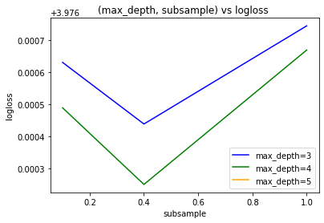
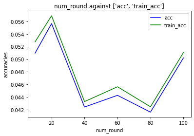
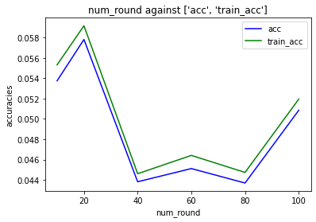
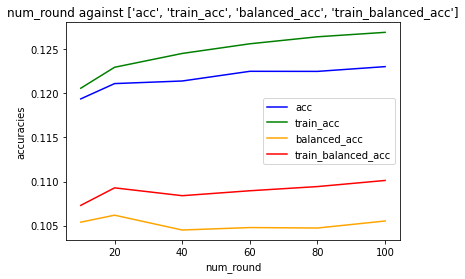

### summary
- Here, recalculataing train metrics for the `~1250` or so models from the hyper parameter tuning session
- Comparing train/test acc towards the [bottom](#2020-07-23) 

### toc
* [2020-07-18](#2020-07-18)
* [2020-07-23](#2020-07-23)

### detail


```python
import pandas as pd
import numpy as np
import datetime; import pytz
import matplotlib.pyplot as plt
from joblib import dump, load
import joblib
import os
from tqdm import tqdm
from sklearn.datasets import load_svmlight_file
from sklearn.metrics import accuracy_score, balanced_accuracy_score
from functools import reduce
import fresh.s3utils as fs3
from importlib import reload
import json
import fresh.plot as fp
import fresh.vanilla_utils as fvu
import fresh.metrics as fm

import fresh.utils as fu

```


```python


os.environ['MY_SAGEMAKER_S3_BUCKET'] = ''  # storing this in my somevars.sh NOTE
os.environ['MY_ACCESS_KEY_ID'] = ''
os.environ['MY_SECRET_ACCESS_KEY'] = ''
```


```python
# s3://my-sagemaker-blah/bikelearn/artifacts/2020-07-10T135910Z/

mybucket = os.getenv('MY_SAGEMAKER_S3_BUCKET')
s3workdir = (f's3://{mybucket}/'
            'bikelearn/artifacts/2020-07-10T135910Z/')
s3uri = (f'{s3workdir}/'
         '2020-07-16T141618Z_results_vec.json'
        )
bucket, s3fn = fs3.s3uri_to_parts(s3uri)

results_vec = json.loads(fs3.read_s3_file(bucket, s3fn))
results_vec
```


```python
df = pd.DataFrame.from_records(results_vec)
```


```python
df.shape
```


    (1013, 26)


```python
keep_fixed = {
 'max_depth': 3,
 'learning_rate': 0.01,
 'colsample_bylevel': 0.1,
 'colsample_bynode': 1,
 'colsample_bytree': 0.1,
 'subsample': 0.1,
 'num_round': 10,
        }
metric_cols = ['logloss','acc', 'balanced_acc', 'karea']
hyperparameters = list(keep_fixed.keys())
print(metric_cols + hyperparameters)
```

    ['logloss', 'acc', 'balanced_acc', 'karea', 'max_depth', 'learning_rate', 'colsample_bylevel', 'colsample_bynode', 'colsample_bytree', 'subsample', 'num_round']


```python
keep_fixed = {
# 'max_depth': 3,
 'learning_rate': 0.01,
 'colsample_bylevel': 0.1,
 'colsample_bynode': 1,
 'colsample_bytree': 0.1,
# 'subsample': 0.1,
 'num_round': 10,
        }
#ipdb.runcall(
fp.compare_tuning(df, feature_col_1='max_depth', 
             feature_col_2='subsample', 
             metric_col='logloss',
             keep_fixed=keep_fixed)
```





```python

print(dict(df[metric_cols + hyperparameters].sort_values(by='logloss').iloc[0]))
print(dict(df[metric_cols + hyperparameters].sort_values(by='acc').iloc[-1]))
print(dict(df[metric_cols + hyperparameters].sort_values(by='balanced_acc').iloc[-1]))
```

    {'logloss': 3.443072437155954, 'acc': 0.12198962315156459, 'balanced_acc': 0.10436194480401938, 'karea': 0.7592264122375006, 'max_depth': 4.0, 'learning_rate': 0.1, 'colsample_bylevel': 1.0, 'colsample_bynode': 1.0, 'colsample_bytree': 1.0, 'subsample': 0.1, 'num_round': 100.0}
    {'logloss': 3.4480742986458592, 'acc': 0.12304248437307332, 'balanced_acc': 0.10551953202851949, 'karea': 0.75845582462009, 'max_depth': 4.0, 'learning_rate': 0.1, 'colsample_bylevel': 1.0, 'colsample_bynode': 1.0, 'colsample_bytree': 1.0, 'subsample': 0.4, 'num_round': 100.0}
    {'logloss': 3.5984655552399465, 'acc': 0.12111698141842223, 'balanced_acc': 0.1061783560314651, 'karea': 0.7373864801658441, 'max_depth': 4.0, 'learning_rate': 0.1, 'colsample_bylevel': 1.0, 'colsample_bynode': 1.0, 'colsample_bytree': 1.0, 'subsample': 0.4, 'num_round': 20.0}


```python
df[['acc', 'balanced_acc', 'karea']].corr()
```


<div>
<style scoped>
    .dataframe tbody tr th:only-of-type {
        vertical-align: middle;
    }

    .dataframe tbody tr th {
        vertical-align: top;
    }

    .dataframe thead th {
        text-align: right;
    }
</style>
<table border="1" class="dataframe">
  <thead>
    <tr style="text-align: right;">
      <th></th>
      <th>acc</th>
      <th>balanced_acc</th>
      <th>karea</th>
    </tr>
  </thead>
  <tbody>
    <tr>
      <th>acc</th>
      <td>1.000000</td>
      <td>0.990795</td>
      <td>0.946822</td>
    </tr>
    <tr>
      <th>balanced_acc</th>
      <td>0.990795</td>
      <td>1.000000</td>
      <td>0.930092</td>
    </tr>
    <tr>
      <th>karea</th>
      <td>0.946822</td>
      <td>0.930092</td>
      <td>1.000000</td>
    </tr>
  </tbody>
</table>
</div>


### 2020-07-18

#### I would like to get the train acc too to better understand the over/under (aka the overfitting/underfitting)


```python
# Ingest new results file ..

s3workdir = (f's3://{mybucket}/'
            'bikelearn/artifacts/2020-07-10T135910Z')
s3uri = (f'{s3workdir}/'
         '2020-07-18T162532Z_results_vec.json'
        )
bucket, s3fn = fs3.s3uri_to_parts(s3uri)

results_vec = json.loads(fs3.read_s3_file(bucket, s3fn))
df = pd.DataFrame.from_records(results_vec)
df.shape
```


    (1255, 26)


```python
!pwd
```


```python
!ls artifacts/2020-07-10T135910Z|tail -5
```


    234_bundle_with_metrics.joblib
    235_bundle_with_metrics.joblib
    236_bundle_with_metrics.joblib.c44edF0B
    237_bundle_with_metrics.joblib
    239_bundle_with_metrics.joblib.BF0eeadc


I made a local mirror artifacts dir to grab the bundles... 

I don't really want a gigabyte of bundles though.. want to 


```python
s3workdir
```


    's3://my-sagemaker-blah/bikelearn/artifacts/2020-07-10T135910Z'


```python
# ok i ran some form of this locally... 
# aws s3 cp s3://my-sagemaker-blah/bikelearn/artifacts/2020-07-10T135910Z/ artifacts/2020-07-10T135910Z/ --recursive --include "*.joblib"
```


```python
# As per https://github.com/namoopsoo/learn-citibike/blob/2020-revisit/notes/2020-07-10-aws.md
# the data dir was artifacts/2020-07-08T143732Z  ... going to re-create that locally too
# 
datadir = '/opt/program/artifacts/2020-07-08T143732Z'
artifactsdir = '/opt/program/artifacts/2020-07-10T135910Z'
train_results = []

train_loc = f'{datadir}/train.libsvm' 
dtrain = xgb.DMatrix(f'{train_loc}?format=libsvm')
actuals = dtrain.get_label()
print('evaluate using ', train_loc)


train_data = load_svmlight_file(train_loc)
X_train = train_data[0].toarray()
y_train = train_data[1]
```

    [18:53:49] 316281x85 matrix with 1431544 entries loaded from /opt/program/artifacts/2020-07-08T143732Z/train.libsvm?format=libsvm
    evaluate using  /opt/program/artifacts/2020-07-08T143732Z/train.libsvm


```python
%%time
########
# Try one
i = 0
bundle = joblib.load(f'{artifactsdir}/{i}_bundle_with_metrics.joblib')
model = bundle['xgb_model']

y_prob_vec = model.predict(dtrain)
predictions = np.argmax(y_prob_vec, axis=1)

logloss = fu.big_logloss(actuals, y_prob=y_prob_vec, 
                         labels= list(range(54)))
acc = accuracy_score(actuals, predictions)
balanced_acc = balanced_accuracy_score(actuals, predictions)

correct_kth, karea = fm.kth_area(y_train, y_prob_vec,
        num_classes=54)
```

    CPU times: user 31.3 s, sys: 110 ms, total: 31.4 s
    Wall time: 21.4 s


```python
acc, balanced_acc, karea, df.iloc[0]
```


    (0.05276320740101365,
     0.03727538888502701,
     0.6435250908504123,
     max_depth                         3
     learning_rate                  0.01
     objective            multi:softprob
     num_class                        54
     base_score                      0.5
     booster                      gbtree
     colsample_bylevel               0.1
     colsample_bynode                  1
     colsample_bytree                0.1
     gamma                             0
     max_delta_step                    0
     min_child_weight                  1
     random_state                      0
     reg_alpha                         0
     reg_lambda                        1
     scale_pos_weight                  1
     seed                             42
     subsample                       0.1
     verbosity                         0
     acc                       0.0509642
     balanced_acc              0.0368461
     logloss                     3.97663
     walltime                    22.0236
     karea                       0.64264
     i                                 0
     num_round                        10
     Name: 0, dtype: object)


```python
artifactsdir = '/opt/program/artifacts/2020-07-10T135910Z'
workdir = artifactsdir 
#workdir = fu.make_work_dir(localdir); print(workdir)
fu.log(workdir, 'Going to write some logs in the "2020-07-16-local" notebook to run predictions on train  ')

```


```python
for i in tqdm(df.i.tolist()):
    calltime = datetime.datetime.now()
    bundle_loc = f'{artifactsdir}/{i}_bundle_with_metrics.joblib'
    bundle = joblib.load(bundle_loc)
    model = bundle['xgb_model']

    y_prob_vec = model.predict(dtrain)
    predictions = np.argmax(y_prob_vec, axis=1)

    logloss = fu.big_logloss(actuals, y_prob=y_prob_vec, 
                             labels= list(range(54)))
    acc = accuracy_score(actuals, predictions)
    balanced_acc = balanced_accuracy_score(actuals, predictions)

    correct_kth, karea = fm.kth_area(y_train, y_prob_vec,
            num_classes=54)
    walltime = fu.do_walltime(calltime)
    
    res = {'train_acc': acc, 'train_balanced_acc': balanced_acc,
                         'i': i, 'train_logloss': logloss, 
                         'train_karea': karea}
    fu.log(workdir, f'[{i}] walltime {walltime}')
    train_results.append(res)
    with open(f'{workdir}/{fu.utc_ts()}_train_results_vec.json', 'w') as fd:
        json.dump({'train_results': train_results,
                  'bundle_loc': bundle_loc,
                  }, fd)
    
    
    
```

     16%|█▌        | 201/1255 [2:09:12<11:17:34, 38.57s/it]


    ---------------------------------------------------------------------------

    KeyboardInterrupt                         Traceback (most recent call last)

    <ipython-input-54-64bff7cff8b4> in <module>
          5     model = bundle['xgb_model']
          6 
    ----> 7     y_prob_vec = model.predict(dtrain)
          8     predictions = np.argmax(y_prob_vec, axis=1)
          9 


    /opt/conda/lib/python3.7/site-packages/xgboost/core.py in predict(self, data, output_margin, ntree_limit, pred_leaf, pred_contribs, approx_contribs, pred_interactions, validate_features)
       1290                                           ctypes.c_uint(ntree_limit),
       1291                                           ctypes.byref(length),
    -> 1292                                           ctypes.byref(preds)))
       1293         preds = ctypes2numpy(preds, length.value, np.float32)
       1294         if pred_leaf:


    KeyboardInterrupt: 


### 2020-07-22

#### coming back after that KeyboardInterrupt


```python
# Had to stop , continuing from where that left off...
# ..  16%|█▌        | 201/1255 [2:09:12<11:17:34, 38.57s/it]
# Last entry I see is {"train_acc": 0.11448047780296634, "train_balanced_acc": 0.09305576566216206, "i": 200, "train_logloss": 3.6177048636263387, "train_karea": 0.7344027878631603}
# in artifacts/2020-07-10T135910Z/2020-07-18T211330Z_train_results_vec.json
# 
# 
prefix = 201
for i in tqdm(df.i.tolist()[prefix:]):
    calltime = datetime.datetime.now()
    bundle_loc = f'{artifactsdir}/{i}_bundle_with_metrics.joblib'
    bundle = joblib.load(bundle_loc)
    model = bundle['xgb_model']

    y_prob_vec = model.predict(dtrain)
    predictions = np.argmax(y_prob_vec, axis=1)

    logloss = fu.big_logloss(actuals, y_prob=y_prob_vec, 
                             labels= list(range(54)))
    acc = accuracy_score(actuals, predictions)
    balanced_acc = balanced_accuracy_score(actuals, predictions)

    correct_kth, karea = fm.kth_area(y_train, y_prob_vec,
            num_classes=54)
    walltime = fu.do_walltime(calltime)
    
    res = {'train_acc': acc, 'train_balanced_acc': balanced_acc,
                         'i': i, 'train_logloss': logloss, 
                         'train_karea': karea}
    fu.log(workdir, f'[{i}] walltime {walltime}')
    train_results.append(res)
    with open(f'{workdir}/{fu.utc_ts()}_train_results_vec.json', 'w') as fd:
        json.dump({'train_results': train_results,
                  'bundle_loc': bundle_loc,
                  }, fd)
    
    
```

    100%|█████████▉| 1052/1054 [10:00:57<01:08, 34.27s/it] 


    ---------------------------------------------------------------------------

    FileNotFoundError                         Traceback (most recent call last)

    <ipython-input-57-0bd90131b171> in <module>
          7     calltime = datetime.datetime.now()
          8     bundle_loc = f'{artifactsdir}/{i}_bundle_with_metrics.joblib'
    ----> 9     bundle = joblib.load(bundle_loc)
         10     model = bundle['xgb_model']
         11 


    /opt/conda/lib/python3.7/site-packages/joblib/numpy_pickle.py in load(filename, mmap_mode)
        575             obj = _unpickle(fobj)
        576     else:
    --> 577         with open(filename, 'rb') as f:
        578             with _read_fileobject(f, filename, mmap_mode) as fobj:
        579                 if isinstance(fobj, str):


    FileNotFoundError: [Errno 2] No such file or directory: '/opt/program/artifacts/2020-07-10T135910Z/1253_bundle_with_metrics.joblib'


```python
# once I have both train and test acc... since I also have the num_rounds dimension,
# I might as well try doing two plots, train acc and test acc, num_rounds x-axis,
# and various other parameters fixed ...
```

### 2020-07-23

#### ok glad that finished, trying to now put this together...


```python
with open(f'{artifactsdir}/2020-07-18T162532Z_results_vec.json') as fd:
    test_results = json.load(fd)
len(test_results)
#pd.DataFrame.from_records().shape
test_results[0]
```


    {'max_depth': 3,
     'learning_rate': 0.01,
     'objective': 'multi:softprob',
     'num_class': 54,
     'base_score': 0.5,
     'booster': 'gbtree',
     'colsample_bylevel': 0.1,
     'colsample_bynode': 1,
     'colsample_bytree': 0.1,
     'gamma': 0,
     'max_delta_step': 0,
     'min_child_weight': 1,
     'random_state': 0,
     'reg_alpha': 0,
     'reg_lambda': 1,
     'scale_pos_weight': 1,
     'seed': 42,
     'subsample': 0.1,
     'verbosity': 0,
     'acc': 0.050964174262760016,
     'balanced_acc': 0.03684609209838398,
     'logloss': 3.9766314117097132,
     'walltime': 22.023615,
     'karea': 0.6426400363389939,
     'i': 0,
     'num_round': 10}


```python


# either from log, 2020-07-22T140623Z_train_results_vec.json
# or from here..
#train_results

# 
# test_results <= 2020-07-18T162532Z_results_vec.json
alldf = pd.DataFrame.from_records(train_results).merge(
        pd.DataFrame.from_records(test_results), on='i')

```


```python
keep_fixed = {
 'max_depth': 3,
 'learning_rate': 0.01,
 'colsample_bylevel': 0.1,
 'colsample_bynode': 1,
 'colsample_bytree': 0.1,
 'subsample': 0.1,
 #'num_round': 10,
        }

fp.compare_train_test(alldf, feature_col='num_round', 
                      metric_cols=['acc', 'train_acc'],
                      keep_fixed=keep_fixed)

```





```python
keep_fixed = {
 'max_depth': 4,
 'learning_rate': 0.01,
 'colsample_bylevel': 0.1,
 'colsample_bynode': 1,
 'colsample_bytree': 0.1,
 'subsample': 0.1,
 #'num_round': 10,
        }

fp.compare_train_test(alldf, feature_col='num_round', 
                      metric_cols=['acc', 'train_acc'],
                      keep_fixed=keep_fixed)

```





```python
best_params = dict(alldf.sort_values(by='acc').iloc[-1])
best_params
```


    {'train_acc': 0.12693459297270465,
     'train_balanced_acc': 0.11012147901980039,
     'i': 755,
     'train_logloss': 3.4301962566050057,
     'train_karea': 0.76345208497788,
     'max_depth': 4,
     'learning_rate': 0.1,
     'objective': 'multi:softprob',
     'num_class': 54,
     'base_score': 0.5,
     'booster': 'gbtree',
     'colsample_bylevel': 1.0,
     'colsample_bynode': 1,
     'colsample_bytree': 1.0,
     'gamma': 0,
     'max_delta_step': 0,
     'min_child_weight': 1,
     'random_state': 0,
     'reg_alpha': 0,
     'reg_lambda': 1,
     'scale_pos_weight': 1,
     'seed': 42,
     'subsample': 0.4,
     'verbosity': 0,
     'acc': 0.12304248437307332,
     'balanced_acc': 0.10551953202851949,
     'logloss': 3.4480742986458592,
     'walltime': 1918.593945,
     'karea': 0.75845582462009,
     'num_round': 100}


```python
# Taking the best params ^^ here is what the "learning curve" seems to look like 
keep_fixed = {
 'max_depth': 4,
 'learning_rate': 0.1,
    
 'colsample_bylevel': 1.0,
 'colsample_bynode': 1,
 'colsample_bytree': 1.0,
    
 'subsample': 0.4,
 #'num_round': 10,
        }

fp.compare_train_test(alldf, feature_col='num_round', 
                      metric_cols=['acc', 'train_acc', 'balanced_acc', 
                                  'train_balanced_acc'],
                      keep_fixed=keep_fixed)

```





```python
# one other next step would be to try finding the biggest gap between train/test acc.
alldf['train_test_acc_delta'] = alldf.apply(lambda x: abs(x['acc'] - x['train_acc']), axis=1)
```


```python
alldf.sort_values(by='train_test_acc_delta').iloc[-1]
```


    train_acc                     0.128123
    train_balanced_acc            0.111239
    i                                 1241
    train_logloss                  3.40954
    train_karea                   0.767823
    max_depth                            5
    learning_rate                      0.1
    objective               multi:softprob
    num_class                           54
    base_score                         0.5
    booster                         gbtree
    colsample_bylevel                    1
    colsample_bynode                     1
    colsample_bytree                     1
    gamma                                0
    max_delta_step                       0
    min_child_weight                     1
    random_state                         0
    reg_alpha                            0
    reg_lambda                           1
    scale_pos_weight                     1
    seed                                42
    subsample                          0.4
    verbosity                            0
    acc                            0.12253
    balanced_acc                  0.104698
    logloss                        3.43584
    walltime                       2327.88
    karea                         0.760578
    num_round                          100
    train_test_acc_delta        0.00559313
    Name: 1242, dtype: object


```python
# interesting, seeming like the biggest train/test gap is very small..
```


```python
alldf.sort_values(by='karea').to_csv(f'{artifactsdir}/train+test_results_vec.csv', index=False)

```


```python
artifactsdir
```


    '/opt/program/artifacts/2020-07-10T135910Z'


