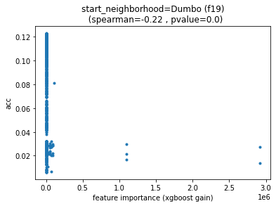
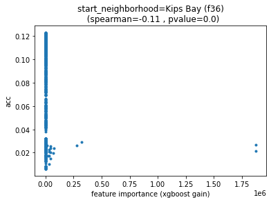
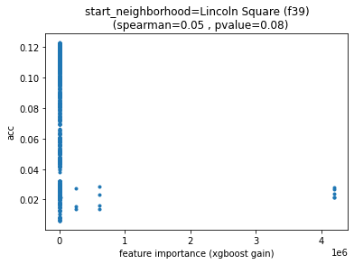
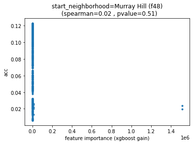

Look at the feature importances in the models from earlier tuning .

Actually... would be kind of cool to try to plot top features against accuracy


```python
import pandas as pd
import numpy as np
import datetime; import pytz
from collections import Counter
import matplotlib.pyplot as plt
from joblib import dump, load
import joblib
import os
from tqdm import tqdm
from sklearn.datasets import load_svmlight_file
from sklearn.metrics import accuracy_score, balanced_accuracy_score
from scipy.stats import spearmanr
from functools import reduce
import fresh.s3utils as fs3
from importlib import reload
import json
import fresh.plot as fp
import fresh.vanilla_utils as fvu
import fresh.metrics as fm

import fresh.utils as fu

```


```python
%matplotlib inline
```


```python
artifactsdir = '/opt/program/artifacts/2020-07-10T135910Z'
alldf = pd.read_csv(f'{artifactsdir}/train+test_results_vec.csv')
alldf.iloc[0]

```


    train_acc                   0.00797076
    train_balanced_acc           0.0185185
    i                                  868
    train_logloss                  34.2635
    train_karea                   0.473045
    max_depth                            4
    learning_rate                        1
    objective               multi:softprob
    num_class                           54
    base_score                         0.5
    booster                         gbtree
    colsample_bylevel                  0.1
    colsample_bynode                     1
    colsample_bytree                   0.1
    gamma                                0
    max_delta_step                       0
    min_child_weight                     1
    random_state                         0
    reg_alpha                            0
    reg_lambda                           1
    scale_pos_weight                     1
    seed                                42
    subsample                          0.4
    verbosity                            0
    acc                         0.00806245
    balanced_acc                 0.0185185
    logloss                        34.2602
    walltime                       718.513
    karea                         0.472606
    num_round                           80
    train_test_acc_delta       9.16906e-05
    Name: 0, dtype: object


```python
# bundle feature access..
def features_from_model(i):
    bundle_loc = f'{artifactsdir}/{i}_bundle_with_metrics.joblib'
    bundle = joblib.load(bundle_loc)
    model = bundle['xgb_model']
    return bundle, model
    
bundle, model = features_from_model(868)
```


```python
len(model.feature_names), 
```


    (85,)


```python
bundle
```


    {'notebook': '2020-07-10-aws.ipynb',
     'xgb_model': <xgboost.core.Booster at 0x7f076b88be10>,
     'train': '/home/ec2-user/SageMaker/learn-citibike/artifacts/2020-07-08T143732Z/train.libsvm',
     'walltime': 718.513401,
     'primary_dataset': '2013-07 - Citi Bike trip data.csv',
     'input_params': {'max_depth': 4,
      'learning_rate': 1,
      'objective': 'multi:softprob',
      'num_class': 54,
      'base_score': 0.5,
      'booster': 'gbtree',
      'colsample_bylevel': 0.1,
      'colsample_bynode': 1,
      'colsample_bytree': 0.1,
      'gamma': 0,
      'max_delta_step': 0,
      'min_child_weight': 1,
      'random_state': 0,
      'reg_alpha': 0,
      'reg_lambda': 1,
      'scale_pos_weight': 1,
      'seed': 42,
      'subsample': 0.4,
      'verbosity': 0},
     'num_round': 80,
     'validation_metrics': {'accuracy': 0.008062450795337057,
      'balanced_accuracy': 0.018518518518518517,
      'confusion': array([[0, 0, 0, ..., 0, 0, 0],
             [0, 0, 0, ..., 0, 0, 0],
             [0, 0, 0, ..., 0, 0, 0],
             ...,
             [0, 0, 0, ..., 0, 0, 0],
             [0, 0, 0, ..., 0, 0, 0],
             [0, 0, 0, ..., 0, 0, 0]]),
      'logloss': 34.26022113302777,
      'test': '/home/ec2-user/SageMaker/learn-citibike/artifacts/2020-07-08T143732Z/test.libsvm',
      'karea': 0.4726062864632681}}


```python
# from the bundle ^^ I also download the processing bundle... 
# by looking at the notebook, https://github.com/namoopsoo/learn-citibike/blob/2020-revisit/notes/2020-07-10-aws.md
# for reference.
datadir = f'/opt/program/artifacts/2020-07-08T143732Z'
proc_bundle = joblib.load(f'{datadir}/proc_bundle.joblib')

'artifacts/2020-07-08T143732Z/proc_bundle.joblib'
```


    'artifacts/2020-07-08T143732Z/proc_bundle.joblib'


```python
proc_bundle
```

    /opt/conda/lib/python3.7/site-packages/sklearn/base.py:197: FutureWarning: From version 0.24, get_params will raise an AttributeError if a parameter cannot be retrieved as an instance attribute. Previously it would return None.
      FutureWarning)


    {'notebook': '2020-07-03-aws.ipynb',
     'proc_bundle': {'enc': OneHotEncoder(categories=[['Alphabet City', 'Battery Park City',
                                 'Bedford-Stuyvesant', 'Bloomingdale', 'Boerum Hill',
                                 'Bowery', 'Broadway Triangle', 'Brooklyn Heights',
                                 'Brooklyn Navy Yard', 'Carnegie Hill',
                                 'Carroll Gardens', 'Central Park', 'Chelsea',
                                 'Chinatown', 'Civic Center', 'Clinton Hill',
                                 'Cobble Hill', 'Columbia Street Waterfront District',
                                 'Downtown Brooklyn', 'Dumbo', 'East Harlem',
                                 'East Village', 'East Williamsburg',
                                 'Financial District', 'Flatiron District',
                                 'Fort Greene', 'Fulton Ferry District',
                                 'Garment District', 'Governors Island', 'Gowanus', ...],
                                [0, 1, 2], [0, 1, 2, 3, 4]],
                    drop=None, dtype=<class 'numpy.float64'>, handle_unknown='error',
                    sparse=True),
      'usertype_le': LabelEncoder(),
      'le': LabelEncoder()}}


```python
# Now taking a look at the notebook https://github.com/namoopsoo/learn-citibike/blob/2020-revisit/notes/2020-07-03-aws.md
# referred to in the proc_bundle, I note that this bundle uses the `v2` preprocessing
# So features , looking at fresh/preproc/v2.py , the xform  func, 
# (Also refreshing my mind about the data going into preproc, looking at prepare_data in fresh/utils.py)
# 
# There's 85 features
# so the first 83 come from the OneHotEncoder, [neighborhoods, genders, time_of_day]
# Then the usertype label encoder
# And finally the last column is taken as is, which is just the weekday, 

```


```python
[len(x) for x in proc_bundle['proc_bundle']['enc'].categories]
```


    [75, 3, 5]


```python

```


    array(['Customer', 'Subscriber'], dtype=object)


```python
onehot = proc_bundle['proc_bundle']['enc'].categories
usertypes = proc_bundle['proc_bundle']['usertype_le'].classes_
feature_names = ([f'start_neighborhood={x}' for x in onehot[0]] 
                + [f'gender={x}' for x in onehot[1]]
                + [f'time_of_day={x}' for x in onehot[2]]
                + ['usertype']
                + ['weekday']) 
feature_names, len(feature_names)
```


    (['start_neighborhood=Alphabet City',
      'start_neighborhood=Battery Park City',
      'start_neighborhood=Bedford-Stuyvesant',
      'start_neighborhood=Bloomingdale',
      'start_neighborhood=Boerum Hill',
      'start_neighborhood=Bowery',
      'start_neighborhood=Broadway Triangle',
      'start_neighborhood=Brooklyn Heights',
      'start_neighborhood=Brooklyn Navy Yard',
      'start_neighborhood=Carnegie Hill',
      'start_neighborhood=Carroll Gardens',
      'start_neighborhood=Central Park',
      'start_neighborhood=Chelsea',
      'start_neighborhood=Chinatown',
      'start_neighborhood=Civic Center',
      'start_neighborhood=Clinton Hill',
      'start_neighborhood=Cobble Hill',
      'start_neighborhood=Columbia Street Waterfront District',
      'start_neighborhood=Downtown Brooklyn',
      'start_neighborhood=Dumbo',
      'start_neighborhood=East Harlem',
      'start_neighborhood=East Village',
      'start_neighborhood=East Williamsburg',
      'start_neighborhood=Financial District',
      'start_neighborhood=Flatiron District',
      'start_neighborhood=Fort Greene',
      'start_neighborhood=Fulton Ferry District',
      'start_neighborhood=Garment District',
      'start_neighborhood=Governors Island',
      'start_neighborhood=Gowanus',
      'start_neighborhood=Gramercy Park',
      'start_neighborhood=Greenpoint',
      'start_neighborhood=Greenwich Village',
      "start_neighborhood=Hell's Kitchen",
      'start_neighborhood=Hudson Square',
      'start_neighborhood=Hunters Point',
      'start_neighborhood=Kips Bay',
      'start_neighborhood=Korea Town',
      'start_neighborhood=Lenox Hill',
      'start_neighborhood=Lincoln Square',
      'start_neighborhood=Little Italy',
      'start_neighborhood=Long Island City',
      'start_neighborhood=Lower East Side',
      'start_neighborhood=Lower Manhattan',
      'start_neighborhood=Meatpacking District',
      'start_neighborhood=Midtown',
      'start_neighborhood=Midtown East',
      'start_neighborhood=Midtown West',
      'start_neighborhood=Murray Hill',
      'start_neighborhood=NoHo',
      'start_neighborhood=NoMad',
      'start_neighborhood=Nolita',
      'start_neighborhood=Park Slope',
      'start_neighborhood=Peter Cooper Village',
      'start_neighborhood=Prospect Heights',
      'start_neighborhood=Prospect Park',
      'start_neighborhood=Red Hook',
      'start_neighborhood=Rose Hill',
      'start_neighborhood=SoHo',
      'start_neighborhood=Stuyvesant Heights',
      'start_neighborhood=Stuyvesant Town',
      'start_neighborhood=Sunset Park',
      'start_neighborhood=Sutton Place',
      'start_neighborhood=Theater District',
      'start_neighborhood=Tribeca',
      'start_neighborhood=Tudor City',
      'start_neighborhood=Two Bridges',
      'start_neighborhood=Ukrainian Village',
      'start_neighborhood=Union Square',
      'start_neighborhood=Upper East Side',
      'start_neighborhood=Upper West Side',
      'start_neighborhood=Vinegar Hill',
      'start_neighborhood=West Village',
      'start_neighborhood=Williamsburg',
      'start_neighborhood=Yorkville',
      'gender=0',
      'gender=1',
      'gender=2',
      'time_of_day=0',
      'time_of_day=1',
      'time_of_day=2',
      'time_of_day=3',
      'time_of_day=4',
      'usertype',
      'weekday'],
     85)


```python
[x for x in proc_bundle['proc_bundle']['enc'].categories]
['start_neighborhood', 'gender', 'time_of_day', 'usertype', 'weekday', ]
```


    [['Alphabet City',
      'Battery Park City',
      'Bedford-Stuyvesant',
      'Bloomingdale',
      'Boerum Hill',
      'Bowery',
      'Broadway Triangle',
      'Brooklyn Heights',
      'Brooklyn Navy Yard',
      'Carnegie Hill',
      'Carroll Gardens',
      'Central Park',
      'Chelsea',
      'Chinatown',
      'Civic Center',
      'Clinton Hill',
      'Cobble Hill',
      'Columbia Street Waterfront District',
      'Downtown Brooklyn',
      'Dumbo',
      'East Harlem',
      'East Village',
      'East Williamsburg',
      'Financial District',
      'Flatiron District',
      'Fort Greene',
      'Fulton Ferry District',
      'Garment District',
      'Governors Island',
      'Gowanus',
      'Gramercy Park',
      'Greenpoint',
      'Greenwich Village',
      "Hell's Kitchen",
      'Hudson Square',
      'Hunters Point',
      'Kips Bay',
      'Korea Town',
      'Lenox Hill',
      'Lincoln Square',
      'Little Italy',
      'Long Island City',
      'Lower East Side',
      'Lower Manhattan',
      'Meatpacking District',
      'Midtown',
      'Midtown East',
      'Midtown West',
      'Murray Hill',
      'NoHo',
      'NoMad',
      'Nolita',
      'Park Slope',
      'Peter Cooper Village',
      'Prospect Heights',
      'Prospect Park',
      'Red Hook',
      'Rose Hill',
      'SoHo',
      'Stuyvesant Heights',
      'Stuyvesant Town',
      'Sunset Park',
      'Sutton Place',
      'Theater District',
      'Tribeca',
      'Tudor City',
      'Two Bridges',
      'Ukrainian Village',
      'Union Square',
      'Upper East Side',
      'Upper West Side',
      'Vinegar Hill',
      'West Village',
      'Williamsburg',
      'Yorkville'],
     [0, 1, 2],
     [0, 1, 2, 3, 4]]


```python
proc_bundle['proc_bundle']['enc']
```


    OneHotEncoder(categories=[['Alphabet City', 'Battery Park City',
                               'Bedford-Stuyvesant', 'Bloomingdale', 'Boerum Hill',
                               'Bowery', 'Broadway Triangle', 'Brooklyn Heights',
                               'Brooklyn Navy Yard', 'Carnegie Hill',
                               'Carroll Gardens', 'Central Park', 'Chelsea',
                               'Chinatown', 'Civic Center', 'Clinton Hill',
                               'Cobble Hill', 'Columbia Street Waterfront District',
                               'Downtown Brooklyn', 'Dumbo', 'East Harlem',
                               'East Village', 'East Williamsburg',
                               'Financial District', 'Flatiron District',
                               'Fort Greene', 'Fulton Ferry District',
                               'Garment District', 'Governors Island', 'Gowanus', ...],
                              [0, 1, 2], [0, 1, 2, 3, 4]],
                  drop=None, dtype=<class 'numpy.float64'>, handle_unknown='error',
                  sparse=True)


```python
len(model.get_score(importance_type='gain')),len(model.get_score(importance_type='weight'))
features = {f'f{i}': model.get_score(importance_type='gain').get(f'f{i}', 0)
               for i, x in enumerate(model.feature_names)}
features
```


    {'f0': 21.84926239047878,
     'f1': 37.786746494099994,
     'f2': 433.8485397055555,
     'f3': 0,
     'f4': 16.223508027632352,
     'f5': 9.42196043241206,
     'f6': 0,
     'f7': 312.1357001213905,
     'f8': 183.591148200835,
     'f9': 0,
     'f10': 0,
     'f11': 677.8533162,
     'f12': 38.99434604246625,
     'f13': 6.5263488942345464,
     'f14': 26.45729177064285,
     'f15': 175.7688860563296,
     'f16': 0,
     'f17': 90.76833475265924,
     'f18': 72.15264768027933,
     'f19': 21.99337013682858,
     'f20': 0,
     'f21': 10.54046058378206,
     'f22': 0,
     'f23': 17.879153117563337,
     'f24': 3.570255177766334,
     'f25': 84.93661638680767,
     'f26': 430.67800551271426,
     'f27': 4.882921038958334,
     'f28': 0,
     'f29': 0,
     'f30': 4.647248752257143,
     'f31': 0,
     'f32': 6.513139701477776,
     'f33': 44.31525139833,
     'f34': 9.75682808103667,
     'f35': 0,
     'f36': 12.14313110033871,
     'f37': 3.478033674544285,
     'f38': 0,
     'f39': 31.03448123228923,
     'f40': 4.873982171226924,
     'f41': 0,
     'f42': 33.41495056715625,
     'f43': 3.9420541673342404,
     'f44': 1.783668180384583,
     'f45': 18.68570371114403,
     'f46': 53.18911013852187,
     'f47': 34.886790859076925,
     'f48': 11.333733844213043,
     'f49': 4.0394160273988335,
     'f50': 4.790216858138834,
     'f51': 4.4780697267222225,
     'f52': 3.365376609984877,
     'f53': 4.78523913215375,
     'f54': 0,
     'f55': 0,
     'f56': 0,
     'f57': 3.318884340601371,
     'f58': 7.3907565483359985,
     'f59': 0,
     'f60': 5.07374035854091,
     'f61': 0,
     'f62': 2.539707918004545,
     'f63': 14.069518631388888,
     'f64': 28.83570998994062,
     'f65': 3.66199824563375,
     'f66': 3.1278085277045453,
     'f67': 9.516930901203033,
     'f68': 2.66708374141353,
     'f69': 0,
     'f70': 0,
     'f71': 12.570966613077418,
     'f72': 11.393699257730953,
     'f73': 8.111616334874284,
     'f74': 0,
     'f75': 15.477744170175452,
     'f76': 11.491175790387242,
     'f77': 4.441719544005313,
     'f78': 39.071259107831914,
     'f79': 3.738208895664341,
     'f80': 0.6978698888044447,
     'f81': 16.965743239596296,
     'f82': 12.161108562157143,
     'f83': 46.38866912147674,
     'f84': 4.034771426104167}


```python
# oops some how got two of these, but exactly the same so can drop one
alldf[alldf['i'] == 0].T
alldf = alldf.drop_duplicates(subset='i')
```


```python
# alldf[alldf['i'] == 0].T
alldf.
```


<div>
<style scoped>
    .dataframe tbody tr th:only-of-type {
        vertical-align: middle;
    }

    .dataframe tbody tr th {
        vertical-align: top;
    }

    .dataframe thead th {
        text-align: right;
    }
</style>
<table border="1" class="dataframe">
  <thead>
    <tr style="text-align: right;">
      <th></th>
      <th>262</th>
    </tr>
  </thead>
  <tbody>
    <tr>
      <th>train_acc</th>
      <td>0.0527632</td>
    </tr>
    <tr>
      <th>train_balanced_acc</th>
      <td>0.0372754</td>
    </tr>
    <tr>
      <th>i</th>
      <td>0</td>
    </tr>
    <tr>
      <th>train_logloss</th>
      <td>3.97656</td>
    </tr>
    <tr>
      <th>train_karea</th>
      <td>0.643525</td>
    </tr>
    <tr>
      <th>max_depth</th>
      <td>3</td>
    </tr>
    <tr>
      <th>learning_rate</th>
      <td>0.01</td>
    </tr>
    <tr>
      <th>objective</th>
      <td>multi:softprob</td>
    </tr>
    <tr>
      <th>num_class</th>
      <td>54</td>
    </tr>
    <tr>
      <th>base_score</th>
      <td>0.5</td>
    </tr>
    <tr>
      <th>booster</th>
      <td>gbtree</td>
    </tr>
    <tr>
      <th>colsample_bylevel</th>
      <td>0.1</td>
    </tr>
    <tr>
      <th>colsample_bynode</th>
      <td>1</td>
    </tr>
    <tr>
      <th>colsample_bytree</th>
      <td>0.1</td>
    </tr>
    <tr>
      <th>gamma</th>
      <td>0</td>
    </tr>
    <tr>
      <th>max_delta_step</th>
      <td>0</td>
    </tr>
    <tr>
      <th>min_child_weight</th>
      <td>1</td>
    </tr>
    <tr>
      <th>random_state</th>
      <td>0</td>
    </tr>
    <tr>
      <th>reg_alpha</th>
      <td>0</td>
    </tr>
    <tr>
      <th>reg_lambda</th>
      <td>1</td>
    </tr>
    <tr>
      <th>scale_pos_weight</th>
      <td>1</td>
    </tr>
    <tr>
      <th>seed</th>
      <td>42</td>
    </tr>
    <tr>
      <th>subsample</th>
      <td>0.1</td>
    </tr>
    <tr>
      <th>verbosity</th>
      <td>0</td>
    </tr>
    <tr>
      <th>acc</th>
      <td>0.0509642</td>
    </tr>
    <tr>
      <th>balanced_acc</th>
      <td>0.0368461</td>
    </tr>
    <tr>
      <th>logloss</th>
      <td>3.97663</td>
    </tr>
    <tr>
      <th>walltime</th>
      <td>22.0236</td>
    </tr>
    <tr>
      <th>karea</th>
      <td>0.64264</td>
    </tr>
    <tr>
      <th>num_round</th>
      <td>10</td>
    </tr>
    <tr>
      <th>train_test_acc_delta</th>
      <td>0.00179903</td>
    </tr>
  </tbody>
</table>
</div>


For those `1253` models, collect their feature importances and hopefully I can use that to broadcast them against the model performance, to suss out maybe which importances are genuine or in common among the top models.

One more thought on this is that perhaps they're all real as long as the models do not indicate signs of overfitting (train error << test error)


```python
# bundle feature access..
def feature_stats_from_model(alldf, i):
    bundle_loc = f'{artifactsdir}/{i}_bundle_with_metrics.joblib'
    bundle = joblib.load(bundle_loc)
    model = bundle['xgb_model']
    # return bundle, model
    row = alldf[alldf['i'] == i].iloc[0]
    features = {f'f{i}': model.get_score(importance_type='gain').get(f'f{i}', 0)
               for i, x in enumerate(model.feature_names)}
    return {**features, 'acc': float(row.acc), 'karea': float(row.karea)}

row = feature_stats_from_model(alldf, 868)
row
```


    {'f0': 21.84926239047878,
     'f1': 37.786746494099994,
     'f2': 433.8485397055555,
     'f3': 0,
     'f4': 16.223508027632352,
     'f5': 9.42196043241206,
     'f6': 0,
     'f7': 312.1357001213905,
     'f8': 183.591148200835,
     'f9': 0,
     'f10': 0,
     'f11': 677.8533162,
     'f12': 38.99434604246625,
     'f13': 6.5263488942345464,
     'f14': 26.45729177064285,
     'f15': 175.7688860563296,
     'f16': 0,
     'f17': 90.76833475265924,
     'f18': 72.15264768027933,
     'f19': 21.99337013682858,
     'f20': 0,
     'f21': 10.54046058378206,
     'f22': 0,
     'f23': 17.879153117563337,
     'f24': 3.570255177766334,
     'f25': 84.93661638680767,
     'f26': 430.67800551271426,
     'f27': 4.882921038958334,
     'f28': 0,
     'f29': 0,
     'f30': 4.647248752257143,
     'f31': 0,
     'f32': 6.513139701477776,
     'f33': 44.31525139833,
     'f34': 9.75682808103667,
     'f35': 0,
     'f36': 12.14313110033871,
     'f37': 3.478033674544285,
     'f38': 0,
     'f39': 31.03448123228923,
     'f40': 4.873982171226924,
     'f41': 0,
     'f42': 33.41495056715625,
     'f43': 3.9420541673342404,
     'f44': 1.783668180384583,
     'f45': 18.68570371114403,
     'f46': 53.18911013852187,
     'f47': 34.886790859076925,
     'f48': 11.333733844213043,
     'f49': 4.0394160273988335,
     'f50': 4.790216858138834,
     'f51': 4.4780697267222225,
     'f52': 3.365376609984877,
     'f53': 4.78523913215375,
     'f54': 0,
     'f55': 0,
     'f56': 0,
     'f57': 3.318884340601371,
     'f58': 7.3907565483359985,
     'f59': 0,
     'f60': 5.07374035854091,
     'f61': 0,
     'f62': 2.539707918004545,
     'f63': 14.069518631388888,
     'f64': 28.83570998994062,
     'f65': 3.66199824563375,
     'f66': 3.1278085277045453,
     'f67': 9.516930901203033,
     'f68': 2.66708374141353,
     'f69': 0,
     'f70': 0,
     'f71': 12.570966613077418,
     'f72': 11.393699257730953,
     'f73': 8.111616334874284,
     'f74': 0,
     'f75': 15.477744170175452,
     'f76': 11.491175790387242,
     'f77': 4.441719544005313,
     'f78': 39.071259107831914,
     'f79': 3.738208895664341,
     'f80': 0.6978698888044447,
     'f81': 16.965743239596296,
     'f82': 12.161108562157143,
     'f83': 46.38866912147674,
     'f84': 4.034771426104167,
     'acc': 0.008062450795337055,
     'karea': 0.4726062864632681}


```python
row = alldf[alldf['i'] == 0]
float(row.iloc[0].acc)
```


    0.050964174262760016


```python
stats_vec = []
for i in tqdm(alldf['i'].tolist()):
    stats_vec.append(feature_stats_from_model(alldf, i))
```

    100%|██████████| 1253/1253 [3:43:03<00:00, 10.68s/it]  


```python
foodf = pd.DataFrame.from_records(stats_vec)
foodf.corr().to_csv(f'{artifactsdir}/feature_acc_corr.csv')
```


```python
plt.figure(figsize=(10,10))
plt.imshow(foodf.corr())
plt.colorbar()
plt.grid(False)
plt.show()

```


This is an attempt to see which features being important correlates with higher accuracy. I guess this is another way of asking the question, given the higher accuracy models, do they share some of the top features?

Basically is there a trend there or is it pretty random.


```python
foodf.iloc[0]
```


    f0        21.849262
    f1        37.786746
    f2       433.848540
    f3         0.000000
    f4        16.223508
                ...    
    f82       12.161109
    f83       46.388669
    f84        4.034771
    acc        0.008062
    karea      0.472606
    Name: 0, Length: 87, dtype: float64


```python
foodf['i'] = alldf['i'].tolist()
```


```python
foodf.sort_values(by='acc').to_csv(f'{artifactsdir}/feature_importances.csv')
```


```python
foodf.corr().sort_values(by='acc')['acc'].tolist()
```


    [-0.22249028433987125,
     -0.2146619609978095,
     -0.18244263134367497,
     -0.17365844155587123,
     -0.17290120681000407,
     -0.1671679775812512,
     -0.1667816434203584,
     -0.1618100863720859,
     -0.15993725926056238,
     -0.1571657789494311,
     -0.15691696599470017,
     -0.15359107691068863,
     -0.1526146337471444,
     -0.15192954875843095,
     -0.14988719316482935,
     -0.1485679345446469,
     -0.14848568392802328,
     -0.14148592302023344,
     -0.14044175116931404,
     -0.12903514620585077,
     -0.12866145769710494,
     -0.12781799189987822,
     -0.1277534168716233,
     -0.12450423647018186,
     -0.11960031267262315,
     -0.11902185698543191,
     -0.11827748747262198,
     -0.11729214357164451,
     -0.11526483521004573,
     -0.11506083639110845,
     -0.11347420363145143,
     -0.11313720499150802,
     -0.11225904071671343,
     -0.11163087167685924,
     -0.11101930170239466,
     -0.11063757047545346,
     -0.11047868892759936,
     -0.10947215709446233,
     -0.10883598231327433,
     -0.10686461955713056,
     -0.10533517240859021,
     -0.10142423745196777,
     -0.10128485600188009,
     -0.09999140404084249,
     -0.09712375774647566,
     -0.09503813417300294,
     -0.0926194776541293,
     -0.09225834868861116,
     -0.09125375334950694,
     -0.08699785109112515,
     -0.08519046754459657,
     -0.08173592165797806,
     -0.07743753253683384,
     -0.07000703267926792,
     -0.06903841875335529,
     -0.06785232350947863,
     -0.06775581611602649,
     -0.052126180356056845,
     -0.04813601804862376,
     -0.023457297920787167,
     -0.021671955204269372,
     0.009036826935946292,
     0.02753122546362949,
     0.11538350070065725,
     0.24244473225551957,
     0.9446158287561083,
     1.0,
     nan,
     nan,
     nan,
     nan,
     nan,
     nan,
     nan,
     nan,
     nan,
     nan,
     nan,
     nan,
     nan,
     nan,
     nan,
     nan,
     nan,
     nan,
     nan,
     nan,
     nan]


```python
foodf.corr().sort_values(by='acc')['acc']
```


    f75   -0.222490
    f73   -0.214662
    f81   -0.182443
    f12   -0.173658
    f78   -0.172901
             ...   
    f59         NaN
    f61         NaN
    f69         NaN
    f70         NaN
    f74         NaN
    Name: acc, Length: 88, dtype: float64


```python
feature_map = {f'f{i}': feature_names[i] for i in range(len(feature_names))}
```


```python
#foodf.corr().sort_values(by='acc')['acc']
foodf.to_records?
```


```python

x = foodf.corr().sort_values(by='acc')['acc'].index.tolist()
[x[i]  for (i, _) in enumerate(x)
         if feature_map.get(x[i]) is None]

```


    ['i', 'karea', 'acc']


### 2020-07-31

#### represent as horizontal bar chart...
- this figure below looks interesting but still the correlations are I think way too small to be interesting.
- That being said, looking at a correlation between two quantities like accuracy (float between 0 and ~0.12) and xgboost feature weight (unbounded number that can be 0, 2, 100, 400 or more), maybe is not proper. Perhaps the numbers need to be normalized?


```python
# TODO.. gotta just take out 'karea' and makis bigger... 
# maybe take out the ones that area too small? 
x = foodf.corr().sort_values(by='acc')['acc'].index.tolist()
y = foodf.corr().sort_values(by='acc')['acc'].tolist()

index = [i for (i, _) in enumerate(x)
        if (
            (not pd.isnull(y[i]))
          and (x[i] not in ['i', 'karea', 'acc']))
        ]
x =  [feature_map.get(x[i]) for i in index
     ]
y = [y[i] for i in index]


fig = plt.figure(figsize=(10,30))
#plt.figure?
ax = fig.add_subplot(121)
ax.barh(x, y)
```


    <BarContainer object of 64 artists>


### 2020-08-02

#### how to otherwise visualize those top features 

Rank features ..?

Hmm one at a time, I plotted each feature , with feature importance against accuracy, 
and surprisingly most features look basically not useful. 

And the features I was really hoping to be useful namely `weekday` and `time_of_day` , are not  really doing anything. 

There were `7` features that visually stood out in these plots however, and they were all "source neighborhood" style features. All other `75` other features visually basically dont look "interesting" and spearman correlation aligns with that visual signal as well.

(And a fun question comes to mind is whether these locations are just more common in the training data)


```python
def plot_feature_importance(foodf, feature):
    out = spearmanr(foodf[feature], foodf['acc'])
    round(out.correlation, 2), round(out.pvalue, 2)
    plt.scatter(foodf[feature], foodf['acc'], marker='.')
    plt.title(f'{feature_map.get(feature)} ({feature})\n '
              f' (spearman={round(out.correlation, 2)} , pvalue={round(out.pvalue, 2)})' )
    plt.xlabel('feature importance (xgboost gain)')
    plt.ylabel('acc')
    plt.show()

```


```python
# For example... 
for x in ['f65', 'f62', 'f40', 'f49', 'f53', 'f60',   'f68']:
    plot_feature_importance(foodf, feature=x)
```


```python
%matplotlib inline
```

#### All the plots 


```python
for x in list(feature_map.keys()):
    plot_feature_importance(foodf, feature=x)
```


    /opt/conda/lib/python3.7/site-packages/numpy/lib/function_base.py:2534: RuntimeWarning: invalid value encountered in true_divide
      c /= stddev[:, None]
    /opt/conda/lib/python3.7/site-packages/numpy/lib/function_base.py:2535: RuntimeWarning: invalid value encountered in true_divide
      c /= stddev[None, :]
    /opt/conda/lib/python3.7/site-packages/scipy/stats/_distn_infrastructure.py:903: RuntimeWarning: invalid value encountered in greater
      return (a < x) & (x < b)
    /opt/conda/lib/python3.7/site-packages/scipy/stats/_distn_infrastructure.py:903: RuntimeWarning: invalid value encountered in less
      return (a < x) & (x < b)
    /opt/conda/lib/python3.7/site-packages/scipy/stats/_distn_infrastructure.py:1912: RuntimeWarning: invalid value encountered in less_equal
      cond2 = cond0 & (x <= _a)














#### most common sources  perhaps influencing top features?


```python
# artifactsdir = '/opt/program/artifacts/2020-07-10T135910Z'
train_loc = 'artifacts/2020-07-08T143732Z/train.libsvm'

train_data = load_svmlight_file(train_loc)
X_train = train_data[0].toarray()
y_train = train_data[1]
```


```python
X_train.shape, y_train.shape
```


    ((316281, 85), (316281,))


```python
X_train[0].shape, X_train[:, :75].shape
```


    ((85,), (316281, 75))


```python
# just quickly plot which source more common... 
source_neighborhood = np.argmax(X_train[:, :75], axis=1)
source_neighborhood
```


    array([23, 57,  8, ..., 27, 12, 27])


```python
plt.hist(source_neighborhood, bins=100)
plt.show()
```


```python

```


```python
# So per earlier, these are the top 7 features 
# from the perspective of correlating with the best accuracy,
['f65', 'f62', 'f40', 'f49', 'f53', 'f60',   'f68']

# But per the below, none of them appear in the top ten most frequent sources
# in the training set, so indeed these must be helpful
```


```python
c = Counter(source_neighborhood)
c.most_common(10)
```


    [(12, 31276),
     (32, 14813),
     (46, 14619),
     (64, 13896),
     (23, 13232),
     (72, 12213),
     (33, 11967),
     (42, 10645),
     (47, 10505),
     (45, 9117)]


