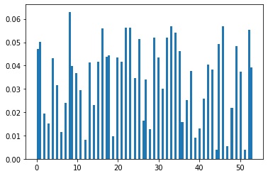
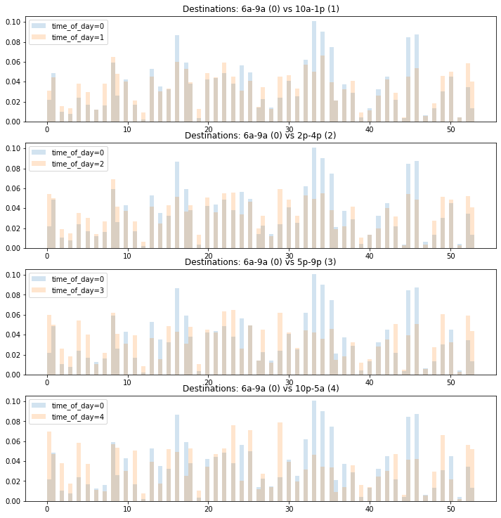

In this notebook, taking another visual approach to do some EDA on the time_of_day feature.
I am looking at this after already having done a good deal of model training. Perhaps if I had looked at this histograms below earlier, I would have not necessarily chosen this particular feature binned as arbitrarily as I had done.


```python
import pandas as pd
import numpy as np
import datetime; import pytz
from collections import Counter
import matplotlib.pyplot as plt
from joblib import dump, load
import joblib
import os
from tqdm import tqdm
from sklearn.datasets import load_svmlight_file
from sklearn.metrics import accuracy_score, balanced_accuracy_score
from scipy.stats import spearmanr
from functools import reduce
import fresh.s3utils as fs3
from importlib import reload
import json
import fresh.plot as fp
import fresh.vanilla_utils as fvu
import fresh.metrics as fm

import fresh.utils as fu

```


```python
%matplotlib inline
```


```python
# artifactsdir = '/opt/program/artifacts/2020-07-10T135910Z'
train_loc = 'artifacts/2020-07-08T143732Z/train.libsvm'

train_data = load_svmlight_file(train_loc)
X_train = train_data[0].toarray()
y_train = train_data[1]


```


```python
X_train.shape, y_train.shape
```


    ((316281, 85), (316281,))


```python
# just quickly plot which source more common... 
X_source_neighborhood = np.argmax(X_train[:, :75], axis=1)

X_time_of_day = np.argmax(X_train[:, 78:83], axis=1)
X_weekday = X_train[:, 84]
```


```python

Counter(X_weekday)
```


    Counter({1.0: 235318, 0.0: 80963})


```python
Counter(X_time_of_day)
```


    Counter({3: 115473, 2: 57914, 0: 54094, 1: 61246, 4: 27554})


```python
X_time_of_day.shape, y_train.shape
```


    ((316281,), (316281,))


```python
Counter(y_train)
```


    Counter({10.0: 6160,
             42.0: 6751,
             29.0: 8736,
             8.0: 10565,
             2.0: 3271,
             46.0: 9515,
             45.0: 8231,
             30.0: 7301,
             18.0: 7416,
             0.0: 7881,
             38.0: 6291,
             48.0: 3656,
             5.0: 5320,
             22.0: 9432,
             20.0: 7298,
             32.0: 8739,
             35.0: 7740,
             43.0: 6399,
             9.0: 6654,
             16.0: 9370,
             23.0: 9414,
             53.0: 6583,
             52.0: 9295,
             34.0: 9082,
             4.0: 7233,
             1.0: 8395,
             36.0: 2666,
             21.0: 6957,
             6.0: 1927,
             25.0: 8607,
             14.0: 3873,
             26.0: 2726,
             24.0: 5802,
             40.0: 2200,
             3.0: 2521,
             37.0: 4234,
             19.0: 1637,
             50.0: 6287,
             49.0: 8115,
             11.0: 4921,
             33.0: 9555,
             7.0: 4008,
             12.0: 1375,
             17.0: 7319,
             31.0: 5034,
             39.0: 1536,
             41.0: 4302,
             15.0: 6963,
             44.0: 673,
             47.0: 919,
             27.0: 5693,
             51.0: 637,
             13.0: 6953,
             28.0: 2113})


```python
plt.hist(y_train, bins=100, density=True)
plt.show()
```





```python
df = pd.DataFrame()
df['X_time_of_day'] = X_time_of_day
df['y_train'] = y_train
# y_train.shape
```

Here below, just sampling 10k , for the `5` different period of times of day, 
there looks to be a high regularity. These time periods were selected kind of arbitrarily and maybe there are other choices that perhaps highlight diffences better. But for these selections, visually they have limited distinction.


```python
sample = np.random.choice(range(df.shape[0]), int(1e4))
df.iloc[sample].shape
```


    (10000, 2)


```python
fig = plt.figure(figsize=(12, 16))
howmany = int(1e4)

def sample_foo(df, howmany):
    sample = np.random.choice(df.index.tolist(), howmany)
    return df.loc[sample]

time_of_day_map = {0: '6a-9a', 
                   1: '10a-1p', 2: '2p-4p', 
                   3: '5p-9p', 4: '10p-5a'}
base = 0
y1 = sample_foo(df[df['X_time_of_day'] == base], howmany)['y_train']

for i in [1, 2, 3, 4]:
    y2 = sample_foo(df[df['X_time_of_day'] == i], howmany)['y_train']
    ax = fig.add_subplot(int('51' + f'{i + 1}'))
    ax.hist(y1, 
            bins=100, density=True, alpha=0.2, label=f'time_of_day={base}')
    
    ax.hist(y2, 
            bins=100, density=True, alpha=0.2, label=f'time_of_day={i}')
    ax.set_title(f'Destinations: {time_of_day_map[base]} ({base}) '
                 f'vs {time_of_day_map[i]} ({i})')
    ax.legend()
fig.show()


```





```python

```


```python
1
```


    1


