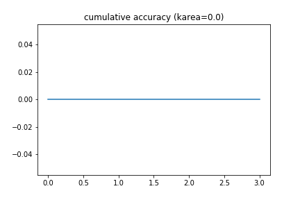

#### Extending notes on karea, what is the worst karea possible
* Earlier notes https://github.com/namoopsoo/learn-citibike/blob/master/notes/2020-07-04-aws.md
* I was wondering since I had also written out how to calculate the theoretical worst logloss, I should consider the worst karea too.
* The *k-area* metric is a number from 0 to (num_classes-1)/num_classes , which is the area under the curve of the "cumulative rank accuracy" , based on the rank of the correct predictions in a model's multi-class probabilities.
* A

```python
import pylab
import matplotlib.pyplot as plt
import numpy as np
import fresh.metrics as fm
import fresh.utils as fu

def _plot(vec):
    plt.plot(vec)
    plt.title(f'cumulative accuracy (karea={vec.sum()})')
    out_dir = 'notes/2020-10-20-karea-worst__files'
    out_loc = f'{out_dir}/{fu.utc_ts()}_cumulative_accuracy.png'
    pylab.savefig(out_loc)
    pylab.close()
    return out_loc

y_test = np.array([1,
                   2,
                   1,
                   0,
                   3])
# Worst possible, always splitting the predictions in the other classes
y_prob = np.array([[.6, 0, .3, .1],
                  [.5, .4, 0, 1],
                  [.5, 0, .4, .1],
                  [0, .5, .4, .1],
                  [.5, .4, .1, 0],])
#
correct_kth, topk, karea = fm.kth_area(y_test, y_prob, num_classes=4)                  
_plot(topk)

```



```python
# Slightly better than worst...
y_prob = np.array([[.6, .3, .1, 0],
                  [.5, .5, 0, 0],
                  [.5, 0, .5, 0],
                  [0, .5, .5, 0],
                  [.5, .5, 0, 0],])
#
correct_kth, topk, karea = fm.kth_area(y_test, y_prob, num_classes=4)
_plot(topk)
# ([1, 3, 3, 3, 2], 0.15000000000000002)                  

```


* in the middle...

```python
y_prob = np.array([[.4, .2, .1, .3],
                  [.5, .4, .1, 0],
                  [.5, 0, .5, 0],
                  [.5, .1, .4, 0],
                  [.4, .5, 0, .1],])
#
correct_kth, topk, karea = fm.kth_area(y_test, y_prob, num_classes=4)
_plot(topk)
# ([2, 2, 3, 0, 2], 0.30000000000000004)
```


* near perfect
```python
y_prob = np.array([[.2, .4, .1, .3],
                  [.1, .4, .5, 0],
                  [0, .6, .4, 0],
                  [.5, .1, .4, 0],
                  [.1, .5, 0, .4],])
#
correct_kth, topk, karea = fm.kth_area(y_test, y_prob, num_classes=4)
_plot(topk)

# ([0, 0, 0, 0, 1], 0.7)
```


* perfect
```python
y_prob = np.array([[.2, .4, .1, .3],
                  [.1, .4, .5, 0],
                  [0, .6, .4, 0],
                  [.5, .1, .4, 0],
                  [.1, .4, 0, .5],])
#
correct_kth, topk, karea = fm.kth_area(y_test, y_prob, num_classes=4)
_plot(topk)
# ([0, 0, 0, 0, 0], 0.75)
```


