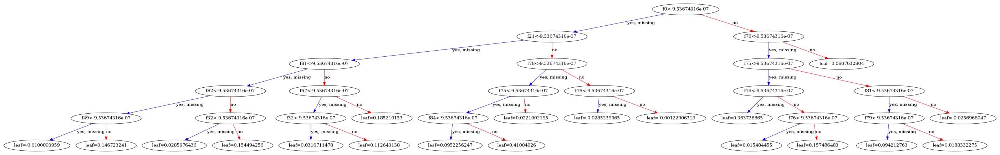

```python
import matplotlib.pyplot as plt
```


```python
import fresh.predict_utils as fpu
bundle = fpu.load_bundle_in_docker()
```

    Loading from bundle_loc /opt/ml/model/all_bundle_with_stationsdf.joblib


    /opt/conda/lib/python3.7/site-packages/sklearn/base.py:334: UserWarning: Trying to unpickle estimator OneHotEncoder from version 0.22.1 when using version 0.23.2. This might lead to breaking code or invalid results. Use at your own risk.
      UserWarning)
    /opt/conda/lib/python3.7/site-packages/sklearn/base.py:334: UserWarning: Trying to unpickle estimator LabelEncoder from version 0.22.1 when using version 0.23.2. This might lead to breaking code or invalid results. Use at your own risk.
      UserWarning)


```python
from xgboost import plot_tree
```


```python
model = bundle['model_bundle']['bundle']['xgb_model']
```


```python
# bundle['model_bundle']['original_filename']#.keys()
# '/opt/program/artifacts/2020-07-10T135910Z/1187_bundle_with_metrics.joblib'
parts = bundle['model_bundle']['original_filename'].split('/')
model_id = f"{parts[4]}_{parts[5].split('_')[0]}"
model_id
```


    '2020-07-10T135910Z_1187'


```python
# fig = plt.figure(figsize=(50,50))
# ax = fig.add_subplot(111)
fig, ax = plt.subplots(figsize=(50, 50))
tree = 0
plot_tree(model, ax=ax, num_trees=tree)
# plt.show()
plt.savefig(
    f"/opt/downloads/model_id_{fpu.extract_model_id_from_bundle(bundle)}_tree{tree}.png")
```





```python
plt.savefig(f"/opt/downloads/model_id_{fpu.extract_model_id_from_bundle(bundle)}_tree{tree}.png")
```


    <Figure size 432x288 with 0 Axes>


```python
import fresh.predict_utils as fpu
reload(fpu)
```


    <module 'fresh.predict_utils' from '/opt/program/fresh/predict_utils.py'>


```python
fpu.extract_model_id_from_bundle(bundle)
```


    '2020-07-10T135910Z_1187'


```python
help(plot_tree)
```

    Help on function plot_tree in module xgboost.plotting:
    
    plot_tree(booster, fmap='', num_trees=0, rankdir='UT', ax=None, **kwargs)
        Plot specified tree.
        
        Parameters
        ----------
        booster : Booster, XGBModel
            Booster or XGBModel instance
        fmap: str (optional)
           The name of feature map file
        num_trees : int, default 0
            Specify the ordinal number of target tree
        rankdir : str, default "UT"
            Passed to graphiz via graph_attr
        ax : matplotlib Axes, default None
            Target axes instance. If None, new figure and axes will be created.
        kwargs :
            Other keywords passed to to_graphviz
        
        Returns
        -------
        ax : matplotlib Axes
    


```python
bundle['proc_bundle']['bundle']['proc_bundle'].keys()
```


    dict_keys(['enc', 'usertype_le', 'le'])


```python
print(model.feature_names[:5])

```

    ['f0', 'f1', 'f2', 'f3', 'f4']


```python
import fresh.preproc.v2 as pv2
```


```python
feature_map = pv2.make_feature_map(bundle['proc_bundle']['bundle'])
feature_map
```


    {'f0': 'start_neighborhood=Alphabet City',
     'f1': 'start_neighborhood=Battery Park City',
     'f2': 'start_neighborhood=Bedford-Stuyvesant',
     'f3': 'start_neighborhood=Bloomingdale',
     'f4': 'start_neighborhood=Boerum Hill',
     'f5': 'start_neighborhood=Bowery',
     'f6': 'start_neighborhood=Broadway Triangle',
     'f7': 'start_neighborhood=Brooklyn Heights',
     'f8': 'start_neighborhood=Brooklyn Navy Yard',
     'f9': 'start_neighborhood=Carnegie Hill',
     'f10': 'start_neighborhood=Carroll Gardens',
     'f11': 'start_neighborhood=Central Park',
     'f12': 'start_neighborhood=Chelsea',
     'f13': 'start_neighborhood=Chinatown',
     'f14': 'start_neighborhood=Civic Center',
     'f15': 'start_neighborhood=Clinton Hill',
     'f16': 'start_neighborhood=Cobble Hill',
     'f17': 'start_neighborhood=Columbia Street Waterfront District',
     'f18': 'start_neighborhood=Downtown Brooklyn',
     'f19': 'start_neighborhood=Dumbo',
     'f20': 'start_neighborhood=East Harlem',
     'f21': 'start_neighborhood=East Village',
     'f22': 'start_neighborhood=East Williamsburg',
     'f23': 'start_neighborhood=Financial District',
     'f24': 'start_neighborhood=Flatiron District',
     'f25': 'start_neighborhood=Fort Greene',
     'f26': 'start_neighborhood=Fulton Ferry District',
     'f27': 'start_neighborhood=Garment District',
     'f28': 'start_neighborhood=Governors Island',
     'f29': 'start_neighborhood=Gowanus',
     'f30': 'start_neighborhood=Gramercy Park',
     'f31': 'start_neighborhood=Greenpoint',
     'f32': 'start_neighborhood=Greenwich Village',
     'f33': "start_neighborhood=Hell's Kitchen",
     'f34': 'start_neighborhood=Hudson Square',
     'f35': 'start_neighborhood=Hunters Point',
     'f36': 'start_neighborhood=Kips Bay',
     'f37': 'start_neighborhood=Korea Town',
     'f38': 'start_neighborhood=Lenox Hill',
     'f39': 'start_neighborhood=Lincoln Square',
     'f40': 'start_neighborhood=Little Italy',
     'f41': 'start_neighborhood=Long Island City',
     'f42': 'start_neighborhood=Lower East Side',
     'f43': 'start_neighborhood=Lower Manhattan',
     'f44': 'start_neighborhood=Meatpacking District',
     'f45': 'start_neighborhood=Midtown',
     'f46': 'start_neighborhood=Midtown East',
     'f47': 'start_neighborhood=Midtown West',
     'f48': 'start_neighborhood=Murray Hill',
     'f49': 'start_neighborhood=NoHo',
     'f50': 'start_neighborhood=NoMad',
     'f51': 'start_neighborhood=Nolita',
     'f52': 'start_neighborhood=Park Slope',
     'f53': 'start_neighborhood=Peter Cooper Village',
     'f54': 'start_neighborhood=Prospect Heights',
     'f55': 'start_neighborhood=Prospect Park',
     'f56': 'start_neighborhood=Red Hook',
     'f57': 'start_neighborhood=Rose Hill',
     'f58': 'start_neighborhood=SoHo',
     'f59': 'start_neighborhood=Stuyvesant Heights',
     'f60': 'start_neighborhood=Stuyvesant Town',
     'f61': 'start_neighborhood=Sunset Park',
     'f62': 'start_neighborhood=Sutton Place',
     'f63': 'start_neighborhood=Theater District',
     'f64': 'start_neighborhood=Tribeca',
     'f65': 'start_neighborhood=Tudor City',
     'f66': 'start_neighborhood=Two Bridges',
     'f67': 'start_neighborhood=Ukrainian Village',
     'f68': 'start_neighborhood=Union Square',
     'f69': 'start_neighborhood=Upper East Side',
     'f70': 'start_neighborhood=Upper West Side',
     'f71': 'start_neighborhood=Vinegar Hill',
     'f72': 'start_neighborhood=West Village',
     'f73': 'start_neighborhood=Williamsburg',
     'f74': 'start_neighborhood=Yorkville',
     'f75': 'gender=0',
     'f76': 'gender=1',
     'f77': 'gender=2',
     'f78': 'time_of_day=0',
     'f79': 'time_of_day=1',
     'f80': 'time_of_day=2',
     'f81': 'time_of_day=3',
     'f82': 'time_of_day=4',
     'f83': 'usertype',
     'f84': 'weekday'}


```python
from importlib import reload
import pandas as pd
```


```python
reload(pv2)
```


    <module 'fresh.preproc.v2' from '/opt/program/fresh/preproc/v2.py'>


```python

# Rank by Fscore
model.get_fscore()
df = pd.DataFrame.from_records([{'name': feature_map.get(k), 'f': k, 'fscore': v} for (k,v) in model.get_fscore().items()])
```


```python
df.sort_values(by='fscore', ascending=False).iloc[:30]
```


<div>
<style scoped>
    .dataframe tbody tr th:only-of-type {
        vertical-align: middle;
    }

    .dataframe tbody tr th {
        vertical-align: top;
    }

    .dataframe thead th {
        text-align: right;
    }
</style>
<table border="1" class="dataframe">
  <thead>
    <tr style="text-align: right;">
      <th></th>
      <th>name</th>
      <th>f</th>
      <th>fscore</th>
    </tr>
  </thead>
  <tbody>
    <tr>
      <th>9</th>
      <td>weekday</td>
      <td>f84</td>
      <td>12812</td>
    </tr>
    <tr>
      <th>10</th>
      <td>gender=1</td>
      <td>f76</td>
      <td>8973</td>
    </tr>
    <tr>
      <th>2</th>
      <td>time_of_day=3</td>
      <td>f81</td>
      <td>8377</td>
    </tr>
    <tr>
      <th>8</th>
      <td>gender=0</td>
      <td>f75</td>
      <td>7969</td>
    </tr>
    <tr>
      <th>11</th>
      <td>time_of_day=1</td>
      <td>f79</td>
      <td>7064</td>
    </tr>
    <tr>
      <th>26</th>
      <td>time_of_day=2</td>
      <td>f80</td>
      <td>6594</td>
    </tr>
    <tr>
      <th>7</th>
      <td>time_of_day=0</td>
      <td>f78</td>
      <td>6302</td>
    </tr>
    <tr>
      <th>17</th>
      <td>gender=2</td>
      <td>f77</td>
      <td>5509</td>
    </tr>
    <tr>
      <th>3</th>
      <td>time_of_day=4</td>
      <td>f82</td>
      <td>4854</td>
    </tr>
    <tr>
      <th>40</th>
      <td>start_neighborhood=Chelsea</td>
      <td>f12</td>
      <td>1199</td>
    </tr>
    <tr>
      <th>37</th>
      <td>start_neighborhood=Midtown East</td>
      <td>f46</td>
      <td>1058</td>
    </tr>
    <tr>
      <th>36</th>
      <td>start_neighborhood=Midtown West</td>
      <td>f47</td>
      <td>947</td>
    </tr>
    <tr>
      <th>30</th>
      <td>start_neighborhood=Downtown Brooklyn</td>
      <td>f18</td>
      <td>910</td>
    </tr>
    <tr>
      <th>41</th>
      <td>start_neighborhood=Hell's Kitchen</td>
      <td>f33</td>
      <td>877</td>
    </tr>
    <tr>
      <th>21</th>
      <td>start_neighborhood=Fort Greene</td>
      <td>f25</td>
      <td>865</td>
    </tr>
    <tr>
      <th>14</th>
      <td>start_neighborhood=Financial District</td>
      <td>f23</td>
      <td>860</td>
    </tr>
    <tr>
      <th>23</th>
      <td>start_neighborhood=Brooklyn Heights</td>
      <td>f7</td>
      <td>834</td>
    </tr>
    <tr>
      <th>49</th>
      <td>start_neighborhood=Kips Bay</td>
      <td>f36</td>
      <td>821</td>
    </tr>
    <tr>
      <th>13</th>
      <td>start_neighborhood=Tribeca</td>
      <td>f64</td>
      <td>813</td>
    </tr>
    <tr>
      <th>28</th>
      <td>start_neighborhood=Lower East Side</td>
      <td>f42</td>
      <td>786</td>
    </tr>
    <tr>
      <th>38</th>
      <td>start_neighborhood=Theater District</td>
      <td>f63</td>
      <td>745</td>
    </tr>
    <tr>
      <th>39</th>
      <td>start_neighborhood=Midtown</td>
      <td>f45</td>
      <td>736</td>
    </tr>
    <tr>
      <th>5</th>
      <td>start_neighborhood=Greenwich Village</td>
      <td>f32</td>
      <td>733</td>
    </tr>
    <tr>
      <th>19</th>
      <td>start_neighborhood=Clinton Hill</td>
      <td>f15</td>
      <td>703</td>
    </tr>
    <tr>
      <th>33</th>
      <td>start_neighborhood=Chinatown</td>
      <td>f13</td>
      <td>695</td>
    </tr>
    <tr>
      <th>20</th>
      <td>start_neighborhood=Williamsburg</td>
      <td>f73</td>
      <td>683</td>
    </tr>
    <tr>
      <th>48</th>
      <td>start_neighborhood=Murray Hill</td>
      <td>f48</td>
      <td>681</td>
    </tr>
    <tr>
      <th>31</th>
      <td>start_neighborhood=Dumbo</td>
      <td>f19</td>
      <td>680</td>
    </tr>
    <tr>
      <th>44</th>
      <td>start_neighborhood=Civic Center</td>
      <td>f14</td>
      <td>660</td>
    </tr>
    <tr>
      <th>12</th>
      <td>start_neighborhood=Battery Park City</td>
      <td>f1</td>
      <td>649</td>
    </tr>
  </tbody>
</table>
</div>


|    | name                                  | f   |   fscore |\n|---:|:--------------------------------------|:----|---------:|\n|  9 | weekday                               | f84 |    12812 |\n| 10 | gender=1                              | f76 |     8973 |\n|  2 | time_of_day=3                         | f81 |     8377 |\n|  8 | gender=0                              | f75 |     7969 |\n| 11 | time_of_day=1                         | f79 |     7064 |\n| 26 | time_of_day=2                         | f80 |     6594 |\n|  7 | time_of_day=0                         | f78 |     6302 |\n| 17 | gender=2                              | f77 |     5509 |\n|  3 | time_of_day=4                         | f82 |     4854 |\n| 40 | start_neighborhood=Chelsea            | f12 |     1199 |\n| 37 | start_neighborhood=Midtown East       | f46 |     1058 |\n| 36 | start_neighborhood=Midtown West       | f47 |      947 |\n| 30 | start_neighborhood=Downtown Brooklyn  | f18 |      910 |\n| 41 | start_neighborhood=Hell's Kitchen     | f33 |      877 |\n| 21 | start_neighborhood=Fort Greene        | f25 |      865 |\n| 14 | start_neighborhood=Financial District | f23 |      860 |\n| 23 | start_neighborhood=Brooklyn Heights   | f7  |      834 |\n| 49 | start_neighborhood=Kips Bay           | f36 |      821 |\n| 13 | start_neighborhood=Tribeca            | f64 |      813 |\n| 28 | start_neighborhood=Lower East Side    | f42 |      786 |


```python

```
