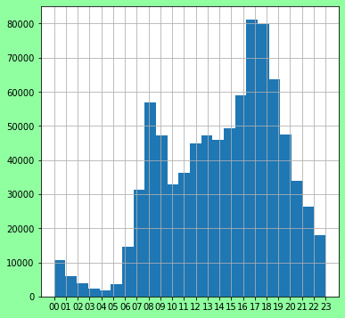
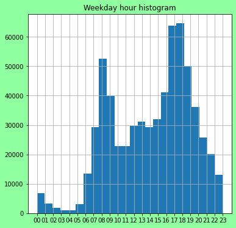
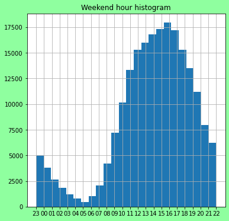
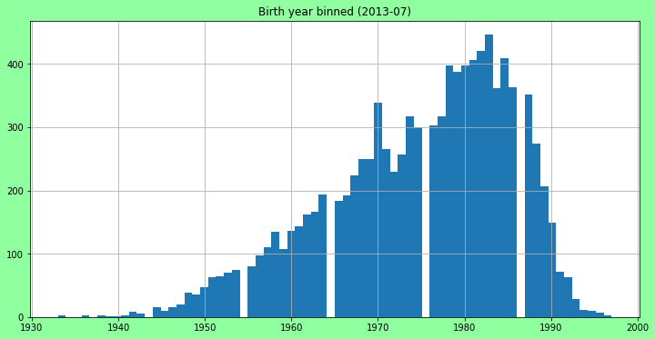
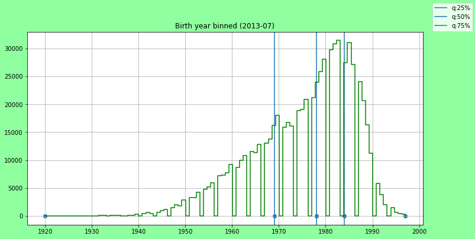

#### Take a quick look at time of day distribution
Don't remember if I did this before


```python
import matplotlib.pyplot as plt
import numpy as np
import pandas as pd

```


```python
datadir = '/opt/data'
localdir = '/opt/program'
tripsdf = pd.read_csv(f'{datadir}/2013-07 - Citi Bike trip data.csv')
stationsdf = pd.read_csv(f'{localdir}/datas/stations/stations-2018-12-04-c.csv',
                        index_col=0)
```


```python
tripsdf.iloc[0]
```


    tripduration                               634
    starttime                  2013-07-01 00:00:00
    stoptime                   2013-07-01 00:10:34
    start station id                           164
    start station name             E 47 St & 2 Ave
    start station latitude                 40.7532
    start station longitude               -73.9703
    end station id                             504
    end station name               1 Ave & E 15 St
    end station latitude                   40.7322
    end station longitude                 -73.9817
    bikeid                                   16950
    usertype                              Customer
    birth year                                  \N
    gender                                       0
    Name: 0, dtype: object


```python
tripsdf['starttime'].map(lambda x: x[11:13]).iloc[:10]
```


    0    00
    1    00
    2    00
    3    00
    4    00
    5    00
    6    00
    7    00
    8    00
    9    00
    Name: starttime, dtype: object


```python
tripsdf['hour'] = tripsdf['starttime'].map(lambda x: x[11:13])

```


```python
# For all time looks like maybe two peaks

fig = plt.figure(figsize=(6, 6))
fig.patch.set_facecolor('xkcd:mint green')
ax = fig.add_subplot(111, )

ax.hist(tripsdf.hour.tolist(), bins=24)
plt.grid(True)
```





```python
# Perhaps on weekdays different?
import fresh.utils as fu

fu.prepare_weekday_feature(tripsdf)
```


```python
fig = plt.figure(figsize=(6, 6))
fig.patch.set_facecolor('xkcd:mint green')
ax = fig.add_subplot(111, )
ax.hist(tripsdf[tripsdf.weekday == True].hour.tolist(), bins=24)
ax.set_title('Weekday hour histogram')
plt.grid(True)
```





```python
# Weekend wow big difference. 
fig = plt.figure(figsize=(6, 6))
fig.patch.set_facecolor('xkcd:mint green')
ax = fig.add_subplot(111, )
ax.hist(tripsdf[tripsdf.weekday == False].hour.tolist(), bins=24)
ax.set_title('Weekend hour histogram')
plt.grid(True)
```





```python
# Ok based on the above, going to create a version 2...
# time_of_day_v2_peaky
# Not sure how to account for the different peaks on weekends
#     # 0: 6-10, 1: 11-15, 2: 16-20, 3: 21-00, 00-5


```

#### Age
- Somehow I did not include age this time around but I should.


```python
tripsdf[['usertype', 'birth year']].iloc[:5]

```


<div>
<style scoped>
    .dataframe tbody tr th:only-of-type {
        vertical-align: middle;
    }

    .dataframe tbody tr th {
        vertical-align: top;
    }

    .dataframe thead th {
        text-align: right;
    }
</style>
<table border="1" class="dataframe">
  <thead>
    <tr style="text-align: right;">
      <th></th>
      <th>usertype</th>
      <th>birth year</th>
    </tr>
  </thead>
  <tbody>
    <tr>
      <th>0</th>
      <td>Customer</td>
      <td>\N</td>
    </tr>
    <tr>
      <th>1</th>
      <td>Customer</td>
      <td>\N</td>
    </tr>
    <tr>
      <th>2</th>
      <td>Subscriber</td>
      <td>1980</td>
    </tr>
    <tr>
      <th>3</th>
      <td>Customer</td>
      <td>\N</td>
    </tr>
    <tr>
      <th>4</th>
      <td>Subscriber</td>
      <td>1986</td>
    </tr>
  </tbody>
</table>
</div>


```python
# Ok should basically fill these as np.nan for 'Customer'
dict(tripsdf[tripsdf.usertype=='Customer']['birth year'].value_counts())
```


    {'\\N': 174887, '1995': 28}


```python
# Luckily no nulls
tripsdf[(tripsdf.usertype=='Subscriber')& (tripsdf['birth year'].isnull())].shape
```


    (0, 18)


```python
def make_xtick_labels(x, step=5):
    '''Given x, step the labels every <step>
    Aka, take every <step>th x label
    '''
    x_ticks = [i for i in  range(len(x)) if i % step == 0]
    x_labels = [x[i] for i in x_ticks]
    return x_ticks, x_labels

```


```python
import numpy as np
```


```python
tripsdf['birth year'] = tripsdf['birth year'].map(lambda x:int(x) if x != '\\N' else np.nan )
```


```python
# Discard below 1913 as np.nan. TODO
tripsdf[(tripsdf.usertype=='Subscriber')& (tripsdf['birth year'] < 1913)].shape
```


    (226, 18)


```python
X = [x for x in tripsdf[(tripsdf.usertype == 'Subscriber')]['birth year'].tolist()
    if x > 1913]
```


```python
print(len(X))
fig = plt.figure(figsize=(12, 6))
fig.patch.set_facecolor('xkcd:mint green')
ax = fig.add_subplot(111, )

ax.hist(X[:10000], bins=70)

# x_ticks, x_labels = make_xtick_labels(x[:1000], step=20)
# ax.set_xticks(x_ticks)
# ax.set_xticklabels(x_labels, rotation=-45)

ax.set_title('Birth year binned (2013-07)')
plt.grid(True)
fig.show()
```

    668262





```python
# Ok this seems normal ish. so might as well just split somewhat arbitrarily or evenly

def get_quantiles(unsorted):
    data = sorted(unsorted)
    minimum = data[0]
    Q1 = np.percentile(data, 25, interpolation = 'midpoint') 
    median = np.median(data)
    Q3 = np.percentile(data, 75, interpolation = 'midpoint') 
    maximum = data[-1]
    return [minimum, Q1, median, Q3, maximum]
```


```python

def show_da_stats(bundle):
    H, bins = bundle['hist']
    quantiles = bundle['quantiles']
    fig = plt.figure(figsize=(12, 6))
    fig.patch.set_facecolor('xkcd:mint green')
    ax = fig.add_subplot(111, )
    ax.scatter(quantiles, [1, 1, 1, 1, 1])
    ax.axvline(quantiles[1], label='q:25%')
    ax.axvline(quantiles[2], label='q:50%')
    ax.axvline(quantiles[3], label='q:75%')

    ax.set_title(bundle['title'])
    ax.plot(bins, np.insert(H, 0, H[0]), drawstyle='steps', color='green')
    plt.grid(True)
    fig.legend()
    fig.show()
    
#
hist = np.histogram(X, bins=100, range=None)

quantiles = get_quantiles(X)
bundle = {'hist': hist, 'quantiles': quantiles,
               'title': 'Birth year binned (2013-07)'}
print('quantiles', quantiles)
show_da_stats(bundle)
```

    quantiles [1920.0, 1969.0, 1978.0, 1984.0, 1997.0]





```python
# And the age quantiles to make this a year independent feature.. 
2013 - np.array([1920.0, 1969.0, 1978.0, 1984.0, 1997.0])
```


    array([93., 44., 35., 29., 16.])


```python
import datetime; import pytz
x = dict(tripsdf.iloc[2])
x

(x['start_dt'] - 
     datetime.datetime(int(x['birth year']), 1, 1, tzinfo=pytz.timezone('US/Eastern'))
).days/365. , (x['start_dt'] - np.nan)
```


    ---------------------------------------------------------------------------

    TypeError                                 Traceback (most recent call last)

    <ipython-input-102-ee3bddc50852> in <module>
          5 (x['start_dt'] - 
          6      datetime.datetime(int(x['birth year']), 1, 1, tzinfo=pytz.timezone('US/Eastern'))
    ----> 7 ).days/365. , (x['start_dt'] - np.nan)
    

    TypeError: unsupported operand type(s) for -: 'Timestamp' and 'float'


```python
x['start_dt'] - pd.NaT
```


    NaT


```python
# Reload once again since I modified a col
tripsdf = pd.read_csv(f'{datadir}/2013-07 - Citi Bike trip data.csv')

```


```python

```
